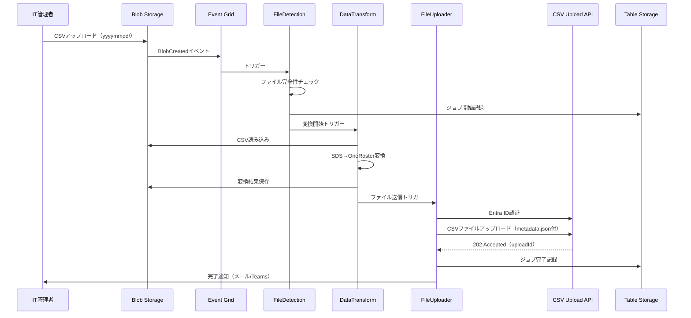
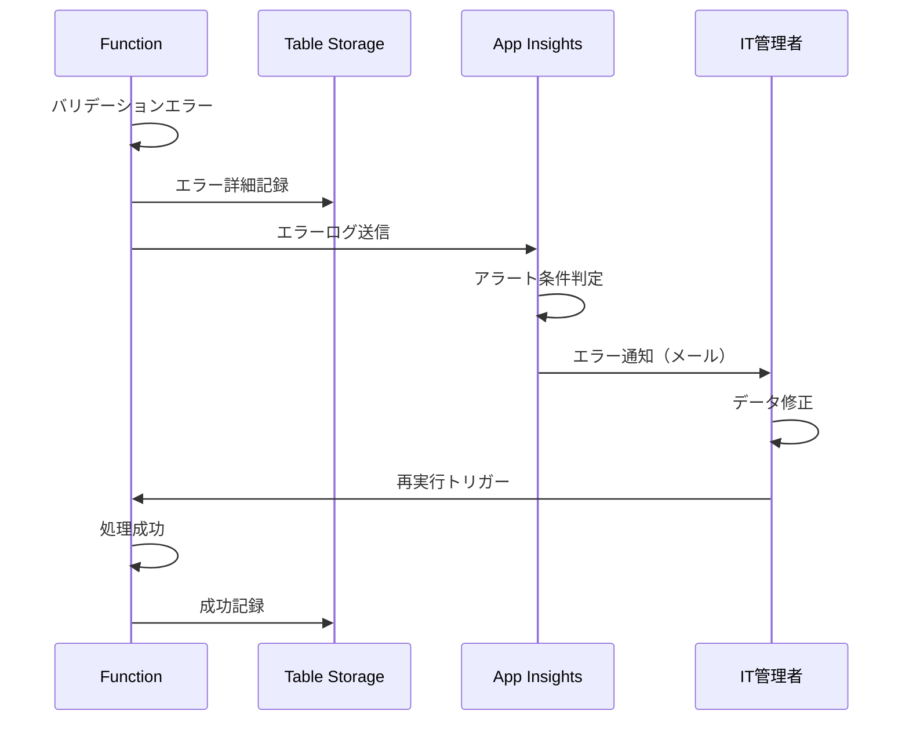
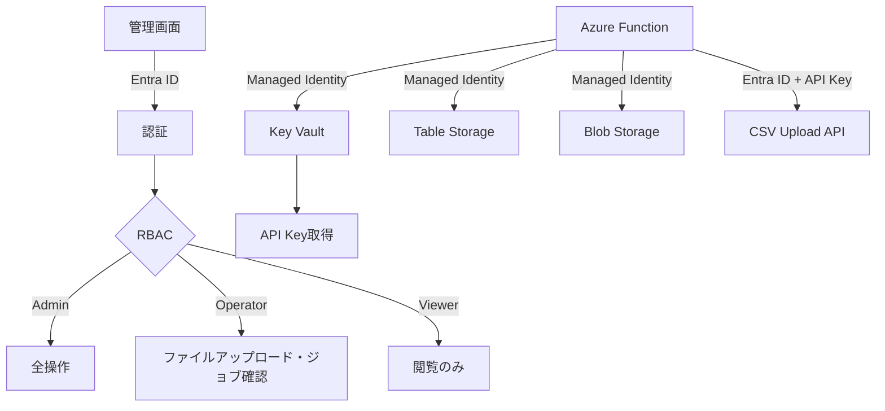

# SDS2Roster システムアーキテクチャ概要

**プロジェクト名**: SDS2Roster  
**ドキュメントバージョン**: 1.0.0  
**作成日**: 2025-10-27  
**ステータス**: Draft

---

## 📋 ドキュメント目的

本ドキュメントは、SDS2Roster（Microsoft School Data Sync CSV → OneRoster v1.2 CSV変換システム）の全体アーキテクチャを定義します。

**対象読者**:
- 開発チーム（バックエンド、フロントエンド、DevOps）
- アーキテクト、技術リーダー
- プロジェクトマネージャー

---

## 🎯 アーキテクチャ目標

### 主要目標

1. **イベント駆動型**: Azure Event Gridによる非同期処理
2. **スケーラビリティ**: 最大100万レコード/日の処理能力
3. **高可用性**: 99.9%稼働率（月間ダウンタイム43分以内）
4. **セキュリティ**: データ暗号化、Entra ID認証、Managed Identity
5. **コスト最適化**: 月額7.3万円以内（Table Storage採用）
6. **マルチ言語対応**: Python版とJavaScript版の並行開発

---

## 📐 アーキテクチャ原則

### 1. クラウドネイティブ設計
- **Serverless First**: Azure Functions中心のアーキテクチャ
- **Managed Services**: Blob Storage, Table Storage, Key Vault
- **Infrastructure as Code**: Terraform による宣言的管理

### 2. 疎結合・高凝集
- **関数単位の分離**: 各Functionは単一責任を持つ
- **イベント駆動**: Event Gridによる非同期通信
- **ステートレス**: 状態はTable Storageに永続化

### 3. セキュリティファースト
- **認証情報のハードコーディング禁止**: Managed Identity + Key Vault
- **最小権限の原則**: RBACによる厳密なアクセス制御
- **データ暗号化**: 転送中（TLS 1.2+）、保存時（AES-256）

### 4. 可観測性
- **構造化ログ**: JSON形式、相関IDによる分散トレース
- **メトリクス**: Application Insights統合
- **アラート**: 異常検知の自動通知

### 5. 多言語戦略
- **Python版**: データ処理特化、pandas活用
- **JavaScript版**: Node.js 20、TypeScript、フロントエンド統合
- **共通仕様**: 同一のAPI仕様、データスキーマ、インフラ構成

---

## 🏗️ システムコンポーネント構成

### レイヤー構造

```
```
┌─────────────────────────────────────────────────────────────┐
│                    プレゼンテーション層                        │
│  - 管理画面（React）                                          │
│  - CSVアップロードAPI（受信側システム・別途開発）              │
└─────────────────────────────────────────────────────────────┘
                              ↓
┌─────────────────────────────────────────────────────────────┐
│                     アプリケーション層                         │
│  - Azure Functions（Python / JavaScript）                    │
│    * FileDetection（ファイル検知）                            │
│    * DataValidation（バリデーション）                         │
│    * DataTransformation（変換処理）                          │
│    * FileUploader（ファイル送信）                            │
│    * JobMonitoring（監視）                                   │
└─────────────────────────────────────────────────────────────┘
```
                              ↓
┌─────────────────────────────────────────────────────────────┐
│                       データ層                                │
│  - Blob Storage（CSV入出力）                                 │
│  - Table Storage（ジョブ履歴）                               │
│  - Key Vault（機密情報）                                     │
└─────────────────────────────────────────────────────────────┘
                              ↓
┌─────────────────────────────────────────────────────────────┐
│                      監視・運用層                             │
│  - Application Insights（ログ・メトリクス）                   │
│  - Azure Monitor（アラート）                                 │
│  - Event Grid（イベント管理）                                │
└─────────────────────────────────────────────────────────────┘
```

---

## 🔄 主要な処理フロー

### 通常フロー（成功パターン）



### エラーハンドリングフロー



---

## 🗂️ ディレクトリ構造戦略

### Blob Storage構造

```
Storage Account: sds2rosterdatasa
├── sds-csv-input/               # 入力コンテナ
│   ├── 20251027/                # 日付別ディレクトリ（yyyymmdd）
│   │   ├── school.csv
│   │   ├── student.csv
│   │   ├── teacher.csv
│   │   ├── section.csv
│   │   ├── studentenrollment.csv
│   │   └── teacherroster.csv
│   └── 20251028/
│       └── ...
├── oneroster-output/            # 出力コンテナ
│   ├── 20251027/                # 入力と同じ日付
│   │   ├── manifest.csv
│   │   ├── orgs.csv
│   │   ├── users.csv
│   │   ├── courses.csv
│   │   ├── classes.csv
│   │   ├── enrollments.csv
│   │   └── academicSessions.csv
│   └── 20251028/
│       └── ...
└── reports/                     # レポートコンテナ
    ├── daily/
    └── monthly/
```

### Table Storage構造

```
Table: JobHistory
PartitionKey: YYYY-MM（年月）
RowKey: jobId（逆タイムスタンプ）

Properties:
- jobId: ジョブID（例: job-20251027-153045-abc123）
- status: Processing | Completed | Failed
- startTime: 2025-10-27T15:30:45Z
- endTime: 2025-10-27T15:35:12Z
- inputDirectory: sds-csv-input/20251027/
- outputDirectory: oneroster-output/20251027/
- recordCounts: {"orgs":10,"users":150,"classes":30}
- errors: 0
- warnings: 2
- userId: admin@example.com
```

---

## 🔐 セキュリティアーキテクチャ

### 認証・認可フロー



### セキュリティレイヤー

| レイヤー | 実装 |
|---------|------|
| **ネットワーク** | Private Endpoint（将来拡張）、Service Endpoint |
| **認証** | Entra ID、Managed Identity、API Key |
| **認可** | RBAC、Key Vault Access Policy（RBACモデル） |
| **暗号化（転送中）** | TLS 1.2以上（TLS 1.3推奨） |
| **暗号化（保存時）** | AES-256（プラットフォーム管理キー） |
| **監査** | Application Insights、Azure Monitor Logs（1年保存） |

---

## 📊 スケーラビリティ戦略

### 垂直スケーリング

| コンポーネント | スケール方法 | 最大容量 |
|--------------|------------|---------|
| Azure Functions | Premium EP1 → EP2 → EP3 | 最大4コア/14GBメモリ |
| Table Storage | パーティション分散 | 無制限（実質） |
| Blob Storage | 自動スケール | 5PB（実質無制限） |

### 水平スケーリング

```
Azure Functions Auto-Scaling:
- 初期インスタンス数: 1
- 最小インスタンス数: 1（Premium Plan pre-warmed）
- 最大インスタンス数: 200
- スケールアウトトリガー: CPU 70%以上、1分継続
- スケールイン遅延: 10分間アイドル後
```

### 負荷分散シナリオ

| レコード数/日 | 予想処理時間 | インスタンス数 | コスト/月 |
|-------------|------------|--------------|----------|
| 10万 | 10分 | 1-2 | 7.3万円 |
| 50万 | 30分 | 3-5 | 10万円 |
| 100万 | 60分 | 5-10 | 15万円 |
| 500万 | 5時間 | 20-30 | 30万円 |

---

## 🎨 多言語実装戦略

### Python版の特徴

**採用理由**:
- データ処理に特化したライブラリ（pandas、numpy）
- CSV操作が簡潔
- 開発速度が速い

**実装言語**: Python 3.11  
**主要ライブラリ**:
- pandas: CSV読み込み・データ変換
- azure-functions: Functionランタイム
- azure-storage-blob: Blob Storage操作
- azure-data-tables: Table Storage操作
- requests: CSVアップロードAPI呼び出し

**ディレクトリ構造**:
```
src/python/
├── functions/
│   ├── file_detection/
│   ├── data_transform/
│   └── file_uploader/
├── shared/
│   ├── models/
│   ├── utils/
│   └── validators/
├── requirements.txt
└── host.json
```

### JavaScript版の特徴

**採用理由**:
- Node.js 20の最新機能活用
- TypeScriptによる型安全性
- フロントエンドとの統合が容易

**実装言語**: TypeScript (Node.js 20)  
**主要ライブラリ**:
- @azure/functions: Functionランタイム
- @azure/storage-blob: Blob Storage操作
- @azure/data-tables: Table Storage操作
- csv-parse: CSV解析
- axios: CSVアップロードAPI呼び出し

**ディレクトリ構造**:
```
src/javascript/
├── functions/
│   ├── fileDetection/
│   ├── dataTransform/
│   └── fileUploader/
├── shared/
│   ├── models/
│   ├── utils/
│   └── validators/
├── package.json
├── tsconfig.json
└── host.json
```

### 共通仕様

両言語版で以下を統一：
- ✅ OneRoster v1.2 CSV仕様
- ✅ Table Storageスキーマ
- ✅ Blob Storageディレクトリ構造（`yyyymmdd/`）
- ✅ イベントペイロード形式
- ✅ エラーコード体系
- ✅ ログフォーマット（JSON構造化ログ）

---

## 🔄 デプロイ戦略

### 環境分離

| 環境 | Function App名 | リソースグループ | 用途 |
|------|--------------|----------------|------|
| **開発** | sds2roster-func-dev | rg-sds2roster-dev | 開発・テスト |
| **ステージング** | sds2roster-func-stg | rg-sds2roster-stg | 統合テスト・検証 |
| **本番（Python）** | sds2roster-func-py-prod | rg-sds2roster-prod | 本番運用（Python版） |
| **本番（JavaScript）** | sds2roster-func-js-prod | rg-sds2roster-prod | 本番運用（JS版） |

### CI/CDパイプライン

```
GitHub Actions Workflow:
1. コードプッシュ（main/develop ブランチ）
2. リンター・フォーマッター実行
3. ユニットテスト（pytest / jest）
4. 統合テスト
5. Terraformプラン生成
6. 承認ゲート（staging/prod）
7. Terraform Apply（インフラ更新）
8. Function App Deploy
9. スモークテスト
10. 本番リリース完了通知
```

---

## 📈 容量計画

### Year 1（初年度）

| 項目 | 予測値 |
|------|--------|
| 平均レコード数/日 | 100万 |
| ピークレコード数/日 | 200万 |
| Storage容量（Blob） | 50GB |
| Table Storage レコード数 | 12万件/年（365日×330ジョブ） |
| Function実行回数/月 | 100万回 |

### Year 2-3（成長期）

| 項目 | Year 2 | Year 3 |
|------|--------|--------|
| 平均レコード数/日 | 200万 | 500万 |
| Storage容量（Blob） | 100GB | 250GB |
| Table Storage レコード数 | 24万件 | 60万件 |
| 必要インスタンス数 | 3-5 | 10-15 |
| 月額コスト | 15万円 | 30万円 |

---

## 🚨 障害復旧戦略（DR）

### RTO/RPO目標

| 障害レベル | RTO（復旧時間目標） | RPO（データ損失許容時間） |
|-----------|-------------------|------------------------|
| Function障害 | 10分 | 0分（ステートレス） |
| Storage障害 | 30分 | 0分（ZRS冗長化） |
| リージョン障害 | 2時間 | 15分 |

### バックアップ戦略

| データ種類 | バックアップ頻度 | 保存期間 | リストア時間 |
|-----------|---------------|---------|-------------|
| 入力CSVファイル | アップロード直後 | 1年間 | 1時間以内 |
| JobHistory | リアルタイム（ZRS） | 1年間 | 即座 |
| システム設定 | 変更時（Git管理） | 永続 | 30分以内 |

---

## 📚 関連ドキュメント

### アーキテクチャドキュメント

1. ✅ **01_architecture_overview.md**（本ドキュメント）
2. 🔜 **02_c4_context_diagram.md** - C4コンテキスト図
3. 🔜 **03_c4_container_diagram.md** - C4コンテナ図
4. 🔜 **04_c4_component_diagram.md** - C4コンポーネント図
5. 🔜 **05_data_flow_design.md** - データフロー詳細設計
6. 🔜 **06_security_architecture.md** - セキュリティアーキテクチャ
7. 🔜 **07_deployment_architecture.md** - デプロイメントアーキテクチャ
8. 🔜 **08_adr_index.md** - Architecture Decision Records

### 要件ドキュメント

- [要件定義書マスター](../requirements/README.md)
- [機能要件定義](../requirements/02_functional_requirements.md)
- [非機能要件定義](../requirements/03_non_functional_requirements.md)

---

## 📝 変更履歴

| バージョン | 日付 | 変更内容 | 変更者 |
|-----------|------|---------|--------|
| 1.0.0 | 2025-10-27 | 初版作成（Python/JavaScript両対応） | System Architect |

---

## ✅ レビュー・承認

| 役割 | 氏名 | 承認日 | 署名 |
|------|------|--------|------|
| System Architect | [氏名] | - | - |
| Technical Lead | [氏名] | - | - |
| Security Officer | [氏名] | - | - |
| Project Sponsor | [氏名] | - | - |

---

**文書管理責任者**: System Architect  
**最終更新日**: 2025-10-27  
**ドキュメントステータス**: Draft  
**次回レビュー予定日**: 2025-11-03
