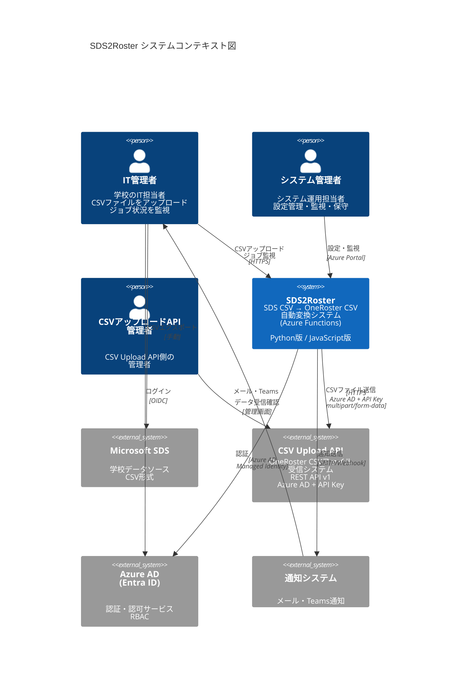
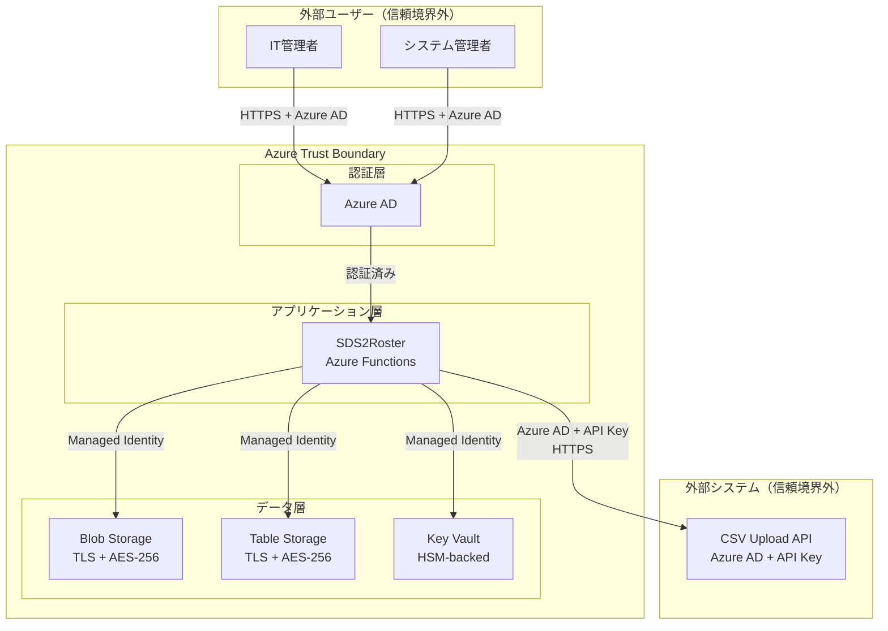

# C4 コンテキスト図（Context Diagram）

**ドキュメントバージョン**: 1.0.0  
**作成日**: 2025-10-27  
**ステータス**: Draft

---

## 📋 概要

C4モデルの最上位レベルとして、SDS2Rosterシステムと外部システム・ユーザーの関係を示します。

**C4モデルとは**:
- **Context（コンテキスト）**: システムの全体像と外部との関係
- Container（コンテナー）: システム内の主要な実行単位
- Component（コンポーネント）: コンテナー内部の構造
- Code（コード）: 個別クラス・関数レベル

本ドキュメントは**Context（レベル1）**を扱います。

---

## 🎯 システムコンテキスト

### 対象システム

**SDS2Roster**:
- Microsoft School Data Sync (SDS) CSV形式をOneRoster v1.2 CSV形式に自動変換
- CSVアップロードAPI経由でデータ送信
- Azureクラウド上で稼働するサーバーレスシステム

---

## 👥 ステークホルダー

### 1. IT管理者（IT Administrator）
**役割**: システムの主要ユーザー
- SDSファイルをアップロード
- ジョブ実行状況を監視
- エラー発生時の対応
- レポート確認

**利用方法**:
- Web管理画面からCSVファイルアップロード
- ジョブステータス確認
- エラー通知受信（メール/Teams）

### 2. システム管理者（System Administrator）
**役割**: システム運用・保守担当者
- システムの設定管理
- ユーザー権限管理
- 監視・アラート設定
- トラブルシューティング

**利用方法**:
- Azureポータルからリソース管理
- Application Insightsでログ・メトリクス確認
- アラート対応

### 3. CSVアップロードAPI管理者
**役割**: CSVアップロードAPIを提供するシステムの管理者
- APIアクセス権限付与（API Key発行）
- データ受信確認
- 連携トラブル対応

---

## 🔗 外部システム

### 1. Microsoft School Data Sync (SDS)
**種類**: データソース  
**役割**: 学校の組織・ユーザー・クラス情報を提供

**データ形式**:
- CSV形式（6ファイル）
- ファイル: school.csv, student.csv, teacher.csv, section.csv, studentenrollment.csv, teacherroster.csv

**連携方式**:
- IT管理者が手動でCSVファイルをエクスポート
- SDS2RosterのBlob Storageへアップロード

### 2. CSVアップロードAPI（外部システム）
**種類**: データ送信先  
**役割**: OneRoster CSVファイルを受信・管理するシステム

**API仕様**:
- プロトコル: HTTPS
- 認証: Azure AD OAuth 2.0 Bearer Token + API Key
- データ形式: multipart/form-data（CSV + metadata.json）
- バージョン: v1

**エンドポイント**:
```
POST /api/v1/upload              # CSVファイルアップロード
GET /api/v1/upload/{uploadId}    # アップロード状態確認
GET /api/v1/health               # ヘルスチェック
GET /api/v1/version              # バージョン情報
```

**連携方式**:
- SDS2Rosterから自動送信
- CSVファイル + metadata.jsonをアップロード
- 非同期処理（202 Accepted、uploadIdで状態確認）

### 3. Azure Active Directory（Entra ID）
**種類**: 認証サービス  
**役割**: ユーザー認証・認可

**連携方式**:
- 管理画面へのログイン認証
- RBACによる権限管理（Admin, Operator, Viewer）
- Managed Identityによるサービス間認証

### 4. メール/通知システム
**種類**: 通知サービス  
**役割**: ジョブ完了・エラー通知

**通知方法**:
- メール（Exchange Online / Gmail）
- Microsoft Teams（Webhook）
- SMS（オプション、Azure Communication Services）

**通知タイミング**:
- ジョブ完了時
- エラー発生時
- 警告発生時

---

## 📊 C4 コンテキスト図



---

## 🔄 主要なユースケース

### ユースケース1: 通常の変換・送信フロー

```
1. IT管理者がSDSからCSVをエクスポート
2. IT管理者がSDS2RosterにCSVをアップロード（yyyymmdd/配下）
3. SDS2Rosterが自動的に変換処理を開始
4. 変換完了後、CSV Upload APIにファイル送信
5. IT管理者に完了通知
```

**成功条件**:
- すべてのCSVファイルが揃っている
- データにバリデーションエラーがない
- CSV Upload APIが正常稼働している

### ユースケース2: エラーハンドリング

```
1. IT管理者がCSVをアップロード
2. SDS2Rosterがバリデーションエラーを検知
3. エラー詳細をログに記録
4. IT管理者にエラー通知（メール）
5. IT管理者がデータを修正
6. 修正後、再アップロードまたは再実行
7. 処理成功、完了通知
```

### ユースケース3: 監視・運用

```
1. システム管理者がApplication Insightsでメトリクス確認
2. 異常なエラー率を検知
3. アラートが自動発火
4. システム管理者がログを調査
5. 必要に応じてシステム調整（スケール、設定変更）
```

---

## 📈 データフロー概要

### 入力データ

| データ | ソース | 形式 | 頻度 |
|--------|--------|------|------|
| SDS CSV | IT管理者 | school.csv, student.csv 等（6ファイル） | 日次/週次 |
| API Key | システム管理者 | Key Vault（X-API-Key） | 初回のみ |
| ユーザー権限 | システム管理者 | Azure AD RBAC | 随時 |

### 出力データ

| データ | 送信先 | 形式 | 頻度 |
|--------|--------|------|------|
| OneRoster CSV | Blob Storage | 7ファイル（manifest含む） | 変換ごと |
| OneRoster CSV | CSV Upload API | multipart/form-data + metadata.json | 変換ごと |
| ジョブ履歴 | Table Storage | JSON | リアルタイム |
| 通知 | IT管理者 | メール/Teams | イベント発生時 |
| ログ | Application Insights | JSON構造化ログ | リアルタイム |

---

## 🔐 セキュリティ境界

### 信頼境界（Trust Boundaries）



### セキュリティ要件

| 境界 | 保護手段 |
|------|---------|
| **外部→システム** | Azure AD認証、TLS 1.2+、RBAC |
| **システム内部** | Managed Identity、Private Endpoint（将来） |
| **システム→外部API** | Azure AD + API Key、TLS 1.2+、証明書ピン留め |
| **データ保存** | AES-256暗号化、Key Vault管理 |
| **監査** | すべてのアクセスをApplication Insightsに記録 |

---

## 🌐 ネットワーク構成概要

### 通信プロトコル

| 通信 | プロトコル | ポート | 暗号化 |
|------|----------|--------|--------|
| 管理画面 → Functions | HTTPS | 443 | TLS 1.2+ |
| Functions → Blob Storage | HTTPS | 443 | TLS 1.2+ |
| Functions → Table Storage | HTTPS | 443 | TLS 1.2+ |
| Functions → Key Vault | HTTPS | 443 | TLS 1.2+ |
| Functions → CSV Upload API | HTTPS | 443 | TLS 1.2+ |
| Functions → Event Grid | HTTPS | 443 | TLS 1.2+ |

### ネットワークフロー

```
Internet
    ↓ HTTPS (TLS 1.2+)
Azure Front Door / Application Gateway (将来拡張)
    ↓
Azure Functions (Premium Plan)
    ↓
├→ Blob Storage (Service Endpoint)
├→ Table Storage (Service Endpoint)
├→ Key Vault (Service Endpoint)
└→ CSV Upload API (Internet)
```

**注**: 現在はPublic Endpoint使用、将来的にPrivate Endpointへ移行検討

---

## 📊 非機能要件のコンテキスト

### パフォーマンス

| 指標 | 目標値 | 測定方法 |
|------|--------|---------|
| 変換速度 | 10万レコード/10分 | Application Insights |
| API応答時間 | p95 < 10秒 | CSV Upload API監視 |
| ファイル検知遅延 | 10秒以内 | Event Grid メトリクス |

### 可用性

| 項目 | 目標 | 実現方法 |
|------|------|---------|
| システム稼働率 | 99.9% | Zone-Redundant Storage、Auto-healing |
| CSV Upload API可用性依存 | N/A（外部依存） | リトライ機構、Circuit Breaker、非同期処理 |

### スケーラビリティ

| 項目 | Year 1 | Year 3 | 対応策 |
|------|--------|--------|--------|
| 日次レコード数 | 100万 | 500万 | Auto-scaling（最大200インスタンス） |
| 同時ジョブ数 | 10 | 50 | Event Grid並列処理 |

---

## 🔄 統合パターン

### 1. Event-Driven Integration（イベント駆動）
- **パターン**: Blob Storage → Event Grid → Azure Functions
- **利点**: 非同期処理、疎結合、高スケーラビリティ
- **用途**: ファイルアップロード検知

### 2. Request-Response Integration（非同期）
- **パターン**: Azure Functions → CSV Upload API（HTTPS）
- **利点**: 大容量ファイル対応、202 Acceptedによる非同期処理、uploadIdでの状態追跡
- **用途**: CSVファイル送信

### 3. Scheduled Integration（スケジュール）
- **パターン**: Timer Trigger → Azure Functions
- **利点**: 定期実行、バッチ処理
- **用途**: 日次/月次レポート生成

---

## 📚 関連ドキュメント

### 次のレベル
- [03_c4_container_diagram.md](./03_c4_container_diagram.md) - システム内部のコンテナー構成

### 要件ドキュメント
- [機能要件定義](../requirements/02_functional_requirements.md)
- [非機能要件定義](../requirements/03_non_functional_requirements.md)
- [ユーザーストーリー](../requirements/04_user_stories.md)

### 外部仕様
- [OneRoster v1.2仕様](https://www.imsglobal.org/spec/oneroster/v1p2)
- [Microsoft SDS CSV Format](https://learn.microsoft.com/schooldatasync/sds-v1-csv-file-format)

---

## 📝 変更履歴

| バージョン | 日付 | 変更内容 | 変更者 |
|-----------|------|---------|--------|
| 1.0.0 | 2025-10-27 | 初版作成 | System Architect |

---

**文書管理責任者**: System Architect  
**最終更新日**: 2025-10-27  
**ドキュメントステータス**: Draft
