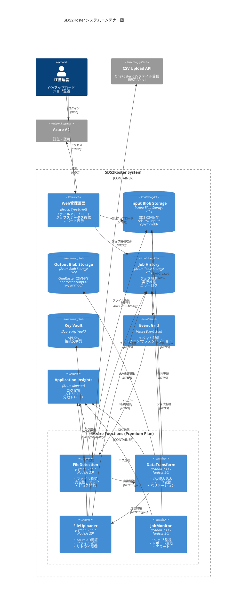

# C4 コンテナー図（Container Diagram）

**ドキュメントバージョン**: 1.0.0  
**作成日**: 2025-10-27  
**ステータス**: Draft

---

## 📋 概要

C4モデルのレベル2として、SDS2Rosterシステム内部の主要な実行単位（コンテナー）とその関係を示します。

**コンテナーとは**:
- アプリケーション、データストア、マイクロサービス等の実行単位
- 独立してデプロイ・実行可能な要素
- 本システムでは: Azure Functions、Blob Storage、Table Storage等

---

## 🏗️ システムコンテナー構成

###コンテナー一覧

| コンテナー名 | 種類 | 技術スタック | 役割 |
|------------|------|------------|------|
| **Web管理画面** | Webアプリケーション | React, TypeScript | ファイルアップロード、ジョブ監視 |
| **FileDetection Function** | Azure Function | Python/JavaScript | ファイル検知・完全性チェック |
| **DataTransform Function** | Azure Function | Python/JavaScript | SDS→OneRoster変換 |
| **ApiPublisher Function** | Azure Function | Python/JavaScript | CSVファイル送信 |
| **JobMonitor Function** | Azure Function | Python/JavaScript | ジョブ監視・レポート生成 |
| **Input Blob Storage** | ストレージ | Azure Blob Storage | SDS CSVファイル保存 |
| **Output Blob Storage** | ストレージ | Azure Blob Storage | OneRoster CSVファイル保存 |
| **Job History Storage** | データベース | Azure Table Storage | ジョブ履歴・状態管理 |
| **Secrets Storage** | シークレット管理 | Azure Key Vault | API Key、接続文字列 |
| **Monitoring** | 監視 | Application Insights | ログ・メトリクス・トレース |
| **Event Broker** | メッセージング | Azure Event Grid | イベント配信 |

---

## 📊 C4 コンテナー図



---

## 🔄 コンテナー間の詳細なデータフロー

### フロー1: ファイルアップロード → 検知

```
1. IT管理者 → Web管理画面
   - ファイル選択（school.csv, student.csv等）
   - 日付ディレクトリ指定（20251027）
   
2. Web管理画面 → Input Blob Storage
   - HTTP PUT: /sds-csv-input/20251027/school.csv
   - Content-Type: text/csv
   - Authorization: SAS Token
   
3. Input Blob Storage → Event Grid
   - Event: Microsoft.Storage.BlobCreated
   - Data: {url, blobType, contentLength, contentType}
   
4. Event Grid → FileDetection Function
   - HTTP POST with Event payload
   - Delivery Mode: At-least-once
```

### フロー2: ファイル完全性チェック → 変換開始

```
1. FileDetection Function
   - Event Gridからトリガー
   - Blob URLを解析（yyyymmddディレクトリ抽出）
   
2. FileDetection → Input Blob Storage
   - GET /sds-csv-input/20251027/ (list blobs)
   - 必須ファイルチェック:
     * school.csv
     * student.csv
     * teacher.csv
     * section.csv (optional)
     * studentenrollment.csv (optional)
     * teacherroster.csv (optional)
   
3. FileDetection → Job History (Table Storage)
   - POST Entity
   - PartitionKey: "2025-10"
   - RowKey: "job-20251027-153045-abc123"
   - Properties: {jobId, status:"Processing", startTime, inputDirectory}
   
4. FileDetection → DataTransform Function
   - HTTP POST /api/transform
   - Body: {jobId, inputDirectory, fileList[]}
```

### フロー3: データ変換処理

```
1. DataTransform Function
   - HTTP Triggerで起動
   
2. DataTransform → Input Blob Storage
   - GET /sds-csv-input/20251027/school.csv
   - GET /sds-csv-input/20251027/student.csv
   - ... (全ファイル並列読み込み)
   
3. DataTransform (内部処理)
   - CSVパース（Python: pandas / JS: csv-parse）
   - データ型変換
   - バリデーション
   - SDS → OneRoster マッピング
   - GUID生成
   - manifest.csv生成
   
4. DataTransform → Output Blob Storage
   - PUT /oneroster-output/20251027/manifest.csv
   - PUT /oneroster-output/20251027/orgs.csv
   - PUT /oneroster-output/20251027/users.csv
   - PUT /oneroster-output/20251027/courses.csv
   - PUT /oneroster-output/20251027/classes.csv
   - PUT /oneroster-output/20251027/enrollments.csv
   - PUT /oneroster-output/20251027/academicSessions.csv
   
5. DataTransform → Job History
   - PATCH Entity (progress update)
   - Properties: {recordCounts, outputDirectory}
   
6. DataTransform → FileUploader Function
   - HTTP POST /api/upload
   - Body: {jobId, outputDirectory}
```

### フロー4: ファイル送信

```
1. FileUploader Function
   - HTTP Triggerで起動
   
2. FileUploader → Key Vault
   - GET Secret: "upload-api-key"
   - GET Secret: "upload-api-endpoint"
   - 認証: Managed Identity
   
3. FileUploader → Output Blob Storage
   - GET /oneroster-output/20251027/manifest.csv
   - GET /oneroster-output/20251027/orgs.csv
   - GET /oneroster-output/20251027/users.csv
   - ... (全ファイル読み込み)
   
4. FileUploader (内部処理)
   - metadata.jsonの生成
     * source, version, uploadedAt
     * recordCounts (各CSVのレコード数)
     * checksums (各CSVのSHA-256)
   - multipart/form-dataの構築
   
5. FileUploader → CSV Upload API (Azure AD認証)
   - Azure AD Managed Identity → Bearer Token取得
   - Token有効期限: 1時間
   
6. FileUploader → CSV Upload API (ファイル送信)
   - POST /api/v1/upload
   - Content-Type: multipart/form-data
   - Header: Authorization: Bearer {azure_ad_token}
   - Header: X-API-Key: {api_key}
   - Body: 
     * metadata.json (application/json)
     * manifest.csv, orgs.csv, users.csv, ... (text/csv)
   - Response: 202 Accepted
     * {uploadId, status:"accepted", message}
   - Retry Logic: Exponential Backoff (最大3回)
   
7. FileUploader → Job History
   - PATCH Entity (completion)
   - Properties: {status:"Completed", endTime, uploadId, apiResults}
```

### フロー5: ジョブ監視・レポート

```
1. JobMonitor Function
   - Timer Trigger (5分ごと)
   
2. JobMonitor → Job History
   - QUERY: status="Processing" AND startTime < (now - 30min)
   - 長時間実行ジョブの検出
   
3. JobMonitor → Application Insights
   - POST CustomEvent: "LongRunningJob"
   - Alert条件にマッチすると自動通知
   
4. JobMonitor (日次レポート - cron: 0 0 * * *)
   - QUERY: PartitionKey="2025-10" (当月)
   - 集計: 成功数、失敗数、平均処理時間
   - レポートCSV生成
   
5. JobMonitor → Output Blob Storage (レポート保存)
   - PUT /reports/daily/report-20251027.csv
```

---

## 🗄️ データストア詳細

### Input Blob Storage

**コンテナー名**: `sds-csv-input`  
**冗長性**: Zone-Redundant Storage (ZRS)  
**アクセス層**: Hot（頻繁アクセス）  
**保存期間**: 1年間

**ディレクトリ構造**:
```
sds-csv-input/
├── 20251027/
│   ├── school.csv          (組織情報)
│   ├── student.csv         (学生情報)
│   ├── teacher.csv         (教員情報)
│   ├── section.csv         (クラス情報)
│   ├── studentenrollment.csv (学生登録)
│   └── teacherroster.csv   (教員配置)
├── 20251028/
│   └── ...
```

**アクセス制御**:
- Function: Managed Identity（Storage Blob Data Reader）
- 管理画面: SAS Token（時間制限付き）

### Output Blob Storage

**コンテナー名**: `oneroster-output`  
**冗長性**: Zone-Redundant Storage (ZRS)  
**アクセス層**: Hot  
**保存期間**: 1年間

**ディレクトリ構造**:
```
oneroster-output/
├── 20251027/
│   ├── manifest.csv           (ファイルリスト、バージョン情報)
│   ├── orgs.csv              (組織: 10レコード)
│   ├── users.csv             (ユーザー: 150レコード)
│   ├── courses.csv           (コース: 20レコード)
│   ├── classes.csv           (クラス: 30レコード)
│   ├── enrollments.csv       (登録: 180レコード)
│   └── academicSessions.csv  (学期: 4レコード)
├── 20251028/
│   └── ...
```

### Job History (Table Storage)

**テーブル名**: `JobHistory`  
**冗長性**: Zone-Redundant Storage (ZRS)

**スキーマ**:
```
PartitionKey: "YYYY-MM" (例: "2025-10")
RowKey: "job-{yyyymmdd}-{hhmmss}-{random}" (例: "job-20251027-153045-abc123")

Properties:
- jobId (string): "job-20251027-153045-abc123"
- status (string): "Processing" | "Completed" | "Failed"
- startTime (datetime): 2025-10-27T15:30:45Z
- endTime (datetime): 2025-10-27T15:35:12Z
- inputDirectory (string): "sds-csv-input/20251027/"
- outputDirectory (string): "oneroster-output/20251027/"
- inputFiles (string): '["school.csv","student.csv","teacher.csv"]' (JSON)
- outputFiles (string): '["manifest.csv","orgs.csv","users.csv",...]' (JSON)
- recordCounts (string): '{"orgs":10,"users":150,"classes":30}' (JSON)
- errors (int32): 0
- warnings (int32): 2
- errorDetails (string): '[]' (JSON array)
- userId (string): "admin@example.com"
- version (string): "python" | "javascript"
```

**インデックス戦略**:
- PartitionKey（YYYY-MM）で月次クエリ最適化
- RowKey（逆タイムスタンプ）で最新ジョブから取得

**クエリ例**:
```
// 2025年10月の全ジョブ
PartitionKey eq '2025-10'

// 失敗ジョブのみ
PartitionKey eq '2025-10' and status eq 'Failed'

// 最新10件
PartitionKey eq '2025-10' order by RowKey desc top 10
```

### Key Vault

**Vault名**: `sds2roster-kv-prod`  
**SKU**: Standard  
**アクセスポリシー**: Azure RBACモデル

**格納シークレット**:
```
Secret名                          値の例
----------------------------------------
upload-api-key                    xxxxxxxx-xxxx-xxxx-xxxx-xxxxxxxxxxxx
upload-api-endpoint               https://upload.example.com/api/v1
storage-connection-string         DefaultEndpointsProtocol=https;...
notification-smtp-password        P@ssw0rd123
```

**バージョン管理**: 有効（過去バージョン保持）  
**ローテーション**: 90日ごと（推奨）

---

## 🔐 セキュリティ設計

### 認証・認可マトリクス

| コンテナー | 認証方法 | アクセス先 | 権限 |
|-----------|---------|----------|------|
| Web管理画面 | Azure AD (OIDC) | Input Blob | SAS Token（書き込み） |
| Web管理画面 | Azure AD (OIDC) | Table Storage | SAS Token（読み取り） |
| FileDetection | Managed Identity | Input Blob | Storage Blob Data Reader |
| FileDetection | Managed Identity | Table Storage | Table Data Contributor |
| DataTransform | Managed Identity | Input Blob | Storage Blob Data Reader |
| DataTransform | Managed Identity | Output Blob | Storage Blob Data Contributor |
| DataTransform | Managed Identity | Table Storage | Table Data Contributor |
| FileUploader | Managed Identity | Key Vault | Key Vault Secrets User |
| FileUploader | Managed Identity | Output Blob | Storage Blob Data Reader |
| FileUploader | Managed Identity | Table Storage | Table Data Contributor |
| FileUploader | Azure AD + API Key | CSV Upload API | Bearer Token + X-API-Key |

### ネットワークセキュリティ

**現在の構成**:
- Public Endpoint使用
- HTTPS強制（TLS 1.2以上）
- Azure AD認証
- Managed Identity

**将来の強化案（Phase 2）**:
- Private Endpoint有効化
- VNet統合（Azure Functions）
- Network Security Group（NSG）
- Azure Firewall

---

## 📈 スケーラビリティ設計

### Azure Functions スケール設定

**プラン**: Premium Plan (EP1)

**スケールアウト設定**:
```
- 最小インスタンス数: 1（Always Ready）
- 最大インスタンス数: 200
- スケールアウトトリガー: CPU 70%以上
- スケールアウト時間: 1分以内
- スケールイン遅延: 10分間
```

**Function別の並列実行**:
```
FileDetection:
- 最大並列実行: 100（Event Grid配信）
- 実行時間制限: 5分

DataTransform:
- 最大並列実行: 50（重い処理）
- 実行時間制限: 30分（Premium Plan）

FileUploader:
- 最大並列実行: 20（外部API依存）
- 実行時間制限: 15分
- リトライ: 3回（Exponential Backoff）

JobMonitor:
- 並列実行: 1（Timer Trigger）
- 実行時間制限: 10分
```

### Storage スケール特性

| Storage | スケール方式 | 上限 |
|---------|------------|------|
| Blob Storage | 自動（無制限） | 5PB（アカウント） |
| Table Storage | パーティション分散 | 無制限（実質） |
| Key Vault | 自動 | 10,000 requests/10sec |

---

## 🔍 可観測性設計

### Application Insights統合

**テレメトリー種類**:
```
1. Traces (ログ)
   - severity: Verbose, Information, Warning, Error, Critical
   - customDimensions: {jobId, userId, version}
   
2. Metrics (メトリクス)
   - カスタムメトリクス:
     * job_duration_seconds
     * record_count
     * api_call_duration_ms
     * error_rate
   
3. Dependencies (依存関係)
   - Blob Storage呼び出し
   - Table Storage呼び出し
   - CSV Upload API呼び出し
   
4. Exceptions (例外)
   - スタックトレース
   - カスタムプロパティ
   
5. Custom Events
   - JobStarted
   - JobCompleted
   - JobFailed
   - ApiCallSuccess
   - ApiCallFailed
```

###ログ構造

**構造化ログ例（JSON）**:
```json
{
  "timestamp": "2025-10-27T15:30:45.123Z",
  "level": "Information",
  "message": "Job started",
  "properties": {
    "jobId": "job-20251027-153045-abc123",
    "inputDirectory": "sds-csv-input/20251027/",
    "fileCount": 6,
    "userId": "admin@example.com",
    "version": "python",
    "correlationId": "abc-123-def-456"
  }
}
```

### 分散トレーシング

**相関ID戦略**:
```
1. FileDetection: 相関ID生成（UUID）
2. DataTransform: 親の相関IDを引き継ぎ
3. FileUploader: 同一相関IDでトレース
4. Application Insights: 相関IDでトレース集約
```

---

## 📊 パフォーマンス目標

### レスポンスタイム

| 処理 | 目標時間 | 測定点 |
|------|---------|--------|
| ファイル検知 | 10秒以内 | Event Grid → Function起動 |
| 変換処理（10万レコード） | 10分以内 | CSV読み込み → CSV出力 |
| ファイル送信（10万レコード） | 15分以内 | Azure AD認証 → ファイル送信完了 |
| 管理画面読み込み | 3秒以内 | ページロード → 初回描画 |

### スループット

| 処理 | 目標スループット |
|------|----------------|
| CSVアップロード | 100MB/秒 |
| 変換処理 | 1万レコード/分 |
| API送信 | 100リクエスト/秒 |
| Table Storage書き込み | 1000 TPS |

---

## 🚨 エラーハンドリング戦略

### リトライポリシー

| コンテナー | リトライ対象 | 戦略 | 最大回数 |
|-----------|------------|------|---------|
| FileDetection | Event Grid配信失敗 | Event Grid自動リトライ | 30回（24時間） |
| DataTransform | Blob読み取りエラー | Exponential Backoff | 3回 |
| ApiPublisher | OneRoster API 5xx | Exponential Backoff | 3回 |
| ApiPublisher | OAuth認証失敗 | Exponential Backoff | 3回 |
| All Functions | Table Storage接続エラー | Exponential Backoff | 5回 |

### エラーレベル分類

| レベル | 説明 | 対応 |
|--------|------|------|
| **Critical** | システム停止レベル | 即座にアラート、オンコール対応 |
| **Error** | 処理失敗 | IT管理者に通知、手動リトライ |
| **Warning** | データ不整合、推奨外の使用 | ログ記録、日次レビュー |
| **Info** | 正常処理 | ログ記録のみ |

---

## 📚 関連ドキュメント

### 次のレベル
- [04_c4_component_diagram_python.md](./04_c4_component_diagram_python.md) - Python版コンポーネント図
- [04_c4_component_diagram_javascript.md](./04_c4_component_diagram_javascript.md) - JavaScript版コンポーネント図

### アーキテクチャドキュメント
- [01_architecture_overview.md](./01_architecture_overview.md) - アーキテクチャ概要
- [02_c4_context_diagram.md](./02_c4_context_diagram.md) - コンテキスト図

### 技術仕様
- [07_infrastructure_design.md](./07_infrastructure_design.md) - Terraform設計（作成予定）
- [08_api_specification.md](./08_api_specification.md) - API仕様（作成予定）

---

## 📝 変更履歴

| バージョン | 日付 | 変更内容 | 変更者 |
|-----------|------|---------|--------|
| 1.0.0 | 2025-10-27 | 初版作成（Python/JavaScript両対応） | System Architect |

---

**文書管理責任者**: System Architect  
**最終更新日**: 2025-10-27  
**ドキュメントステータス**: Draft
