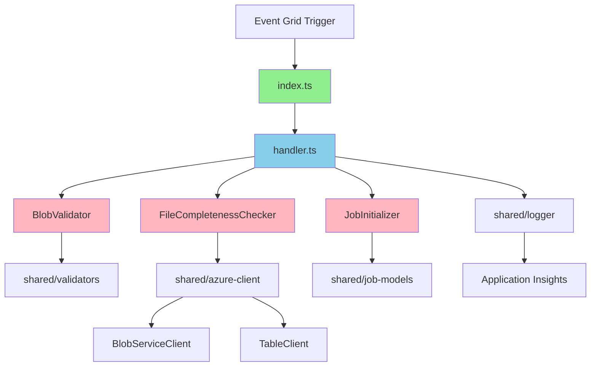
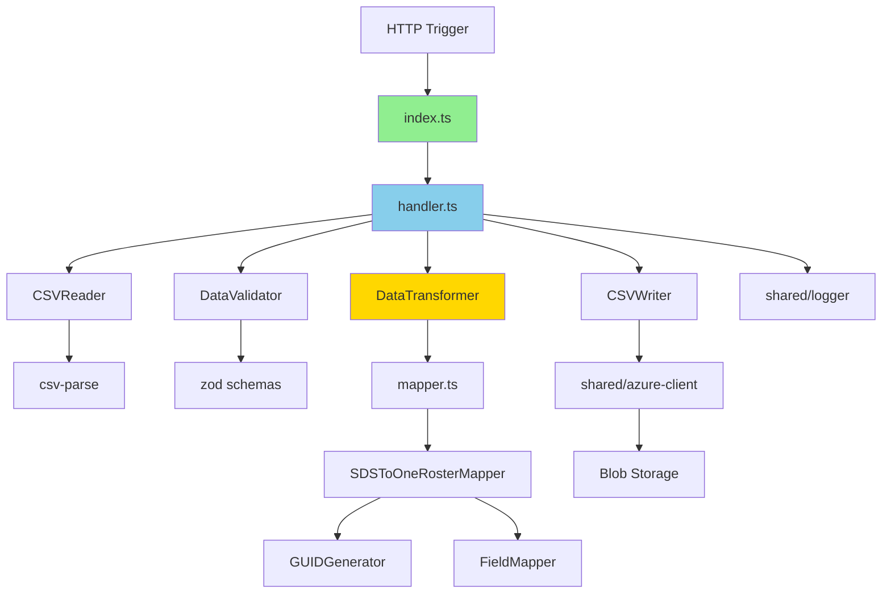
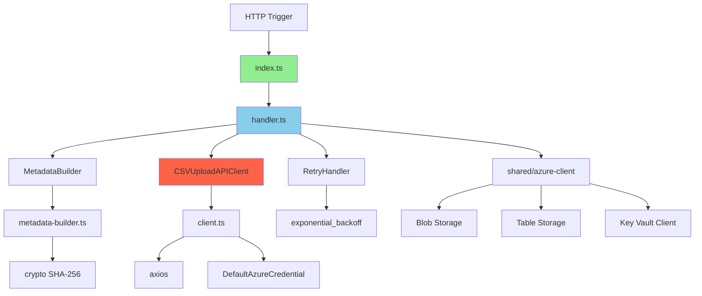

# C4 コンポーネント図 - JavaScript版

**ドキュメントバージョン**: 1.0.0  
**作成日**: 2025-10-27  
**ステータス**: Draft  
**実装言語**: TypeScript on Node.js 20

---

## 📋 概要

C4モデルのレベル3として、JavaScript(TypeScript)版Azure Functionsの内部コンポーネント構造を詳細に示します。

**対象範囲**:
- FileDetection Function（TypeScript実装）
- DataTransform Function（TypeScript実装）
- FileUploader Function（TypeScript実装）
- JobMonitor Function（TypeScript実装）
- 共有モジュール（Shared Modules）

---

## 🏗️ JavaScript版全体構成

### ディレクトリ構造

```
src/javascript/
├── functions/
│   ├── file-detection/
│   │   ├── src/
│   │   │   ├── index.ts                  # メインエントリーポイント
│   │   │   ├── handler.ts                # ビジネスロジック
│   │   │   └── types.ts                  # 型定義
│   │   ├── package.json
│   │   ├── tsconfig.json
│   │   └── function.json
│   │
│   ├── data-transform/
│   │   ├── src/
│   │   │   ├── index.ts
│   │   │   ├── handler.ts
│   │   │   ├── transformer.ts            # 変換エンジン
│   │   │   ├── mapper.ts                 # データマッピング
│   │   │   └── types.ts
│   │   ├── package.json
│   │   └── tsconfig.json
│   │
│   ├── file-uploader/
│   │   ├── src/
│   │   │   ├── index.ts
│   │   │   ├── handler.ts
│   │   │   ├── client.ts                 # CSV Upload APIクライアント
│   │   │   ├── metadata-builder.ts       # metadata.json生成
│   │   │   └── types.ts
│   │   ├── package.json
│   │   └── tsconfig.json
│   │
│   └── job-monitor/
│       ├── src/
│       │   ├── index.ts
│       │   ├── handler.ts
│       │   ├── reporter.ts               # レポート生成
│       │   └── types.ts
│       ├── package.json
│       └── tsconfig.json
│
├── shared/
│   ├── src/
│   │   ├── models/
│   │   │   ├── sds-models.ts             # SDSデータモデル
│   │   │   ├── oneroster-models.ts       # OneRosterデータモデル
│   │   │   └── job-models.ts             # ジョブ管理モデル
│   │   │
│   │   ├── utils/
│   │   │   ├── logger.ts                 # 構造化ログ
│   │   │   ├── azure-client.ts           # Azure SDK統合
│   │   │   ├── csv-parser.ts             # CSV操作
│   │   │   └── validators.ts             # バリデーション
│   │   │
│   │   ├── constants.ts                  # 定数定義
│   │   └── config.ts                     # 設定管理
│   │
│   ├── package.json
│   └── tsconfig.json
│
├── tests/
│   ├── unit/
│   │   ├── file-detection.test.ts
│   │   ├── data-transform.test.ts
│   │   ├── file-uploader.test.ts
│   │   └── shared-utils.test.ts
│   │
│   └── integration/
│       ├── e2e-flow.test.ts
│       └── api-integration.test.ts
│
├── package.json                          # ワークスペース設定
├── tsconfig.json                         # TypeScript共通設定
├── host.json                             # Function App設定
├── local.settings.json                  # ローカル設定（Git除外）
└── README.md
```

### 主要ライブラリ

```json
{
  "dependencies": {
    "@azure/functions": "^4.5.0",
    "@azure/storage-blob": "^12.17.0",
    "@azure/data-tables": "^13.2.2",
    "@azure/identity": "^4.0.1",
    "@azure/keyvault-secrets": "^4.8.0",
    
    "csv-parse": "^5.5.3",
    "csv-stringify": "^6.4.5",
    "axios": "^1.6.2",
    "uuid": "^9.0.1",
    "zod": "^3.22.4",
    
    "date-fns": "^3.0.6"
  },
  "devDependencies": {
    "typescript": "^5.3.3",
    "@types/node": "^20.10.6",
    "@types/uuid": "^9.0.7",
    
    "jest": "^29.7.0",
    "@types/jest": "^29.5.11",
    "ts-jest": "^29.1.1",
    
    "eslint": "^8.56.0",
    "@typescript-eslint/eslint-plugin": "^6.17.0",
    "@typescript-eslint/parser": "^6.17.0"
  }
}
```

---

## 🔧 FileDetection Function（JavaScript版）

### コンポーネント構造



### 型定義とクラス設計

#### types.ts
```typescript
import { EventGridEvent } from '@azure/eventgrid';

export interface BlobCreatedEventData {
  api: string;
  clientRequestId: string;
  requestId: string;
  eTag: string;
  contentType: string;
  contentLength: number;
  blobType: string;
  url: string;
  sequencer: string;
  storageDiagnostics: {
    batchId: string;
  };
}

export interface FileDetectionResult {
  status: 'success' | 'waiting' | 'error';
  jobId?: string;
  directory?: string;
  message?: string;
}

export interface FileCheckResult {
  isComplete: boolean;
  foundFiles: string[];
  missingFiles: string[];
}
```

#### index.ts
```typescript
import { app, EventGridEvent, InvocationContext } from '@azure/functions';
import { FileDetectionHandler } from './handler';
import { StructuredLogger } from '../../shared/utils/logger';

const logger = new StructuredLogger('FileDetection');

app.eventGrid('fileDetection', {
  handler: async (event: EventGridEvent, context: InvocationContext) => {
    logger.info('Event Grid trigger started', {
      eventId: event.id,
      eventType: event.eventType,
      invocationId: context.invocationId
    });

    try {
      const handler = new FileDetectionHandler();
      const result = await handler.handle(event);

      logger.info('File detection completed', {
        result,
        invocationId: context.invocationId
      });

      return result;
    } catch (error) {
      logger.error('File detection failed', {
        error: error instanceof Error ? error.message : String(error),
        invocationId: context.invocationId
      }, error);

      throw error;
    }
  }
});
```

#### handler.ts
```typescript
import { EventGridEvent } from '@azure/eventgrid';
import { AzureBlobClient, AzureTableClient } from '../../shared/utils/azure-client';
import { StructuredLogger } from '../../shared/utils/logger';
import { FileValidator } from '../../shared/utils/validators';
import { Job, JobStatus } from '../../shared/models/job-models';
import { REQUIRED_FILES } from '../../shared/constants';
import axios from 'axios';
import { v4 as uuidv4 } from 'uuid';
import { format } from 'date-fns';
import type { 
  BlobCreatedEventData, 
  FileDetectionResult,
  FileCheckResult 
} from './types';

export class FileDetectionHandler {
  private blobClient: AzureBlobClient;
  private tableClient: AzureTableClient;
  private logger: StructuredLogger;
  private validator: FileValidator;

  constructor() {
    this.blobClient = new AzureBlobClient();
    this.tableClient = new AzureTableClient();
    this.logger = new StructuredLogger('FileDetectionHandler');
    this.validator = new FileValidator();
  }

  async handle(event: EventGridEvent): Promise<FileDetectionResult> {
    try {
      // イベントデータ解析
      const eventData = event.data as BlobCreatedEventData;
      const blobUrl = eventData.url;
      const directory = this.extractDirectory(blobUrl);

      this.logger.info('File detection started', {
        directory,
        blobUrl,
        eventId: event.id
      });

      // ファイル完全性チェック
      const checkResult = await this.checkFileCompleteness(directory);

      if (!checkResult.isComplete) {
        this.logger.warning('Files not complete yet', {
          directory,
          foundFiles: checkResult.foundFiles,
          missingFiles: checkResult.missingFiles
        });

        return { 
          status: 'waiting', 
          directory,
          message: `Waiting for files: ${checkResult.missingFiles.join(', ')}`
        };
      }

      // ジョブ初期化
      const job = await this.initializeJob(directory, checkResult.foundFiles);

      // 変換Functionトリガー
      await this.triggerTransform(job);

      this.logger.info('File detection completed', {
        jobId: job.jobId,
        fileCount: checkResult.foundFiles.length
      });

      return { 
        status: 'success', 
        jobId: job.jobId,
        directory
      };

    } catch (error) {
      this.logger.error('File detection failed', {
        error: error instanceof Error ? error.message : String(error)
      }, error);

      throw error;
    }
  }

  private extractDirectory(blobUrl: string): string {
    /**
     * Blob URLからディレクトリパス抽出
     * 例: .../sds-csv-input/20251027/school.csv → 20251027
     */
    const urlParts = blobUrl.split('/');
    const containerIndex = urlParts.findIndex(part => part === 'sds-csv-input');
    
    if (containerIndex === -1 || containerIndex === urlParts.length - 1) {
      throw new Error('Invalid blob URL format');
    }

    return urlParts[containerIndex + 1];
  }

  private async checkFileCompleteness(directory: string): Promise<FileCheckResult> {
    /**
     * ファイル完全性チェック
     * 
     * 必須ファイル（ユーザー管理のみ）:
     * - school.csv
     * - student.csv
     * - teacher.csv
     * 
     * オプションファイル（クラス管理）:
     * - section.csv
     * - studentenrollment.csv
     * - teacherroster.csv
     */
    const prefix = `sds-csv-input/${directory}/`;
    const blobs = await this.blobClient.listBlobs('sds-csv-input', prefix);

    const fileNames = blobs.map(blob => blob.name.split('/').pop()!);

    // 必須ファイルチェック
    const requiredFiles = new Set(['school.csv', 'student.csv', 'teacher.csv']);
    const foundFiles = fileNames.filter(name => requiredFiles.has(name));
    const missingFiles = Array.from(requiredFiles).filter(name => !fileNames.includes(name));

    return {
      isComplete: missingFiles.length === 0,
      foundFiles: fileNames,
      missingFiles
    };
  }

  private async initializeJob(directory: string, files: string[]): Promise<Job> {
    /**
     * ジョブ初期化
     */
    const now = new Date();
    const jobId = `job-${format(now, 'yyyyMMdd-HHmmss')}-${uuidv4().substring(0, 8)}`;

    const job: Job = {
      partitionKey: format(now, 'yyyy-MM'),
      rowKey: jobId,
      jobId,
      status: JobStatus.Processing,
      startTime: now.toISOString(),
      inputDirectory: `sds-csv-input/${directory}/`,
      inputFiles: files,
      userId: 'system', // 実際はAzure ADから取得
      version: 'javascript'
    };

    // Table Storageに保存
    await this.tableClient.insertEntity('JobHistory', job);

    return job;
  }

  private async triggerTransform(job: Job): Promise<void> {
    /**
     * データ変換Functionをトリガー
     */
    const transformUrl = process.env.TRANSFORM_FUNCTION_URL;
    
    if (!transformUrl) {
      throw new Error('TRANSFORM_FUNCTION_URL not configured');
    }

    const payload = {
      jobId: job.jobId,
      inputDirectory: job.inputDirectory,
      files: job.inputFiles
    };

    try {
      const response = await axios.post(transformUrl, payload, {
        headers: { 'Content-Type': 'application/json' },
        timeout: 30000
      });

      this.logger.info('Transform function triggered', {
        jobId: job.jobId,
        statusCode: response.status
      });
    } catch (error) {
      this.logger.error('Failed to trigger transform function', {
        jobId: job.jobId,
        error: error instanceof Error ? error.message : String(error)
      }, error);

      throw error;
    }
  }
}
```

---

## 🔄 DataTransform Function（JavaScript版）

### コンポーネント構造



### 型定義とクラス設計

#### transformer.ts
```typescript
import { parse } from 'csv-parse/sync';
import { stringify } from 'csv-stringify/sync';
import { StructuredLogger } from '../../shared/utils/logger';
import { SDSSchool, SDSStudent, SDSTeacher } from '../../shared/models/sds-models';
import { 
  OneRosterOrg, 
  OneRosterUser,
  OneRosterCourse,
  OneRosterClass,
  OneRosterEnrollment
} from '../../shared/models/oneroster-models';
import { SDSToOneRosterMapper } from './mapper';

export class DataTransformer {
  private logger: StructuredLogger;
  private mapper: SDSToOneRosterMapper;

  constructor() {
    this.logger = new StructuredLogger('DataTransformer');
    this.mapper = new SDSToOneRosterMapper();
  }

  async transformSchools(csvContent: string): Promise<string> {
    /**
     * school.csv → orgs.csv 変換
     * 
     * SDSフィールド:
     * - School SIS ID
     * - Name
     * - School Number
     * - School NCES_ID (optional)
     * - State ID (optional)
     * 
     * OneRosterフィールド:
     * - sourcedId (GUID)
     * - status (active)
     * - dateLastModified
     * - name
     * - type (school)
     * - identifier (School SIS ID)
     */
    this.logger.info('Transforming schools');

    // CSV解析
    const records = parse(csvContent, {
      columns: true,
      skip_empty_lines: true,
      trim: true
    }) as SDSSchool[];

    this.logger.info(`Parsing ${records.length} schools`);

    // 変換
    const orgs: OneRosterOrg[] = records.map(record => 
      this.mapper.mapSchoolToOrg(record)
    );

    // CSV生成
    const outputCsv = stringify(orgs, {
      header: true,
      columns: [
        'sourcedId',
        'status',
        'dateLastModified',
        'name',
        'type',
        'identifier',
        'parentSourcedId'
      ]
    });

    return outputCsv;
  }

  async transformUsers(
    studentsCsv: string,
    teachersCsv: string
  ): Promise<string> {
    /**
     * student.csv + teacher.csv → users.csv 変換
     */
    this.logger.info('Transforming users');

    // 学生解析
    const students = parse(studentsCsv, {
      columns: true,
      skip_empty_lines: true,
      trim: true
    }) as SDSStudent[];

    // 教員解析
    const teachers = parse(teachersCsv, {
      columns: true,
      skip_empty_lines: true,
      trim: true
    }) as SDSTeacher[];

    this.logger.info(
      `Parsing ${students.length} students and ${teachers.length} teachers`
    );

    const users: OneRosterUser[] = [];

    // 学生変換
    students.forEach(student => {
      users.push(this.mapper.mapStudentToUser(student));
    });

    // 教員変換
    teachers.forEach(teacher => {
      users.push(this.mapper.mapTeacherToUser(teacher));
    });

    // CSV生成
    const outputCsv = stringify(users, {
      header: true,
      columns: [
        'sourcedId',
        'status',
        'dateLastModified',
        'enabledUser',
        'username',
        'userIds',
        'givenName',
        'familyName',
        'middleName',
        'role',
        'identifier',
        'email',
        'sms',
        'phone',
        'orgs',
        'grades'
      ]
    });

    return outputCsv;
  }

  async transformCourses(sectionsCsv: string): Promise<string> {
    /**
     * section.csv → courses.csv 変換
     */
    this.logger.info('Transforming courses');

    const sections = parse(sectionsCsv, {
      columns: true,
      skip_empty_lines: true,
      trim: true
    });

    // コース抽出（重複除去）
    const courseMap = new Map<string, OneRosterCourse>();

    sections.forEach((section: any) => {
      const courseId = section['Course SIS ID'];
      if (!courseMap.has(courseId)) {
        courseMap.set(
          courseId,
          this.mapper.mapSectionToCourse(section)
        );
      }
    });

    const courses = Array.from(courseMap.values());

    const outputCsv = stringify(courses, {
      header: true,
      columns: [
        'sourcedId',
        'status',
        'dateLastModified',
        'schoolYearSourcedId',
        'title',
        'courseCode',
        'grades',
        'subjects',
        'orgSourcedId'
      ]
    });

    return outputCsv;
  }
}
```

#### mapper.ts
```typescript
import { v5 as uuidv5 } from 'uuid';
import { format } from 'date-fns';
import { SDSSchool, SDSStudent, SDSTeacher } from '../../shared/models/sds-models';
import { OneRosterOrg, OneRosterUser } from '../../shared/models/oneroster-models';

export class SDSToOneRosterMapper {
  private guidCache: Map<string, string>;
  private namespace: string;

  constructor() {
    this.guidCache = new Map();
    // OneRoster専用名前空間UUID
    this.namespace = '6ba7b810-9dad-11d1-80b4-00c04fd430c8';
  }

  mapSchoolToOrg(sdsSchool: SDSSchool): OneRosterOrg {
    /**
     * school.csv → orgs.csv マッピング
     * 
     * 変換ルール:
     * 1. sourcedId: SDS ID からGUID生成（決定的）
     * 2. name: Name をそのまま使用
     * 3. type: 固定値 "school"
     * 4. identifier: School SIS ID
     */
    const sdsId = String(sdsSchool['School SIS ID']);
    const sourcedId = this.generateDeterministicGuid('school', sdsId);

    const org: OneRosterOrg = {
      sourcedId,
      status: 'active',
      dateLastModified: new Date().toISOString(),
      name: sdsSchool.Name,
      type: 'school',
      identifier: sdsId,
      parentSourcedId: undefined,
      metadata: {
        schoolNumber: sdsSchool['School Number'],
        ncesId: sdsSchool['School NCES_ID'],
        stateId: sdsSchool['State ID']
      }
    };

    return org;
  }

  mapStudentToUser(sdsStudent: SDSStudent): OneRosterUser {
    /**
     * student.csv → users.csv マッピング
     */
    const sdsId = String(sdsStudent['SIS ID']);
    const sourcedId = this.generateDeterministicGuid('student', sdsId);

    // メールアドレス生成（存在しない場合）
    const email = sdsStudent.Username 
      ? `${sdsStudent.Username}@example.edu` 
      : `${sdsId}@example.edu`;

    const user: OneRosterUser = {
      sourcedId,
      status: 'active',
      dateLastModified: new Date().toISOString(),
      enabledUser: true,
      username: sdsStudent.Username || sdsId,
      userIds: JSON.stringify([{
        type: 'SIS',
        identifier: sdsId
      }]),
      givenName: sdsStudent['First Name'] || '',
      familyName: sdsStudent['Last Name'] || '',
      middleName: sdsStudent['Middle Name'],
      role: 'student',
      identifier: sdsId,
      email,
      sms: sdsStudent.Phone,
      phone: sdsStudent.Phone,
      orgs: this.getOrgGuid(sdsStudent['School SIS ID']),
      grades: sdsStudent.Grade ? JSON.stringify([sdsStudent.Grade]) : undefined
    };

    return user;
  }

  mapTeacherToUser(sdsTeacher: SDSTeacher): OneRosterUser {
    /**
     * teacher.csv → users.csv マッピング
     */
    const sdsId = String(sdsTeacher['SIS ID']);
    const sourcedId = this.generateDeterministicGuid('teacher', sdsId);

    const email = sdsTeacher.Username 
      ? `${sdsTeacher.Username}@example.edu` 
      : `${sdsId}@example.edu`;

    const user: OneRosterUser = {
      sourcedId,
      status: 'active',
      dateLastModified: new Date().toISOString(),
      enabledUser: true,
      username: sdsTeacher.Username || sdsId,
      userIds: JSON.stringify([{
        type: 'SIS',
        identifier: sdsId
      }]),
      givenName: sdsTeacher['First Name'] || '',
      familyName: sdsTeacher['Last Name'] || '',
      middleName: sdsTeacher['Middle Name'],
      role: 'teacher',
      identifier: sdsId,
      email,
      sms: sdsTeacher.Phone,
      phone: sdsTeacher.Phone,
      orgs: this.getOrgGuid(sdsTeacher['School SIS ID']),
      grades: undefined
    };

    return user;
  }

  private generateDeterministicGuid(entityType: string, entityId: string): string {
    /**
     * 決定的GUID生成
     * 同じ入力なら常に同じGUIDを返す（UUID v5使用）
     * 
     * @param entityType - エンティティタイプ（school, student, teacher等）
     * @param entityId - エンティティID（SDS ID）
     * @returns UUID形式の文字列
     */
    const cacheKey = `${entityType}:${entityId}`;

    if (this.guidCache.has(cacheKey)) {
      return this.guidCache.get(cacheKey)!;
    }

    // entity_type + entity_id から決定的にGUID生成
    const guid = uuidv5(cacheKey, this.namespace);

    this.guidCache.set(cacheKey, guid);
    return guid;
  }

  private getOrgGuid(schoolSisId?: string): string | undefined {
    /**
     * 組織GUIDを取得（学校IDから）
     */
    if (!schoolSisId) {
      return undefined;
    }

    return this.generateDeterministicGuid('school', String(schoolSisId));
  }
}
```

---

## 📤 FileUploader Function（JavaScript版）

### コンポーネント構造



### クラス設計

#### metadata-builder.ts
```typescript
import * as crypto from 'crypto';
import { StructuredLogger } from '../../shared/utils/logger';
import { AzureBlobClient } from '../../shared/utils/azure-client';

interface MetadataJSON {
  source: string;
  version: string;
  uploadedAt: string;
  recordCounts: Record<string, number>;
  checksums: Record<string, string>;
}

export class MetadataBuilder {
  private blobClient: AzureBlobClient;
  private logger: StructuredLogger;

  constructor() {
    this.blobClient = new AzureBlobClient();
    this.logger = new StructuredLogger('MetadataBuilder');
  }

  async buildMetadata(
    outputDirectory: string,
    fileList: string[]
  ): Promise<MetadataJSON> {
    /**
     * metadata.json生成
     * 
     * @param outputDirectory - 出力ディレクトリパス
     * @param fileList - CSVファイル名リスト
     * @returns メタデータオブジェクト
     */
    this.logger.info('Building metadata', {
      directory: outputDirectory,
      fileCount: fileList.length
    });

    const checksums: Record<string, string> = {};
    const recordCounts: Record<string, number> = {};

    for (const filename of fileList) {
      const blobPath = `${outputDirectory}/${filename}`;

      // ファイル読み込み
      const content = await this.blobClient.downloadBlob(
        'oneroster-output',
        blobPath
      );

      // SHA-256チェックサム計算
      const hash = crypto.createHash('sha256');
      hash.update(content);
      const checksum = hash.digest('hex');
      checksums[filename] = checksum;

      // レコード数カウント（ヘッダー除く）
      const lines = content.trim().split('\n');
      const recordCount = Math.max(0, lines.length - 1); // ヘッダー行を除く
      recordCounts[filename] = recordCount;

      this.logger.debug(`File processed: ${filename}`, {
        checksum: checksum.substring(0, 16) + '...',
        records: recordCount
      });
    }

    // メタデータ構築
    const metadata: MetadataJSON = {
      source: 'SDS2Roster',
      version: '1.0.0',
      uploadedAt: new Date().toISOString(),
      recordCounts,
      checksums
    };

    const totalRecords = Object.values(recordCounts).reduce((a, b) => a + b, 0);

    this.logger.info('Metadata built successfully', {
      totalRecords,
      totalFiles: fileList.length
    });

    return metadata;
  }
}
```

#### client.ts
```typescript
import axios, { AxiosInstance } from 'axios';
import FormData from 'form-data';
import { DefaultAzureCredential } from '@azure/identity';
import { SecretClient } from '@azure/keyvault-secrets';
import { StructuredLogger } from '../../shared/utils/logger';

interface UploadResponse {
  uploadId: string;
  status: string;
  message: string;
  receivedAt: string;
}

interface StatusResponse {
  uploadId: string;
  status: 'accepted' | 'processing' | 'completed' | 'failed' | 'partial_success';
  receivedAt: string;
  processedAt?: string;
  completedAt?: string;
  totalFiles: number;
  processedFiles: number;
  failedFiles: number;
  recordCounts?: Record<string, number>;
  errors?: Array<{ file: string; error: string }>;
}

interface TokenCacheEntry {
  accessToken: string;
  expiresAt: Date;
}

export class CSVUploadAPIClient {
  private kvClient: SecretClient;
  private credential: DefaultAzureCredential;
  private logger: StructuredLogger;
  private axiosInstance: AxiosInstance;
  private tokenCache?: TokenCacheEntry;

  constructor() {
    const keyVaultUrl = process.env.KEY_VAULT_URL;
    if (!keyVaultUrl) {
      throw new Error('KEY_VAULT_URL not configured');
    }

    this.credential = new DefaultAzureCredential();
    this.kvClient = new SecretClient(keyVaultUrl, this.credential);
    this.logger = new StructuredLogger('CSVUploadAPIClient');

    this.axiosInstance = axios.create({
      timeout: 60000, // 60秒（ファイルアップロード用）
    });
  }

  async uploadCSVFiles(
    files: Record<string, Buffer>,
    metadata: Record<string, any>
  ): Promise<UploadResponse> {
    /**
     * CSVファイル一括アップロード
     * 
     * @param files - ファイル名 -> ファイル内容のマップ
     * @param metadata - メタデータオブジェクト
     * @returns APIレスポンス（uploadId含む）
     */
    this.logger.info('Starting CSV file upload', {
      fileCount: Object.keys(files).length
    });

    // APIエンドポイントとキー取得
    const apiEndpoint = await this.getSecret('upload-api-endpoint');
    const apiKey = await this.getSecret('upload-api-key');

    // Azure ADトークン取得
    const accessToken = await this.getAccessToken();

    // FormData構築
    const formData = new FormData();

    // メタデータ追加
    formData.append(
      'metadata',
      JSON.stringify(metadata),
      {
        filename: 'metadata.json',
        contentType: 'application/json'
      }
    );

    // CSVファイル追加
    for (const [filename, content] of Object.entries(files)) {
      formData.append('files', content, {
        filename,
        contentType: 'text/csv'
      });
    }

    try {
      const response = await this.axiosInstance.post<UploadResponse>(
        `${apiEndpoint}/api/v1/upload`,
        formData,
        {
          headers: {
            ...formData.getHeaders(),
            'Authorization': `Bearer ${accessToken}`,
            'X-API-Key': apiKey
          },
          maxBodyLength: 100 * 1024 * 1024, // 100MB
          maxContentLength: 100 * 1024 * 1024
        }
      );

      this.logger.info('CSV files uploaded successfully', {
        uploadId: response.data.uploadId,
        status: response.data.status
      });

      return response.data;
    } catch (error: any) {
      this.logger.error('CSV upload failed', {
        error: error.message,
        status: error.response?.status,
        data: error.response?.data
      });
      throw error;
    }
  }

  async getUploadStatus(uploadId: string): Promise<StatusResponse> {
    /**
     * アップロードステータス確認
     * 
     * @param uploadId - アップロードID
     * @returns ステータス情報
     */
    const apiEndpoint = await this.getSecret('upload-api-endpoint');
    const apiKey = await this.getSecret('upload-api-key');
    const accessToken = await this.getAccessToken();

    try {
      const response = await this.axiosInstance.get<StatusResponse>(
        `${apiEndpoint}/api/v1/upload/${uploadId}`,
        {
          headers: {
            'Authorization': `Bearer ${accessToken}`,
            'X-API-Key': apiKey
          }
        }
      );

      return response.data;
    } catch (error: any) {
      this.logger.error('Failed to get upload status', {
        uploadId,
        error: error.message
      });
      throw error;
    }
  }

  private async getAccessToken(forceRefresh: boolean = false): Promise<string> {
    /**
     * Azure ADアクセストークン取得
     */
    if (!forceRefresh && this.isTokenValid()) {
      return this.tokenCache!.accessToken;
    }

    this.logger.info('Requesting new Azure AD access token');

    const tokenResponse = await this.credential.getToken(
      'https://management.azure.com/.default'
    );

    if (!tokenResponse) {
      throw new Error('Failed to obtain access token');
    }

    // キャッシュ保存
    this.tokenCache = {
      accessToken: tokenResponse.token,
      expiresAt: new Date(tokenResponse.expiresOnTimestamp)
    };

    this.logger.info('Access token obtained successfully');
    return tokenResponse.token;
  }

  private isTokenValid(): boolean {
    /**
     * トークン有効性チェック
     */
    if (!this.tokenCache) {
      return false;
    }

    // 5分のバッファを持たせる
    const bufferTime = 5 * 60 * 1000;
    return Date.now() < (this.tokenCache.expiresAt.getTime() - bufferTime);
  }

  private async getSecret(secretName: string): Promise<string> {
    /**
     * Key Vaultからシークレット取得
     */
    const secret = await this.kvClient.getSecret(secretName);

    if (!secret.value) {
      throw new Error(`Secret ${secretName} has no value`);
    }

    return secret.value;
  }
}
```

#### handler.ts
```typescript
import { AzureBlobClient, AzureTableClient } from '../../shared/utils/azure-client';
import { StructuredLogger } from '../../shared/utils/logger';
import { MetadataBuilder } from './metadata-builder';
import { CSVUploadAPIClient } from './client';

interface FileUploaderInput {
  jobId: string;
  outputDirectory: string;
}

export class FileUploaderHandler {
  private blobClient: AzureBlobClient;
  private tableClient: AzureTableClient;
  private metadataBuilder: MetadataBuilder;
  private uploadClient: CSVUploadAPIClient;
  private logger: StructuredLogger;

  constructor() {
    this.blobClient = new AzureBlobClient();
    this.tableClient = new AzureTableClient();
    this.metadataBuilder = new MetadataBuilder();
    this.uploadClient = new CSVUploadAPIClient();
    this.logger = new StructuredLogger('FileUploaderHandler');
  }

  async execute(input: FileUploaderInput): Promise<void> {
    /**
     * ファイルアップロード処理
     * 
     * @param input - 入力パラメータ
     */
    const { jobId, outputDirectory } = input;

    this.logger.info('Starting file upload process', {
      jobId,
      outputDirectory
    });

    try {
      // ステータス更新: Uploading
      await this.updateJobStatus(jobId, 'Uploading');

      // OneRoster CSVファイル一覧取得
      const csvFiles = await this.getCSVFiles(outputDirectory);

      // metadata.json生成
      const metadata = await this.metadataBuilder.buildMetadata(
        outputDirectory,
        csvFiles
      );

      // ファイル内容読み込み
      const filesContent: Record<string, Buffer> = {};
      for (const filename of csvFiles) {
        const blobPath = `${outputDirectory}/${filename}`;
        const content = await this.blobClient.downloadBlob(
          'oneroster-output',
          blobPath
        );
        filesContent[filename] = Buffer.from(content, 'utf-8');
      }

      // CSV Upload APIへアップロード
      const uploadResponse = await this.uploadClient.uploadCSVFiles(
        filesContent,
        metadata
      );

      this.logger.info('Upload initiated', {
        uploadId: uploadResponse.uploadId,
        status: uploadResponse.status
      });

      // アップロード結果を記録
      await this.recordUploadResult(jobId, uploadResponse);

      // ステータス更新: Completed
      await this.updateJobStatus(jobId, 'Completed', {
        uploadId: uploadResponse.uploadId,
        uploadStatus: uploadResponse.status
      });

      this.logger.info('File upload process completed', {
        jobId,
        uploadId: uploadResponse.uploadId
      });

    } catch (error: any) {
      this.logger.error('File upload process failed', {
        jobId,
        error: error.message,
        stack: error.stack
      });

      await this.updateJobStatus(jobId, 'Failed', {
        error: error.message
      });

      throw error;
    }
  }

  private async getCSVFiles(directory: string): Promise<string[]> {
    /**
     * OneRoster CSVファイル一覧取得
     */
    const allFiles = await this.blobClient.listBlobs(
      'oneroster-output',
      directory
    );

    // OneRoster標準ファイルのみフィルタ
    const csvFiles = allFiles.filter(f =>
      f.endsWith('.csv') &&
      [
        'orgs.csv',
        'users.csv',
        'courses.csv',
        'classes.csv',
        'enrollments.csv',
        'academicSessions.csv',
        'demographics.csv',
        'categories.csv',
        'resources.csv'
      ].some(name => f.includes(name))
    );

    this.logger.info(`Found ${csvFiles.length} OneRoster CSV files`);

    return csvFiles.map(f => f.split('/').pop()!);
  }

  private async recordUploadResult(
    jobId: string,
    uploadResponse: any
  ): Promise<void> {
    /**
     * アップロード結果を記録
     */
    await this.tableClient.upsertEntity('JobHistory', {
      PartitionKey: jobId.substring(0, 7), // YYYY-MM
      RowKey: jobId,
      uploadId: uploadResponse.uploadId,
      uploadStatus: uploadResponse.status,
      uploadedAt: uploadResponse.receivedAt,
      lastUpdated: new Date().toISOString()
    });
  }

  private async updateJobStatus(
    jobId: string,
    status: string,
    additionalData?: Record<string, any>
  ): Promise<void> {
    /**
     * ジョブステータス更新
     */
    const updateData: Record<string, any> = {
      PartitionKey: jobId.substring(0, 7),
      RowKey: jobId,
      status,
      lastUpdated: new Date().toISOString(),
      ...additionalData
    };

    if (status === 'Completed') {
      updateData.endTime = new Date().toISOString();
    }

    await this.tableClient.upsertEntity('JobHistory', updateData);

    this.logger.info(`Job status updated: ${status}`, { jobId });
  }
}
```

---

    this.logger.info(`Posting ${entityType}`, {
      count: data.length,
      endpoint
    });

    // リトライロジック付き送信
    const response = await this.postWithRetry(url, data, token);

    this.logger.info(`${entityType} posted successfully`, {
      count: data.length,
      statusCode: response.status
    });

    return response.data;
  }

  private async postWithRetry(
    url: string,
    data: any[],
    token: string,
    maxRetries: number = 3
  ): Promise<AxiosResponse> {
    /**
     * リトライロジック付きPOST
     * 
     * Exponential Backoff:
     * - 1回目: 即座
     * - 2回目: 2秒待機
     * - 3回目: 4秒待機
     * - 4回目: 8秒待機
     */
    for (let attempt = 0; attempt <= maxRetries; attempt++) {
      try {
        const response = await this.axiosInstance.post(url, data, {
          headers: {
            'Authorization': `Bearer ${token}`
          }
        });

        // 成功 (2xx)
        return response;

      } catch (error) {
        if (!axios.isAxiosError(error)) {
          throw error;
        }

        const statusCode = error.response?.status;

        // 4xx エラー（リトライしない）
        if (statusCode && statusCode >= 400 && statusCode < 500) {
          this.logger.error('Client error, no retry', {
            statusCode,
            response: error.response?.data
          });
          throw error;
        }

        // 5xx エラーまたはネットワークエラー（リトライ）
        if (attempt < maxRetries) {
          const waitTime = Math.pow(2, attempt) * 1000;
          this.logger.warning(`Request failed, retry in ${waitTime}ms`, {
            attempt: attempt + 1,
            statusCode,
            error: error.message
          });

          await this.sleep(waitTime);
          continue;
        }

        // 最終試行で失敗
        this.logger.error('Request failed after all retries', {
          attempts: maxRetries + 1,
          error: error.message
        });
        throw error;
      }
    }

    throw new Error('Unexpected error in retry logic');
  }

  private sleep(ms: number): Promise<void> {
    return new Promise(resolve => setTimeout(resolve, ms));
  }
}
```

---

## 📊 JobMonitor Function（JavaScript版）

### クラス設計

#### reporter.ts
```typescript
import { AzureTableClient, AzureBlobClient } from '../../shared/utils/azure-client';
import { StructuredLogger } from '../../shared/utils/logger';
import { Job, JobStatus } from '../../shared/models/job-models';
import { stringify } from 'csv-stringify/sync';
import { format, startOfDay, endOfDay } from 'date-fns';

interface DailyReport {
  date: string;
  totalJobs: number;
  completed: number;
  failed: number;
  processing: number;
  successRate: number;
  avgDurationMinutes: number;
  totalRecords: number;
  pythonJobs: number;
  javascriptJobs: number;
}

export class JobReporter {
  private tableClient: AzureTableClient;
  private blobClient: AzureBlobClient;
  private logger: StructuredLogger;

  constructor() {
    this.tableClient = new AzureTableClient();
    this.blobClient = new AzureBlobClient();
    this.logger = new StructuredLogger('JobReporter');
  }

  async generateDailyReport(targetDate: Date): Promise<DailyReport> {
    /**
     * 日次レポート生成
     * 
     * @param targetDate - 対象日付
     * @returns レポートデータ
     */
    const partitionKey = format(targetDate, 'yyyy-MM');

    // 当日のジョブ取得
    const query = `PartitionKey eq '${partitionKey}'`;
    const entities = await this.tableClient.queryEntities('JobHistory', query);

    const jobs = entities.filter(entity => 
      this.isTargetDate(entity as Job, targetDate)
    ) as Job[];

    // 統計計算
    const report: DailyReport = {
      date: format(targetDate, 'yyyy-MM-dd'),
      totalJobs: jobs.length,
      completed: jobs.filter(j => j.status === JobStatus.Completed).length,
      failed: jobs.filter(j => j.status === JobStatus.Failed).length,
      processing: jobs.filter(j => j.status === JobStatus.Processing).length,
      successRate: 0,
      avgDurationMinutes: 0,
      totalRecords: 0,
      pythonJobs: jobs.filter(j => j.version === 'python').length,
      javascriptJobs: jobs.filter(j => j.version === 'javascript').length
    };

    if (report.totalJobs > 0) {
      report.successRate = (report.completed / report.totalJobs) * 100;
    }

    // 平均処理時間計算
    const completedJobs = jobs.filter(j => 
      j.status === JobStatus.Completed && j.endTime
    );

    if (completedJobs.length > 0) {
      const durations = completedJobs.map(job => {
        const start = new Date(job.startTime);
        const end = new Date(job.endTime!);
        return (end.getTime() - start.getTime()) / (1000 * 60);
      });

      report.avgDurationMinutes = 
        durations.reduce((a, b) => a + b, 0) / durations.length;
    }

    // レコード数集計
    for (const job of jobs) {
      if (job.recordCounts) {
        const counts = JSON.parse(job.recordCounts);
        report.totalRecords += Object.values(counts as Record<string, number>)
          .reduce((a, b) => a + b, 0);
      }
    }

    // CSV保存
    await this.saveReportCsv(report, targetDate);

    return report;
  }

  private isTargetDate(job: Job, targetDate: Date): boolean {
    /**
     * ジョブが対象日付か判定
     */
    if (!job.startTime) {
      return false;
    }

    const jobDate = new Date(job.startTime);
    const targetStart = startOfDay(targetDate);
    const targetEnd = endOfDay(targetDate);

    return jobDate >= targetStart && jobDate <= targetEnd;
  }

  private async saveReportCsv(report: DailyReport, targetDate: Date): Promise<void> {
    /**
     * レポートをCSVとして保存
     */
    const csv = stringify([report], {
      header: true,
      columns: [
        'date',
        'totalJobs',
        'completed',
        'failed',
        'processing',
        'successRate',
        'avgDurationMinutes',
        'totalRecords',
        'pythonJobs',
        'javascriptJobs'
      ]
    });

    const blobName = `reports/daily/report-${format(targetDate, 'yyyyMMdd')}.csv`;

    await this.blobClient.uploadBlob(
      'oneroster-output',
      blobName,
      Buffer.from(csv),
      'text/csv'
    );

    this.logger.info('Daily report saved', {
      date: format(targetDate, 'yyyy-MM-dd'),
      blobName
    });
  }
}
```

---

## 🧩 Shared Modules（共有モジュール）

### models/oneroster-models.ts
```typescript
/**
 * OneRoster v1.2 データモデル
 */

export interface OneRosterOrg {
  sourcedId: string;
  status: 'active' | 'tobedeleted';
  dateLastModified: string;
  name: string;
  type: 'department' | 'school' | 'district' | 'local' | 'state' | 'national';
  identifier: string;
  parentSourcedId?: string;
  metadata?: Record<string, any>;
}

export interface OneRosterUser {
  sourcedId: string;
  status: 'active' | 'tobedeleted';
  dateLastModified: string;
  enabledUser: boolean;
  username: string;
  userIds: string; // JSON array
  givenName: string;
  familyName: string;
  middleName?: string;
  role: 'student' | 'teacher' | 'administrator' | 'aide' | 'guardian' | 'parent';
  identifier: string;
  email: string;
  sms?: string;
  phone?: string;
  orgs?: string; // JSON array
  grades?: string; // JSON array
  metadata?: Record<string, any>;
}

export interface OneRosterCourse {
  sourcedId: string;
  status: 'active' | 'tobedeleted';
  dateLastModified: string;
  schoolYearSourcedId?: string;
  title: string;
  courseCode: string;
  grades?: string; // JSON array
  subjects?: string; // JSON array
  orgSourcedId: string;
}

export interface OneRosterClass {
  sourcedId: string;
  status: 'active' | 'tobedeleted';
  dateLastModified: string;
  title: string;
  classCode: string;
  classType: 'homeroom' | 'scheduled';
  location?: string;
  grades?: string; // JSON array
  subjects?: string; // JSON array
  courseSourcedId: string;
  schoolSourcedId: string;
  termSourcedIds?: string; // JSON array
  periods?: string; // JSON array
}

export interface OneRosterEnrollment {
  sourcedId: string;
  status: 'active' | 'tobedeleted';
  dateLastModified: string;
  classSourcedId: string;
  schoolSourcedId: string;
  userSourcedId: string;
  role: 'student' | 'teacher';
  primary: boolean;
  beginDate?: string;
  endDate?: string;
}
```

### utils/logger.ts
```typescript
import { DefaultAzureCredential } from '@azure/identity';
import { LogsIngestionClient } from '@azure/monitor-ingestion';

interface LogEntry {
  timestamp: string;
  level: 'INFO' | 'WARNING' | 'ERROR' | 'CRITICAL';
  component: string;
  message: string;
  properties: Record<string, any>;
  error?: {
    message: string;
    stack?: string;
  };
}

export class StructuredLogger {
  private component: string;
  private appInsightsClient?: LogsIngestionClient;

  constructor(componentName: string) {
    this.component = componentName;

    // Application Insights統合
    const connectionString = process.env.APPLICATIONINSIGHTS_CONNECTION_STRING;
    if (connectionString) {
      const credential = new DefaultAzureCredential();
      // ログ取り込みクライアント初期化
      // this.appInsightsClient = new LogsIngestionClient(...);
    }
  }

  info(message: string, properties: Record<string, any> = {}): void {
    this.log('INFO', message, properties);
  }

  warning(message: string, properties: Record<string, any> = {}): void {
    this.log('WARNING', message, properties);
  }

  error(
    message: string,
    properties: Record<string, any> = {},
    error?: Error
  ): void {
    const errorInfo = error ? {
      message: error.message,
      stack: error.stack
    } : undefined;

    this.log('ERROR', message, properties, errorInfo);
  }

  private log(
    level: LogEntry['level'],
    message: string,
    properties: Record<string, any>,
    error?: LogEntry['error']
  ): void {
    const logEntry: LogEntry = {
      timestamp: new Date().toISOString(),
      level,
      component: this.component,
      message,
      properties,
      error
    };

    // コンソール出力（ローカル開発用）
    console.log(JSON.stringify(logEntry));

    // Application Insightsへ送信（本番環境）
    if (this.appInsightsClient) {
      // 実装: カスタムログ取り込み
    }
  }
}
```

---

## 📝 次のドキュメント

- [05_data_flow_design.md](./05_data_flow_design.md) - データフロー詳細設計

---

**文書管理責任者**: System Architect  
**最終更新日**: 2025-10-27  
**ドキュメントステータス**: Draft
