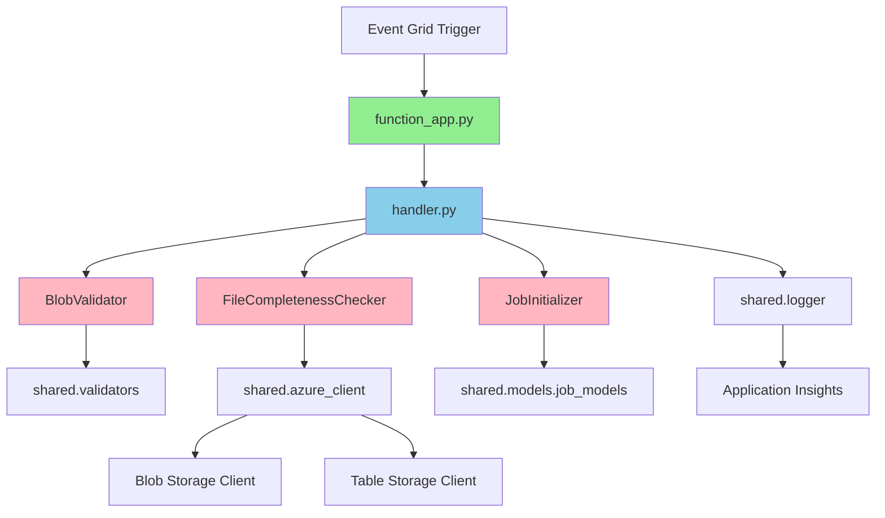
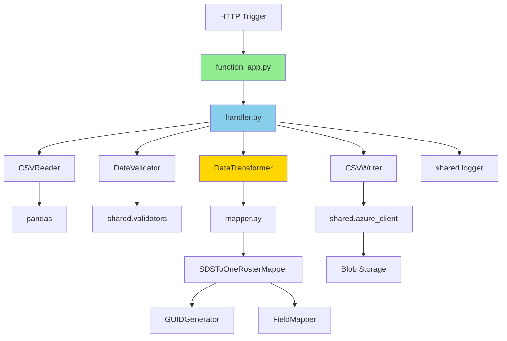
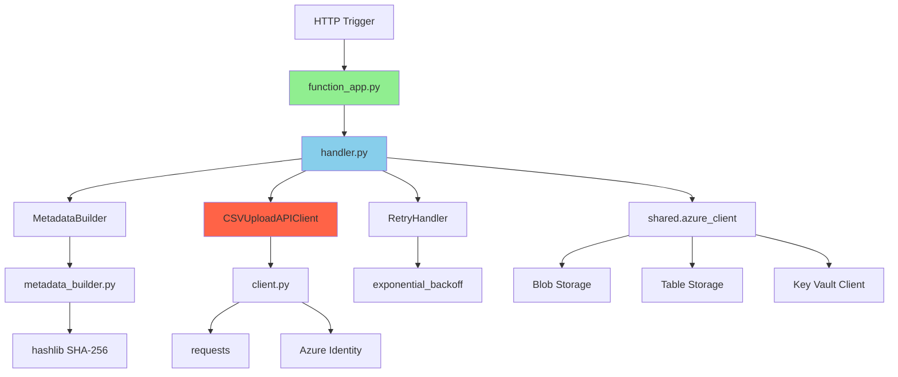

# C4 コンポーネント図 - Python版

**ドキュメントバージョン**: 1.0.0  
**作成日**: 2025-10-27  
**ステータス**: Draft  
**実装言語**: Python 3.11

---

## 📋 概要

C4モデルのレベル3として、Python版Azure Functionsの内部コンポーネント構造を詳細に示します。

**対象範囲**:
- FileDetection Function（Python実装）
- DataTransform Function（Python実装）
- FileUploader Function（Python実装）
- JobMonitor Function（Python実装）
- 共有モジュール（Shared Modules）

---

## 🏗️ Python版全体構成

### ディレクトリ構造

```
src/python/
├── functions/
│   ├── file_detection/
│   │   ├── __init__.py
│   │   ├── function_app.py          # メインエントリーポイント
│   │   ├── handler.py                # ビジネスロジック
│   │   └── requirements.txt
│   │
│   ├── data_transform/
│   │   ├── __init__.py
│   │   ├── function_app.py
│   │   ├── handler.py
│   │   ├── transformer.py            # 変換エンジン
│   │   ├── mapper.py                 # データマッピング
│   │   └── requirements.txt
│   │
│   ├── file_uploader/
│   │   ├── __init__.py
│   │   ├── function_app.py
│   │   ├── handler.py
│   │   ├── client.py                 # CSV Upload APIクライアント
│   │   ├── metadata_builder.py       # metadata.json生成
│   │   └── requirements.txt
│   │
│   └── job_monitor/
│       ├── __init__.py
│       ├── function_app.py
│       ├── handler.py
│       ├── reporter.py               # レポート生成
│       └── requirements.txt
│
├── shared/
│   ├── __init__.py
│   ├── models/
│   │   ├── __init__.py
│   │   ├── sds_models.py             # SDSデータモデル
│   │   ├── oneroster_models.py       # OneRosterデータモデル
│   │   └── job_models.py             # ジョブ管理モデル
│   │
│   ├── utils/
│   │   ├── __init__.py
│   │   ├── logger.py                 # 構造化ログ
│   │   ├── azure_client.py           # Azure SDK統合
│   │   ├── csv_parser.py             # CSV操作
│   │   └── validators.py             # バリデーション
│   │
│   ├── constants.py                  # 定数定義
│   └── config.py                     # 設定管理
│
├── tests/
│   ├── unit/
│   │   ├── test_file_detection.py
│   │   ├── test_data_transform.py
│   │   ├── test_file_uploader.py
│   │   └── test_shared_utils.py
│   │
│   └── integration/
│       ├── test_e2e_flow.py
│       └── test_api_integration.py
│
├── requirements.txt                  # 共通依存関係
├── host.json                         # Function App設定
├── local.settings.json              # ローカル設定（Git除外）
└── README.md
```

### 主要ライブラリ

```python
# requirements.txt
azure-functions==1.18.0
azure-storage-blob==12.19.0
azure-data-tables==12.4.0
azure-identity==1.15.0
azure-keyvault-secrets==4.7.0

pandas==2.1.4
numpy==1.26.2

requests==2.31.0
pydantic==2.5.3
python-dotenv==1.0.0

pytest==7.4.3
pytest-cov==4.1.0
pytest-asyncio==0.23.2
```

---

## 🔧 FileDetection Function（Python版）

### コンポーネント構造



### クラス設計

#### 1. function_app.py
```python
import azure.functions as func
import logging
from .handler import FileDetectionHandler

app = func.FunctionApp()

@app.event_grid_trigger(arg_name="event")
def file_detection(event: func.EventGridEvent):
    """
    Blob Storage Event Gridトリガー
    ファイルアップロード検知
    """
    logging.info(f"Event Grid trigger: {event.id}")
    
    handler = FileDetectionHandler()
    result = handler.handle(event)
    
    return result
```

#### 2. handler.py
```python
from typing import Dict, List
from azure.functions import EventGridEvent
from shared.utils.azure_client import AzureStorageClient, AzureTableClient
from shared.utils.logger import StructuredLogger
from shared.utils.validators import FileValidator
from shared.models.job_models import Job, JobStatus
from shared.constants import REQUIRED_FILES

class FileDetectionHandler:
    """ファイル検知ハンドラー"""
    
    def __init__(self):
        self.blob_client = AzureStorageClient()
        self.table_client = AzureTableClient()
        self.logger = StructuredLogger("FileDetection")
        self.validator = FileValidator()
    
    def handle(self, event: EventGridEvent) -> Dict:
        """
        メイン処理
        
        Args:
            event: Event Gridイベント
            
        Returns:
            処理結果
        """
        try:
            # イベントデータ解析
            blob_url = event.data['url']
            directory = self._extract_directory(blob_url)
            
            self.logger.info("File detection started", {
                "directory": directory,
                "blob_url": blob_url
            })
            
            # ファイル完全性チェック
            files = self._check_file_completeness(directory)
            
            if not files:
                self.logger.warning("Files not complete yet", {
                    "directory": directory
                })
                return {"status": "waiting"}
            
            # ジョブ初期化
            job = self._initialize_job(directory, files)
            
            # 変換Functionトリガー
            self._trigger_transform(job)
            
            self.logger.info("File detection completed", {
                "job_id": job.job_id,
                "file_count": len(files)
            })
            
            return {"status": "success", "job_id": job.job_id}
            
        except Exception as e:
            self.logger.error("File detection failed", {
                "error": str(e)
            }, exc_info=True)
            raise
    
    def _extract_directory(self, blob_url: str) -> str:
        """
        Blob URLからディレクトリパス抽出
        例: .../sds-csv-input/20251027/school.csv → 20251027
        """
        parts = blob_url.split('/')
        container_idx = parts.index('sds-csv-input')
        return parts[container_idx + 1]
    
    def _check_file_completeness(self, directory: str) -> List[str]:
        """
        ファイル完全性チェック
        
        必須ファイル（ユーザー管理のみ）:
        - school.csv
        - student.csv
        - teacher.csv
        
        オプションファイル（クラス管理）:
        - section.csv
        - studentenrollment.csv
        - teacherroster.csv
        """
        prefix = f"sds-csv-input/{directory}/"
        blobs = self.blob_client.list_blobs(
            container='sds-csv-input',
            prefix=prefix
        )
        
        file_names = [blob.name.split('/')[-1] for blob in blobs]
        
        # 必須ファイルチェック
        required = {'school.csv', 'student.csv', 'teacher.csv'}
        if not required.issubset(set(file_names)):
            return []  # まだ揃っていない
        
        return file_names
    
    def _initialize_job(self, directory: str, files: List[str]) -> Job:
        """ジョブ初期化"""
        from datetime import datetime
        import uuid
        
        timestamp = datetime.utcnow()
        job_id = f"job-{timestamp.strftime('%Y%m%d-%H%M%S')}-{uuid.uuid4().hex[:8]}"
        
        job = Job(
            partition_key=timestamp.strftime('%Y-%m'),
            row_key=job_id,
            job_id=job_id,
            status=JobStatus.PROCESSING,
            start_time=timestamp,
            input_directory=f"sds-csv-input/{directory}/",
            input_files=files,
            user_id="system",  # 実際はAzure ADから取得
            version="python"
        )
        
        # Table Storageに保存
        self.table_client.insert_entity('JobHistory', job.to_dict())
        
        return job
    
    def _trigger_transform(self, job: Job):
        """データ変換Functionをトリガー"""
        import requests
        import os
        
        transform_url = os.getenv('TRANSFORM_FUNCTION_URL')
        
        payload = {
            "job_id": job.job_id,
            "input_directory": job.input_directory,
            "files": job.input_files
        }
        
        response = requests.post(
            transform_url,
            json=payload,
            headers={'Content-Type': 'application/json'}
        )
        
        response.raise_for_status()
```

---

## 🔄 DataTransform Function（Python版）

### コンポーネント構造



### クラス設計

#### transformer.py
```python
import pandas as pd
from typing import Dict, List
from shared.models.sds_models import SDSSchool, SDSStudent, SDSTeacher
from shared.models.oneroster_models import OneRosterOrg, OneRosterUser
from shared.utils.logger import StructuredLogger

class DataTransformer:
    """SDS → OneRoster データ変換エンジン"""
    
    def __init__(self):
        self.logger = StructuredLogger("DataTransformer")
        self.mapper = SDSToOneRosterMapper()
    
    def transform_schools(self, df: pd.DataFrame) -> pd.DataFrame:
        """
        school.csv → orgs.csv 変換
        
        SDSフィールド:
        - School SIS ID
        - Name
        - School Number
        - School NCES_ID (optional)
        - State ID (optional)
        
        OneRosterフィールド:
        - sourcedId (GUID)
        - status (active)
        - dateLastModified
        - name
        - type (school)
        - identifier (School SIS ID)
        """
        self.logger.info(f"Transforming schools: {len(df)} records")
        
        transformed = []
        for _, row in df.iterrows():
            org = self.mapper.map_school_to_org(row)
            transformed.append(org.to_dict())
        
        result_df = pd.DataFrame(transformed)
        return result_df
    
    def transform_users(
        self,
        students_df: pd.DataFrame,
        teachers_df: pd.DataFrame
    ) -> pd.DataFrame:
        """
        student.csv + teacher.csv → users.csv 変換
        """
        self.logger.info(
            f"Transforming users: {len(students_df)} students, "
            f"{len(teachers_df)} teachers"
        )
        
        users = []
        
        # 学生変換
        for _, row in students_df.iterrows():
            user = self.mapper.map_student_to_user(row)
            users.append(user.to_dict())
        
        # 教員変換
        for _, row in teachers_df.iterrows():
            user = self.mapper.map_teacher_to_user(row)
            users.append(user.to_dict())
        
        result_df = pd.DataFrame(users)
        return result_df
```

#### mapper.py
```python
import uuid
from datetime import datetime
from shared.models.sds_models import SDSSchool
from shared.models.oneroster_models import OneRosterOrg

class SDSToOneRosterMapper:
    """SDSとOneRosterのフィールドマッピング"""
    
    def __init__(self):
        self._guid_cache = {}  # GUID再利用キャッシュ
    
    def map_school_to_org(self, sds_row: dict) -> OneRosterOrg:
        """
        school.csv → orgs.csv マッピング
        
        変換ルール:
        1. sourcedId: SDS ID からGUID生成（決定的）
        2. name: Name をそのまま使用
        3. type: 固定値 "school"
        4. identifier: School SIS ID
        """
        sds_id = str(sds_row['School SIS ID'])
        
        # 決定的GUID生成（同じIDなら同じGUID）
        sourced_id = self._generate_deterministic_guid(
            'school',
            sds_id
        )
        
        org = OneRosterOrg(
            sourcedId=sourced_id,
            status='active',
            dateLastModified=datetime.utcnow().isoformat() + 'Z',
            name=sds_row['Name'],
            type='school',
            identifier=sds_id,
            # オプションフィールド
            metadata={
                'schoolNumber': sds_row.get('School Number'),
                'ncesId': sds_row.get('School NCES_ID'),
                'stateId': sds_row.get('State ID')
            }
        )
        
        return org
    
    def map_student_to_user(self, sds_row: dict) -> 'OneRosterUser':
        """student.csv → users.csv マッピング"""
        sds_id = str(sds_row['SIS ID'])
        
        sourced_id = self._generate_deterministic_guid(
            'student',
            sds_id
        )
        
        # メールアドレス生成（存在しない場合）
        email = sds_row.get('Username') or f"{sds_id}@example.edu"
        
        user = OneRosterUser(
            sourcedId=sourced_id,
            status='active',
            dateLastModified=datetime.utcnow().isoformat() + 'Z',
            enabledUser=True,
            username=sds_row.get('Username', sds_id),
            userIds=[{
                'type': 'SIS',
                'identifier': sds_id
            }],
            givenName=sds_row.get('First Name', ''),
            familyName=sds_row.get('Last Name', ''),
            middleName=sds_row.get('Middle Name'),
            role='student',
            identifier=sds_id,
            email=email,
            sms=sds_row.get('Phone'),
            phone=sds_row.get('Phone'),
            # オプション: 組織所属
            orgs=[self._get_org_guid(sds_row.get('School SIS ID'))],
            grades=[sds_row.get('Grade')]
        )
        
        return user
    
    def _generate_deterministic_guid(
        self,
        entity_type: str,
        entity_id: str
    ) -> str:
        """
        決定的GUID生成
        同じ入力なら常に同じGUIDを返す（UUID v5使用）
        
        Args:
            entity_type: エンティティタイプ（school, student, teacher等）
            entity_id: エンティティID（SDS ID）
            
        Returns:
            UUID形式の文字列
        """
        cache_key = f"{entity_type}:{entity_id}"
        
        if cache_key in self._guid_cache:
            return self._guid_cache[cache_key]
        
        # 名前空間UUIDを使用（OneRoster専用）
        namespace = uuid.UUID('6ba7b810-9dad-11d1-80b4-00c04fd430c8')
        
        # entity_type + entity_id から決定的にGUID生成
        guid = str(uuid.uuid5(namespace, cache_key))
        
        self._guid_cache[cache_key] = guid
        return guid
    
    def _get_org_guid(self, school_sis_id: str) -> str:
        """組織GUIDを取得（学校IDから）"""
        if not school_sis_id:
            return None
        return self._generate_deterministic_guid('school', str(school_sis_id))
```

---

## 📤 FileUploader Function（Python版）

### コンポーネント構造



### クラス設計

#### metadata_builder.py
```python
import hashlib
import json
from typing import Dict, List
from datetime import datetime
from shared.utils.azure_client import AzureBlobClient
from shared.utils.logger import StructuredLogger

class MetadataBuilder:
    """metadata.json生成"""
    
    def __init__(self):
        self.blob_client = AzureBlobClient()
        self.logger = StructuredLogger("MetadataBuilder")
    
    def build_metadata(
        self,
        output_directory: str,
        file_list: List[str]
    ) -> Dict:
        """
        メタデータJSON生成
        
        Args:
            output_directory: 出力ディレクトリパス
            file_list: CSVファイル名リスト
            
        Returns:
            メタデータディクショナリ
        """
        self.logger.info("Building metadata", {
            "directory": output_directory,
            "file_count": len(file_list)
        })
        
        # 各ファイルのチェックサムとレコード数を計算
        checksums = {}
        record_counts = {}
        
        for filename in file_list:
            blob_path = f"{output_directory}/{filename}"
            
            # ファイル読み込み
            content = self.blob_client.download_blob(blob_path)
            
            # SHA-256チェックサム計算
            checksum = hashlib.sha256(content.encode('utf-8')).hexdigest()
            checksums[filename] = checksum
            
            # レコード数カウント（ヘッダー除く）
            lines = content.strip().split('\n')
            record_count = max(0, len(lines) - 1)  # ヘッダー行を除く
            record_counts[filename] = record_count
            
            self.logger.debug(f"File processed: {filename}", {
                "checksum": checksum[:16] + "...",
                "records": record_count
            })
        
        # メタデータ構築
        metadata = {
            "source": "SDS2Roster",
            "version": "1.0.0",
            "uploadedAt": datetime.utcnow().isoformat() + "Z",
            "recordCounts": record_counts,
            "checksums": checksums
        }
        
        self.logger.info("Metadata built successfully", {
            "total_records": sum(record_counts.values()),
            "total_files": len(file_list)
        })
        
        return metadata

#### client.py
```python
import requests
from typing import Dict, List, Optional
from azure.identity import ManagedIdentityCredential
from shared.utils.azure_client import AzureKeyVaultClient
from shared.utils.logger import StructuredLogger
import time

class CSVUploadAPIClient:
    """CSV Upload API v1クライアント"""
    
    def __init__(self):
        self.kv_client = AzureKeyVaultClient()
        self.credential = ManagedIdentityCredential()
        self.logger = StructuredLogger("CSVUploadAPIClient")
        self.session = requests.Session()
        self._token_cache: Optional[Dict] = None
    
    def upload_csv_files(
        self,
        files: Dict[str, bytes],
        metadata: Dict
    ) -> Dict:
        """
        CSVファイル一括アップロード
        
        Args:
            files: ファイル名 -> ファイル内容のディクショナリ
            metadata: メタデータディクショナリ
            
        Returns:
            APIレスポンス（uploadId含む）
        """
        # Key VaultからAPI設定取得
        api_endpoint = self.kv_client.get_secret('upload-api-endpoint')
        api_key = self.kv_client.get_secret('upload-api-key')
        
        # Azure AD Bearer Token取得
        bearer_token = self._get_bearer_token()
        
        url = f"{api_endpoint}/upload"
        
        headers = {
            'Authorization': f'Bearer {bearer_token}',
            'X-API-Key': api_key
        }
        
        # multipart/form-dataの構築
        files_data = []
        
        # metadata.jsonを追加
        import json
        files_data.append((
            'files',
            ('metadata.json', json.dumps(metadata), 'application/json')
        ))
        
        # CSVファイルを追加
        for filename, content in files.items():
            files_data.append((
                'files',
                (filename, content, 'text/csv')
            ))
        
        self.logger.info("Uploading CSV files", {
            "file_count": len(files),
            "endpoint": url
        })
        
        # リトライロジック付き送信
        response = self._post_with_retry(url, files_data, headers)
        
        result = response.json()
        
        self.logger.info("CSV files uploaded successfully", {
            "upload_id": result.get('uploadId'),
            "status": result.get('status'),
            "status_code": response.status_code
        })
        
        return result
    
    def _get_bearer_token(self) -> str:
        """
        Azure AD Bearer Token取得
        
        Returns:
            Bearer Token
        """
        # キャッシュチェック（簡易実装、本番ではライブラリ推奨）
        if self._token_cache and self._is_token_valid():
            return self._token_cache['token']
        
        # Managed Identityでトークン取得
        # デフォルトスコープ: https://management.azure.com/.default
        # 実際のスコープはAPI仕様に従う
        token = self.credential.get_token("https://management.azure.com/.default")
        
        self._token_cache = {
            'token': token.token,
            'expires_on': token.expires_on
        }
        
        return token.token
    
    def _is_token_valid(self) -> bool:
        """トークン有効性チェック"""
        if not self._token_cache:
            return False
        
        import time
        # 5分のバッファ
        return time.time() < (self._token_cache['expires_on'] - 300)
    
    def _post_with_retry(
        self,
        url: str,
        files: List,
        headers: Dict,
        max_retries: int = 3
    ) -> requests.Response:
        """
        リトライロジック付きPOST
        
        Exponential Backoff:
        - 1回目: 即座
        - 2回目: 2秒待機
        - 3回目: 4秒待機
        - 4回目: 8秒待機
        """
        for attempt in range(max_retries + 1):
            try:
                response = self.session.post(
                    url,
                    files=files,
                    headers=headers,
                    timeout=60  # ファイルアップロードのため長めに設定
                )
                
                # 成功 (2xx)
                if response.status_code < 300:
                    return response
                
                # 4xx エラー（リトライしない）
                if 400 <= response.status_code < 500:
                    self.logger.error("Client error, no retry", {
                        "status_code": response.status_code,
                        "response": response.text
                    })
                    response.raise_for_status()
                
                # 5xx エラー（リトライ）
                if response.status_code >= 500 and attempt < max_retries:
                    wait_time = 2 ** attempt
                    self.logger.warning(f"Server error, retry in {wait_time}s", {
                        "attempt": attempt + 1,
                        "status_code": response.status_code
                    })
                    time.sleep(wait_time)
                    continue
                
                # 最終試行で失敗
                response.raise_for_status()
                
            except requests.exceptions.RequestException as e:
                if attempt < max_retries:
                    wait_time = 2 ** attempt
                    self.logger.warning(f"Request failed, retry in {wait_time}s", {
                        "attempt": attempt + 1,
                        "error": str(e)
                    })
                    time.sleep(wait_time)
                    continue
                
                # 最終試行で失敗
                self.logger.error("Request failed after all retries", {
                    "attempts": max_retries + 1,
                    "error": str(e)
                })
                raise
        
        raise Exception("Unexpected error in retry logic")
```

---

## 📊 JobMonitor Function（Python版）

### クラス設計

#### reporter.py
```python
import pandas as pd
from datetime import datetime, timedelta
from typing import Dict, List
from shared.utils.azure_client import AzureTableClient, AzureBlobClient
from shared.utils.logger import StructuredLogger

class JobReporter:
    """ジョブレポート生成"""
    
    def __init__(self):
        self.table_client = AzureTableClient()
        self.blob_client = AzureBlobClient()
        self.logger = StructuredLogger("JobReporter")
    
    def generate_daily_report(self, target_date: datetime) -> Dict:
        """
        日次レポート生成
        
        Args:
            target_date: 対象日付
            
        Returns:
            レポートデータ
        """
        partition_key = target_date.strftime('%Y-%m')
        
        # 当日のジョブ取得
        query = f"PartitionKey eq '{partition_key}'"
        entities = self.table_client.query_entities('JobHistory', query)
        
        jobs = [entity for entity in entities 
                if self._is_target_date(entity, target_date)]
        
        # 統計計算
        report = {
            'date': target_date.strftime('%Y-%m-%d'),
            'total_jobs': len(jobs),
            'completed': len([j for j in jobs if j['status'] == 'Completed']),
            'failed': len([j for j in jobs if j['status'] == 'Failed']),
            'processing': len([j for j in jobs if j['status'] == 'Processing']),
            'success_rate': 0.0,
            'avg_duration_minutes': 0.0,
            'total_records': 0,
            'python_jobs': 0,
            'javascript_jobs': 0
        }
        
        if report['total_jobs'] > 0:
            report['success_rate'] = (
                report['completed'] / report['total_jobs'] * 100
            )
        
        # 平均処理時間計算
        completed_jobs = [j for j in jobs if j['status'] == 'Completed']
        if completed_jobs:
            durations = [
                (j['end_time'] - j['start_time']).total_seconds() / 60
                for j in completed_jobs
                if j.get('end_time')
            ]
            if durations:
                report['avg_duration_minutes'] = sum(durations) / len(durations)
        
        # レコード数集計
        for job in jobs:
            if job.get('recordCounts'):
                import json
                counts = json.loads(job['recordCounts'])
                report['total_records'] += sum(counts.values())
            
            # 言語別集計
            if job.get('version') == 'python':
                report['python_jobs'] += 1
            elif job.get('version') == 'javascript':
                report['javascript_jobs'] += 1
        
        # CSV保存
        self._save_report_csv(report, target_date)
        
        return report
    
    def _is_target_date(self, entity: Dict, target_date: datetime) -> bool:
        """エンティティが対象日付か判定"""
        start_time = entity.get('start_time')
        if not start_time:
            return False
        
        if isinstance(start_time, str):
            start_time = datetime.fromisoformat(start_time.replace('Z', '+00:00'))
        
        return start_time.date() == target_date.date()
    
    def _save_report_csv(self, report: Dict, target_date: datetime):
        """レポートをCSVとして保存"""
        df = pd.DataFrame([report])
        csv_content = df.to_csv(index=False)
        
        blob_name = f"reports/daily/report-{target_date.strftime('%Y%m%d')}.csv"
        
        self.blob_client.upload_blob(
            container='oneroster-output',
            blob_name=blob_name,
            data=csv_content,
            content_type='text/csv'
        )
        
        self.logger.info("Daily report saved", {
            "date": target_date.strftime('%Y-%m-%d'),
            "blob_name": blob_name
        })
```

---

## 🧩 Shared Modules（共有モジュール）

### models/sds_models.py
```python
from dataclasses import dataclass
from typing import Optional

@dataclass
class SDSSchool:
    """SDSスクールモデル"""
    school_sis_id: str
    name: str
    school_number: Optional[str] = None
    school_nces_id: Optional[str] = None
    state_id: Optional[str] = None
    low_grade: Optional[str] = None
    high_grade: Optional[str] = None
    principal_sis_id: Optional[str] = None
    principal_name: Optional[str] = None
    principal_secondary_email: Optional[str] = None
    address: Optional[str] = None
    city: Optional[str] = None
    state: Optional[str] = None
    country: Optional[str] = None
    zip: Optional[str] = None
    phone: Optional[str] = None
    zone: Optional[str] = None

@dataclass
class SDSStudent:
    """SDS学生モデル"""
    sis_id: str
    school_sis_id: str
    first_name: str
    last_name: str
    middle_name: Optional[str] = None
    grade: Optional[str] = None
    username: Optional[str] = None
    password: Optional[str] = None
    state_id: Optional[str] = None
    secondary_email: Optional[str] = None
    student_number: Optional[str] = None
    mailing_address: Optional[str] = None
    mailing_city: Optional[str] = None
    mailing_state: Optional[str] = None
    mailing_zip: Optional[str] = None
    mailing_country: Optional[str] = None
    residence_address: Optional[str] = None
    phone: Optional[str] = None
    mobile: Optional[str] = None
    graduation_year: Optional[str] = None
```

### utils/logger.py
```python
import logging
import json
from typing import Dict, Any
from datetime import datetime
from opencensus.ext.azure.log_exporter import AzureLogHandler

class StructuredLogger:
    """Application Insights用構造化ログ"""
    
    def __init__(self, component_name: str):
        self.component_name = component_name
        self.logger = logging.getLogger(component_name)
        
        # Application Insights統合
        connection_string = os.getenv('APPLICATIONINSIGHTS_CONNECTION_STRING')
        if connection_string:
            handler = AzureLogHandler(connection_string=connection_string)
            self.logger.addHandler(handler)
        
        self.logger.setLevel(logging.INFO)
    
    def info(self, message: str, properties: Dict[str, Any] = None):
        """Infoレベルログ"""
        self._log(logging.INFO, message, properties)
    
    def warning(self, message: str, properties: Dict[str, Any] = None):
        """Warningレベルログ"""
        self._log(logging.WARNING, message, properties)
    
    def error(
        self,
        message: str,
        properties: Dict[str, Any] = None,
        exc_info: bool = False
    ):
        """Errorレベルログ"""
        self._log(logging.ERROR, message, properties, exc_info)
    
    def _log(
        self,
        level: int,
        message: str,
        properties: Dict[str, Any] = None,
        exc_info: bool = False
    ):
        """内部ログ処理"""
        log_entry = {
            'timestamp': datetime.utcnow().isoformat() + 'Z',
            'component': self.component_name,
            'message': message,
            'properties': properties or {}
        }
        
        self.logger.log(
            level,
            json.dumps(log_entry),
            extra={'custom_dimensions': properties or {}},
            exc_info=exc_info
        )
```

---

## 📝 次のドキュメント

- [04_c4_component_diagram_javascript.md](./04_c4_component_diagram_javascript.md) - JavaScript版コンポーネント図

---

**文書管理責任者**: System Architect  
**最終更新日**: 2025-10-27  
**ドキュメントステータス**: Draft
