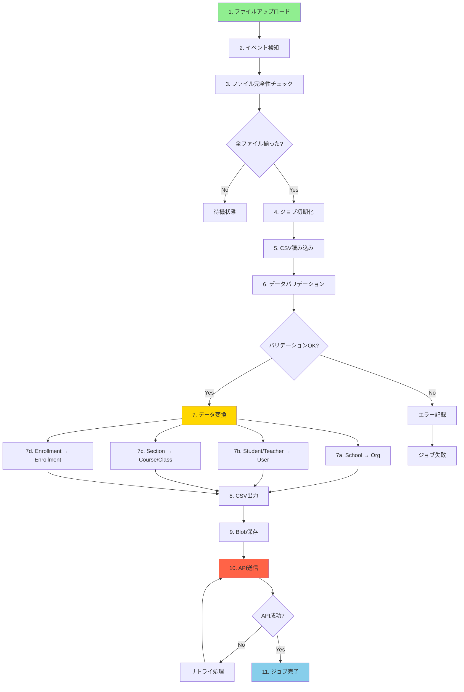
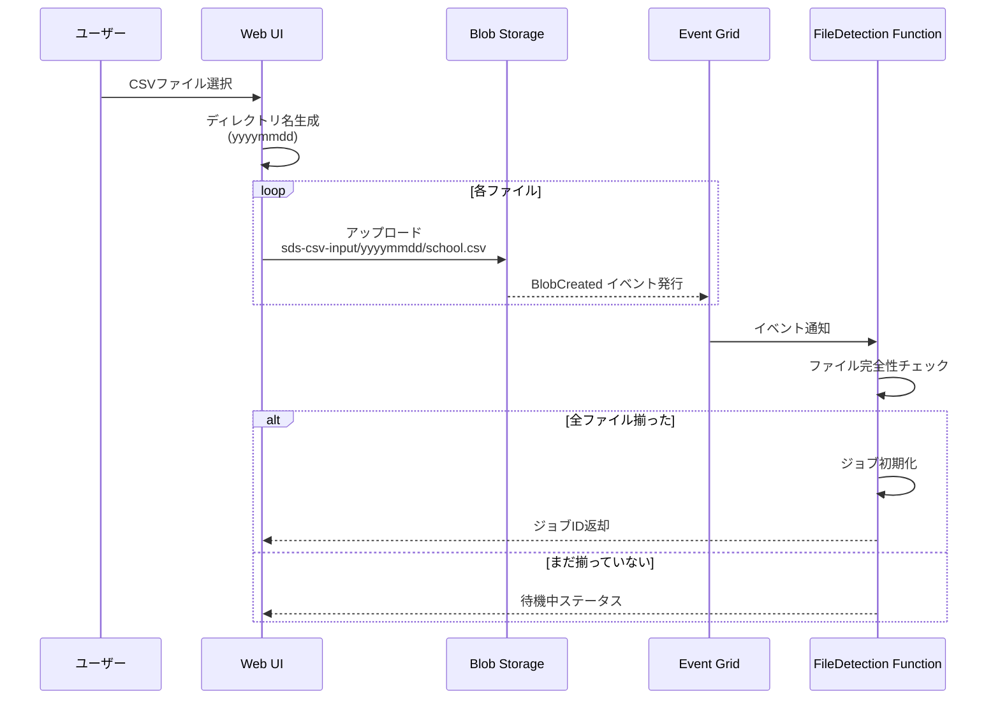
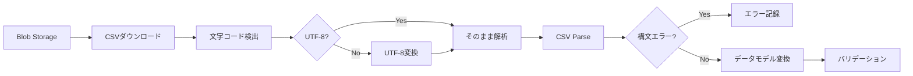
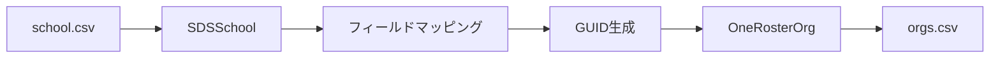
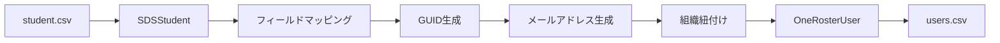
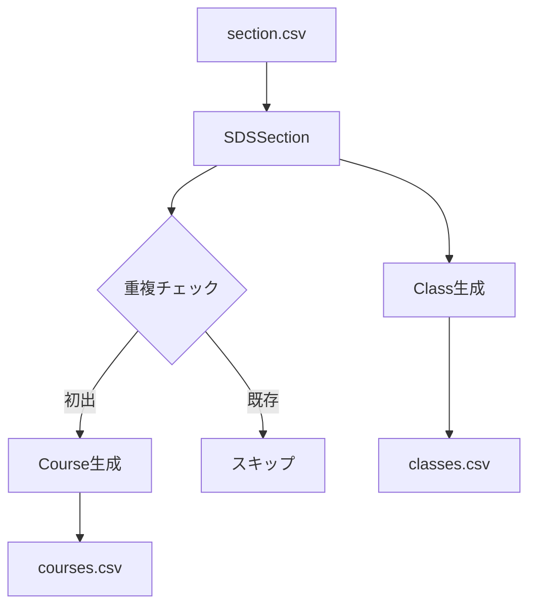
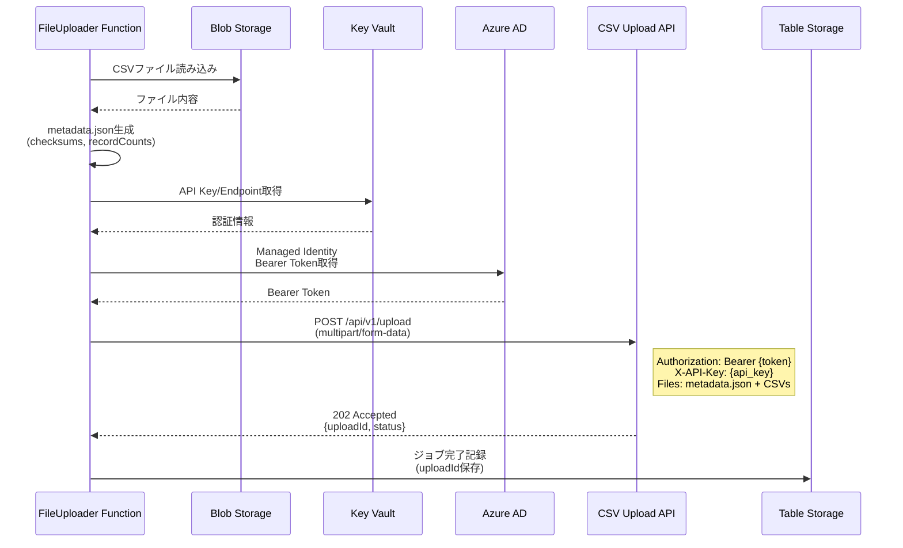

# データフロー詳細設計

**ドキュメントバージョン**: 1.0.0  
**作成日**: 2025-10-27  
**ステータス**: Draft

---

## 📋 概要

本ドキュメントでは、SDS CSVからOneRoster v1.2形式への変換処理におけるデータフローを詳細に定義します。

**対象範囲**:
1. ファイルアップロードから検知まで
2. データ読み込みとバリデーション
3. データ変換ロジック（フィールドマッピング）
4. CSV出力とAPI送信
5. エラーハンドリングとリトライ

---

## 🔄 全体データフロー概要



---

## 1️⃣ ファイルアップロード ～ 検知フロー

### 1.1 ユーザーアップロード



### 1.2 必須ファイルリスト

| ファイル名 | 説明 | 必須 |
|----------|------|------|
| `school.csv` | 学校情報 | ✅ |
| `student.csv` | 学生情報 | ✅ |
| `teacher.csv` | 教員情報 | ✅ |
| `section.csv` | セクション（クラス）情報 | ❌ |
| `studentenrollment.csv` | 学生登録情報 | ❌ |
| `teacherroster.csv` | 教員配置情報 | ❌ |

**チェックロジック**:
```typescript
// 必須ファイル
const REQUIRED_FILES = ['school.csv', 'student.csv', 'teacher.csv'];

// 完全性チェック
function checkCompleteness(files: string[]): boolean {
  return REQUIRED_FILES.every(required => files.includes(required));
}
```

### 1.3 ディレクトリ命名規則

**形式**: `yyyymmdd`

**例**:
- `20251027` - 2025年10月27日
- `20250101` - 2025年1月1日

**生成ロジック**:
```typescript
// Web UI側で生成
const directory = format(new Date(), 'yyyyMMdd');

// アップロードパス
const blobPath = `sds-csv-input/${directory}/${fileName}`;
```

---

## 2️⃣ データ読み込みとバリデーション

### 2.1 CSV読み込みフロー



### 2.2 SDSデータモデル定義

#### school.csv
```typescript
interface SDSSchool {
  'School SIS ID': string;           // 必須
  'Name': string;                     // 必須
  'School Number'?: string;
  'School NCES_ID'?: string;
  'State ID'?: string;
  'Low Grade'?: string;
  'High Grade'?: string;
  'Principal SIS ID'?: string;
  'Principal Name'?: string;
  'Principal Secondary Email'?: string;
  'Address'?: string;
  'City'?: string;
  'State'?: string;
  'Country'?: string;
  'Zip'?: string;
  'Phone'?: string;
  'Zone'?: string;
}
```

**バリデーションルール**:
```typescript
import { z } from 'zod';

const SDSSchoolSchema = z.object({
  'School SIS ID': z.string().min(1, 'School SIS ID is required'),
  'Name': z.string().min(1, 'Name is required'),
  'School Number': z.string().optional(),
  'School NCES_ID': z.string().optional(),
  'State ID': z.string().optional(),
  // ... 他のフィールド
});

// バリデーション実行
function validateSchool(data: unknown): SDSSchool {
  return SDSSchoolSchema.parse(data);
}
```

#### student.csv
```typescript
interface SDSStudent {
  'SIS ID': string;                   // 必須
  'School SIS ID': string;            // 必須
  'First Name': string;               // 必須
  'Last Name': string;                // 必須
  'Middle Name'?: string;
  'Grade'?: string;
  'Username'?: string;
  'Password'?: string;
  'State ID'?: string;
  'Secondary Email'?: string;
  'Student Number'?: string;
  'Mailing Address'?: string;
  'Mailing City'?: string;
  'Mailing State'?: string;
  'Mailing Zip'?: string;
  'Mailing Country'?: string;
  'Residence Address'?: string;
  'Phone'?: string;
  'Mobile'?: string;
  'Graduation Year'?: string;
}
```

**バリデーションルール**:
```typescript
const SDSStudentSchema = z.object({
  'SIS ID': z.string().min(1),
  'School SIS ID': z.string().min(1),
  'First Name': z.string().min(1),
  'Last Name': z.string().min(1),
  'Middle Name': z.string().optional(),
  'Grade': z.string().optional(),
  'Username': z.string().email().optional(),
  // ... 他のフィールド
});
```

#### teacher.csv
```typescript
interface SDSTeacher {
  'SIS ID': string;                   // 必須
  'School SIS ID': string;            // 必須
  'First Name': string;               // 必須
  'Last Name': string;                // 必須
  'Middle Name'?: string;
  'Title'?: string;
  'Username'?: string;
  'Password'?: string;
  'State ID'?: string;
  'Secondary Email'?: string;
  'Teacher Number'?: string;
  'Status'?: string;
  'Phone'?: string;
  'Mobile'?: string;
}
```

### 2.3 バリデーションエラーハンドリング

```typescript
interface ValidationError {
  row: number;
  field: string;
  value: any;
  error: string;
}

class DataValidator {
  private errors: ValidationError[] = [];
  
  validate(records: any[], schema: z.ZodSchema): any[] {
    const validRecords = [];
    
    records.forEach((record, index) => {
      try {
        const validated = schema.parse(record);
        validRecords.push(validated);
      } catch (error) {
        if (error instanceof z.ZodError) {
          error.errors.forEach(err => {
            this.errors.push({
              row: index + 1,
              field: err.path.join('.'),
              value: record[err.path[0]],
              error: err.message
            });
          });
        }
      }
    });
    
    return validRecords;
  }
  
  getErrors(): ValidationError[] {
    return this.errors;
  }
  
  hasErrors(): boolean {
    return this.errors.length > 0;
  }
}
```

---

## 3️⃣ データ変換ロジック（詳細）

### 3.1 GUID生成戦略

**要件**:
- 同じSDS IDからは常に同じGUIDを生成（決定的）
- UUID v5（名前ベース）を使用
- 名前空間UUIDはOneRoster専用

```typescript
import { v5 as uuidv5 } from 'uuid';

class GUIDGenerator {
  // OneRoster専用名前空間UUID
  private readonly NAMESPACE = '6ba7b810-9dad-11d1-80b4-00c04fd430c8';
  private cache = new Map<string, string>();
  
  generate(entityType: string, entityId: string): string {
    const key = `${entityType}:${entityId}`;
    
    if (this.cache.has(key)) {
      return this.cache.get(key)!;
    }
    
    const guid = uuidv5(key, this.NAMESPACE);
    this.cache.set(key, guid);
    
    return guid;
  }
}
```

**使用例**:
```typescript
const generator = new GUIDGenerator();

// 学校
const schoolGuid = generator.generate('school', '12345');
// => "a1b2c3d4-e5f6-5789-a0b1-c2d3e4f5g6h7"

// 同じIDなら同じGUID
const schoolGuid2 = generator.generate('school', '12345');
// => "a1b2c3d4-e5f6-5789-a0b1-c2d3e4f5g6h7" (同じ)

// 学生
const studentGuid = generator.generate('student', 'S00001');
// => "b2c3d4e5-f6g7-5890-a1b2-c3d4e5f6g7h8"
```

### 3.2 School → Org 変換



**変換マッピング**:

| SDS フィールド | OneRoster フィールド | 変換ルール |
|--------------|---------------------|----------|
| School SIS ID | sourcedId | UUID v5生成 |
| - | status | 固定値: "active" |
| - | dateLastModified | 現在時刻（ISO 8601） |
| Name | name | そのまま |
| - | type | 固定値: "school" |
| School SIS ID | identifier | そのまま |
| - | parentSourcedId | NULL（階層構造なし） |

**実装例**:
```typescript
class SchoolMapper {
  private guidGenerator: GUIDGenerator;
  
  constructor() {
    this.guidGenerator = new GUIDGenerator();
  }
  
  map(sdsSchool: SDSSchool): OneRosterOrg {
    const sdsId = String(sdsSchool['School SIS ID']);
    
    return {
      sourcedId: this.guidGenerator.generate('school', sdsId),
      status: 'active',
      dateLastModified: new Date().toISOString(),
      name: sdsSchool.Name,
      type: 'school',
      identifier: sdsId,
      parentSourcedId: undefined,
      metadata: {
        schoolNumber: sdsSchool['School Number'],
        ncesId: sdsSchool['School NCES_ID'],
        stateId: sdsSchool['State ID'],
        lowGrade: sdsSchool['Low Grade'],
        highGrade: sdsSchool['High Grade']
      }
    };
  }
}
```

### 3.3 Student → User 変換



**変換マッピング**:

| SDS フィールド | OneRoster フィールド | 変換ルール |
|--------------|---------------------|----------|
| SIS ID | sourcedId | UUID v5生成 |
| - | status | 固定値: "active" |
| - | dateLastModified | 現在時刻 |
| - | enabledUser | 固定値: true |
| Username | username | あればそのまま、なければSIS ID |
| SIS ID | userIds | JSON配列: `[{"type":"SIS","identifier":"..."}]` |
| First Name | givenName | そのまま |
| Last Name | familyName | そのまま |
| Middle Name | middleName | そのまま |
| - | role | 固定値: "student" |
| SIS ID | identifier | そのまま |
| Username | email | `{username}@example.edu` または `{SIS ID}@example.edu` |
| Phone | sms | そのまま |
| Phone | phone | そのまま |
| School SIS ID | orgs | 学校のGUID（JSON配列） |
| Grade | grades | JSON配列: `["9"]` |

**実装例**:
```typescript
class StudentMapper {
  private guidGenerator: GUIDGenerator;
  
  constructor() {
    this.guidGenerator = new GUIDGenerator();
  }
  
  map(sdsStudent: SDSStudent): OneRosterUser {
    const sdsId = String(sdsStudent['SIS ID']);
    const schoolSisId = String(sdsStudent['School SIS ID']);
    
    // メールアドレス生成
    const username = sdsStudent.Username || sdsId;
    const email = sdsStudent.Username 
      ? `${sdsStudent.Username}@example.edu`
      : `${sdsId}@example.edu`;
    
    // 組織GUID取得
    const orgGuid = this.guidGenerator.generate('school', schoolSisId);
    
    return {
      sourcedId: this.guidGenerator.generate('student', sdsId),
      status: 'active',
      dateLastModified: new Date().toISOString(),
      enabledUser: true,
      username,
      userIds: JSON.stringify([{
        type: 'SIS',
        identifier: sdsId
      }]),
      givenName: sdsStudent['First Name'],
      familyName: sdsStudent['Last Name'],
      middleName: sdsStudent['Middle Name'],
      role: 'student',
      identifier: sdsId,
      email,
      sms: sdsStudent.Phone,
      phone: sdsStudent.Phone,
      orgs: JSON.stringify([orgGuid]),
      grades: sdsStudent.Grade ? JSON.stringify([sdsStudent.Grade]) : undefined
    };
  }
}
```

### 3.4 Teacher → User 変換

**変換マッピング** (Studentとほぼ同じ、roleが異なる):

| SDS フィールド | OneRoster フィールド | 変換ルール |
|--------------|---------------------|----------|
| SIS ID | sourcedId | UUID v5生成 |
| - | status | 固定値: "active" |
| - | dateLastModified | 現在時刻 |
| - | enabledUser | 固定値: true |
| Username | username | あればそのまま、なければSIS ID |
| SIS ID | userIds | JSON配列 |
| First Name | givenName | そのまま |
| Last Name | familyName | そのまま |
| Middle Name | middleName | そのまま |
| - | role | 固定値: "teacher" ⚠️ |
| SIS ID | identifier | そのまま |
| Username | email | `{username}@example.edu` |
| Phone | sms | そのまま |
| Phone | phone | そのまま |
| School SIS ID | orgs | 学校のGUID |
| - | grades | NULL（教員は学年なし） |

**実装例**:
```typescript
class TeacherMapper {
  private guidGenerator: GUIDGenerator;
  
  constructor() {
    this.guidGenerator = new GUIDGenerator();
  }
  
  map(sdsTeacher: SDSTeacher): OneRosterUser {
    const sdsId = String(sdsTeacher['SIS ID']);
    const schoolSisId = String(sdsTeacher['School SIS ID']);
    
    const username = sdsTeacher.Username || sdsId;
    const email = sdsTeacher.Username 
      ? `${sdsTeacher.Username}@example.edu`
      : `${sdsId}@example.edu`;
    
    const orgGuid = this.guidGenerator.generate('school', schoolSisId);
    
    return {
      sourcedId: this.guidGenerator.generate('teacher', sdsId),
      status: 'active',
      dateLastModified: new Date().toISOString(),
      enabledUser: true,
      username,
      userIds: JSON.stringify([{
        type: 'SIS',
        identifier: sdsId
      }]),
      givenName: sdsTeacher['First Name'],
      familyName: sdsTeacher['Last Name'],
      middleName: sdsTeacher['Middle Name'],
      role: 'teacher', // ⚠️ 学生との違い
      identifier: sdsId,
      email,
      sms: sdsTeacher.Phone,
      phone: sdsTeacher.Phone,
      orgs: JSON.stringify([orgGuid]),
      grades: undefined // ⚠️ 教員は学年なし
    };
  }
}
```

### 3.5 Section → Course + Class 変換

SDSの`section.csv`は、OneRosterでは`courses.csv`と`classes.csv`の2つに分離されます。



#### Course変換

**変換マッピング**:

| SDS フィールド | OneRoster フィールド | 変換ルール |
|--------------|---------------------|----------|
| Course SIS ID | sourcedId | UUID v5生成 |
| - | status | 固定値: "active" |
| - | dateLastModified | 現在時刻 |
| - | schoolYearSourcedId | NULL（年度管理なし） |
| Course Name | title | そのまま |
| Course Number | courseCode | そのまま |
| - | grades | NULL |
| Course Subject | subjects | JSON配列 |
| School SIS ID | orgSourcedId | 学校のGUID |

#### Class変換

**変換マッピング**:

| SDS フィールド | OneRoster フィールド | 変換ルール |
|--------------|---------------------|----------|
| SIS ID | sourcedId | UUID v5生成 |
| - | status | 固定値: "active" |
| - | dateLastModified | 現在時刻 |
| Section Name | title | そのまま |
| Section Number | classCode | そのまま |
| - | classType | 固定値: "scheduled" |
| - | location | NULL |
| - | grades | NULL |
| Course Subject | subjects | JSON配列 |
| Course SIS ID | courseSourcedId | コースのGUID |
| School SIS ID | schoolSourcedId | 学校のGUID |
| Term SIS ID | termSourcedIds | JSON配列 |
| - | periods | NULL |

**実装例**:
```typescript
class SectionMapper {
  private guidGenerator: GUIDGenerator;
  private courseCache = new Map<string, OneRosterCourse>();
  
  constructor() {
    this.guidGenerator = new GUIDGenerator();
  }
  
  mapToCourse(sdsSection: SDSSection): OneRosterCourse | null {
    const courseSisId = String(sdsSection['Course SIS ID']);
    
    // 既にCourseを生成済みならスキップ
    if (this.courseCache.has(courseSisId)) {
      return null;
    }
    
    const schoolSisId = String(sdsSection['School SIS ID']);
    const course: OneRosterCourse = {
      sourcedId: this.guidGenerator.generate('course', courseSisId),
      status: 'active',
      dateLastModified: new Date().toISOString(),
      schoolYearSourcedId: undefined,
      title: sdsSection['Course Name'],
      courseCode: sdsSection['Course Number'],
      grades: undefined,
      subjects: sdsSection['Course Subject'] 
        ? JSON.stringify([sdsSection['Course Subject']])
        : undefined,
      orgSourcedId: this.guidGenerator.generate('school', schoolSisId)
    };
    
    this.courseCache.set(courseSisId, course);
    return course;
  }
  
  mapToClass(sdsSection: SDSSection): OneRosterClass {
    const sectionSisId = String(sdsSection['SIS ID']);
    const courseSisId = String(sdsSection['Course SIS ID']);
    const schoolSisId = String(sdsSection['School SIS ID']);
    
    return {
      sourcedId: this.guidGenerator.generate('class', sectionSisId),
      status: 'active',
      dateLastModified: new Date().toISOString(),
      title: sdsSection['Section Name'],
      classCode: sdsSection['Section Number'],
      classType: 'scheduled',
      location: undefined,
      grades: undefined,
      subjects: sdsSection['Course Subject']
        ? JSON.stringify([sdsSection['Course Subject']])
        : undefined,
      courseSourcedId: this.guidGenerator.generate('course', courseSisId),
      schoolSourcedId: this.guidGenerator.generate('school', schoolSisId),
      termSourcedIds: sdsSection['Term SIS ID']
        ? JSON.stringify([this.guidGenerator.generate('term', sdsSection['Term SIS ID'])])
        : undefined,
      periods: undefined
    };
  }
}
```

### 3.6 StudentEnrollment + TeacherRoster → Enrollment 変換

SDSの`studentenrollment.csv`と`teacherroster.csv`は、OneRosterの`enrollments.csv`に統合されます。

**StudentEnrollment変換マッピング**:

| SDS フィールド | OneRoster フィールド | 変換ルール |
|--------------|---------------------|----------|
| - | sourcedId | UUID v5生成（Section ID + Student ID） |
| - | status | 固定値: "active" |
| - | dateLastModified | 現在時刻 |
| Section SIS ID | classSourcedId | クラスのGUID |
| School SIS ID | schoolSourcedId | 学校のGUID |
| Student SIS ID | userSourcedId | 学生のGUID |
| - | role | 固定値: "student" |
| - | primary | 固定値: true |
| - | beginDate | NULL |
| - | endDate | NULL |

**TeacherRoster変換マッピング**:

| SDS フィールド | OneRoster フィールド | 変換ルール |
|--------------|---------------------|----------|
| - | sourcedId | UUID v5生成（Section ID + Teacher ID） |
| - | status | 固定値: "active" |
| - | dateLastModified | 現在時刻 |
| Section SIS ID | classSourcedId | クラスのGUID |
| School SIS ID | schoolSourcedId | 学校のGUID |
| Teacher SIS ID | userSourcedId | 教員のGUID |
| - | role | 固定値: "teacher" ⚠️ |
| - | primary | 固定値: true |
| - | beginDate | NULL |
| - | endDate | NULL |

**実装例**:
```typescript
class EnrollmentMapper {
  private guidGenerator: GUIDGenerator;
  
  constructor() {
    this.guidGenerator = new GUIDGenerator();
  }
  
  mapStudentEnrollment(sdsEnrollment: SDSStudentEnrollment): OneRosterEnrollment {
    const sectionSisId = String(sdsEnrollment['Section SIS ID']);
    const studentSisId = String(sdsEnrollment['Student SIS ID']);
    const schoolSisId = String(sdsEnrollment['School SIS ID']);
    
    // 複合キーでGUID生成
    const enrollmentId = `${sectionSisId}:${studentSisId}`;
    
    return {
      sourcedId: this.guidGenerator.generate('enrollment', enrollmentId),
      status: 'active',
      dateLastModified: new Date().toISOString(),
      classSourcedId: this.guidGenerator.generate('class', sectionSisId),
      schoolSourcedId: this.guidGenerator.generate('school', schoolSisId),
      userSourcedId: this.guidGenerator.generate('student', studentSisId),
      role: 'student',
      primary: true,
      beginDate: undefined,
      endDate: undefined
    };
  }
  
  mapTeacherRoster(sdsRoster: SDSTeacherRoster): OneRosterEnrollment {
    const sectionSisId = String(sdsRoster['Section SIS ID']);
    const teacherSisId = String(sdsRoster['Teacher SIS ID']);
    const schoolSisId = String(sdsRoster['School SIS ID']);
    
    const enrollmentId = `${sectionSisId}:${teacherSisId}`;
    
    return {
      sourcedId: this.guidGenerator.generate('enrollment', enrollmentId),
      status: 'active',
      dateLastModified: new Date().toISOString(),
      classSourcedId: this.guidGenerator.generate('class', sectionSisId),
      schoolSourcedId: this.guidGenerator.generate('school', schoolSisId),
      userSourcedId: this.guidGenerator.generate('teacher', teacherSisId),
      role: 'teacher', // ⚠️ 学生との違い
      primary: true,
      beginDate: undefined,
      endDate: undefined
    };
  }
}
```

---

## 4️⃣ CSV出力とBlob保存

### 4.1 出力ファイル一覧

| ファイル名 | 説明 | 元データ |
|----------|------|---------|
| `orgs.csv` | 組織情報 | school.csv |
| `users.csv` | ユーザー情報 | student.csv + teacher.csv |
| `courses.csv` | コース情報 | section.csv |
| `classes.csv` | クラス情報 | section.csv |
| `enrollments.csv` | 登録情報 | studentenrollment.csv + teacherroster.csv |
| `academicSessions.csv` | 学期情報 | （固定値または空） |
| `demographics.csv` | 人口統計情報 | （空） |

### 4.2 CSV出力形式

**共通仕様**:
- エンコーディング: UTF-8 (BOM なし)
- 改行コード: LF (`\n`)
- 区切り文字: カンマ (`,`)
- 引用符: ダブルクォート (`"`)
- ヘッダー行: 必須

**TypeScript実装例**:
```typescript
import { stringify } from 'csv-stringify/sync';

function generateCsv<T>(records: T[], columns: (keyof T)[]): string {
  return stringify(records, {
    header: true,
    columns: columns as string[],
    quoted: true,
    record_delimiter: '\n'
  });
}

// 使用例
const orgsCsv = generateCsv(orgs, [
  'sourcedId',
  'status',
  'dateLastModified',
  'name',
  'type',
  'identifier',
  'parentSourcedId'
]);
```

**Python実装例**:
```python
import pandas as pd

def generate_csv(records: List[Dict], columns: List[str]) -> str:
    df = pd.DataFrame(records)
    return df[columns].to_csv(index=False, encoding='utf-8')

# 使用例
orgs_csv = generate_csv(orgs, [
    'sourcedId',
    'status',
    'dateLastModified',
    'name',
    'type',
    'identifier',
    'parentSourcedId'
])
```

### 4.3 Blob保存パス

**パターン**: `oneroster-output/{yyyymmdd}/{filename}`

**例**:
```
oneroster-output/20251027/orgs.csv
oneroster-output/20251027/users.csv
oneroster-output/20251027/courses.csv
oneroster-output/20251027/classes.csv
oneroster-output/20251027/enrollments.csv
oneroster-output/20251027/academicSessions.csv
oneroster-output/20251027/demographics.csv
```

---

## 5️⃣ CSVファイルアップロード

### 5.1 ファイル送信フロー



### 5.2 metadata.json生成

metadata.jsonはアップロードするCSVファイルのメタ情報を含む必須ファイルです。

**構造**:
```json
{
  "source": "SDS2Roster",
  "version": "1.0.0",
  "uploadedAt": "2025-10-27T15:30:45.123Z",
  "recordCounts": {
    "manifest.csv": 7,
    "orgs.csv": 10,
    "users.csv": 150,
    "courses.csv": 25,
    "classes.csv": 30,
    "enrollments.csv": 180,
    "academicSessions.csv": 4
  },
  "checksums": {
    "manifest.csv": "a1b2c3d4e5f6...",
    "orgs.csv": "1a2b3c4d5e6f...",
    "users.csv": "9z8y7x6w5v4u...",
    "courses.csv": "f1e2d3c4b5a6...",
    "classes.csv": "6a5b4c3d2e1f...",
    "enrollments.csv": "z9y8x7w6v5u4...",
    "academicSessions.csv": "4u5v6w7x8y9z..."
  }
}
```

**実装例**:
```typescript
async function buildMetadata(
  directory: string,
  fileList: string[]
): Promise<object> {
  const recordCounts: Record<string, number> = {};
  const checksums: Record<string, string> = {};
  
  for (const filename of fileList) {
    const content = await blobClient.downloadBlob(`${directory}/${filename}`);
    
    // レコード数カウント（ヘッダー除く）
    const lines = content.split('\n');
    recordCounts[filename] = Math.max(0, lines.length - 1);
    
    // SHA-256チェックサム
    const hash = crypto.createHash('sha256');
    hash.update(content);
    checksums[filename] = hash.digest('hex');
  }
  
  return {
    source: 'SDS2Roster',
    version: '1.0.0',
    uploadedAt: new Date().toISOString(),
    recordCounts,
    checksums
  };
}
```

### 5.3 multipart/form-dataの構築

**ファイル送信実装例**:
```typescript
async function uploadCSVFiles(
  files: Map<string, Buffer>,
  metadata: object
): Promise<{uploadId: string; status: string}> {
  const apiEndpoint = await kvClient.getSecret('upload-api-endpoint');
  const apiKey = await kvClient.getSecret('upload-api-key');
  
  // Azure AD Bearer Token取得
  const credential = new ManagedIdentityCredential();
  const token = await credential.getToken('https://management.azure.com/.default');
  
  // FormDataの構築
  const formData = new FormData();
  
  // metadata.json追加
  formData.append('files', JSON.stringify(metadata), {
    filename: 'metadata.json',
    contentType: 'application/json'
  });
  
  // CSVファイル追加
  for (const [filename, content] of files.entries()) {
    formData.append('files', content, {
      filename: filename,
      contentType: 'text/csv'
    });
  }
  
  // API呼び出し
  const response = await axios.post(
    `${apiEndpoint}/upload`,
    formData,
    {
      headers: {
        'Authorization': `Bearer ${token.token}`,
        'X-API-Key': apiKey,
        ...formData.getHeaders()
      },
      timeout: 60000  // 60秒
    }
  );
  
  return response.data;  // {uploadId, status: "accepted", message}
}
```

### 5.4 リトライ戦略

**リトライ対象**:
- 5xx サーバーエラー
- ネットワークタイムアウト
- 接続エラー

**リトライしない**:
- 4xx クライアントエラー（データ不正、認証エラー）
- 413 Payload Too Large（ファイルサイズ超過）

**Exponential Backoff**:
```
試行1: 即座
試行2: 2秒待機
試行3: 4秒待機
試行4: 8秒待機（最大）
```

**実装例**:
```typescript
async function postWithRetry(
  url: string,
  formData: FormData,
  headers: object,
  maxRetries: number = 3
): Promise<any> {
  for (let attempt = 0; attempt <= maxRetries; attempt++) {
    try {
      const response = await axios.post(url, formData, {
        headers,
        timeout: 60000
      });
      
      return response.data;
      
    } catch (error) {
      if (!axios.isAxiosError(error)) throw error;
      
      const status = error.response?.status;
      
      // 4xx: リトライしない
      if (status && status >= 400 && status < 500) {
        logger.error('Client error, no retry', { status, data: error.response?.data });
        throw error;
      }
      
      // 最終試行
      if (attempt === maxRetries) {
        logger.error('Max retries reached', { attempts: maxRetries + 1 });
        throw error;
      }
      
      // Exponential Backoff
      const waitMs = Math.pow(2, attempt) * 1000;
      logger.warn(`Retry in ${waitMs}ms`, { attempt: attempt + 1 });
      await sleep(waitMs);
    }
  }
}
```

### 5.5 アップロード状態確認（オプション）

非同期処理の状態を確認する場合:

```typescript
async function checkUploadStatus(uploadId: string): Promise<{
  status: string;
  message?: string;
  processedAt?: string;
}> {
  const apiEndpoint = await kvClient.getSecret('upload-api-endpoint');
  const apiKey = await kvClient.getSecret('upload-api-key');
  const token = await getAzureADToken();
  
  const response = await axios.get(
    `${apiEndpoint}/upload/${uploadId}`,
    {
      headers: {
        'Authorization': `Bearer ${token}`,
        'X-API-Key': apiKey
      }
    }
  );
  
  return response.data;
  // status: "accepted" | "processing" | "completed" | "failed" | "partial_success"
}
```

---

## 📝 次のドキュメント

- [06_security_architecture.md](./06_security_architecture.md) - セキュリティアーキテクチャ

---

**文書管理責任者**: System Architect  
**最終更新日**: 2025-10-27  
**ドキュメントステータス**: Draft
