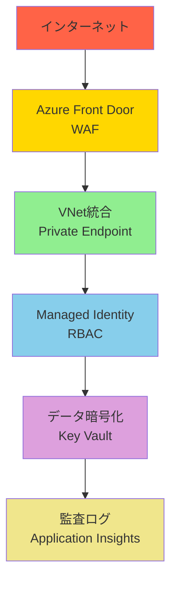
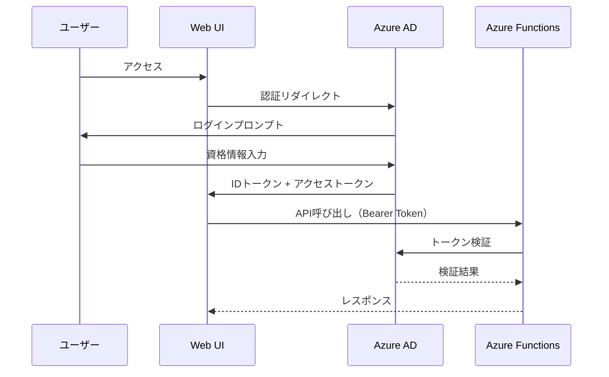
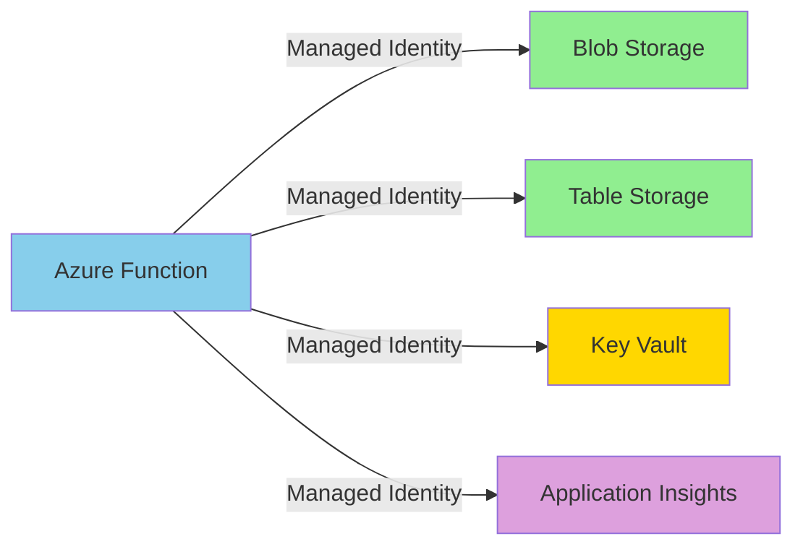
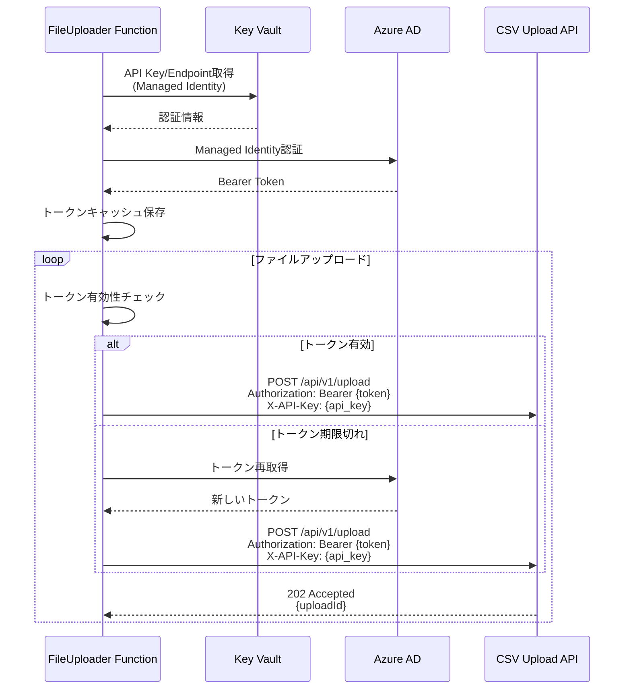
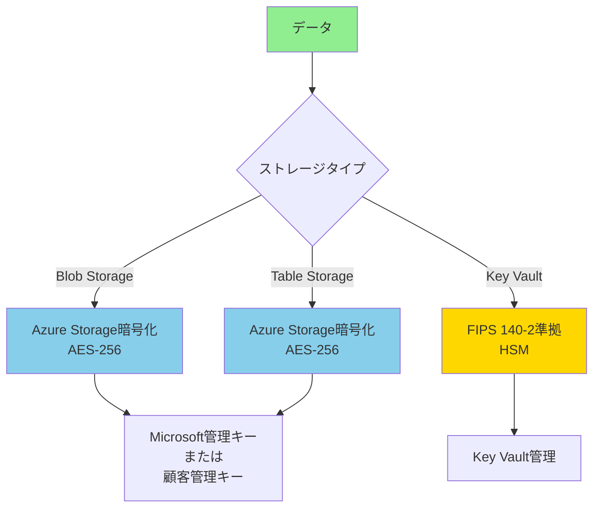
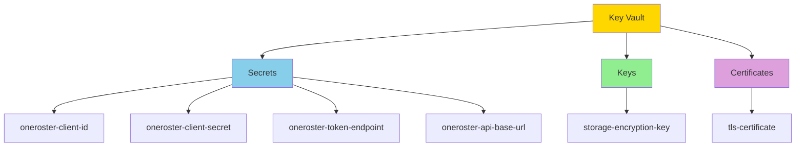
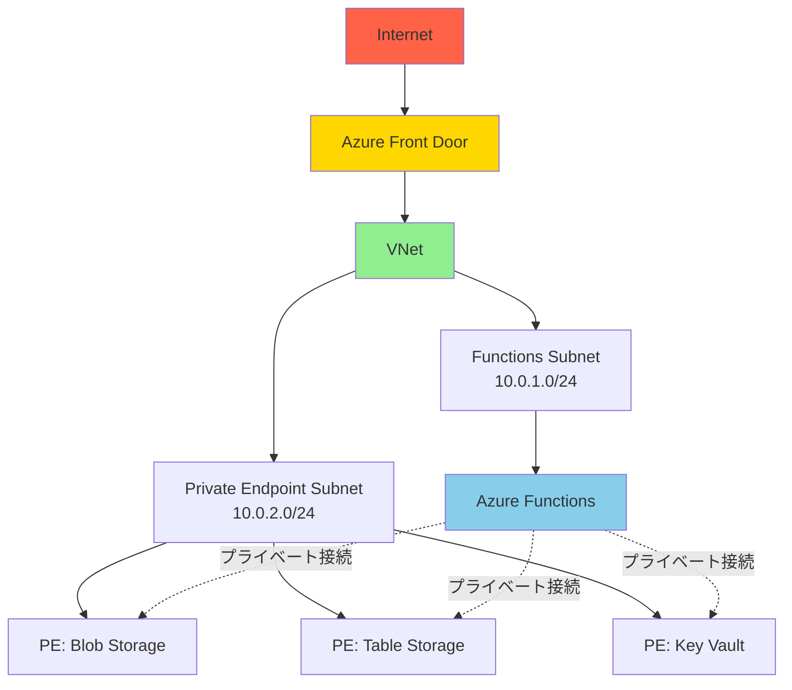

# セキュリティアーキテクチャ詳細設計

**ドキュメントバージョン**: 1.0.0  
**作成日**: 2025-10-27  
**ステータス**: Draft

---

## 📋 概要

本ドキュメントでは、SDS2Rosterシステムのセキュリティアーキテクチャを詳細に定義します。

**対象範囲**:
1. 認証・認可戦略
2. データ暗号化
3. ネットワークセキュリティ
4. シークレット管理
5. 監査とロギング
6. 脆弱性対策

---

## 🔐 セキュリティ原則

### 1. 多層防御（Defense in Depth）



### 2. 最小権限の原則（Principle of Least Privilege）

各コンポーネントは、必要最小限の権限のみを持ちます。

### 3. ゼロトラスト（Zero Trust）

すべてのアクセスを検証し、暗黙の信頼を置きません。

---

## 🔑 認証・認可戦略

### 1.1 ユーザー認証（Web UI）



**実装詳細**:

#### Azure ADアプリ登録
```json
{
  "displayName": "SDS2Roster-WebUI",
  "signInAudience": "AzureADMyOrg",
  "web": {
    "redirectUris": [
      "https://sds2roster.example.com/auth/callback"
    ],
    "implicitGrantSettings": {
      "enableIdTokenIssuance": true,
      "enableAccessTokenIssuance": false
    }
  },
  "requiredResourceAccess": [
    {
      "resourceAppId": "00000003-0000-0000-c000-000000000000",
      "resourceAccess": [
        {
          "id": "e1fe6dd8-ba31-4d61-89e7-88639da4683d",
          "type": "Scope"
        }
      ]
    }
  ]
}
```

#### Web UIでのトークン取得（React）
```typescript
import { PublicClientApplication } from '@azure/msal-browser';

const msalConfig = {
  auth: {
    clientId: process.env.REACT_APP_AAD_CLIENT_ID!,
    authority: `https://login.microsoftonline.com/${process.env.REACT_APP_AAD_TENANT_ID}`,
    redirectUri: window.location.origin + '/auth/callback'
  },
  cache: {
    cacheLocation: 'sessionStorage',
    storeAuthStateInCookie: false
  }
};

const msalInstance = new PublicClientApplication(msalConfig);

// ログイン
async function login() {
  try {
    const loginResponse = await msalInstance.loginPopup({
      scopes: ['User.Read']
    });
    
    return loginResponse.accessToken;
  } catch (error) {
    console.error('Login failed:', error);
    throw error;
  }
}

// APIリクエスト
async function callApi(endpoint: string, method: string, data?: any) {
  const accounts = msalInstance.getAllAccounts();
  
  if (accounts.length === 0) {
    throw new Error('No authenticated account');
  }
  
  const tokenResponse = await msalInstance.acquireTokenSilent({
    scopes: [`api://${process.env.REACT_APP_API_CLIENT_ID}/.default`],
    account: accounts[0]
  });
  
  const response = await fetch(endpoint, {
    method,
    headers: {
      'Authorization': `Bearer ${tokenResponse.accessToken}`,
      'Content-Type': 'application/json'
    },
    body: data ? JSON.stringify(data) : undefined
  });
  
  return response.json();
}
```

### 1.2 Azure Functions認証（HTTP Trigger）

#### function.jsonでの認証設定
```json
{
  "bindings": [
    {
      "authLevel": "anonymous",
      "type": "httpTrigger",
      "direction": "in",
      "name": "req",
      "methods": ["post"]
    }
  ]
}
```

#### host.jsonでのAzure AD認証
```json
{
  "version": "2.0",
  "extensions": {
    "http": {
      "routePrefix": "api"
    }
  },
  "auth": {
    "identityProvider": {
      "type": "aad",
      "audience": "api://sds2roster-functions",
      "issuer": "https://login.microsoftonline.com/{tenant-id}/v2.0"
    }
  }
}
```

#### TypeScriptでのトークン検証
```typescript
import { app, HttpRequest, HttpResponseInit, InvocationContext } from '@azure/functions';
import { DefaultAzureCredential } from '@azure/identity';
import jwt from 'jsonwebtoken';
import jwksClient from 'jwks-rsa';

const client = jwksClient({
  jwksUri: `https://login.microsoftonline.com/${process.env.AAD_TENANT_ID}/discovery/v2.0/keys`
});

function getKey(header: any, callback: any) {
  client.getSigningKey(header.kid, (err, key) => {
    if (err) {
      callback(err);
      return;
    }
    const signingKey = key?.getPublicKey();
    callback(null, signingKey);
  });
}

async function validateToken(token: string): Promise<any> {
  return new Promise((resolve, reject) => {
    jwt.verify(
      token,
      getKey,
      {
        audience: `api://${process.env.API_CLIENT_ID}`,
        issuer: `https://login.microsoftonline.com/${process.env.AAD_TENANT_ID}/v2.0`,
        algorithms: ['RS256']
      },
      (err, decoded) => {
        if (err) {
          reject(err);
        } else {
          resolve(decoded);
        }
      }
    );
  });
}

app.http('protectedEndpoint', {
  methods: ['POST'],
  authLevel: 'anonymous',
  handler: async (request: HttpRequest, context: InvocationContext): Promise<HttpResponseInit> => {
    try {
      // Authorization ヘッダー取得
      const authHeader = request.headers.get('Authorization');
      
      if (!authHeader || !authHeader.startsWith('Bearer ')) {
        return {
          status: 401,
          jsonBody: { error: 'No bearer token provided' }
        };
      }
      
      const token = authHeader.substring(7);
      
      // トークン検証
      const decoded = await validateToken(token);
      
      // ユーザー情報取得
      const userId = decoded.oid; // Object ID
      const userName = decoded.name;
      const userEmail = decoded.preferred_username;
      
      context.log('Authenticated user:', { userId, userName, userEmail });
      
      // ビジネスロジック処理
      // ...
      
      return {
        status: 200,
        jsonBody: { message: 'Success' }
      };
      
    } catch (error) {
      context.error('Authentication failed:', error);
      return {
        status: 401,
        jsonBody: { error: 'Invalid token' }
      };
    }
  }
});
```

### 1.3 サービス間認証（Managed Identity）



#### Managed Identity有効化（Terraform）
```hcl
resource "azurerm_linux_function_app" "file_detection" {
  name                = "func-sds2roster-filedetection-${var.environment}"
  resource_group_name = azurerm_resource_group.main.name
  location            = azurerm_resource_group.main.location
  
  identity {
    type = "SystemAssigned"
  }
  
  # ...
}

# Blob Storageへのアクセス権限
resource "azurerm_role_assignment" "func_blob_contributor" {
  scope                = azurerm_storage_account.main.id
  role_definition_name = "Storage Blob Data Contributor"
  principal_id         = azurerm_linux_function_app.file_detection.identity[0].principal_id
}

# Table Storageへのアクセス権限
resource "azurerm_role_assignment" "func_table_contributor" {
  scope                = azurerm_storage_account.main.id
  role_definition_name = "Storage Table Data Contributor"
  principal_id         = azurerm_linux_function_app.file_detection.identity[0].principal_id
}

# Key Vaultへのアクセス権限
resource "azurerm_key_vault_access_policy" "func_secrets" {
  key_vault_id = azurerm_key_vault.main.id
  tenant_id    = data.azurerm_client_config.current.tenant_id
  object_id    = azurerm_linux_function_app.file_detection.identity[0].principal_id
  
  secret_permissions = [
    "Get",
    "List"
  ]
}
```

#### TypeScriptでのManaged Identity使用
```typescript
import { DefaultAzureCredential } from '@azure/identity';
import { BlobServiceClient } from '@azure/storage-blob';
import { TableClient } from '@azure/data-tables';
import { SecretClient } from '@azure/keyvault-secrets';

// Managed Identity認証情報
const credential = new DefaultAzureCredential();

// Blob Storage
const blobServiceClient = new BlobServiceClient(
  `https://${process.env.STORAGE_ACCOUNT_NAME}.blob.core.windows.net`,
  credential
);

// Table Storage
const tableClient = new TableClient(
  `https://${process.env.STORAGE_ACCOUNT_NAME}.table.core.windows.net`,
  'JobHistory',
  credential
);

// Key Vault
const keyVaultClient = new SecretClient(
  process.env.KEY_VAULT_URL!,
  credential
);

// シークレット取得
async function getSecret(secretName: string): Promise<string> {
  const secret = await keyVaultClient.getSecret(secretName);
  return secret.value!;
}
```

#### PythonでのManaged Identity使用
```python
from azure.identity import DefaultAzureCredential
from azure.storage.blob import BlobServiceClient
from azure.data.tables import TableClient
from azure.keyvault.secrets import SecretClient
import os

# Managed Identity認証情報
credential = DefaultAzureCredential()

# Blob Storage
blob_service_client = BlobServiceClient(
    account_url=f"https://{os.getenv('STORAGE_ACCOUNT_NAME')}.blob.core.windows.net",
    credential=credential
)

# Table Storage
table_client = TableClient(
    endpoint=f"https://{os.getenv('STORAGE_ACCOUNT_NAME')}.table.core.windows.net",
    table_name='JobHistory',
    credential=credential
)

# Key Vault
kv_client = SecretClient(
    vault_url=os.getenv('KEY_VAULT_URL'),
    credential=credential
)

# シークレット取得
def get_secret(secret_name: str) -> str:
    secret = kv_client.get_secret(secret_name)
    return secret.value
```

### 1.4 CSV Upload API認証（Azure AD + API Key）



**実装例**（TypeScript）:
```typescript
import axios from 'axios';
import { SecretClient } from '@azure/keyvault-secrets';
import { ManagedIdentityCredential } from '@azure/identity';
import FormData from 'form-data';

interface TokenCache {
  token: string;
  expiresOn: number;  // Unix timestamp (秒)
}

class CSVUploadClient {
  private kvClient: SecretClient;
  private credential: ManagedIdentityCredential;
  private tokenCache?: TokenCache;
  
  constructor() {
    this.credential = new ManagedIdentityCredential();
    this.kvClient = new SecretClient(
      process.env.KEY_VAULT_URL!,
      this.credential
    );
  }
  
  async uploadFiles(
    files: Map<string, Buffer>,
    metadata: object
  ): Promise<{uploadId: string; status: string}> {
    // Key VaultからAPI設定取得
    const apiEndpoint = await this.getSecret('upload-api-endpoint');
    const apiKey = await this.getSecret('upload-api-key');
    
    // Azure AD Bearer Token取得
    const bearerToken = await this.getBearerToken();
    
    // FormData構築
    const formData = new FormData();
    formData.append('files', JSON.stringify(metadata), {
      filename: 'metadata.json',
      contentType: 'application/json'
    });
    
    for (const [filename, content] of files.entries()) {
      formData.append('files', content, {
        filename: filename,
        contentType: 'text/csv'
      });
    }
    
    // API呼び出し
    const response = await axios.post(
      `${apiEndpoint}/upload`,
      formData,
      {
        headers: {
          'Authorization': `Bearer ${bearerToken}`,
          'X-API-Key': apiKey,
          ...formData.getHeaders()
        },
        timeout: 60000
      }
    );
    
    return response.data;
  }
  
  private async getBearerToken(): Promise<string> {
    // キャッシュチェック（5分のバッファ）
    if (this.isTokenValid()) {
      return this.tokenCache!.token;
    }
    
    // Managed Identityでトークン取得
    const tokenResponse = await this.credential.getToken(
      'https://management.azure.com/.default'
    );
    
    // キャッシュ保存
    this.tokenCache = {
      token: tokenResponse.token,
      expiresOn: tokenResponse.expiresOn
    };
    
    return tokenResponse.token;
  }
  
  private isTokenValid(): boolean {
    if (!this.tokenCache) return false;
    // 5分のバッファ
    const now = Math.floor(Date.now() / 1000);
    return now < (this.tokenCache.expiresOn - 300);
  }
  
  private async getSecret(secretName: string): Promise<string> {
    const secret = await this.kvClient.getSecret(secretName);
    if (!secret.value) {
      throw new Error(`Secret ${secretName} has no value`);
    }
    return secret.value;
  }
}
```

**セキュリティ上の利点**:
- **二要素認証**: Azure AD Bearer Token + API Key の両方が必要
- **Managed Identity**: クライアントシークレット不要、自動ローテーション
- **API Key**: 追加の認証レイヤー、簡易的なアクセス制御
- **トークンキャッシュ**: 不要な認証リクエストを削減

---

## 🔒 データ暗号化

### 2.1 保存データの暗号化（Encryption at Rest）



#### Blob Storage暗号化設定（Terraform）
```hcl
resource "azurerm_storage_account" "main" {
  name                     = "stsds2roster${var.environment}"
  resource_group_name      = azurerm_resource_group.main.name
  location                 = azurerm_resource_group.main.location
  account_tier             = "Standard"
  account_replication_type = "ZRS"
  
  # 暗号化設定
  encryption {
    services {
      blob {
        enabled = true
      }
      table {
        enabled = true
      }
    }
    key_source = "Microsoft.Storage" # または "Microsoft.Keyvault"（顧客管理キー）
  }
  
  # HTTPSのみ許可
  enable_https_traffic_only = true
  
  # TLS 1.2以上を強制
  min_tls_version = "TLS1_2"
  
  # ネットワークルール
  network_rules {
    default_action = "Deny"
    ip_rules       = []
    virtual_network_subnet_ids = [
      azurerm_subnet.functions.id
    ]
    bypass = ["AzureServices"]
  }
}
```

#### 顧客管理キー（CMK）使用例
```hcl
# Key Vaultでキー作成
resource "azurerm_key_vault_key" "storage_encryption" {
  name         = "storage-encryption-key"
  key_vault_id = azurerm_key_vault.main.id
  key_type     = "RSA"
  key_size     = 2048
  
  key_opts = [
    "decrypt",
    "encrypt",
    "sign",
    "unwrapKey",
    "verify",
    "wrapKey"
  ]
}

# Storage AccountでCMK使用
resource "azurerm_storage_account" "main" {
  # ...
  
  identity {
    type = "SystemAssigned"
  }
  
  customer_managed_key {
    key_vault_key_id          = azurerm_key_vault_key.storage_encryption.id
    user_assigned_identity_id = null
  }
}

# Key Vaultアクセス許可
resource "azurerm_key_vault_access_policy" "storage" {
  key_vault_id = azurerm_key_vault.main.id
  tenant_id    = data.azurerm_client_config.current.tenant_id
  object_id    = azurerm_storage_account.main.identity[0].principal_id
  
  key_permissions = [
    "Get",
    "UnwrapKey",
    "WrapKey"
  ]
}
```

### 2.2 転送データの暗号化（Encryption in Transit）

**要件**:
- すべての通信でTLS 1.2以上を使用
- 弱い暗号スイートを無効化

#### Azure Functions HTTPS強制
```hcl
resource "azurerm_linux_function_app" "main" {
  name = "func-sds2roster-${var.environment}"
  
  # HTTPS のみ許可
  https_only = true
  
  site_config {
    # TLS 1.2 最小バージョン
    minimum_tls_version = "1.2"
    
    # HTTP/2 有効化
    http2_enabled = true
  }
}
```

#### Blob Storage HTTPS強制
```hcl
resource "azurerm_storage_account" "main" {
  # HTTPS のみ許可
  enable_https_traffic_only = true
  
  # TLS 1.2 最小バージョン
  min_tls_version = "TLS1_2"
}
```

---

## 🔐 シークレット管理

### 3.1 Key Vault構成



#### Key Vault作成（Terraform）
```hcl
resource "azurerm_key_vault" "main" {
  name                = "kv-sds2roster-${var.environment}"
  location            = azurerm_resource_group.main.location
  resource_group_name = azurerm_resource_group.main.name
  tenant_id           = data.azurerm_client_config.current.tenant_id
  
  sku_name = "standard" # または "premium"（HSMバックアップ）
  
  # 論理削除有効化（90日間保持）
  soft_delete_retention_days = 90
  purge_protection_enabled   = true
  
  # ネットワークACL
  network_acls {
    default_action = "Deny"
    bypass         = "AzureServices"
    ip_rules       = []
    virtual_network_subnet_ids = [
      azurerm_subnet.functions.id
    ]
  }
  
  # RBAC有効化
  enable_rbac_authorization = true
}

# シークレット作成
resource "azurerm_key_vault_secret" "upload_api_key" {
  name         = "upload-api-key"
  value        = var.upload_api_key
  key_vault_id = azurerm_key_vault.main.id
  
  content_type = "text/plain"
  
  tags = {
    environment = var.environment
    managed_by  = "terraform"
  }
}

resource "azurerm_key_vault_secret" "upload_api_endpoint" {
  name         = "upload-api-endpoint"
  value        = var.upload_api_endpoint
  key_vault_id = azurerm_key_vault.main.id
  
  content_type = "text/plain"
  
  tags = {
    environment = var.environment
    managed_by  = "terraform"
  }
}
```

### 3.2 シークレットローテーション

**戦略**:
- CSV Upload API Key: 90日ごと
- ストレージアクセスキー: Managed Identity使用のため不要
- 暗号化キー: 1年ごと

#### シークレットローテーション自動化（Azure Automation）
```hcl
resource "azurerm_automation_account" "main" {
  name                = "aa-sds2roster-${var.environment}"
  location            = azurerm_resource_group.main.location
  resource_group_name = azurerm_resource_group.main.name
  sku_name            = "Basic"
}

resource "azurerm_automation_runbook" "rotate_secrets" {
  name                    = "Rotate-OneRosterSecrets"
  location                = azurerm_resource_group.main.location
  resource_group_name     = azurerm_resource_group.main.name
  automation_account_name = azurerm_automation_account.main.name
  
  log_verbose  = true
  log_progress = true
  
  runbook_type = "PowerShell"
  
  content = file("${path.module}/runbooks/rotate-secrets.ps1")
}

resource "azurerm_automation_schedule" "rotate_secrets_schedule" {
  name                    = "RotateSecretsQuarterly"
  resource_group_name     = azurerm_resource_group.main.name
  automation_account_name = azurerm_automation_account.main.name
  
  frequency = "Month"
  interval  = 3
  timezone  = "Asia/Tokyo"
}
```

---

## 🌐 ネットワークセキュリティ

### 4.1 VNet統合とPrivate Endpoint



#### VNet作成（Terraform）
```hcl
resource "azurerm_virtual_network" "main" {
  name                = "vnet-sds2roster-${var.environment}"
  location            = azurerm_resource_group.main.location
  resource_group_name = azurerm_resource_group.main.name
  address_space       = ["10.0.0.0/16"]
}

# Functions用サブネット
resource "azurerm_subnet" "functions" {
  name                 = "snet-functions"
  resource_group_name  = azurerm_resource_group.main.name
  virtual_network_name = azurerm_virtual_network.main.name
  address_prefixes     = ["10.0.1.0/24"]
  
  delegation {
    name = "func-delegation"
    
    service_delegation {
      name    = "Microsoft.Web/serverFarms"
      actions = ["Microsoft.Network/virtualNetworks/subnets/action"]
    }
  }
}

# Private Endpoint用サブネット
resource "azurerm_subnet" "private_endpoints" {
  name                 = "snet-private-endpoints"
  resource_group_name  = azurerm_resource_group.main.name
  virtual_network_name = azurerm_virtual_network.main.name
  address_prefixes     = ["10.0.2.0/24"]
  
  private_endpoint_network_policies_enabled = false
}
```

#### Private Endpoint作成（Blob Storage）
```hcl
resource "azurerm_private_endpoint" "blob" {
  name                = "pe-blob-${var.environment}"
  location            = azurerm_resource_group.main.location
  resource_group_name = azurerm_resource_group.main.name
  subnet_id           = azurerm_subnet.private_endpoints.id
  
  private_service_connection {
    name                           = "psc-blob"
    private_connection_resource_id = azurerm_storage_account.main.id
    is_manual_connection           = false
    subresource_names              = ["blob"]
  }
  
  private_dns_zone_group {
    name                 = "pdns-blob"
    private_dns_zone_ids = [azurerm_private_dns_zone.blob.id]
  }
}

# Private DNS Zone
resource "azurerm_private_dns_zone" "blob" {
  name                = "privatelink.blob.core.windows.net"
  resource_group_name = azurerm_resource_group.main.name
}

resource "azurerm_private_dns_zone_virtual_network_link" "blob" {
  name                  = "pdns-link-blob"
  resource_group_name   = azurerm_resource_group.main.name
  private_dns_zone_name = azurerm_private_dns_zone.blob.name
  virtual_network_id    = azurerm_virtual_network.main.id
}
```

### 4.2 NSG（Network Security Group）

```hcl
resource "azurerm_network_security_group" "functions" {
  name                = "nsg-functions-${var.environment}"
  location            = azurerm_resource_group.main.location
  resource_group_name = azurerm_resource_group.main.name
  
  # インバウンドルール: HTTPSのみ許可
  security_rule {
    name                       = "AllowHTTPS"
    priority                   = 100
    direction                  = "Inbound"
    access                     = "Allow"
    protocol                   = "Tcp"
    source_port_range          = "*"
    destination_port_range     = "443"
    source_address_prefix      = "*"
    destination_address_prefix = "*"
  }
  
  # アウトバウンドルール: Azure Servicesへのアクセス許可
  security_rule {
    name                       = "AllowAzureServices"
    priority                   = 100
    direction                  = "Outbound"
    access                     = "Allow"
    protocol                   = "*"
    source_port_range          = "*"
    destination_port_range     = "*"
    source_address_prefix      = "VirtualNetwork"
    destination_address_prefix = "AzureCloud"
  }
}

resource "azurerm_subnet_network_security_group_association" "functions" {
  subnet_id                 = azurerm_subnet.functions.id
  network_security_group_id = azurerm_network_security_group.functions.id
}
```

---

## 📊 監査とロギング

### 5.1 Azure Monitor診断設定

```hcl
# Blob Storage診断設定
resource "azurerm_monitor_diagnostic_setting" "blob" {
  name                       = "diag-blob-${var.environment}"
  target_resource_id         = "${azurerm_storage_account.main.id}/blobServices/default"
  log_analytics_workspace_id = azurerm_log_analytics_workspace.main.id
  
  enabled_log {
    category = "StorageRead"
  }
  
  enabled_log {
    category = "StorageWrite"
  }
  
  enabled_log {
    category = "StorageDelete"
  }
  
  metric {
    category = "Transaction"
    enabled  = true
  }
}

# Key Vault診断設定
resource "azurerm_monitor_diagnostic_setting" "keyvault" {
  name                       = "diag-kv-${var.environment}"
  target_resource_id         = azurerm_key_vault.main.id
  log_analytics_workspace_id = azurerm_log_analytics_workspace.main.id
  
  enabled_log {
    category = "AuditEvent"
  }
  
  metric {
    category = "AllMetrics"
    enabled  = true
  }
}
```

### 5.2 セキュリティ監査クエリ

#### 認証失敗の検出（KQL）
```kusto
AzureDiagnostics
| where ResourceType == "VAULTS"
| where OperationName == "VaultGet" or OperationName == "SecretGet"
| where ResultType != "Success"
| summarize FailureCount = count() by CallerIPAddress, identity_claim_oid_g, bin(TimeGenerated, 1h)
| where FailureCount > 5
| order by TimeGenerated desc
```

#### 不審なBlob削除の検出
```kusto
StorageBlobLogs
| where OperationName == "DeleteBlob"
| where StatusCode == 200
| extend FileCount = toint(split(Uri, "/")[-1])
| summarize DeletedFiles = count() by AccountName, CallerIpAddress, bin(TimeGenerated, 1h)
| where DeletedFiles > 100
| order by TimeGenerated desc
```

---

## 🛡️ 脆弱性対策

### 6.1 依存関係の脆弱性スキャン

#### GitHub Dependabot設定
```yaml
# .github/dependabot.yml
version: 2
updates:
  # JavaScript dependencies
  - package-ecosystem: "npm"
    directory: "/src/javascript"
    schedule:
      interval: "weekly"
    open-pull-requests-limit: 10
    
  # Python dependencies
  - package-ecosystem: "pip"
    directory: "/src/python"
    schedule:
      interval: "weekly"
    open-pull-requests-limit: 10
```

### 6.2 コンテナスキャン（Azure Container Registry）

```hcl
resource "azurerm_container_registry" "main" {
  name                = "acrsds2roster${var.environment}"
  resource_group_name = azurerm_resource_group.main.name
  location            = azurerm_resource_group.main.location
  sku                 = "Premium"
  
  # Microsoft Defender for Containers統合
  quarantine_policy_enabled = true
  
  # 信頼されたコンテンツのみ許可
  trust_policy {
    enabled = true
  }
}
```

### 6.3 Azure Security Center推奨設定

```hcl
resource "azurerm_security_center_subscription_pricing" "main" {
  tier          = "Standard"
  resource_type = "VirtualMachines"
}

resource "azurerm_security_center_subscription_pricing" "storage" {
  tier          = "Standard"
  resource_type = "StorageAccounts"
}

resource "azurerm_security_center_subscription_pricing" "keyvault" {
  tier          = "Standard"
  resource_type = "KeyVaults"
}
```

---

## 📋 セキュリティチェックリスト

### デプロイ前チェック

- [ ] すべてのAzure Functionsで認証が有効
- [ ] Managed Identityが有効化され、RBACが設定されている
- [ ] Key Vaultにすべてのシークレットが保存されている
- [ ] Blob/Table Storageの暗号化が有効
- [ ] ネットワークアクセスがVNetに制限されている
- [ ] Private Endpointが構成されている
- [ ] HTTPSのみが許可されている
- [ ] TLS 1.2以上が強制されている
- [ ] 診断ログが有効化されている
- [ ] Azure Security Centerが有効

### 運用中チェック

- [ ] 認証失敗アラートの監視
- [ ] 異常なAPIアクセスパターンの検出
- [ ] シークレットローテーションの実施（90日ごと）
- [ ] 脆弱性スキャン結果の確認（週次）
- [ ] セキュリティパッチの適用（月次）

---

## 📝 次のドキュメント

- [07_infrastructure_design.md](./07_infrastructure_design.md) - インフラストラクチャ設計

---

**文書管理責任者**: Security Architect  
**最終更新日**: 2025-10-27  
**ドキュメントステータス**: Draft
