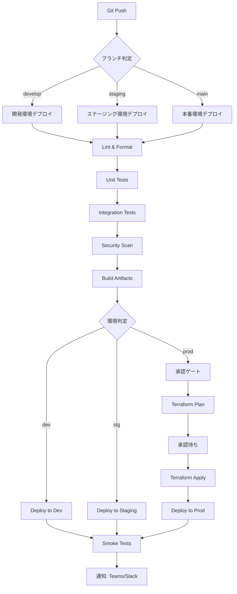

# デプロイメント・インフラストラクチャ設計

**ドキュメントバージョン**: 1.0.0  
**作成日**: 2025-10-27  
**ステータス**: Draft

---

## 📋 概要

本ドキュメントは、SDS2Rosterシステムのデプロイメント戦略、CI/CDパイプライン、インフラストラクチャ設計（Infrastructure as Code）を定義します。

**対象読者**:
- DevOpsエンジニア
- インフラエンジニア
- システム管理者
- 開発チーム

---

## 🎯 デプロイメント原則

### 1. Infrastructure as Code (IaC)
- **Terraform使用**: すべてのAzureリソースをコードで管理
- **バージョン管理**: TerraformコードはすべてGitで管理
- **再現性**: 環境をいつでも再作成可能

### 2. 自動化優先
- **手動作業最小化**: デプロイはすべてCI/CDパイプライン経由
- **承認フロー**: 本番デプロイには承認ゲート必須
- **ロールバック**: ワンクリックでロールバック可能

### 3. Blue-Green Deployment
- **ゼロダウンタイム**: 本番環境への影響を最小化
- **段階的ロールアウト**: カナリアリリース対応
- **即座のロールバック**: 問題発生時は旧バージョンに切り替え

### 4. 環境分離
- **独立した環境**: 開発・ステージング・本番を完全分離
- **リソースグループ分離**: 環境ごとに独立したAzureリソースグループ
- **設定管理**: 環境ごとの設定をKey Vaultで管理

---

## 🏗️ 環境構成

### 環境一覧

| 環境 | 目的 | デプロイ頻度 | 承認要否 |
|------|------|------------|---------|
| **開発 (dev)** | 機能開発・単体テスト | 1日複数回 | 不要 |
| **ステージング (stg)** | 統合テスト・検証 | 週1-2回 | 不要 |
| **本番 (prod)** | 本番運用 | 月2回 | **必須** |

### リソース命名規則

```
パターン: {service}-{project}-{env}-{region}

例:
- func-sds2roster-dev-japaneast
- st-sds2roster-prod-japaneast
- kv-sds2roster-prod-japaneast
- rg-sds2roster-dev
- rg-sds2roster-prod
```

### 環境詳細

#### 開発環境 (dev)

| リソース | 名称 | SKU/Tier | 用途 |
|---------|------|----------|------|
| Function App (Python) | func-sds2roster-py-dev | Consumption | Python版開発 |
| Function App (JavaScript) | func-sds2roster-js-dev | Consumption | JavaScript版開発 |
| Storage Account | stsds2rosterdev | Standard LRS | ファイル保存 |
| Table Storage | stsds2rosterdev | Standard | ジョブ履歴 |
| Key Vault | kv-sds2roster-dev | Standard | シークレット管理 |
| Application Insights | appi-sds2roster-dev | - | 監視・ログ |
| リソースグループ | rg-sds2roster-dev | - | リソース管理 |

**特徴**:
- 低コスト優先（Consumption Plan）
- LRS（ローカル冗長ストレージ）
- 開発者全員がアクセス可能

#### ステージング環境 (stg)

| リソース | 名称 | SKU/Tier | 用途 |
|---------|------|----------|------|
| Function App (Python) | func-sds2roster-py-stg | Premium EP1 | Python版検証 |
| Function App (JavaScript) | func-sds2roster-js-stg | Premium EP1 | JavaScript版検証 |
| Storage Account | stsds2rosterstg | Standard ZRS | ファイル保存 |
| Table Storage | stsds2rosterstg | Standard | ジョブ履歴 |
| Key Vault | kv-sds2roster-stg | Standard | シークレット管理 |
| Application Insights | appi-sds2roster-stg | - | 監視・ログ |
| リソースグループ | rg-sds2roster-stg | - | リソース管理 |

**特徴**:
- 本番同等構成
- ZRS（ゾーン冗長ストレージ）
- 本番相当の負荷テスト可能

#### 本番環境 (prod)

| リソース | 名称 | SKU/Tier | 用途 |
|---------|------|----------|------|
| Function App (Python) | func-sds2roster-py-prod | Premium EP2 | Python版本番 |
| Function App (JavaScript) | func-sds2roster-js-prod | Premium EP2 | JavaScript版本番 |
| Storage Account (Function用) | stsds2rosterfnprod | Standard ZRS | Function専用 |
| Storage Account (データ用) | stsds2rosterdataprod | Standard ZRS | CSV入出力 |
| Table Storage | stsds2rosterdataprod | Standard | ジョブ履歴 |
| Key Vault | kv-sds2roster-prod | Standard | シークレット管理 |
| Application Insights | appi-sds2roster-prod | - | 監視・ログ |
| リソースグループ | rg-sds2roster-prod | - | リソース管理 |

**特徴**:
- 高可用性・高性能（Premium EP2）
- Storage Account分離（Function用/データ用）
- ZRS（ゾーン冗長ストレージ）
- 本番運用監視・アラート

---

## 🔄 CI/CDパイプライン

### GitHub Actionsワークフロー

#### 全体フロー図



### ワークフロー定義

#### 1. 開発環境デプロイ（`.github/workflows/deploy-dev.yml`）

```yaml
name: Deploy to Development

on:
  push:
    branches:
      - develop

env:
  AZURE_FUNCTIONAPP_NAME_PY: func-sds2roster-py-dev
  AZURE_FUNCTIONAPP_NAME_JS: func-sds2roster-js-dev
  PYTHON_VERSION: '3.11'
  NODE_VERSION: '20'

jobs:
  lint-and-test:
    runs-on: ubuntu-latest
    steps:
      - uses: actions/checkout@v4
      
      # Python Lint & Test
      - name: Set up Python
        uses: actions/setup-python@v4
        with:
          python-version: ${{ env.PYTHON_VERSION }}
      
      - name: Install Python dependencies
        run: |
          cd src/python
          pip install -r requirements.txt
          pip install -r requirements-dev.txt
      
      - name: Run Python linters
        run: |
          cd src/python
          black --check .
          flake8 .
          mypy .
      
      - name: Run Python tests
        run: |
          cd src/python
          pytest --cov=. --cov-report=xml
      
      # JavaScript Lint & Test
      - name: Set up Node.js
        uses: actions/setup-node@v4
        with:
          node-version: ${{ env.NODE_VERSION }}
      
      - name: Install JS dependencies
        run: |
          cd src/javascript
          npm ci
      
      - name: Run JS linters
        run: |
          cd src/javascript
          npm run lint
      
      - name: Run JS tests
        run: |
          cd src/javascript
          npm run test:coverage

  deploy-python:
    needs: lint-and-test
    runs-on: ubuntu-latest
    steps:
      - uses: actions/checkout@v4
      
      - name: Login to Azure
        uses: azure/login@v1
        with:
          creds: ${{ secrets.AZURE_CREDENTIALS_DEV }}
      
      - name: Deploy Python Function App
        uses: Azure/functions-action@v1
        with:
          app-name: ${{ env.AZURE_FUNCTIONAPP_NAME_PY }}
          package: './src/python'
          python-version: ${{ env.PYTHON_VERSION }}

  deploy-javascript:
    needs: lint-and-test
    runs-on: ubuntu-latest
    steps:
      - uses: actions/checkout@v4
      
      - name: Login to Azure
        uses: azure/login@v1
        with:
          creds: ${{ secrets.AZURE_CREDENTIALS_DEV }}
      
      - name: Deploy JS Function App
        uses: Azure/functions-action@v1
        with:
          app-name: ${{ env.AZURE_FUNCTIONAPP_NAME_JS }}
          package: './src/javascript'

  smoke-tests:
    needs: [deploy-python, deploy-javascript]
    runs-on: ubuntu-latest
    steps:
      - name: Run smoke tests
        run: |
          # 基本的なヘルスチェック
          curl -f https://${AZURE_FUNCTIONAPP_NAME_PY}.azurewebsites.net/api/health
          curl -f https://${AZURE_FUNCTIONAPP_NAME_JS}.azurewebsites.net/api/health

  notify:
    needs: [smoke-tests]
    runs-on: ubuntu-latest
    steps:
      - name: Notify Teams
        uses: aliencube/microsoft-teams-actions@v0.8.0
        with:
          webhook_uri: ${{ secrets.TEAMS_WEBHOOK_URL }}
          title: "Development Deployment Success"
          summary: "SDS2Roster dev environment deployed successfully"
```

#### 2. 本番環境デプロイ（`.github/workflows/deploy-prod.yml`）

```yaml
name: Deploy to Production

on:
  push:
    branches:
      - main
    tags:
      - 'v*.*.*'

env:
  AZURE_FUNCTIONAPP_NAME_PY: func-sds2roster-py-prod
  AZURE_FUNCTIONAPP_NAME_JS: func-sds2roster-js-prod
  TERRAFORM_VERSION: '1.5.0'

jobs:
  security-scan:
    runs-on: ubuntu-latest
    steps:
      - uses: actions/checkout@v4
      
      - name: Run Trivy vulnerability scanner
        uses: aquasecurity/trivy-action@master
        with:
          scan-type: 'fs'
          scan-ref: '.'
          format: 'sarif'
          output: 'trivy-results.sarif'
      
      - name: Upload Trivy results
        uses: github/codeql-action/upload-sarif@v2
        with:
          sarif_file: 'trivy-results.sarif'

  terraform-plan:
    needs: security-scan
    runs-on: ubuntu-latest
    steps:
      - uses: actions/checkout@v4
      
      - name: Setup Terraform
        uses: hashicorp/setup-terraform@v2
        with:
          terraform_version: ${{ env.TERRAFORM_VERSION }}
      
      - name: Terraform Init
        run: |
          cd terraform/environments/prod
          terraform init -backend-config="key=prod.tfstate"
      
      - name: Terraform Plan
        run: |
          cd terraform/environments/prod
          terraform plan -out=tfplan
      
      - name: Upload Plan
        uses: actions/upload-artifact@v3
        with:
          name: terraform-plan
          path: terraform/environments/prod/tfplan

  approval-gate:
    needs: terraform-plan
    runs-on: ubuntu-latest
    environment:
      name: production
      url: https://func-sds2roster-py-prod.azurewebsites.net
    steps:
      - name: Wait for approval
        run: echo "Waiting for manual approval..."

  terraform-apply:
    needs: approval-gate
    runs-on: ubuntu-latest
    steps:
      - uses: actions/checkout@v4
      
      - name: Setup Terraform
        uses: hashicorp/setup-terraform@v2
        with:
          terraform_version: ${{ env.TERRAFORM_VERSION }}
      
      - name: Download Plan
        uses: actions/download-artifact@v3
        with:
          name: terraform-plan
          path: terraform/environments/prod
      
      - name: Terraform Apply
        run: |
          cd terraform/environments/prod
          terraform init -backend-config="key=prod.tfstate"
          terraform apply tfplan

  deploy-functions:
    needs: terraform-apply
    runs-on: ubuntu-latest
    strategy:
      matrix:
        language: [python, javascript]
    steps:
      - uses: actions/checkout@v4
      
      - name: Login to Azure
        uses: azure/login@v1
        with:
          creds: ${{ secrets.AZURE_CREDENTIALS_PROD }}
      
      - name: Deploy Function App
        uses: Azure/functions-action@v1
        with:
          app-name: ${{ matrix.language == 'python' && env.AZURE_FUNCTIONAPP_NAME_PY || env.AZURE_FUNCTIONAPP_NAME_JS }}
          package: './src/${{ matrix.language }}'
          slot-name: 'staging'

  swap-slots:
    needs: deploy-functions
    runs-on: ubuntu-latest
    steps:
      - name: Login to Azure
        uses: azure/login@v1
        with:
          creds: ${{ secrets.AZURE_CREDENTIALS_PROD }}
      
      - name: Swap Python slots
        run: |
          az functionapp deployment slot swap \
            --resource-group rg-sds2roster-prod \
            --name ${{ env.AZURE_FUNCTIONAPP_NAME_PY }} \
            --slot staging \
            --target-slot production
      
      - name: Swap JS slots
        run: |
          az functionapp deployment slot swap \
            --resource-group rg-sds2roster-prod \
            --name ${{ env.AZURE_FUNCTIONAPP_NAME_JS }} \
            --slot staging \
            --target-slot production

  post-deployment-tests:
    needs: swap-slots
    runs-on: ubuntu-latest
    steps:
      - uses: actions/checkout@v4
      
      - name: Run integration tests
        run: |
          cd tests/integration
          npm ci
          npm run test:prod
      
      - name: Monitor error rate
        run: |
          # Application Insightsでエラー率を確認
          # 5%以上の場合は自動ロールバック
          ERROR_RATE=$(az monitor app-insights metrics show \
            --app appi-sds2roster-prod \
            --metric requests/failed \
            --interval PT5M \
            --query "value.data[-1].average" \
            --output tsv)
          
          if (( $(echo "$ERROR_RATE > 5" | bc -l) )); then
            echo "Error rate too high: $ERROR_RATE%"
            exit 1
          fi

  rollback-on-failure:
    needs: post-deployment-tests
    if: failure()
    runs-on: ubuntu-latest
    steps:
      - name: Login to Azure
        uses: azure/login@v1
        with:
          creds: ${{ secrets.AZURE_CREDENTIALS_PROD }}
      
      - name: Rollback Python
        run: |
          az functionapp deployment slot swap \
            --resource-group rg-sds2roster-prod \
            --name ${{ env.AZURE_FUNCTIONAPP_NAME_PY }} \
            --slot production \
            --target-slot staging
      
      - name: Rollback JS
        run: |
          az functionapp deployment slot swap \
            --resource-group rg-sds2roster-prod \
            --name ${{ env.AZURE_FUNCTIONAPP_NAME_JS }} \
            --slot production \
            --target-slot staging
      
      - name: Notify failure
        uses: aliencube/microsoft-teams-actions@v0.8.0
        with:
          webhook_uri: ${{ secrets.TEAMS_WEBHOOK_URL }}
          title: "🚨 Production Deployment Failed - Rolled Back"
          summary: "Deployment failed and was automatically rolled back"
```

---

## 🏗️ Terraform構成

### ディレクトリ構造

```
terraform/
├── modules/
│   ├── function-app/
│   │   ├── main.tf
│   │   ├── variables.tf
│   │   └── outputs.tf
│   │
│   ├── storage/
│   │   ├── main.tf
│   │   ├── variables.tf
│   │   └── outputs.tf
│   │
│   ├── key-vault/
│   │   ├── main.tf
│   │   ├── variables.tf
│   │   └── outputs.tf
│   │
│   └── monitoring/
│       ├── main.tf
│       ├── variables.tf
│       └── outputs.tf
│
├── environments/
│   ├── dev/
│   │   ├── main.tf
│   │   ├── variables.tf
│   │   ├── terraform.tfvars
│   │   └── backend.tf
│   │
│   ├── stg/
│   │   ├── main.tf
│   │   ├── variables.tf
│   │   ├── terraform.tfvars
│   │   └── backend.tf
│   │
│   └── prod/
│       ├── main.tf
│       ├── variables.tf
│       ├── terraform.tfvars
│       └── backend.tf
│
├── shared/
│   ├── providers.tf
│   ├── versions.tf
│   └── locals.tf
│
└── README.md
```

### メインTerraformコード例

#### terraform/environments/prod/main.tf

```hcl
terraform {
  required_version = ">= 1.5.0"
  
  required_providers {
    azurerm = {
      source  = "hashicorp/azurerm"
      version = "~> 3.75.0"
    }
  }
  
  backend "azurerm" {
    resource_group_name  = "rg-terraform-state"
    storage_account_name = "stterraformstate"
    container_name       = "tfstate"
    key                  = "prod.tfstate"
  }
}

provider "azurerm" {
  features {
    key_vault {
      purge_soft_delete_on_destroy = false
      recover_soft_deleted_key_vaults = true
    }
  }
}

# ローカル変数
locals {
  project      = "sds2roster"
  environment  = "prod"
  location     = "japaneast"
  
  tags = {
    Project     = "SDS2Roster"
    Environment = "Production"
    ManagedBy   = "Terraform"
    CostCenter  = "IT-Education"
  }
}

# リソースグループ
resource "azurerm_resource_group" "main" {
  name     = "rg-${local.project}-${local.environment}"
  location = local.location
  tags     = local.tags
}

# Storage Account (Function用)
module "storage_function" {
  source = "../../modules/storage"
  
  name                = "st${local.project}fn${local.environment}"
  resource_group_name = azurerm_resource_group.main.name
  location            = azurerm_resource_group.main.location
  
  account_tier             = "Standard"
  account_replication_type = "ZRS"
  
  enable_https_traffic_only = true
  min_tls_version          = "TLS1_2"
  
  tags = local.tags
}

# Storage Account (データ用)
module "storage_data" {
  source = "../../modules/storage"
  
  name                = "st${local.project}data${local.environment}"
  resource_group_name = azurerm_resource_group.main.name
  location            = azurerm_resource_group.main.location
  
  account_tier             = "Standard"
  account_replication_type = "ZRS"
  
  enable_https_traffic_only = true
  min_tls_version          = "TLS1_2"
  
  # Blob containers
  containers = [
    "sds-input",
    "oneroster-output"
  ]
  
  tags = local.tags
}

# Key Vault
module "key_vault" {
  source = "../../modules/key-vault"
  
  name                = "kv-${local.project}-${local.environment}"
  resource_group_name = azurerm_resource_group.main.name
  location            = azurerm_resource_group.main.location
  
  sku_name = "standard"
  
  enabled_for_deployment          = false
  enabled_for_disk_encryption     = false
  enabled_for_template_deployment = false
  
  enable_rbac_authorization = true
  purge_protection_enabled  = true
  
  network_acls = {
    bypass         = "AzureServices"
    default_action = "Deny"
  }
  
  tags = local.tags
}

# Application Insights
module "monitoring" {
  source = "../../modules/monitoring"
  
  name                = "appi-${local.project}-${local.environment}"
  resource_group_name = azurerm_resource_group.main.name
  location            = azurerm_resource_group.main.location
  
  application_type = "web"
  
  daily_data_cap_in_gb = 10
  retention_in_days    = 90
  
  tags = local.tags
}

# Python Function App
module "function_app_python" {
  source = "../../modules/function-app"
  
  name                = "func-${local.project}-py-${local.environment}"
  resource_group_name = azurerm_resource_group.main.name
  location            = azurerm_resource_group.main.location
  
  os_type  = "Linux"
  runtime  = "python"
  version  = "3.11"
  
  service_plan_sku_name = "EP2"
  
  storage_account_name       = module.storage_function.name
  storage_account_access_key = module.storage_function.primary_access_key
  
  app_settings = {
    APPINSIGHTS_INSTRUMENTATIONKEY = module.monitoring.instrumentation_key
    KEY_VAULT_URL                  = module.key_vault.vault_uri
    DATA_STORAGE_CONNECTION_STRING = module.storage_data.primary_connection_string
    FUNCTIONS_WORKER_RUNTIME       = "python"
    AzureWebJobsFeatureFlags       = "EnableWorkerIndexing"
  }
  
  identity_type = "SystemAssigned"
  
  tags = local.tags
}

# JavaScript Function App
module "function_app_javascript" {
  source = "../../modules/function-app"
  
  name                = "func-${local.project}-js-${local.environment}"
  resource_group_name = azurerm_resource_group.main.name
  location            = azurerm_resource_group.main.location
  
  os_type  = "Linux"
  runtime  = "node"
  version  = "20"
  
  service_plan_sku_name = "EP2"
  
  storage_account_name       = module.storage_function.name
  storage_account_access_key = module.storage_function.primary_access_key
  
  app_settings = {
    APPINSIGHTS_INSTRUMENTATIONKEY = module.monitoring.instrumentation_key
    KEY_VAULT_URL                  = module.key_vault.vault_uri
    DATA_STORAGE_CONNECTION_STRING = module.storage_data.primary_connection_string
    FUNCTIONS_WORKER_RUNTIME       = "node"
    WEBSITE_NODE_DEFAULT_VERSION   = "~20"
  }
  
  identity_type = "SystemAssigned"
  
  tags = local.tags
}

# RBAC: Function Apps → Key Vault
resource "azurerm_role_assignment" "function_python_kv" {
  scope                = module.key_vault.id
  role_definition_name = "Key Vault Secrets User"
  principal_id         = module.function_app_python.principal_id
}

resource "azurerm_role_assignment" "function_javascript_kv" {
  scope                = module.key_vault.id
  role_definition_name = "Key Vault Secrets User"
  principal_id         = module.function_app_javascript.principal_id
}

# RBAC: Function Apps → Storage Data
resource "azurerm_role_assignment" "function_python_storage" {
  scope                = module.storage_data.id
  role_definition_name = "Storage Blob Data Contributor"
  principal_id         = module.function_app_python.principal_id
}

resource "azurerm_role_assignment" "function_javascript_storage" {
  scope                = module.storage_data.id
  role_definition_name = "Storage Blob Data Contributor"
  principal_id         = module.function_app_javascript.principal_id
}
```

#### terraform/modules/function-app/main.tf

```hcl
variable "name" {
  description = "Function App name"
  type        = string
}

variable "resource_group_name" {
  description = "Resource group name"
  type        = string
}

variable "location" {
  description = "Azure region"
  type        = string
}

variable "os_type" {
  description = "OS type (Linux/Windows)"
  type        = string
  default     = "Linux"
}

variable "runtime" {
  description = "Runtime (python/node)"
  type        = string
}

variable "version" {
  description = "Runtime version"
  type        = string
}

variable "service_plan_sku_name" {
  description = "App Service Plan SKU"
  type        = string
  default     = "EP1"
}

variable "storage_account_name" {
  description = "Storage account name for Function App"
  type        = string
}

variable "storage_account_access_key" {
  description = "Storage account access key"
  type        = string
  sensitive   = true
}

variable "app_settings" {
  description = "App settings"
  type        = map(string)
  default     = {}
}

variable "identity_type" {
  description = "Managed Identity type"
  type        = string
  default     = "SystemAssigned"
}

variable "tags" {
  description = "Resource tags"
  type        = map(string)
  default     = {}
}

# App Service Plan
resource "azurerm_service_plan" "main" {
  name                = "${var.name}-plan"
  resource_group_name = var.resource_group_name
  location            = var.location
  os_type             = var.os_type
  sku_name            = var.service_plan_sku_name
  
  tags = var.tags
}

# Linux Function App
resource "azurerm_linux_function_app" "main" {
  count = var.os_type == "Linux" ? 1 : 0
  
  name                       = var.name
  resource_group_name        = var.resource_group_name
  location                   = var.location
  service_plan_id            = azurerm_service_plan.main.id
  storage_account_name       = var.storage_account_name
  storage_account_access_key = var.storage_account_access_key
  
  site_config {
    application_stack {
      python_version = var.runtime == "python" ? var.version : null
      node_version   = var.runtime == "node" ? var.version : null
    }
    
    minimum_tls_version = "1.2"
    http2_enabled       = true
    
    cors {
      allowed_origins = ["https://portal.azure.com"]
    }
  }
  
  app_settings = var.app_settings
  
  identity {
    type = var.identity_type
  }
  
  tags = var.tags
}

output "id" {
  value = azurerm_linux_function_app.main[0].id
}

output "name" {
  value = azurerm_linux_function_app.main[0].name
}

output "default_hostname" {
  value = azurerm_linux_function_app.main[0].default_hostname
}

output "principal_id" {
  value = azurerm_linux_function_app.main[0].identity[0].principal_id
}
```

---

## 🔐 シークレット管理

### GitHub Secrets

本番環境デプロイに必要なシークレット:

| シークレット名 | 説明 | 取得方法 |
|--------------|------|---------|
| `AZURE_CREDENTIALS_DEV` | 開発環境用Azure認証情報 | `az ad sp create-for-rbac` |
| `AZURE_CREDENTIALS_STG` | ステージング環境用 | 同上 |
| `AZURE_CREDENTIALS_PROD` | 本番環境用 | 同上 |
| `TEAMS_WEBHOOK_URL` | Teams通知用Webhook | Teams設定 |
| `TERRAFORM_BACKEND_KEY` | Terraform State Backend Key | Azure Portal |

### Azure認証情報の作成

```bash
# サービスプリンシパル作成
az ad sp create-for-rbac \
  --name "github-actions-sds2roster-prod" \
  --role contributor \
  --scopes /subscriptions/{subscription-id}/resourceGroups/rg-sds2roster-prod \
  --sdk-auth

# 出力をGitHub Secretsに登録
# AZURE_CREDENTIALS_PROD として保存
```

### Key Vaultシークレット

アプリケーションが使用するシークレット:

| シークレット名 | 説明 | 設定方法 |
|--------------|------|---------|
| `upload-api-endpoint` | CSV Upload API エンドポイント | 手動設定 |
| `upload-api-key` | CSV Upload API キー | 手動設定 |
| `table-storage-connection-string` | Table Storage接続文字列 | Terraform自動設定 |

---

## 🚀 デプロイ手順

### 初回環境構築

#### 1. Terraform State用Storage Account作成

```bash
# Terraform State保存用のStorage Account作成
az group create \
  --name rg-terraform-state \
  --location japaneast

az storage account create \
  --name stterraformstate \
  --resource-group rg-terraform-state \
  --location japaneast \
  --sku Standard_ZRS

az storage container create \
  --name tfstate \
  --account-name stterraformstate
```

#### 2. Terraform初期化・実行

```bash
# 開発環境
cd terraform/environments/dev
terraform init
terraform plan
terraform apply

# ステージング環境
cd terraform/environments/stg
terraform init
terraform plan
terraform apply

# 本番環境
cd terraform/environments/prod
terraform init
terraform plan
terraform apply
```

#### 3. Function App初回デプロイ

```bash
# Python版
cd src/python
func azure functionapp publish func-sds2roster-py-prod

# JavaScript版
cd src/javascript
npm run build
func azure functionapp publish func-sds2roster-js-prod
```

### 通常デプロイ (CI/CD経由)

#### 開発環境

```bash
# developブランチにpush
git checkout develop
git add .
git commit -m "feat: add new feature"
git push origin develop

# GitHub Actionsが自動実行
# - Lint & Test
# - Deploy to dev
# - Smoke tests
```

#### 本番環境

```bash
# mainブランチにマージ
git checkout main
git merge develop
git push origin main

# または、タグ作成
git tag -a v1.2.3 -m "Release v1.2.3"
git push origin v1.2.3

# GitHub Actionsが実行
# - Security scan
# - Terraform plan
# - 承認待ち (手動承認必要)
# - Terraform apply
# - Function deploy (staging slot)
# - Slot swap
# - Post-deployment tests
```

### 緊急ロールバック

```bash
# Azure CLIで手動ロールバック
az functionapp deployment slot swap \
  --resource-group rg-sds2roster-prod \
  --name func-sds2roster-py-prod \
  --slot production \
  --target-slot staging

az functionapp deployment slot swap \
  --resource-group rg-sds2roster-prod \
  --name func-sds2roster-js-prod \
  --slot production \
  --target-slot staging
```

---

## 📊 モニタリング・アラート

### デプロイメントダッシュボード

Application Insightsで以下を監視:

| メトリクス | 正常範囲 | アラート閾値 | アクション |
|----------|---------|------------|----------|
| デプロイ成功率 | 100% | < 95% | Teams通知 |
| デプロイ時間 | < 10分 | > 15分 | 調査 |
| Function起動時間 | < 30秒 | > 60秒 | スケール調整 |
| エラー率 (デプロイ後) | < 0.1% | > 5% | 自動ロールバック |
| リクエスト応答時間 | < 500ms | > 2秒 | アラート |

### デプロイメント通知

#### 成功時

```
✅ Deployment Success

Environment: Production
Version: v1.2.3
Deployed by: user@example.com
Duration: 8m 32s
Tests: All passed
Status: https://func-sds2roster-py-prod.azurewebsites.net/api/health
```

#### 失敗時

```
🚨 Deployment Failed

Environment: Production
Version: v1.2.3
Failed at: Post-deployment tests
Error: Error rate > 5%
Action: Automatically rolled back
Previous version: v1.2.2 (restored)
```

---

## 🔧 トラブルシューティング

### デプロイ失敗時の対応

#### 1. Terraform Apply失敗

```bash
# エラーログ確認
terraform show

# 特定リソースのみ再作成
terraform taint azurerm_linux_function_app.main
terraform apply

# 状態ファイル確認
terraform state list
terraform state show azurerm_resource_group.main
```

#### 2. Function App デプロイ失敗

```bash
# デプロイログ確認
az webapp log tail \
  --name func-sds2roster-py-prod \
  --resource-group rg-sds2roster-prod

# App Settings確認
az functionapp config appsettings list \
  --name func-sds2roster-py-prod \
  --resource-group rg-sds2roster-prod

# 再起動
az functionapp restart \
  --name func-sds2roster-py-prod \
  --resource-group rg-sds2roster-prod
```

#### 3. Slot Swap失敗

```bash
# Staging slot確認
az functionapp show \
  --name func-sds2roster-py-prod \
  --resource-group rg-sds2roster-prod \
  --slot staging

# Swap状態確認
az functionapp deployment slot list \
  --name func-sds2roster-py-prod \
  --resource-group rg-sds2roster-prod

# 手動でSwap実行
az functionapp deployment slot swap \
  --resource-group rg-sds2roster-prod \
  --name func-sds2roster-py-prod \
  --slot staging \
  --target-slot production
```

---

## 📚 関連ドキュメント

### アーキテクチャドキュメント
- [01_architecture_overview.md](./01_architecture_overview.md) - システムアーキテクチャ概要
- [03_c4_container_diagram.md](./03_c4_container_diagram.md) - コンテナー構成
- [06_security_architecture.md](./06_security_architecture.md) - セキュリティ設計

### 要件ドキュメント
- [非機能要件定義](../requirements/03_non_functional_requirements.md)
- [プロジェクト概要](../requirements/01_project_overview.md)

### 外部リソース
- [Azure Functions デプロイメント](https://learn.microsoft.com/azure/azure-functions/functions-deployment-technologies)
- [Terraform Azure Provider](https://registry.terraform.io/providers/hashicorp/azurerm/latest/docs)
- [GitHub Actions for Azure](https://github.com/Azure/actions)

---

## 📝 変更履歴

| バージョン | 日付 | 変更内容 | 変更者 |
|-----------|------|---------|--------|
| 1.0.0 | 2025-10-27 | 初版作成 | DevOps Engineer |

---

## 🔍 チェックリスト

### デプロイ前チェック

- [ ] すべてのテストがパスしている
- [ ] セキュリティスキャンで問題なし
- [ ] Terraformプランを確認済み
- [ ] 承認者の承認を取得
- [ ] ロールバック手順を確認
- [ ] 関係者に通知済み

### デプロイ後チェック

- [ ] Smoke testsがパス
- [ ] エラー率が正常範囲内
- [ ] 応答時間が正常範囲内
- [ ] Application Insightsで異常なし
- [ ] Function Appが正常起動
- [ ] Key Vaultアクセス確認
- [ ] Storage接続確認
- [ ] デプロイ完了通知送信
