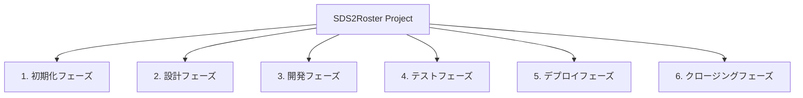
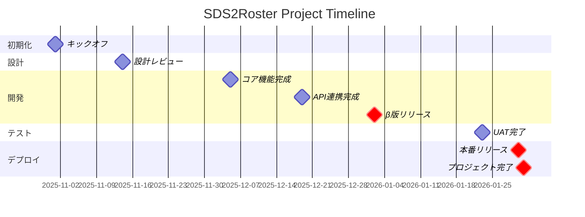
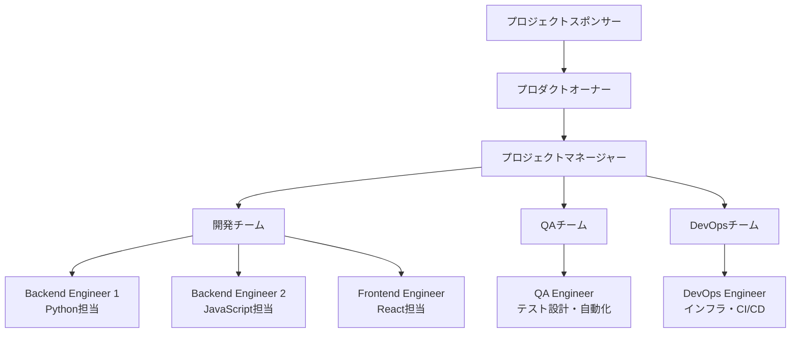
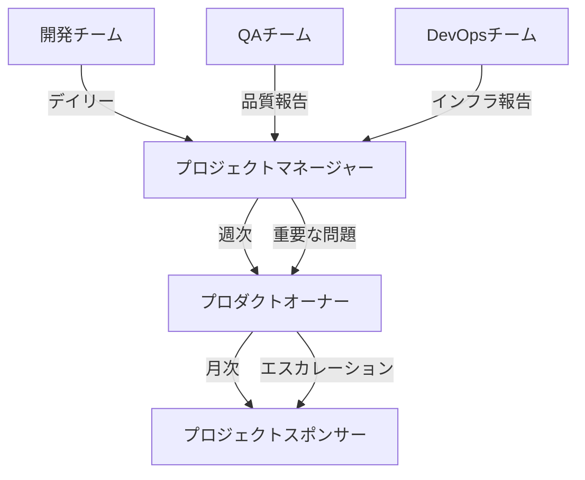
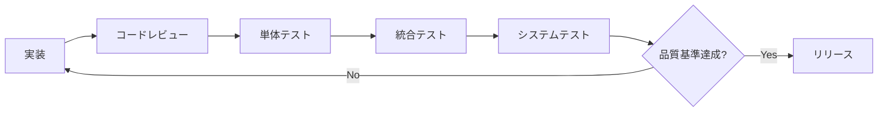
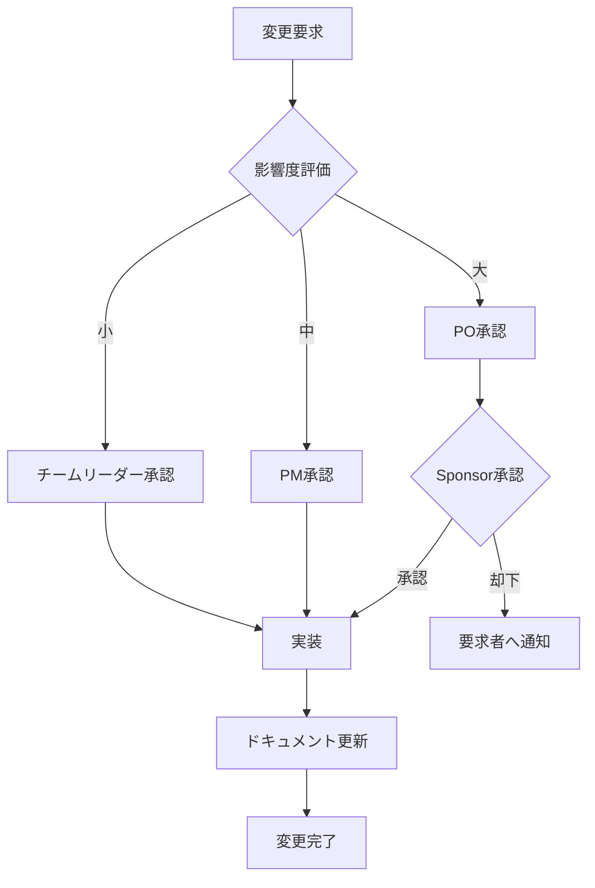

# プロジェクト管理計画書

**ドキュメントバージョン**: 1.0.0  
**作成日**: 2025-10-27  
**最終更新**: 2025-10-27  
**ステータス**: Draft

---

## 📋 概要

本ドキュメントは、SDS2Rosterプロジェクトの全体的な管理方針、スケジュール、リソース配分、コミュニケーション計画を定義します。

**対象読者**:
- プロジェクトマネージャー
- プロジェクトスポンサー
- 開発チームメンバー
- ステークホルダー

---

## 🎯 プロジェクト基本情報

### プロジェクト憲章

| 項目 | 内容 |
|------|------|
| **プロジェクト名** | SDS2Roster - School Data Sync to OneRoster Conversion Tool |
| **プロジェクトコード** | SDS2R-2025 |
| **プロジェクト期間** | 2025年11月1日〜2026年1月31日（12週間） |
| **プロジェクト予算** | 開発費: 500万円、運用費: 10万円/月 |
| **プロジェクト目標** | SDS形式CSVを自動的にOneRoster形式に変換し、APIで送信するクラウドツールを構築 |

### プロジェクト目標（SMART）

1. **Specific（具体的）**: Azure Functions基盤でSDS→OneRoster変換ツールを開発
2. **Measurable（測定可能）**: 変換精度99.9%以上、10万レコード/10分以内
3. **Achievable（達成可能）**: 実績ある技術スタック（Azure、Python、TypeScript）を使用
4. **Relevant（関連性）**: 年間480万円のコスト削減を実現
5. **Time-bound（期限付き）**: 12週間で本番リリース

---

## 📊 WBS（Work Breakdown Structure）

### レベル1: プロジェクトフェーズ



### レベル2: 作業パッケージ

#### 1. 初期化フェーズ（Week 1）
- 1.1プロジェクトキックオフ
- 1.2ステークホルダー分析
- 1.3要件定義ワークショップ
- 1.4開発環境セットアップ

#### 2. 設計フェーズ（Week 1-2）
- 2.1システムアーキテクチャ設計
- 2.2データモデル設計
- 2.3 API仕様設計
- 2.4セキュリティ設計
- 2.5データベーススキーマ設計

#### 3. 開発フェーズ（Week 2-10）
- **Sprint 1-2（Week 2-5）**: 基盤構築
  - 3.1.1 Azure環境構築（Terraform）
  - 3.1.2 CI/CDパイプライン構築
  - 3.1.3コア変換ロジック実装（Python/JS）
  - 3.1.4データバリデーション機能
  
- **Sprint 3（Week 5-6）**: API連携
  - 3.2.1 CSV Upload API統合（Python）
  - 3.2.2 CSV Upload API統合（JavaScript）
  - 3.2.3認証・認可実装（Azure AD + API Key）
  - 3.2.4エラーハンドリング
  
- **Sprint 4（Week 7-8）**: 監視と運用
  - 3.3.1 Application Insights統合
  - 3.3.2ログ記録機能
  - 3.3.3アラート設定
  - 3.3.4β版リリース
  
- **Sprint 5（Week 9-10）**: 高度な機能
  - 3.4.1バッチ処理最適化
  - 3.4.2リトライ・再実行機能
  - 3.4.3パフォーマンスチューニング
  - 3.4.4管理ダッシュボード

#### 4. テストフェーズ（Week 8-11）
- 4.1単体テスト（継続的）
- 4.2統合テスト（Week 8-9）
- 4.3システムテスト（Week 10）
- 4.4パフォーマンステスト（Week 10）
- 4.5セキュリティテスト（Week 11）
- 4.6ユーザー受入テスト（Week 11）

#### 5. デプロイフェーズ（Week 11-12）
- 5.1本番環境構築
- 5.2データ移行
- 5.3本番デプロイ
- 5.4運用手順書作成
- 5.5ユーザートレーニング

#### 6. クロージングフェーズ（Week 12）
- 6.1プロジェクト振り返り
- 6.2成果物引き渡し
- 6.3ドキュメント整備
- 6.4教訓の文書化

---

## 📅 プロジェクトスケジュール

### マスタースケジュール

| フェーズ | 開始日 | 終了日 | 期間 | 主要マイルストーン |
|---------|--------|--------|------|------------------|
| **初期化** | 2025-11-01 | 2025-11-07 | 1週間 | キックオフ完了 |
| **設計** | 2025-11-01 | 2025-11-14 | 2週間 | 設計レビュー完了 |
| **開発 Sprint 1-2** | 2025-11-08 | 2025-12-05 | 4週間 | コア機能完成 |
| **開発 Sprint 3** | 2025-12-06 | 2025-12-19 | 2週間 | API連携完成 |
| **開発 Sprint 4** | 2025-12-20 | 2026-01-02 | 2週間 | **β版リリース** |
| **開発 Sprint 5** | 2026-01-03 | 2026-01-16 | 2週間 | 高度機能完成 |
| **テスト** | 2025-12-20 | 2026-01-23 | 5週間 | UAT完了 |
| **デプロイ** | 2026-01-24 | 2026-01-30 | 1週間 | **本番リリース** |
| **クロージング** | 2026-01-27 | 2026-01-31 | 1週間 | プロジェクト完了 |

### 主要マイルストーン



### 詳細スケジュール（Sprint別）

#### Sprint 1-2（Week 2-5）: 基盤構築・コア機能

| タスク | 担当 | 開始日 | 終了日 | 依存関係 | ステータス |
|--------|------|--------|--------|---------|----------|
| Azure環境構築（Terraform） | DevOps | 2025-11-08 | 2025-11-12 | - | 予定 |
| CI/CDパイプライン | DevOps | 2025-11-13 | 2025-11-19 | Azure環境 | 予定 |
| SDS Parser実装（Python） | Backend-1 | 2025-11-08 | 2025-11-21 | - | 予定 |
| SDS Parser実装（JS） | Backend-2 | 2025-11-08 | 2025-11-21 | - | 予定 |
| OneRoster Generator実装（Python） | Backend-1 | 2025-11-22 | 2025-12-03 | SDS Parser | 予定 |
| OneRoster Generator実装（JS） | Backend-2 | 2025-11-22 | 2025-12-03 | SDS Parser | 予定 |
| バリデーション機能 | Backend-1/2 | 2025-11-25 | 2025-12-05 | Parser | 予定 |
| 単体テスト作成 | QA | 2025-11-15 | 2025-12-05 | 各機能 | 予定 |

#### Sprint 3（Week 5-6）: API連携

| タスク | 担当 | 開始日 | 終了日 | 依存関係 | ステータス |
|--------|------|--------|--------|---------|----------|
| CSV Upload API統合（Python） | Backend-1 | 2025-12-06 | 2025-12-12 | Generator | 予定 |
| CSV Upload API統合（JS） | Backend-2 | 2025-12-06 | 2025-12-12 | Generator | 予定 |
| Azure AD認証実装 | Backend-1 | 2025-12-06 | 2025-12-10 | - | 予定 |
| API Key認証実装 | Backend-2 | 2025-12-06 | 2025-12-10 | - | 予定 |
| エラーハンドリング | Backend-1/2 | 2025-12-13 | 2025-12-19 | API統合 | 予定 |
| 統合テスト | QA | 2025-12-16 | 2025-12-19 | 全機能 | 予定 |

#### Sprint 4（Week 7-8）: 監視・β版

| タスク | 担当 | 開始日 | 終了日 | 依存関係 | ステータス |
|--------|------|--------|--------|---------|----------|
| Application Insights統合 | DevOps | 2025-12-20 | 2025-12-24 | - | 予定 |
| 構造化ログ実装 | Backend-1/2 | 2025-12-20 | 2025-12-26 | - | 予定 |
| アラート設定 | DevOps | 2025-12-27 | 2026-01-02 | App Insights | 予定 |
| β版デプロイ | DevOps | 2026-01-02 | 2026-01-02 | 全機能 | 予定 |
| β版テスト | QA | 2026-01-02 | 2026-01-02 | β版デプロイ | 予定 |

#### Sprint 5（Week 9-10）: 高度機能

| タスク | 担当 | 開始日 | 終了日 | 依存関係 | ステータス |
|--------|------|--------|--------|---------|----------|
| バッチ処理最適化 | Backend-1 | 2026-01-03 | 2026-01-09 | β版 | 予定 |
| リトライ機能 | Backend-2 | 2026-01-03 | 2026-01-09 | β版 | 予定 |
| パフォーマンスチューニング | Backend-1/2 | 2026-01-10 | 2026-01-16 | 最適化 | 予定 |
| 管理ダッシュボード | Frontend | 2026-01-03 | 2026-01-16 | - | 予定 |

#### Sprint 6（Week 11-12）: テスト・デプロイ

| タスク | 担当 | 開始日 | 終了日 | 依存関係 | ステータス |
|--------|------|--------|--------|---------|----------|
| システムテスト | QA | 2026-01-17 | 2026-01-20 | 全機能 | 予定 |
| パフォーマンステスト | QA | 2026-01-17 | 2026-01-20 | 全機能 | 予定 |
| セキュリティテスト | QA | 2026-01-21 | 2026-01-23 | 全機能 | 予定 |
| UAT | ユーザー | 2026-01-21 | 2026-01-23 | 全機能 | 予定 |
| 本番環境構築 | DevOps | 2026-01-24 | 2026-01-28 | UAT完了 | 予定 |
| 本番デプロイ | DevOps | 2026-01-30 | 2026-01-30 | 本番環境 | 予定 |
| 運用手順書作成 | Tech Writer | 2026-01-27 | 2026-01-30 | - | 予定 |
| ユーザートレーニング | PM | 2026-01-29 | 2026-01-30 | 手順書 | 予定 |

---

## 👥 プロジェクト体制

### 組織図



### ロールと責任

| ロール | 氏名 | 責任 | 稼働率 |
|--------|------|------|--------|
| **プロジェクトスポンサー** | 未定 | 予算承認、意思決定、エスカレーション対応 | 5% |
| **プロダクトオーナー** | 未定 | 要件定義、優先順位付け、受入基準承認 | 20% |
| **プロジェクトマネージャー** | 未定 | 全体管理、進捗管理、リスク管理、コミュニケーション | 100% |
| **Backend Engineer 1（Python）** | 未定 | Python版実装、単体テスト、コードレビュー | 100% |
| **Backend Engineer 2（JavaScript）** | 未定 | JavaScript版実装、単体テスト、コードレビュー | 100% |
| **Frontend Engineer** | 未定 | 管理画面実装、UI/UXデザイン | 50% |
| **QA Engineer** | 未定 | テスト計画、テスト設計、自動化、品質保証 | 100% |
| **DevOps Engineer** | 未定 | インフラ構築、CI/CD、監視、運用設計 | 100% |
| **Technical Writer** | 未定 | ドキュメント作成、運用手順書作成 | 30% |

### RACI マトリックス

| アクティビティ | PM | PO | Sponsor | Backend | Frontend | QA | DevOps | Tech Writer |
|--------------|----|----|---------|---------|----------|-------|--------|-------------|
| **要件定義** | A | R | C | C | C | I | I | I |
| **設計** | A | C | I | R | R | C | R | I |
| **実装** | A | I | I | R | R | C | C | I |
| **テスト計画** | A | C | I | C | C | R | C | I |
| **テスト実行** | A | I | I | C | C | R | C | I |
| **デプロイ** | A | C | I | C | I | C | R | I |
| **ドキュメント** | A | C | I | C | C | C | C | R |
| **承認** | I | R | A | I | I | I | I | I |

**凡例**:
- R: Responsible（実行責任者）
- A: Accountable（説明責任者）
- C: Consulted（相談先）
- I: Informed（報告先）

---

## 💰 予算管理

### 予算配分

| カテゴリ | 金額 | 内訳 | 割合 |
|---------|------|------|------|
| **人件費** | 400万円 | エンジニア5名 × 12週間 | 80% |
| **インフラコスト（開発期間）** | 30万円 | Azure環境（dev/stg/prod） × 3か月 | 6% |
| **ツール・ライセンス** | 20万円 | GitHub、監視ツール、テストツール | 4% |
| **外部サービス** | 20万円 | OneRoster API連携テスト環境 | 4% |
| **トレーニング・ドキュメント** | 15万円 | ユーザートレーニング、マニュアル作成 | 3% |
| **予備費** | 15万円 | リスク対応、スコープ変更 | 3% |
| **合計** | **500万円** | - | 100% |

### 運用コスト（月額）

| カテゴリ | 金額 | 内訳 |
|---------|------|------|
| Azure Function（Premium EP2） | 4.5万円 | Python版 + JavaScript版 |
| Azure Storage | 1.5万円 | Blob Storage + Table Storage |
| Application Insights | 1.0万円 | ログ・メトリクス |
| Key Vault | 0.3万円 | シークレット管理 |
| ネットワーク転送 | 0.5万円 | データ転送料 |
| サポート | 2.2万円 | Azure基本サポート |
| **合計** | **10万円** | - |

### コスト監視

- **週次レビュー**: 実績コストと予算の比較
- **月次報告**: ステークホルダーへのコスト報告
- **アラート設定**: 予算の80%超過時に通知
- **コスト最適化**: 四半期ごとにリソース見直し

---

## 📢 コミュニケーション計画

### コミュニケーションマトリックス

| 会議/報告 | 目的 | 参加者 | 頻度 | 所要時間 | 形式 |
|----------|------|--------|------|---------|------|
| **キックオフミーティング** | プロジェクト開始宣言 | 全員 + Sponsor | 初回のみ | 2時間 | 対面 |
| **デイリースタンドアップ** | 進捗共有、課題共有 | 開発チーム + PM | 毎日 | 15分 | オンライン |
| **スプリント計画会議** | スプリント計画、タスク割り当て | 開発チーム + PO + PM | 2週間毎 | 2時間 | オンライン |
| **スプリントレビュー** | 成果物デモ、フィードバック | 開発チーム + PO + Sponsor | 2週間毎 | 1時間 | オンライン |
| **スプリント振り返り** | プロセス改善 | 開発チーム + PM | 2週間毎 | 1時間 | オンライン |
| **ステアリング委員会** | 意思決定、リスク対応 | PM + PO + Sponsor | 月1回 | 1時間 | 対面 |
| **週次進捗報告** | 進捗、課題、リスク報告 | PM → PO + Sponsor | 毎週金曜 | - | メール |
| **技術レビュー** | 設計・コードレビュー | 開発チーム | 随時 | 1-2時間 | オンライン |

### 報告体制



### コミュニケーションツール

| ツール | 用途 | 対象者 |
|--------|------|--------|
| **Microsoft Teams** | チャット、ビデオ会議 | 全員 |
| **Azure DevOps** | タスク管理、バックログ | 開発チーム |
| **GitHub** | コード管理、Pull Request | 開発チーム |
| **Confluence** | ドキュメント共有 | 全員 |
| **メール** | 正式な報告、承認依頼 | PM、PO、Sponsor |

### エスカレーションパス

| レベル | 対象事項 | 対応者 | 対応時間 |
|--------|---------|--------|---------|
| **レベル1** | タスクの遅延、技術的な問題 | チームリーダー | 1営業日 |
| **レベル2** | スプリント目標未達、リソース不足 | プロジェクトマネージャー | 2営業日 |
| **レベル3** | スコープ変更、予算超過 | プロダクトオーナー | 3営業日 |
| **レベル4** | プロジェクト中止検討、重大リスク | プロジェクトスポンサー | 5営業日 |

---

## 📋 品質管理

### 品質目標

| 品質特性 | 目標値 | 測定方法 |
|---------|--------|---------|
| **機能性** | 全機能要件100%実装 | 機能チェックリスト |
| **信頼性** | 変換精度 99.9%以上 | データ検証テスト |
| **パフォーマンス** | 10万レコード/10分以内 | 負荷テスト |
| **保守性** | コードカバレッジ 80%以上 | 単体テスト |
| **セキュリティ** | 脆弱性ゼロ | セキュリティスキャン |

### 品質保証プロセス



### レビュー計画

| レビュー種別 | タイミング | 参加者 | 基準 |
|------------|-----------|--------|------|
| **要件レビュー** | 設計フェーズ開始前 | PO、PM、開発チーム | 要件の明確性、完全性 |
| **設計レビュー** | 実装開始前 | 開発チーム全員 | アーキテクチャ整合性、拡張性 |
| **コードレビュー** | Pull Request毎 | 他の開発者 | コーディング規約、ベストプラクティス |
| **テストレビュー** | テスト実行前 | QA、開発チーム | テストカバレッジ、品質基準 |

---

## 📊 進捗管理

### 進捗測定方法

#### EVM（Earned Value Management）

| 指標 | 説明 | 計算式 |
|------|------|--------|
| **PV（計画価値）** | 計画されたコスト | スケジュール通りの予算 |
| **EV（出来高）** | 完了した作業の価値 | 完了率 × 予算 |
| **AC（実コスト）** | 実際に使用したコスト | 実績コスト |
| **SV（スケジュール差異）** | スケジュール遅延/先行 | EV - PV |
| **CV（コスト差異）** | コスト超過/節約 | EV - AC |
| **SPI（スケジュール効率指数）** | スケジュール効率 | EV / PV |
| **CPI（コスト効率指数）** | コスト効率 | EV / AC |

**健全性基準**:
- SPI ≥ 0.95: スケジュール健全
- CPI ≥ 0.95: コスト健全

#### ベロシティ（スプリント別）

| Sprint | 計画ポイント | 完了ポイント | ベロシティ | 累積ベロシティ |
|--------|------------|------------|----------|--------------|
| Sprint 1-2 | 40 | - | - | - |
| Sprint 3 | 25 | - | - | - |
| Sprint 4 | 30 | - | - | - |
| Sprint 5 | 25 | - | - | - |
| Sprint 6 | 20 | - | - | - |

### 進捗報告フォーマット

#### 週次進捗報告

```
【週次進捗報告】 Week X (YYYY-MM-DD ~ YYYY-MM-DD)

1. 今週の実績
   - 完了したタスク: [タスクリスト]
   - 進行中のタスク: [タスクリスト]

2. 来週の予定
   - 計画タスク: [タスクリスト]

3. 課題・リスク
   - [課題1]: 影響度、対応策
   - [課題2]: 影響度、対応策

4. KPI
   - スケジュール効率指数（SPI）: X.XX
   - コスト効率指数（CPI）: X.XX
   - ベロシティ: XX ポイント

5. 意思決定事項
   - [決定事項1]
   - [決定事項2]
```

---

## 🎓 ステークホルダー管理

### ステークホルダー分析

| ステークホルダー | 影響力 | 関心度 | 戦略 | エンゲージメント方法 |
|----------------|--------|--------|------|-------------------|
| **プロジェクトスポンサー** | 高 | 高 | 密接な管理 | 月次報告、重要決定時の相談 |
| **プロダクトオーナー** | 高 | 高 | 密接な管理 | 週次報告、スプリントレビュー |
| **システム管理者** | 中 | 高 | 満足維持 | 運用設計への参加、トレーニング |
| **学校IT担当者** | 中 | 中 | 情報提供 | β版テスト、フィードバック収集 |
| **連携アプリ開発者** | 中 | 中 | 情報提供 | API仕様共有、統合テスト |
| **開発チーム** | 高 | 高 | 密接な管理 | デイリースタンドアップ、レビュー |

### ステークホルダーマップ

```
     影響力
       ↑
   高  │  [Sponsor]       [PO]
       │  [開発チーム]
       │
   中  │  [管理者]        [IT担当]
       │                  [アプリ開発者]
       │
   低  │
       └─────────────────────→ 関心度
         低      中      高
```

---

## 🎯 成功基準

### プロジェクト成功指標

| 指標 | 目標 | 測定時期 | 測定方法 |
|------|------|---------|---------|
| **スケジュール遵守** | 2026-01-30までにリリース | プロジェクト完了時 | 実績日vs計画日 |
| **予算遵守** | 500万円以内 | プロジェクト完了時 | 実績コストvs予算 |
| **品質達成** | 全品質基準クリア | UAT完了時 | テスト結果 |
| **ステークホルダー満足度** | 4.0/5.0以上 | プロジェクト完了後 | アンケート |
| **ROI** | 11か月で回収 | 運用1年後 | コスト削減実績 |

### 完了基準

#### スプリント完了基準
- [ ] 全計画タスクが完了（Done）
- [ ] コードレビュー完了
- [ ] 単体テスト合格（カバレッジ80%以上）
- [ ] 統合テスト合格
- [ ] ドキュメント更新完了
- [ ] PO承認取得

#### プロジェクト完了基準
- [ ] 全機能要件実装完了
- [ ] 全品質基準達成
- [ ] 本番環境デプロイ成功
- [ ] UAT合格
- [ ] 運用手順書完成
- [ ] ユーザートレーニング完了
- [ ] PO・Sponsor承認取得
- [ ] プロジェクト振り返り完了

---

## 📚 関連ドキュメント

### プロジェクト管理ドキュメント
- [02_risk_management_plan.md](./02_risk_management_plan.md) - リスク管理計画書
- [03_test_plan.md](./03_test_plan.md) - テスト計画書
- [04_operations_plan.md](./04_operations_plan.md) - 運用・保守計画書

### 要件ドキュメント
- [プロジェクト概要](../requirements/01_project_overview.md)
- [機能要件定義](../requirements/02_functional_requirements.md)
- [非機能要件定義](../requirements/03_non_functional_requirements.md)

### アーキテクチャドキュメント
- [アーキテクチャ概要](../architecture/01_architecture_overview.md)
- [デプロイメント設計](../architecture/07_deployment_architecture.md)

---

## 📝 変更管理

### 変更管理プロセス



### 変更影響度基準

| 影響度 | 基準 | 承認者 | 対応期間 |
|--------|------|--------|---------|
| **小** | スケジュール影響なし、コスト増なし | チームリーダー | 1週間 |
| **中** | スケジュール1週間以内の遅延、コスト10万円以内 | PM | 2週間 |
| **大** | スケジュール1週間超の遅延、コスト10万円超 | PO + Sponsor | 1か月 |

---

## 🔍 承認

| 役割 | 氏名 | 署名 | 日付 |
|------|------|------|------|
| プロジェクトマネージャー | 未定 | - | - |
| プロダクトオーナー | 未定 | - | - |
| プロジェクトスポンサー | 未定 | - | - |

---

## 📝 変更履歴

| バージョン | 日付 | 変更内容 | 変更者 |
|-----------|------|---------|--------|
| 1.0.0 | 2025-10-27 | 初版作成 | Project Manager |

---

## 付録

### 用語集

| 用語 | 説明 |
|------|------|
| **SDS** | School Data Sync - Microsoft提供の学校データ同期サービス |
| **OneRoster** | 教育データ標準仕様（IMS Global） |
| **WBS** | Work Breakdown Structure - 作業分解構造 |
| **EVM** | Earned Value Management - 出来高管理 |
| **RACI** | Responsible, Accountable, Consulted, Informed - 責任分担マトリックス |

### 参考資料

- [PMBOKガイド](https://www.pmi.org/pmbok-guide-standards)
- [Agile実践ガイド](https://www.pmi.org/pmbok-guide-standards/practice-guides/agile)
- [Azureプロジェクト管理ベストプラクティス](https://learn.microsoft.com/azure/architecture/framework/)
