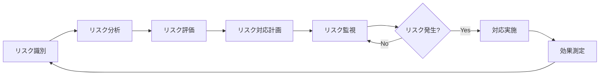
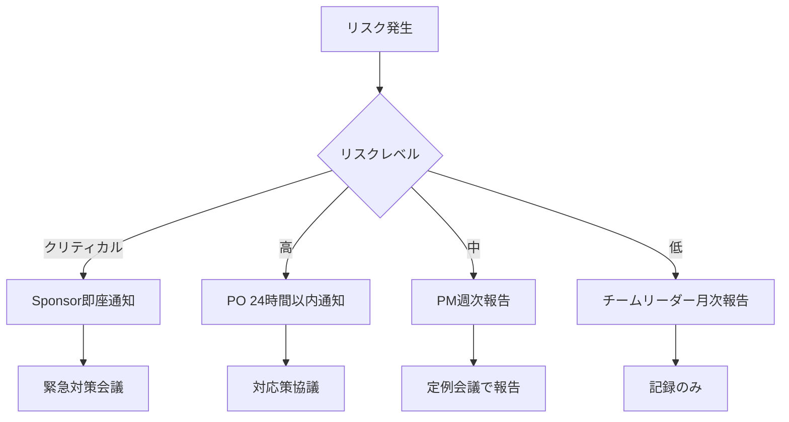

# リスク管理計画書

**ドキュメントバージョン**: 1.0.0  
**作成日**: 2025-10-27  
**最終更新**: 2025-10-27  
**ステータス**: Draft

---

## 📋 概要

本ドキュメントは、SDS2Rosterプロジェクトにおけるリスクの識別、分析、対応戦略、監視プロセスを定義します。

**対象読者**:
- プロジェクトマネージャー
- プロジェクトスポンサー
- 開発チーム
- ステークホルダー

---

## 🎯 リスク管理の目的

### 目的
1. **プロアクティブなリスク管理**: 問題が発生する前に対策を講じる
2. **影響の最小化**: リスク発生時の影響を最小限に抑える
3. **意思決定の支援**: リスク情報に基づく適切な意思決定
4. **ステークホルダーへの透明性**: リスク状況を共有し信頼を構築

### スコープ
- プロジェクト期間中のすべてのリスク
- 技術、スケジュール、コスト、リソース、外部依存関係に関するリスク
- リスク発生後の対応戦略

---

## 📊 リスク管理プロセス



### プロセス詳細

| フェーズ | アクティビティ | 担当者 | 頻度 |
|---------|--------------|--------|------|
| **リスク識別** | 潜在的なリスクの洗い出し | 全チーム | 週次 |
| **リスク分析** | 発生確率と影響度の評価 | PM + チームリーダー | 週次 |
| **リスク評価** | 優先順位付け | PM | 週次 |
| **リスク対応計画** | 対応戦略の策定 | PM + 関係者 | 必要に応じて |
| **リスク監視** | リスク状況の追跡 | PM | 日次 |

---

## 📈 リスク評価基準

### 発生確率

| レベル | 確率 | 説明 |
|--------|------|------|
| **5 - 非常に高い** | >80% | ほぼ確実に発生する |
| **4 - 高い** | 60-80% | 発生する可能性が高い |
| **3 - 中程度** | 40-60% | 発生する可能性がある |
| **2 - 低い** | 20-40% | 発生する可能性は低い |
| **1 - 非常に低い** | <20% | 発生する可能性は極めて低い |

### 影響度

| レベル | 説明 | スケジュール影響 | コスト影響 | 品質影響 |
|--------|------|----------------|-----------|---------|
| **5 - 致命的** | プロジェクト失敗 | >4週間遅延 | >100万円超過 | 使用不可能 |
| **4 - 重大** | 主要目標未達 | 2-4週間遅延 | 50-100万円超過 | 大幅な品質低下 |
| **3 - 中程度** | 一部目標未達 | 1-2週間遅延 | 20-50万円超過 | 顕著な品質低下 |
| **2 - 軽微** | 軽微な影響 | 数日遅延 | 10-20万円超過 | わずかな品質低下 |
| **1 - 無視できる** | ほとんど影響なし | 遅延なし | <10万円超過 | 品質影響なし |

### リスクスコア

**リスクスコア = 発生確率 × 影響度**

| スコア | リスクレベル | 対応方針 |
|--------|------------|---------|
| **20-25** | 🔴 クリティカル | 即座に対応、エスカレーション |
| **15-19** | 🟠 高 | 優先的に対応計画策定 |
| **8-14** | 🟡 中 | 対応計画策定、監視 |
| **4-7** | 🟢 低 | 定期監視 |
| **1-3** | ⚪ 無視可能 | 記録のみ |

---

## 🚨 リスク登録簿

### リスク一覧

#### R001: CSV Upload API開発遅延

| 項目 | 内容 |
|------|------|
| **リスクID** | R001 |
| **カテゴリ** | 外部依存 |
| **説明** | CSV Upload APIの開発が遅延し、統合テストが実施できない |
| **発生確率** | 4（高い：60-80%） |
| **影響度** | 4（重大：2-4週間遅延） |
| **リスクスコア** | **16（🟠 高）** |
| **トリガー条件** | API仕様確定が1週間以上遅延、エンドポイント未提供 |
| **対応戦略** | **緩和（Mitigate）** |
| **対応策** | 1. モックAPIを早期に作成<br>2. API仕様を先行して確定<br>3. 並行開発体制の構築<br>4. 週次進捗確認ミーティング |
| **コンティンジェンシープラン** | 1. 簡易版APIを自前で実装<br>2. ファイル出力のみで先行リリース |
| **対応コスト** | 20万円（モックAPI開発） |
| **担当者** | PM + Backend Engineer |
| **ステータス** | 🟡 監視中 |
| **最終更新** | 2025-10-27 |

---

#### R002: Azure環境構築の遅延

| 項目 | 内容 |
|------|------|
| **リスクID** | R002 |
| **カテゴリ** | 技術 |
| **説明** | Azure環境のセットアップやTerraformコードの問題で構築が遅延 |
| **発生確率** | 3（中程度：40-60%） |
| **影響度** | 3（中程度：1-2週間遅延） |
| **リスクスコア** | **9（🟡 中）** |
| **トリガー条件** | Terraform Apply失敗、権限不足、リソース制限 |
| **対応戦略** | **緩和（Mitigate）** |
| **対応策** | 1. 事前にAzure環境の権限確認<br>2. Terraformコードの段階的テスト<br>3. DevOpsエンジニアのスキルアップ<br>4. Azureサポート契約の確保 |
| **コンティンジェンシープラン** | 1. 手動でリソース作成<br>2. 外部コンサルタント起用 |
| **対応コスト** | 10万円（サポート契約） |
| **担当者** | DevOps Engineer |
| **ステータス** | 🟡 監視中 |
| **最終更新** | 2025-10-27 |

---

#### R003: データ変換精度の問題

| 項目 | 内容 |
|------|------|
| **リスクID** | R003 |
| **カテゴリ** | 品質 |
| **説明** | SDS→OneRoster変換ロジックに不具合があり、変換精度99.9%を達成できない |
| **発生確率** | 3（中程度：40-60%） |
| **影響度** | 4（重大：品質目標未達） |
| **リスクスコア** | **12（🟡 中）** |
| **トリガー条件** | テストで精度99%未満、データバリデーション失敗 |
| **対応戦略** | **緩和（Mitigate）** |
| **対応策** | 1. 十分なテストデータの準備<br>2. 段階的な変換ロジックの実装とテスト<br>3. コードレビューの徹底<br>4. 自動テストの充実 |
| **コンティンジェンシープラン** | 1. 手動検証プロセスの追加<br>2. 変換後のデータクレンジング機能 |
| **対応コスト** | 15万円（追加テスト工数） |
| **担当者** | Backend Engineer + QA |
| **ステータス** | 🟡 監視中 |
| **最終更新** | 2025-10-27 |

---

#### R004: パフォーマンス目標未達

| 項目 | 内容 |
|------|------|
| **リスクID** | R004 |
| **カテゴリ** | 技術 |
| **説明** | 10万レコード/10分の処理速度目標を達成できない |
| **発生確率** | 3（中程度：40-60%） |
| **影響度** | 3（中程度：非機能要件未達） |
| **リスクスコア** | **9（🟡 中）** |
| **トリガー条件** | 負荷テストで処理時間が15分超過 |
| **対応戦略** | **緩和（Mitigate）** |
| **対応策** | 1. 早期のパフォーマンステスト実施<br>2. バッチ処理の並列化<br>3. Azure Functions Premium Planへの変更<br>4. データ処理アルゴリズムの最適化 |
| **コンティンジェンシープラン** | 1. 段階的な処理（複数回に分割）<br>2. インスタンスのスケールアップ |
| **対応コスト** | 25万円（Premium Plan差額） |
| **担当者** | Backend Engineer |
| **ステータス** | 🟡 監視中 |
| **最終更新** | 2025-10-27 |

---

#### R005: キーメンバーの離脱

| 項目 | 内容 |
|------|------|
| **リスクID** | R005 |
| **カテゴリ** | リソース |
| **説明** | コアメンバー（Backend Engineer、DevOps）が急遽離脱する |
| **発生確率** | 2（低い：20-40%） |
| **影響度** | 5（致命的：プロジェクト継続困難） |
| **リスクスコア** | **10（🟡 中）** |
| **トリガー条件** | メンバーの体調不良、退職、他プロジェクトへの異動 |
| **対応戦略** | **移転（Transfer）** |
| **対応策** | 1. ナレッジの文書化（ドキュメント整備）<br>2. ペアプログラミングでスキル共有<br>3. コードレビューによる知識分散<br>4. バックアップ要員の確保 |
| **コンティンジェンシープラン** | 1. 外部ベンダーの起用<br>2. 他プロジェクトからの応援要請 |
| **対応コスト** | 50万円（外部委託） |
| **担当者** | PM |
| **ステータス** | 🟢 低リスク |
| **最終更新** | 2025-10-27 |

---

#### R006: セキュリティ脆弱性の発見

| 項目 | 内容 |
|------|------|
| **リスクID** | R006 |
| **カテゴリ** | セキュリティ |
| **説明** | 開発後にセキュリティ脆弱性が発見され、大規模な修正が必要 |
| **発生確率** | 2（低い：20-40%） |
| **影響度** | 4（重大：2週間以上の修正） |
| **リスクスコア** | **8（🟡 中）** |
| **トリガー条件** | セキュリティスキャンでHigh/Criticalの脆弱性検出 |
| **対応戦略** | **緩和（Mitigate）** |
| **対応策** | 1. 開発初期からセキュアコーディング<br>2. 定期的なセキュリティスキャン（Trivy、Snyk）<br>3. コードレビューでのセキュリティチェック<br>4. Azure AD、Key Vaultなどセキュアなサービス利用 |
| **コンティンジェンシープラン** | 1. 専門家によるセキュリティ監査<br>2. 脆弱性修正の優先実施 |
| **対応コスト** | 30万円（監査費用） |
| **担当者** | Backend Engineer |
| **ステータス** | 🟡 監視中 |
| **最終更新** | 2025-10-27 |

---

#### R007: 予算超過

| 項目 | 内容 |
|------|------|
| **リスクID** | R007 |
| **カテゴリ** | コスト |
| **説明** | 開発期間延長やスコープ拡大により予算500万円を超過 |
| **発生確率** | 3（中程度：40-60%） |
| **影響度** | 3（中程度：20-50万円超過） |
| **リスクスコア** | **9（🟡 中）** |
| **トリガー条件** | 累計コストが予算の80%超過、追加要件の発生 |
| **対応戦略** | **回避（Avoid）** |
| **対応策** | 1. 週次でのコスト監視<br>2. スコープ変更管理の徹底<br>3. 予備費（15万円）の確保<br>4. 優先順位に基づく機能削減の検討 |
| **コンティンジェンシープラン** | 1. Phase 2への機能延期<br>2. スポンサーへの追加予算申請 |
| **対応コスト** | 予備費15万円 |
| **担当者** | PM |
| **ステータス** | 🟡 監視中 |
| **最終更新** | 2025-10-27 |

---

#### R008: OneRoster仕様変更

| 項目 | 内容 |
|------|------|
| **リスクID** | R008 |
| **カテゴリ** | 外部依存 |
| **説明** | OneRoster v1.2仕様が変更され、実装の見直しが必要 |
| **発生確率** | 2（低い：20-40%） |
| **影響度** | 3（中程度：1-2週間の修正） |
| **リスクスコア** | **6（🟢 低）** |
| **トリガー条件** | IMS GlobalからOneRoster仕様更新のアナウンス |
| **対応戦略** | **受容（Accept）** |
| **対応策** | 1. OneRoster仕様の定期的な確認<br>2. 変換ロジックの抽象化（変更に強い設計）<br>3. バージョン管理の実施 |
| **コンティンジェンシープラン** | 1. 旧バージョンとの互換性維持<br>2. 段階的な移行対応 |
| **対応コスト** | 10万円（修正工数） |
| **担当者** | Backend Engineer |
| **ステータス** | 🟢 低リスク |
| **最終更新** | 2025-10-27 |

---

#### R009: Azure サービス障害

| 項目 | 内容 |
|------|------|
| **リスクID** | R009 |
| **カテゴリ** | 外部依存 |
| **説明** | Azure Functions、Blob Storageなどのサービス障害でシステムが停止 |
| **発生確率** | 2（低い：20-40%） |
| **影響度** | 3（中程度：サービス停止） |
| **リスクスコア** | **6（🟢 低）** |
| **トリガー条件** | Azure Status Dashboardで障害報告 |
| **対応戦略** | **緩和（Mitigate）** |
| **対応策** | 1. Multi-Region構成の検討（Phase 2）<br>2. Azure Service Healthアラートの設定<br>3. 障害時の手動復旧手順の整備<br>4. SLA 99.9%以上のサービス選定 |
| **コンティンジェンシープラン** | 1. 手動でのバッチ処理実行<br>2. Azureサポートへのエスカレーション |
| **対応コスト** | 0円（Azureサポート契約内） |
| **担当者** | DevOps Engineer |
| **ステータス** | 🟢 低リスク |
| **最終更新** | 2025-10-27 |

---

#### R010: ユーザー受入テスト不合格

| 項目 | 内容 |
|------|------|
| **リスクID** | R010 |
| **カテゴリ** | 品質 |
| **説明** | UATでユーザーから多数の改善要求があり、リリース延期 |
| **発生確率** | 3（中程度：40-60%） |
| **影響度** | 3（中程度：1-2週間遅延） |
| **リスクスコア** | **9（🟡 中）** |
| **トリガー条件** | UAT不合格、Critical/High優先度のバグ10件以上 |
| **対応戦略** | **緩和（Mitigate）** |
| **対応策** | 1. β版での早期ユーザーフィードバック<br>2. ユーザー要件の事前確認<br>3. UIプロトタイプの作成と合意<br>4. 段階的なリリース（MVP優先） |
| **コンティンジェンシープラン** | 1. 重要機能のみ先行リリース<br>2. Phase 2での改善対応 |
| **対応コスト** | 20万円（追加工数） |
| **担当者** | PM + PO |
| **ステータス** | 🟡 監視中 |
| **最終更新** | 2025-10-27 |

---

## 📊 リスクマトリックス

### リスクマップ

```
影響度
  ↑
5 │           R005
  │
4 │   R001    R003
  │   R006
3 │   R002    R004    R007
  │   R008    R009    R010
2 │
  │
1 │
  └───────────────────→ 発生確率
    1   2   3   4   5
```

### リスクレベル別集計

| リスクレベル | 件数 | リスクID |
|------------|------|---------|
| 🔴 クリティカル（20-25） | 0件 | - |
| 🟠 高（15-19） | 1件 | R001 |
| 🟡 中（8-14） | 7件 | R002, R003, R004, R005, R006, R007, R010 |
| 🟢 低（4-7） | 2件 | R008, R009 |
| ⚪ 無視可能（1-3） | 0件 | - |

---

## 🎯 リスク対応戦略

### 戦略の種類

| 戦略 | 説明 | 適用例 |
|------|------|--------|
| **回避（Avoid）** | リスクの原因を取り除く | R007: 予算超過を防ぐため、スコープ管理を徹底 |
| **緩和（Mitigate）** | 発生確率または影響度を下げる | R001: モックAPIで開発遅延を緩和 |
| **移転（Transfer）** | リスクを第三者に移す | R005: 外部ベンダーに委託 |
| **受容（Accept）** | リスクを受け入れ、監視のみ | R008: OneRoster仕様変更は監視のみ |

---

## 📅 リスク監視計画

### 監視スケジュール

| アクティビティ | 頻度 | 担当者 | 成果物 |
|--------------|------|--------|--------|
| **リスクレビュー会議** | 週次（毎週月曜） | PM + チームリーダー | リスク登録簿更新 |
| **リスク状況報告** | 週次（毎週金曜） | PM | 週次進捗報告に含める |
| **ハイリスク監視** | 日次 | PM | リスクアラート |
| **リスク登録簿更新** | 随時 | 全チーム | リスク登録簿 |
| **リスクダッシュボード確認** | 日次 | PM | - |

### KPI（Key Performance Indicators）

| KPI | 目標値 | 測定方法 |
|-----|--------|---------|
| 新規リスク識別数 | 週1件以上 | リスク登録簿 |
| ハイリスク（スコア15+）の件数 | 0件 | リスクマトリックス |
| リスク対応完了率 | 90%以上 | 対応計画vs実績 |
| リスク発生による遅延 | 0週間 | スケジュール実績 |

---

## 🚨 エスカレーション

### エスカレーション基準

| リスクレベル | エスカレーション先 | タイミング |
|------------|-----------------|----------|
| 🔴 クリティカル | Sponsor | 即座 |
| 🟠 高 | PO | 24時間以内 |
| 🟡 中 | PM | 週次報告 |
| 🟢 低 | チームリーダー | 月次報告 |

### エスカレーションフロー



---

## 📝 リスク対応ログ

### 対応履歴テンプレート

| 日付 | リスクID | 対応内容 | 結果 | 担当者 |
|------|---------|---------|------|--------|
| - | - | - | - | - |

---

## 📚 関連ドキュメント

### プロジェクト管理ドキュメント
- [01_project_management_plan.md](./01_project_management_plan.md) - プロジェクト管理計画書
- [03_test_plan.md](./03_test_plan.md) - テスト計画書（作成予定）
- [04_operations_plan.md](./04_operations_plan.md) - 運用・保守計画書（作成予定）

### 要件ドキュメント
- [プロジェクト概要](../requirements/01_project_overview.md)
- [非機能要件定義](../requirements/03_non_functional_requirements.md)

---

## 🔍 承認

| 役割 | 氏名 | 署名 | 日付 |
|------|------|------|------|
| プロジェクトマネージャー | 未定 | - | - |
| プロダクトオーナー | 未定 | - | - |
| プロジェクトスポンサー | 未定 | - | - |

---

## 📝 変更履歴

| バージョン | 日付 | 変更内容 | 変更者 |
|-----------|------|---------|--------|
| 1.0.0 | 2025-10-27 | 初版作成、10件のリスク登録 | Project Manager |

---

## 付録A: リスク識別チェックリスト

### 技術リスク
- [ ] 技術的な実現可能性
- [ ] パフォーマンス要件達成
- [ ] 技術的な複雑性
- [ ] 新技術の採用
- [ ] 外部サービスの依存

### スケジュールリスク
- [ ] 見積もりの正確性
- [ ] 依存関係の複雑性
- [ ] リソースの可用性
- [ ] マイルストーンの実現性

### コストリスク
- [ ] 見積もりの精度
- [ ] スコープ変更
- [ ] Azureコストの変動
- [ ] 外部委託費用

### リソースリスク
- [ ] 人材の確保
- [ ] スキルセットの適合性
- [ ] キーメンバーの離脱
- [ ] 他プロジェクトとのリソース競合

### 外部リスク
- [ ] API開発の遅延
- [ ] 仕様変更
- [ ] ベンダーの問題
- [ ] Azureサービスの障害

### 品質リスク
- [ ] テストカバレッジ不足
- [ ] 品質基準の達成
- [ ] ユーザー受入テスト
- [ ] セキュリティ脆弱性

---

## 付録B: 用語集

| 用語 | 説明 |
|------|------|
| **リスク** | プロジェクト目標に悪影響を与える可能性のある不確実な事象 |
| **リスクスコア** | 発生確率×影響度で算出される優先度指標 |
| **緩和** | リスクの発生確率または影響度を下げる対応策 |
| **コンティンジェンシープラン** | リスク発生時の具体的な対応計画 |
| **トリガー** | リスクが顕在化する兆候や条件 |
