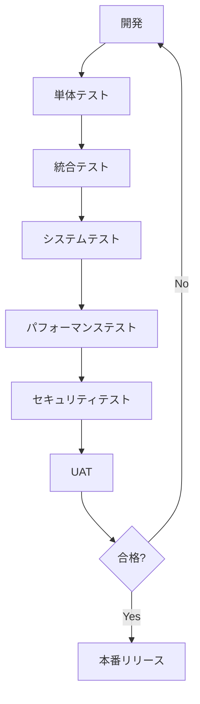
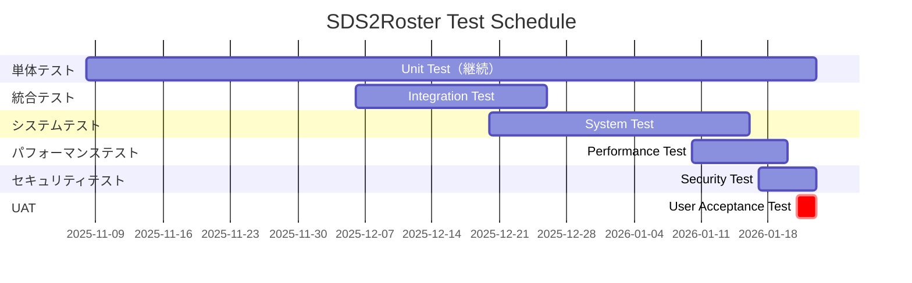
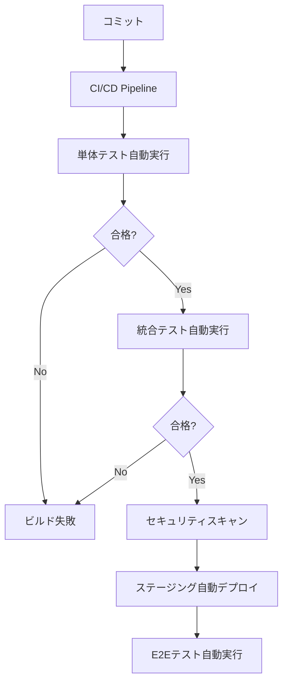

# テスト計画書

**ドキュメントバージョン**: 1.0.0  
**作成日**: 2025-10-27  
**最終更新**: 2025-10-27  
**ステータス**: Draft

---

## 📋 概要

本ドキュメントは、SDS2Rosterプロジェクトにおけるテスト戦略、テスト種別、スケジュール、合格基準、自動化計画を定義します。

**対象読者**:
- QAエンジニア
- 開発チーム
- プロジェクトマネージャー
- ステークホルダー

---

## 🎯 テストの目的

### 主要目的
1. **品質保証**: 全機能要件・非機能要件の実装を検証
2. **不具合の早期発見**: 開発初期段階からの継続的テスト
3. **リグレッション防止**: 既存機能の品質維持
4. **本番環境の安全性**: 安心してリリースできる品質レベルの確保

### 品質目標

| 品質特性 | 目標値 | 測定方法 |
|---------|--------|---------|
| **機能性** | 100%の要件実装 | 機能テスト合格率 |
| **信頼性** | 変換精度99.9%以上 | データ検証テスト |
| **パフォーマンス** | 10万レコード/10分以内 | 負荷テスト |
| **可用性** | 99.9%以上 | システム稼働率 |
| **セキュリティ** | 脆弱性ゼロ | セキュリティスキャン |
| **保守性** | コードカバレッジ80%以上 | 単体テスト |

---

## 📊 テスト戦略

### テストアプローチ



### テストレベル

| テストレベル | 目的 | 実施者 | 自動化率 | タイミング |
|------------|------|--------|---------|----------|
| **単体テスト** | 関数・メソッドレベルの検証 | 開発者 | 90%以上 | 実装直後 |
| **統合テスト** | モジュール間連携の検証 | 開発者・QA | 80%以上 | Sprint終了時 |
| **システムテスト** | エンドツーエンドの検証 | QA | 60%以上 | Sprint 4-5 |
| **パフォーマンステスト** | 性能要件の検証 | QA | 100% | Sprint 5 |
| **セキュリティテスト** | 脆弱性の検証 | QA・外部 | 80%以上 | Sprint 5-6 |
| **UAT** | ユーザー受け入れ検証 | ユーザー | 0% | Sprint 6 |

---

## 🧪 テスト種別

### 1. 単体テスト（Unit Testing）

#### 対象
- Python関数（SDS Parser、OneRoster Generator、Validator）
- JavaScript関数（SDS Parser、OneRoster Generator、Validator）
- ユーティリティ関数

#### テストフレームワーク
- **Python**: pytest、pytest-cov
- **JavaScript**: Jest、@azure/functions-test

#### カバレッジ目標
- **ライン カバレッジ**: 80%以上
- **ブランチカバレッジ**: 75%以上
- **関数カバレッジ**: 90%以上

#### テストケース例

```python
# Python単体テストの例
def test_sds_parser_valid_data():
    """SDSパーサーが正常なデータを正しく解析できることを検証"""
    sds_data = "id,firstName,lastName\n1,John,Doe"
    parser = SDSParser()
    result = parser.parse_users(sds_data)
    
    assert len(result) == 1
    assert result[0]['firstName'] == 'John'
    assert result[0]['lastName'] == 'Doe'

def test_oneroster_generator_user():
    """OneRoster Generatorがユーザーデータを正しく生成できることを検証"""
    sds_user = {'id': '1', 'firstName': 'John', 'lastName': 'Doe'}
    generator = OneRosterGenerator()
    result = generator.generate_user(sds_user)
    
    assert result['sourcedId'] == '1'
    assert result['givenName'] == 'John'
    assert result['familyName'] == 'Doe'
```

---

### 2. 統合テスト（Integration Testing）

#### 対象
- Blob Storage → Azure Function連携
- Azure Function → CSV Upload API連携
- Azure Function → Table Storage連携
- Key Vault統合

#### テストシナリオ

| ID | シナリオ | 検証項目 |
|----|---------|---------|
| IT-001 | ファイルアップロード→Function起動 | Blob Storageイベントトリガーの動作 |
| IT-002 | SDS→OneRoster変換 | 全ファイル種別の変換処理 |
| IT-003 | バリデーション | 不正データの検出とエラーハンドリング |
| IT-004 | API送信 | CSV Upload API呼び出し成功 |
| IT-005 | ログ記録 | Table Storageへのジョブ履歴保存 |
| IT-006 | Key Vault連携 | APIキー・エンドポイントの取得 |

#### テストデータ

```
テストデータセット:
├── valid/
│   ├── users.csv（100件）
│   ├── orgs.csv（10件）
│   └── enrollments.csv（500件）
├── invalid/
│   ├── missing_required_fields.csv
│   ├── invalid_format.csv
│   └── duplicate_ids.csv
└── edge_cases/
    ├── empty_file.csv
    ├── large_file.csv（10万レコード）
    └── special_characters.csv
```

---

### 3. システムテスト（System Testing）

#### 対象
- エンドツーエンドのビジネスフロー
- 全機能要件の検証

#### テストケース一覧

| ID | テストケース | 事前条件 | 手順 | 期待結果 |
|----|------------|---------|------|---------|
| ST-001 | 通常変換フロー | SDSファイル準備 | 1. ファイルアップロード<br>2. 変換完了を待つ<br>3. API送信確認 | 正常に変換・送信完了 |
| ST-002 | 複数ファイル同時処理 | 5ファイル準備 | 同時アップロード | 全ファイルが正常処理 |
| ST-003 | バリデーションエラー | 不正データ準備 | アップロード | エラー通知、ログ記録 |
| ST-004 | API送信失敗時のリトライ | APIモックで失敗設定 | アップロード | 3回リトライ後、失敗ログ |
| ST-005 | 変換履歴の確認 | 過去の実行履歴 | ダッシュボード確認 | 正しい履歴表示 |

---

### 4. パフォーマンステスト（Performance Testing）

#### 目標値

| メトリクス | 目標値 | 許容値 |
|----------|--------|--------|
| **処理速度** | 10万レコード/10分以内 | 12分以内 |
| **同時実行数** | 10ファイル同時処理 | 8ファイル以上 |
| **メモリ使用量** | Function 1GB以下 | 1.5GB以下 |
| **API応答時間** | 平均500ms以下 | 1秒以下 |
| **スループット** | 1000レコード/秒 | 800レコード/秒 |

#### テストツール
- **Apache JMeter**: 負荷テスト
- **Azure Load Testing**: Azureネイティブ負荷テスト
- **Application Insights**: リアルタイムモニタリング

#### テストシナリオ

```yaml
負荷テストシナリオ1: 通常負荷
- 仮想ユーザー数: 10
- ランプアップ時間: 5分
- 実行時間: 30分
- ファイルサイズ: 10,000レコード/ファイル

負荷テストシナリオ2: ピーク負荷
- 仮想ユーザー数: 50
- ランプアップ時間: 10分
- 実行時間: 60分
- ファイルサイズ: 50,000レコード/ファイル

負荷テストシナリオ3: スパイク負荷
- 仮想ユーザー数: 0→100→0
- スパイク時間: 5分
- ファイルサイズ: 5,000レコード/ファイル
```

---

### 5. セキュリティテスト（Security Testing）

#### テスト項目

| カテゴリ | テスト項目 | ツール |
|---------|----------|--------|
| **静的解析** | コード脆弱性スキャン | Trivy、Snyk |
| **依存関係** | パッケージ脆弱性チェック | npm audit、pip audit |
| **認証・認可** | Azure AD認証、API Key検証 | 手動テスト |
| **データ保護** | 暗号化、TLS通信 | Burp Suite |
| **アクセス制御** | RBAC、Key Vault権限 | 手動テスト |
| **ログ監査** | 監査ログの完全性 | 手動テスト |

#### 脆弱性スキャン

```bash
# Trivy（コンテナイメージスキャン）
trivy image --severity HIGH,CRITICAL <image>

# Snyk（依存関係スキャン）
snyk test

# OWASP ZAP（動的スキャン）
zap-cli quick-scan https://func-sds2roster-prod.azurewebsites.net
```

#### セキュリティチェックリスト

- [ ] HTTPS通信のみ使用
- [ ] API Keyの安全な保管（Key Vault）
- [ ] 認証・認可の実装
- [ ] SQLインジェクション対策（該当なし：CSVのみ）
- [ ] XSS対策（該当なし：Web UIなし）
- [ ] CSRF対策（該当なし：APIのみ）
- [ ] 機密情報のログ出力禁止
- [ ] アクセスログの記録

---

### 6. ユーザー受入テスト（UAT）

#### 目的
- ビジネス要件の充足確認
- ユーザビリティの検証
- 本番環境での動作確認

#### 参加者
- 学校IT担当者（2-3名）
- システム管理者（1-2名）
- プロダクトオーナー
- QAエンジニア

#### テストシナリオ

| シナリオID | シナリオ | 成功基準 |
|-----------|---------|---------|
| UAT-001 | 実際のSDSファイルをアップロード | 正常に変換・送信完了 |
| UAT-002 | エラーファイルのアップロード | 適切なエラーメッセージ表示 |
| UAT-003 | 変換履歴の確認 | 履歴が正しく表示される |
| UAT-004 | 大容量ファイルの処理 | 10分以内に完了 |
| UAT-005 | 複数ファイルの同時処理 | すべて正常処理 |

#### UAT環境
- **環境**: 本番同等のステージング環境
- **期間**: 2025-01-21〜2025-01-23（3日間）
- **データ**: 実データ（匿名化済み）

---

## 📅 テストスケジュール

### テストタイムライン

| フェーズ | 期間 | テスト種別 | 担当 |
|---------|------|-----------|------|
| **Sprint 1-2** | Week 2-5 | 単体テスト（継続） | 開発者 |
| **Sprint 3** | Week 5-6 | 単体テスト（継続）<br>統合テスト開始 | 開発者・QA |
| **Sprint 4** | Week 7-8 | 単体テスト（継続）<br>統合テスト<br>システムテスト開始 | 開発者・QA |
| **Sprint 5** | Week 9-10 | システムテスト<br>パフォーマンステスト | QA |
| **Sprint 6** | Week 11-12 | セキュリティテスト<br>UAT | QA・外部・ユーザー |

### 詳細スケジュール



---

## ✅ 合格基準

### テストレベル別合格基準

| テストレベル | 合格基準 |
|------------|---------|
| **単体テスト** | • カバレッジ80%以上<br>• すべてのテストケース合格<br>• Critical/High優先度のバグゼロ |
| **統合テスト** | • すべてのシナリオ合格<br>• API連携成功率99%以上<br>• Critical/Highバグゼロ |
| **システムテスト** | • 全機能要件の検証完了<br>• Critical/Highバグゼロ<br>• Medium以下のバグは対応計画策定 |
| **パフォーマンステスト** | • 処理速度目標達成（10万レコード/10分）<br>• メモリ使用量1GB以下<br>• API応答時間500ms以下 |
| **セキュリティテスト** | • High/Critical脆弱性ゼロ<br>• Medium以下は対応計画策定<br>• セキュリティチェックリスト完了 |
| **UAT** | • すべてのシナリオ合格<br>• ユーザー満足度4.0/5.0以上<br>• Critical/Highバグゼロ |

### 不具合優先度基準

| 優先度 | 説明 | 対応期限 |
|--------|------|---------|
| **Critical** | システム停止、データ損失 | 即座（24時間以内） |
| **High** | 主要機能が使用不可 | 1週間以内 |
| **Medium** | 軽微な機能不具合 | 次Sprint |
| **Low** | 改善要望、UI微調整 | Phase 2 |

---

## 🤖 テスト自動化

### 自動化戦略



### 自動化ツール

| 用途 | ツール | 対象 |
|------|--------|------|
| **単体テスト** | pytest、Jest | Python、JavaScript |
| **統合テスト** | pytest、Jest | API連携、Storage連携 |
| **E2Eテスト** | Playwright | エンドツーエンド |
| **負荷テスト** | Azure Load Testing | パフォーマンス |
| **セキュリティスキャン** | Trivy、Snyk | 脆弱性検出 |
| **CI/CD** | GitHub Actions | 自動テスト実行 |

### CI/CDパイプライン統合

```yaml
# .github/workflows/test.yml（抜粋）
name: Test Pipeline

on: [push, pull_request]

jobs:
  unit-test:
    runs-on: ubuntu-latest
    steps:
      - uses: actions/checkout@v4
      
      # Python単体テスト
      - name: Run Python tests
        run: |
          cd src/python
          pytest --cov=. --cov-report=xml
      
      # JavaScript単体テスト
      - name: Run JS tests
        run: |
          cd src/javascript
          npm test -- --coverage
      
      # カバレッジ確認
      - name: Check coverage
        run: |
          if [ $(cat coverage.xml | grep 'line-rate' | cut -d'"' -f2 | awk '{print $1*100}') -lt 80 ]; then
            echo "Coverage below 80%"
            exit 1
          fi
  
  integration-test:
    needs: unit-test
    runs-on: ubuntu-latest
    steps:
      - name: Run integration tests
        run: |
          pytest tests/integration
```

---

## 📊 テストメトリクス

### トラッキング指標

| メトリクス | 目標値 | 測定方法 |
|----------|--------|---------|
| **テストカバレッジ** | 80%以上 | pytest-cov、Jest |
| **テスト合格率** | 100% | テスト実行結果 |
| **不具合検出率** | 早期検出80%以上 | 不具合発見フェーズ |
| **不具合再発率** | 5%以下 | リグレッションテスト |
| **自動化率** | 75%以上 | 自動テストケース数 |

### レポート

#### 日次レポート
- CI/CDパイプライン結果
- テスト合格/不合格数
- 新規不具合数

#### 週次レポート
- テスト進捗（計画vs実績）
- カバレッジ推移
- 不具合サマリー（優先度別）
- リスク・課題

#### Sprint終了時レポート
- Sprintテスト完了率
- 品質メトリクス
- 不具合トレンド
- 次Sprintの重点領域

---

## 🔧 テスト環境

### 環境構成

| 環境 | 用途 | 構成 | データ |
|------|------|------|--------|
| **開発（dev）** | 単体テスト、統合テスト初期 | Consumption Plan | テストデータ（小） |
| **ステージング（stg）** | 統合テスト、システムテスト | Premium EP1 | テストデータ（中） |
| **UAT** | ユーザー受入テスト | Premium EP2（本番同等） | 実データ（匿名化） |

### テストデータ管理

```
テストデータリポジトリ:
test-data/
├── unit/
│   ├── sds/
│   │   ├── users_valid.csv（10件）
│   │   ├── users_invalid.csv
│   │   └── ...
│   └── oneroster/
│       ├── users_expected.csv
│       └── ...
├── integration/
│   ├── scenario1/（100件）
│   └── scenario2/（500件）
├── system/
│   ├── full_dataset/（10,000件）
│   └── edge_cases/
└── performance/
    └── large_dataset/（100,000件）
```

---

## 📚 関連ドキュメント

### プロジェクト管理ドキュメント
- [01_project_management_plan.md](./01_project_management_plan.md) - プロジェクト管理計画書
- [02_risk_management_plan.md](./02_risk_management_plan.md) - リスク管理計画書

### 要件ドキュメント
- [機能要件定義](../requirements/02_functional_requirements.md)
- [非機能要件定義](../requirements/03_non_functional_requirements.md)
- [ユーザーストーリー](../requirements/04_user_stories.md)

### アーキテクチャドキュメント
- [アーキテクチャ概要](../architecture/01_architecture_overview.md)
- [セキュリティ設計](../architecture/06_security_architecture.md)

---

## 🔍 承認

| 役割 | 氏名 | 署名 | 日付 |
|------|------|------|------|
| QAエンジニア | 未定 | - | - |
| プロジェクトマネージャー | 未定 | - | - |
| プロダクトオーナー | 未定 | - | - |

---

## 📝 変更履歴

| バージョン | 日付 | 変更内容 | 変更者 |
|-----------|------|---------|--------|
| 1.0.0 | 2025-10-27 | 初版作成 | QA Engineer |

---

## 付録A: テストケーステンプレート

```markdown
### テストケースID: TC-XXX-YYY

**テストケース名**: [テスト対象の簡潔な説明]

**テストレベル**: [Unit/Integration/System/Performance/Security/UAT]

**優先度**: [Critical/High/Medium/Low]

**事前条件**:
- [条件1]
- [条件2]

**テストステップ**:
1. [ステップ1]
2. [ステップ2]
3. [ステップ3]

**期待結果**:
- [期待される結果1]
- [期待される結果2]

**実績**:
- 実行日: YYYY-MM-DD
- 結果: [Pass/Fail]
- 備考: [コメント]
```

---

## 付録B: 不具合報告テンプレート

```markdown
### 不具合ID: BUG-XXX

**タイトル**: [不具合の簡潔な説明]

**優先度**: [Critical/High/Medium/Low]

**発見フェーズ**: [Unit/Integration/System/UAT]

**再現環境**: [dev/stg/prod]

**再現手順**:
1. [手順1]
2. [手順2]
3. [手順3]

**期待結果**: [本来の動作]

**実際の結果**: [実際の動作]

**影響範囲**: [影響を受ける機能・ユーザー]

**スクリーンショット/ログ**: [添付ファイル]

**担当者**: [未定/氏名]

**ステータス**: [Open/In Progress/Fixed/Closed]
```
