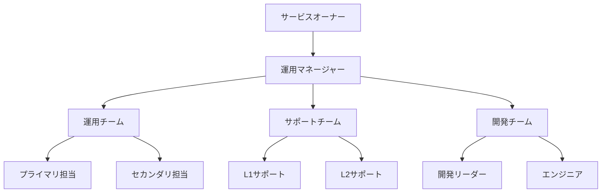
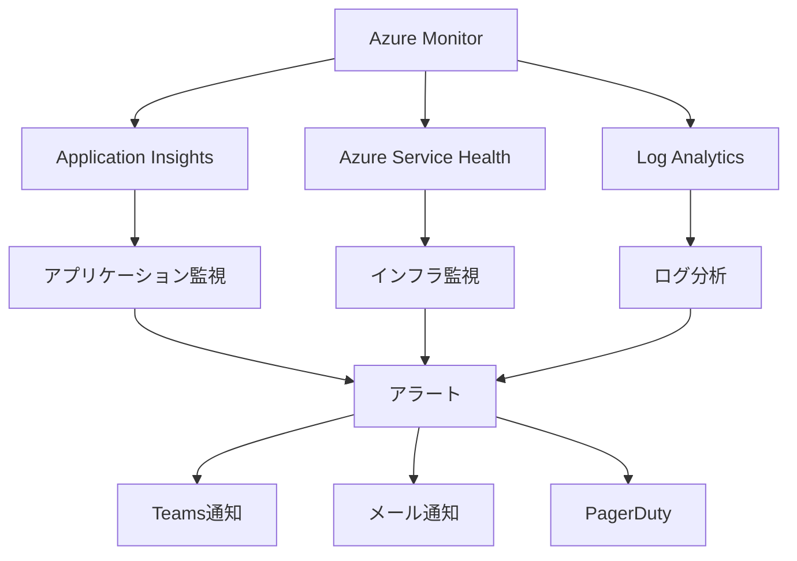
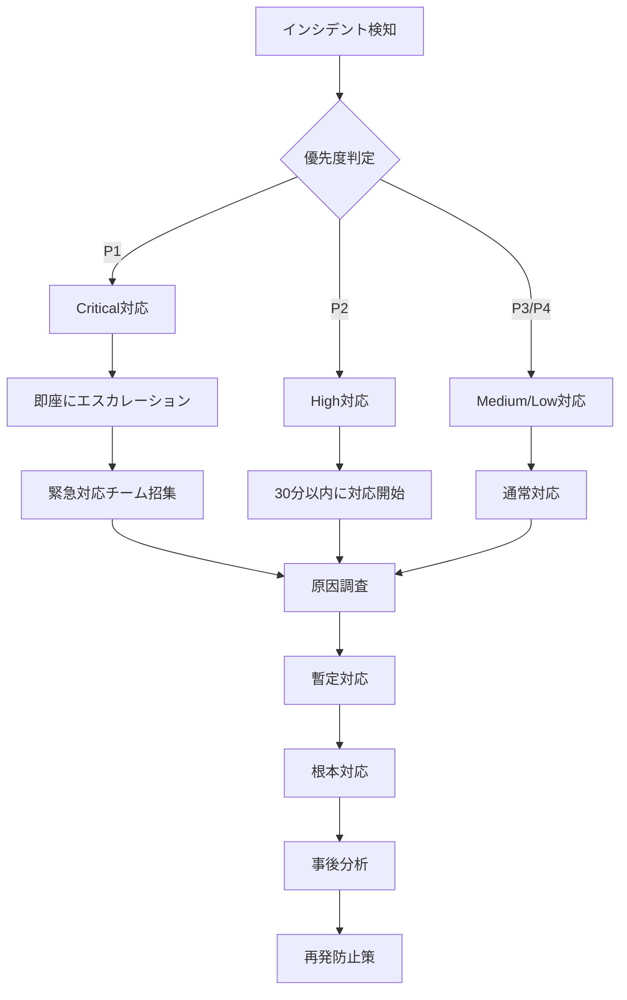
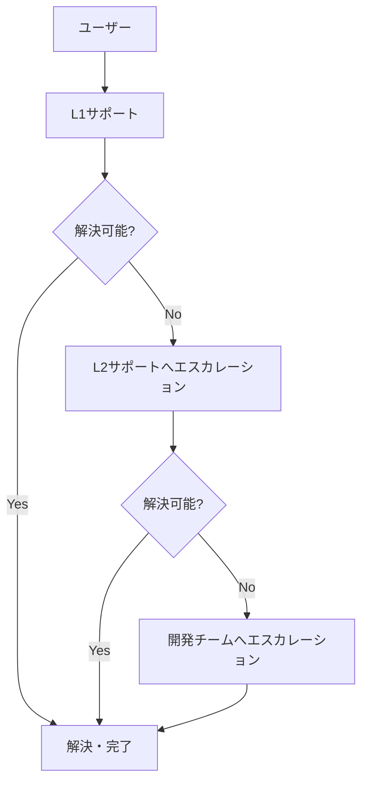

# 運用・保守計画書

**ドキュメントバージョン**: 1.0.0  
**作成日**: 2025-10-27  
**最終更新**: 2025-10-27  
**ステータス**: Draft

---

## 📋 概要

本ドキュメントは、SDS2Rosterシステムの運用・保守に関する方針、手順、体制、監視計画を定義します。

**対象読者**:
- 運用チーム
- システム管理者
- DevOpsエンジニア
- サポート担当者
- プロジェクトマネージャー

---

## 🎯 運用・保守の目的

### 主要目的
1. **システム可用性の維持**: 99.9%以上のサービス稼働率
2. **早期問題検知**: 障害発生前のアラート検知
3. **迅速な障害復旧**: RTO 30分、RPO 1時間
4. **継続的な改善**: 運用ノウハウの蓄積と改善

### サービスレベル目標（SLO）

| 指標 | 目標値 | 測定方法 |
|------|--------|---------|
| **可用性** | 99.9%以上 | Application Insights |
| **変換成功率** | 99%以上 | ジョブ履歴分析 |
| **平均処理時間** | 10万レコード/10分以内 | パフォーマンスログ |
| **平均復旧時間（MTTR）** | 30分以内 | インシデント記録 |
| **平均故障間隔（MTBF）** | 720時間以上（30日） | 障害履歴 |

---

## 👥 運用体制

### 運用組織



### ロールと責任

| ロール | 責任 | 稼働時間 | 対応範囲 |
|--------|------|---------|---------|
| **サービスオーナー** | サービス全体の責任、意思決定 | 営業時間 | エスカレーション対応 |
| **運用マネージャー** | 運用チーム管理、SLA管理 | 営業時間 | 運用全般の監督 |
| **プライマリ担当** | 日常監視、定常作業、障害対応 | 24/7（ローテーション） | レベル1-2障害 |
| **セカンダリ担当** | バックアップ、計画作業 | 営業時間 | レベル2-3障害 |
| **L1サポート** | ユーザー問い合わせ対応 | 営業時間（9-18時） | 基本的な質問 |
| **L2サポート** | 技術的な問い合わせ対応 | 営業時間 | 技術的な問題 |
| **開発チーム** | バグ修正、機能追加 | 営業時間 | コード修正が必要な問題 |

### シフト体制

| シフト | 時間帯 | 担当者 | 役割 |
|--------|--------|--------|------|
| **日勤** | 9:00-18:00（平日） | プライマリ担当 | 監視、定常作業、障害対応 |
| **夜間・休日** | オンコール体制 | ローテーション | 緊急障害対応のみ |

---

## 📊 監視計画

### 監視レイヤー



### 監視項目

#### 1. システム監視

| カテゴリ | 監視項目 | 閾値 | アラート条件 | 優先度 |
|---------|---------|------|------------|--------|
| **可用性** | Function Appヘルスチェック | - | 3回連続失敗 | Critical |
| **エラー率** | HTTPエラー（5xx） | <0.1% | >1%が5分継続 | High |
| **応答時間** | API応答時間 | <500ms | >2秒が5分継続 | Medium |
| **処理時間** | ファイル変換時間 | 10万件/10分 | 目標の150%超過 | Medium |
| **メモリ使用率** | Function Appメモリ | <80% | >90%が5分継続 | High |
| **CPU使用率** | Function App CPU | <70% | >85%が5分継続 | High |

#### 2. ビジネス監視

| カテゴリ | 監視項目 | 閾値 | アラート条件 | 優先度 |
|---------|---------|------|------------|--------|
| **変換成功率** | ジョブ成功率 | >99% | <95%が1時間継続 | High |
| **API送信成功率** | CSV Upload API | >99% | <95%が30分継続 | High |
| **処理量** | 1日あたりの処理ファイル数 | - | 通常の50%未満 | Medium |
| **データ品質** | バリデーションエラー率 | <1% | >5%が1時間継続 | Medium |

#### 3. インフラ監視

| カテゴリ | 監視項目 | 閾値 | アラート条件 | 優先度 |
|---------|---------|------|------------|--------|
| **Storage容量** | Blob Storage使用量 | <80% | >90% | Medium |
| **Storage可用性** | Blob Storageヘルス | - | 障害検知 | Critical |
| **Table Storage** | Table可用性 | - | 障害検知 | High |
| **Key Vault** | Key Vaultアクセス | - | アクセス失敗 | Critical |
| **ネットワーク** | 送受信データ量 | - | 通常の200%超過 | Medium |

### 監視ダッシュボード

#### メインダッシュボード（Application Insights）

```
┌─────────────────────────────────────────────────────────────┐
│ SDS2Roster 運用ダッシュボード                                    │
├─────────────────────────────────────────────────────────────┤
│                                                             │
│ ◉ システムステータス: 正常                                      │
│ ◉ 可用性: 99.95% ↑ (過去24時間)                               │
│ ◉ アクティブアラート: 0件                                      │
│                                                             │
├─────────────────────────────────────────────────────────────┤
│ 📊 処理統計（過去24時間）                                        │
│   • 処理ファイル数: 245件                                      │
│   • 成功: 243件 (99.2%)                                      │
│   • 失敗: 2件 (0.8%)                                         │
│   • 総レコード数: 1,234,567件                                 │
│   • 平均処理時間: 8分32秒                                      │
│                                                             │
├─────────────────────────────────────────────────────────────┤
│ 📈 パフォーマンス                                               │
│   • 平均応答時間: 387ms                                       │
│   • 95パーセンタイル: 1.2秒                                   │
│   • CPU使用率: 45%                                          │
│   • メモリ使用率: 62%                                         │
│                                                             │
├─────────────────────────────────────────────────────────────┤
│ 🔍 エラー分析                                                  │
│   • HTTPエラー: 12件 (0.05%)                                 │
│   • バリデーションエラー: 8件                                  │
│   • API送信エラー: 2件                                        │
│                                                             │
└─────────────────────────────────────────────────────────────┘
```

### アラート設定

#### アラートルール

```yaml
# Application Insightsアラート設定例
alerts:
  - name: "High Error Rate"
    condition: "Failed requests > 1%"
    window: "5 minutes"
    severity: "High"
    action:
      - teams_notification
      - email_notification
  
  - name: "Function App Down"
    condition: "Availability < 100%"
    window: "3 minutes"
    severity: "Critical"
    action:
      - teams_notification
      - email_notification
      - pagerduty_alert
  
  - name: "Slow Response Time"
    condition: "Response time > 2000ms"
    window: "5 minutes"
    severity: "Medium"
    action:
      - teams_notification
```

---

## 🔧 定常運用作業

### 日次作業

| 作業 | 内容 | 担当 | 所要時間 | チェックリスト |
|------|------|------|---------|--------------|
| **朝礼確認** | 前日の処理状況確認 | 運用担当 | 10分 | ☐ 処理件数<br>☐ エラー件数<br>☐ アラート履歴 |
| **ダッシュボード確認** | 各種メトリクス確認 | 運用担当 | 10分 | ☐ 可用性<br>☐ エラー率<br>☐ 応答時間 |
| **ログ確認** | エラーログのレビュー | 運用担当 | 20分 | ☐ Criticalエラー<br>☐ Warningログ<br>☐ 異常パターン |
| **バックアップ確認** | バックアップ完了確認 | 運用担当 | 5分 | ☐ Blob Storage<br>☐ Table Storage |

### 週次作業

| 作業 | 内容 | 担当 | 所要時間 | 実施日 |
|------|------|------|---------|--------|
| **週次レポート作成** | 運用レポート作成 | 運用マネージャー | 1時間 | 毎週月曜 |
| **容量確認** | Storage容量確認 | 運用担当 | 15分 | 毎週月曜 |
| **パフォーマンス分析** | 処理時間トレンド分析 | 運用担当 | 30分 | 毎週水曜 |
| **セキュリティ確認** | アクセスログ監査 | 運用担当 | 30分 | 毎週金曜 |

### 月次作業

| 作業 | 内容 | 担当 | 所要時間 | 実施日 |
|------|------|------|---------|--------|
| **月次レポート作成** | SLA達成状況報告 | 運用マネージャー | 2時間 | 毎月1日 |
| **キャパシティ計画** | リソース使用状況分析 | 運用マネージャー | 1時間 | 毎月5日 |
| **パッチ適用** | セキュリティパッチ適用 | DevOps | 2時間 | 毎月第2土曜 |
| **DR訓練** | 災害復旧訓練 | 運用チーム | 4時間 | 毎月第3土曜 |
| **ログアーカイブ** | 古いログのアーカイブ | 運用担当 | 30分 | 毎月末 |

### 四半期作業

| 作業 | 内容 | 担当 | 所要時間 |
|------|------|------|---------|
| **コスト最適化レビュー** | Azureコスト分析と最適化 | 運用マネージャー | 4時間 |
| **セキュリティ監査** | 包括的セキュリティレビュー | セキュリティ担当 | 1日 |
| **ドキュメント更新** | 運用手順書の見直し | 運用チーム | 1日 |
| **運用改善会議** | プロセス改善の検討 | 全員 | 2時間 |

---

## 🚨 インシデント管理

### インシデント分類

| レベル | 説明 | 影響範囲 | 対応時間 | エスカレーション |
|--------|------|---------|---------|----------------|
| **P1 - Critical** | システム全面停止 | 全ユーザー | 即座（15分以内） | 運用マネージャー + サービスオーナー |
| **P2 - High** | 主要機能停止 | 多数のユーザー | 30分以内 | 運用マネージャー |
| **P3 - Medium** | 一部機能障害 | 一部ユーザー | 2時間以内 | 運用担当 |
| **P4 - Low** | 軽微な問題 | 限定的 | 1営業日以内 | 運用担当 |

### インシデント対応フロー



### インシデント対応手順

#### P1（Critical）インシデント

```markdown
【P1インシデント対応手順】

1. 検知（0-5分）
   □ アラート確認
   □ 影響範囲の特定
   □ インシデントチケット作成

2. 初動対応（5-15分）
   □ 運用マネージャーへ即座に連絡
   □ サービスオーナーへエスカレーション
   □ 対応チーム招集

3. 状況把握（15-30分）
   □ ログ確認
   □ Application Insights分析
   □ Azure Service Health確認
   □ 影響範囲の詳細調査

4. 暫定対応（30-60分）
   □ 可能な緊急対策の実施
   □ ユーザーへの通知（必要に応じて）
   □ 進捗を15分毎に報告

5. 根本対応（1時間-）
   □ 原因の特定
   □ 恒久対策の実施
   □ 動作確認
   □ サービス復旧

6. 事後対応
   □ インシデントレポート作成
   □ 根本原因分析（RCA）
   □ 再発防止策の策定
   □ ナレッジベース更新
```

### インシデント対応例

#### 例1: Function App停止

```
【インシデント】Function Appが応答しない

対応手順:
1. Azure Portalでステータス確認
2. Application Insightsでエラーログ確認
3. 以下を順に試行:
   a. Function App再起動
      az functionapp restart \
        --name func-sds2roster-py-prod \
        --resource-group rg-sds2roster-prod
   
   b. デプロイスロットの切り替え
      az functionapp deployment slot swap \
        --resource-group rg-sds2roster-prod \
        --name func-sds2roster-py-prod \
        --slot staging
   
   c. 旧バージョンへのロールバック
      （GitHub Actionsから前回のデプロイを再実行）

4. 復旧確認
   curl https://func-sds2roster-py-prod.azurewebsites.net/api/health

5. 原因調査
   - デプロイ履歴確認
   - エラーログ分析
   - 環境変数・設定確認
```

#### 例2: Blob Storage接続エラー

```
【インシデント】Blob Storageへの接続失敗

対応手順:
1. Azure Service Healthで障害情報確認
   https://status.azure.com/

2. Storage Accountステータス確認
   az storage account show \
     --name stsds2rosterdataprod \
     --resource-group rg-sds2roster-prod

3. 接続文字列の確認
   - Key Vaultからの取得確認
   - 接続文字列の有効性確認

4. ネットワーク設定確認
   - ファイアウォールルール
   - VNetサービスエンドポイント

5. 一時的な回避策
   - セカンダリリージョンへのフェイルオーバー（設定されている場合）

6. 復旧確認
   - テストファイルのアップロード
   - Function実行テスト
```

---

## 💾 バックアップ・リストア

### バックアップ戦略

| 対象 | バックアップ方法 | 頻度 | 保管期間 | 保管場所 |
|------|----------------|------|---------|---------|
| **Blob Storage（データ）** | Soft Delete + Versioning | リアルタイム | 30日 | 同一Storage |
| **Blob Storage（スナップショット）** | 手動スナップショット | 日次 | 90日 | GRS（Geo-Redundant） |
| **Table Storage** | Export to Blob | 日次 | 90日 | Blob Storage |
| **Function Appコード** | GitHub | プッシュ毎 | 無期限 | GitHub |
| **Function App設定** | ARM Template | 変更時 | 無期限 | GitHub |
| **Terraformステート** | Azure Blob | 変更毎 | 無期限 | Terraform Backend |

### バックアップ手順

#### Blob Storageバックアップ

```bash
#!/bin/bash
# daily-backup.sh

DATE=$(date +%Y%m%d)
STORAGE_ACCOUNT="stsds2rosterdataprod"
CONTAINER="sds-input"
BACKUP_CONTAINER="backups"

# スナップショット作成
az storage blob snapshot \
  --account-name $STORAGE_ACCOUNT \
  --container-name $CONTAINER \
  --name "*.csv" \
  --snapshot-tag "daily-backup-$DATE"

echo "Backup completed: $DATE"
```

#### Table Storageバックアップ

```bash
#!/bin/bash
# table-backup.sh

DATE=$(date +%Y%m%d)
STORAGE_ACCOUNT="stsds2rosterdataprod"
TABLE_NAME="JobHistory"
BACKUP_FILE="job-history-backup-$DATE.json"

# Table Storage Export
az storage entity query \
  --account-name $STORAGE_ACCOUNT \
  --table-name $TABLE_NAME \
  --output json > $BACKUP_FILE

# Blobへアップロード
az storage blob upload \
  --account-name $STORAGE_ACCOUNT \
  --container-name backups \
  --name "table-backups/$BACKUP_FILE" \
  --file $BACKUP_FILE

echo "Table backup completed: $BACKUP_FILE"
```

### リストア手順

#### データリストア（Blob Storage）

```bash
# 特定の日付のスナップショットからリストア
SNAPSHOT_DATE="2025-10-27"
SOURCE_BLOB="users.csv"
DEST_BLOB="users-restored.csv"

# スナップショット一覧取得
az storage blob list \
  --account-name stsds2rosterdataprod \
  --container-name sds-input \
  --include s \
  --query "[?snapshot!=null && name=='$SOURCE_BLOB']"

# 特定のスナップショットからコピー
az storage blob copy start \
  --account-name stsds2rosterdataprod \
  --destination-container sds-input \
  --destination-blob $DEST_BLOB \
  --source-container sds-input \
  --source-blob $SOURCE_BLOB \
  --source-snapshot <snapshot-id>
```

#### システム全体のリストア（DR）

```bash
# 災害復旧手順

# 1. Terraformでインフラ再構築
cd terraform/environments/prod
terraform init
terraform apply

# 2. Function Appデプロイ
# GitHub Actionsから最新の安定版をデプロイ

# 3. データリストア
# Blob Storage: GRSによる自動レプリケーション
# Table Storage: バックアップからインポート

# 4. 動作確認
./scripts/smoke-test.sh

# 5. DNSフェイルオーバー（必要に応じて）
```

---

## 🔄 変更管理

### 変更の種類

| 変更タイプ | 説明 | 承認者 | 実施タイミング |
|----------|------|--------|--------------|
| **緊急変更** | 障害対応のための変更 | 運用マネージャー | 即座 |
| **標準変更** | 事前承認済みの定型変更 | 不要（手順書に従う） | 保守ウィンドウ |
| **通常変更** | 新機能、改善 | サービスオーナー | 保守ウィンドウ |
| **重要変更** | アーキテクチャ変更 | 経営層 | 保守ウィンドウ |

### 保守ウィンドウ

| 種別 | 日時 | 通知期間 | 最大停止時間 |
|------|------|---------|------------|
| **定期保守** | 毎月第2土曜 2:00-6:00 | 1週間前 | 4時間 |
| **緊急保守** | 随時 | 可能な限り事前通知 | 2時間 |

### 変更手順

```markdown
【変更実施手順】

1. 変更計画（Change Plan）
   □ 変更内容の詳細記述
   □ 影響範囲の分析
   □ リスクアセスメント
   □ ロールバック計画

2. 承認（Approval）
   □ 変更申請書作成
   □ 承認者へ提出
   □ 承認取得

3. 通知（Notification）
   □ ユーザーへの事前通知
   □ 関係者への連絡

4. 実施（Implementation）
   □ 事前バックアップ
   □ 変更作業実施
   □ 動作確認

5. 検証（Verification）
   □ テスト実施
   □ モニタリング強化（24時間）

6. 完了報告（Closure）
   □ 変更完了報告書作成
   □ ドキュメント更新
```

---

## 📞 サポート

### サポート体制



### サポートレベル

| レベル | 対応内容 | 対応時間 | SLA |
|--------|---------|---------|-----|
| **L1** | 基本的な質問、手順案内 | 営業時間（9-18時） | 初回応答1時間以内 |
| **L2** | 技術的な問題調査、設定変更 | 営業時間 | 初回応答2時間以内 |
| **L3** | バグ修正、機能追加 | 営業時間 | 調査開始1営業日以内 |

### よくある問い合わせ（FAQ）

#### Q1: ファイルをアップロードしたが処理されない

```
【原因】
- ファイル形式が不正
- ファイル名が規約に合っていない
- Blob Storageの権限不足

【対応】
1. ファイル形式を確認（CSV、UTF-8）
2. ファイル名を確認（users.csv, orgs.csv等）
3. Application Insightsでエラーログ確認
4. 必要に応じて再アップロード
```

#### Q2: 変換結果がおかしい

```
【原因】
- SDSデータの不整合
- バリデーションエラー
- マッピングルールの誤り

【対応】
1. エラーログで詳細確認
2. 元のSDSファイルを検証
3. サンプルデータでテスト
4. 必要に応じて開発チームへエスカレーション
```

---

## 📊 運用レポート

### 月次運用レポートテンプレート

```markdown
# SDS2Roster 月次運用レポート
**対象期間**: YYYY年MM月

## 1. サマリー
- **可用性**: XX.XX%（目標: 99.9%）
- **処理件数**: X,XXX件
- **インシデント**: X件（P1: X, P2: X, P3: X, P4: X）
- **変更作業**: X件

## 2. SLA達成状況
| 指標 | 目標 | 実績 | 達成 |
|------|------|------|-----|
| 可用性 | 99.9% | XX.X% | ✓/✗ |
| 変換成功率 | 99% | XX.X% | ✓/✗ |
| 平均処理時間 | 10分 | XX分 | ✓/✗ |
| MTTR | 30分 | XX分 | ✓/✗ |

## 3. 処理統計
- 総処理ファイル数: X,XXX件
- 成功: X,XXX件（XX.X%）
- 失敗: XXX件（X.X%）
- 総レコード数: XX,XXX,XXX件

## 4. インシデントサマリー
| 日付 | レベル | 内容 | 影響時間 | 対応 |
|------|--------|------|---------|------|
| MM/DD | PX | ... | XX分 | ... |

## 5. 変更作業
| 日付 | 種類 | 内容 | 結果 |
|------|------|------|------|
| MM/DD | ... | ... | 成功/失敗 |

## 6. パフォーマンス
- 平均応答時間: XXXms
- 95パーセンタイル: XXXms
- CPU使用率（平均）: XX%
- メモリ使用率（平均）: XX%

## 7. コスト
- 今月コスト: XX,XXX円
- 前月比: +/-X%
- 予算比: XX%

## 8. 課題と改善提案
1. [課題1]
   - 対応策: ...
   
2. [課題2]
   - 対応策: ...
```

---

## 🎓 ナレッジ管理

### ナレッジベース構造

```
knowledge-base/
├── troubleshooting/
│   ├── function-app-issues.md
│   ├── storage-connectivity.md
│   ├── api-integration-errors.md
│   └── performance-tuning.md
│
├── how-to/
│   ├── deploy-new-version.md
│   ├── rollback-procedure.md
│   ├── add-monitoring-alert.md
│   └── restore-from-backup.md
│
├── runbooks/
│   ├── incident-response-p1.md
│   ├── incident-response-p2.md
│   ├── maintenance-procedures.md
│   └── disaster-recovery.md
│
└── faq/
    ├── user-faq.md
    ├── admin-faq.md
    └── troubleshooting-faq.md
```

### ドキュメント更新プロセス

1. **インシデント後**: 対応内容をナレッジベースに追加
2. **変更後**: 手順書を最新化
3. **四半期レビュー**: 全ドキュメントの見直し

---

## 📚 関連ドキュメント

### プロジェクト管理ドキュメント
- [01_project_management_plan.md](./01_project_management_plan.md) - プロジェクト管理計画書
- [02_risk_management_plan.md](./02_risk_management_plan.md) - リスク管理計画書
- [03_test_plan.md](./03_test_plan.md) - テスト計画書

### アーキテクチャドキュメント
- [アーキテクチャ概要](../architecture/01_architecture_overview.md)
- [デプロイメント設計](../architecture/07_deployment_architecture.md)
- [セキュリティ設計](../architecture/06_security_architecture.md)

---

## 🔍 承認

| 役割 | 氏名 | 署名 | 日付 |
|------|------|------|------|
| 運用マネージャー | 未定 | - | - |
| サービスオーナー | 未定 | - | - |
| プロジェクトマネージャー | 未定 | - | - |

---

## 📝 変更履歴

| バージョン | 日付 | 変更内容 | 変更者 |
|-----------|------|---------|--------|
| 1.0.0 | 2025-10-27 | 初版作成 | Operations Manager |

---

## 付録A: 運用チェックリスト

### 日次チェックリスト

```markdown
# 日次運用チェックリスト

日付: YYYY-MM-DD
担当者: __________

## 朝（9:00-10:00）
- [ ] ダッシュボード確認（可用性、エラー率）
- [ ] 前日の処理件数確認
- [ ] アラート履歴確認
- [ ] インシデントチケット確認

## 午前（10:00-12:00）
- [ ] エラーログレビュー
- [ ] 処理失敗ジョブの調査
- [ ] ユーザー問い合わせ対応

## 午後（13:00-18:00）
- [ ] パフォーマンスメトリクス確認
- [ ] バックアップ完了確認
- [ ] 保留中タスクの進捗確認
- [ ] 引き継ぎ事項の記録

## 所見・特記事項
___________________________________________
___________________________________________
```

---

## 付録B: エスカレーション連絡先

| ロール | 氏名 | 電話 | メール | 対応時間 |
|--------|------|------|--------|---------|
| 運用マネージャー | 未定 | XXX-XXXX-XXXX | ops-mgr@example.com | 24/7 |
| サービスオーナー | 未定 | XXX-XXXX-XXXX | owner@example.com | 営業時間 |
| 開発リーダー | 未定 | XXX-XXXX-XXXX | dev-lead@example.com | 営業時間 |
| Azureサポート | - | - | azure-support@microsoft.com | 24/7 |
