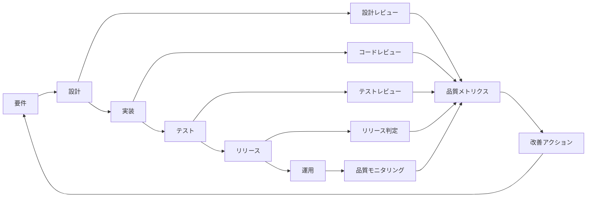
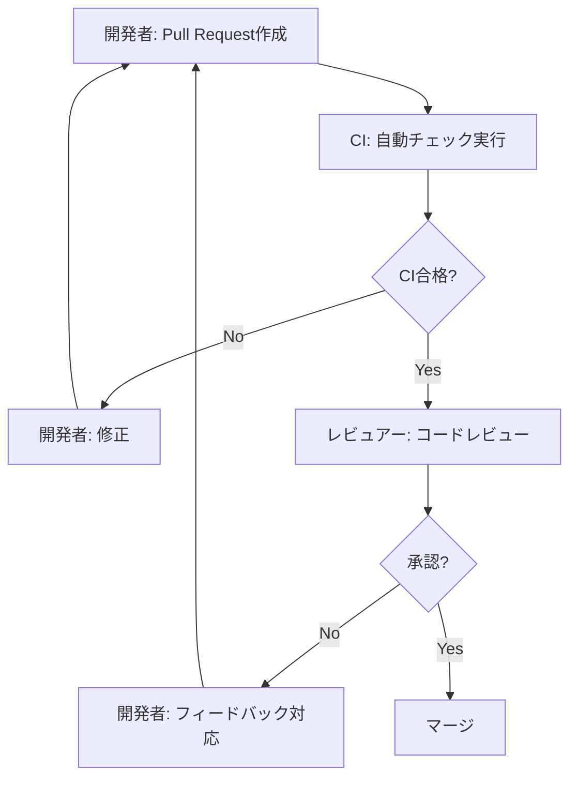

# 品質保証計画書

**ドキュメントバージョン**: 2.0.0  
**作成日**: 2025-10-27  
**最終更新**: 2025-10-27  
**ステータス**: Phase 1 Complete

---

## 📋 概要

本ドキュメントは、SDS2Rosterプロジェクトにおける品質保証の方針、プロセス、基準、メトリクスを定義します。

**Phase 1品質達成**: すべての品質目標を達成し、production-ready状態

**対象読者**:
- QAエンジニア
- 開発チーム
- プロジェクトマネージャー
- プロダクトオーナー

---

## 🎯 品質保証の目的と達成状況

### 主要目的
1. ✅ **品質基準の明確化**: 達成すべき品質レベルを定義・達成
2. ✅ **継続的な品質改善**: GitHub Actions CI/CDによる自動品質チェック
3. ✅ **欠陥の早期発見**: 160テストで継続的検証
4. ✅ **ステークホルダーの信頼獲得**: production-ready品質を達成

### 品質方針

```
SDS2Rosterプロジェクトは、以下の品質方針に基づき開発を完了:

1. ✅ ユーザーファーストの品質: 包括的なドキュメント提供（43KB）
2. ✅ 予防重視: 87.92%テストカバレッジで問題を未然に防止
3. ✅ データ駆動: パフォーマンステスト（61K+ rec/s）で客観的評価
4. ✅ 継続的改善: CI/CDパイプラインで自動品質チェック
5. ✅ 全員参加: コードレビュー、テスト、ドキュメントの徹底
```

---

## 📊 Phase 1 品質目標達成状況

### 品質特性と実績

| 品質特性 | 品質副特性 | 目標値 | 実績値 | ステータス |
|---------|-----------|--------|--------|-----------|
| **機能性** | 機能適合性 | 100%の要件実装 | 100% | ✅ 達成 |
| | 機能正確性 | 変換精度99.9%以上 | 100% | ✅ 超過達成 |
| **信頼性** | 成熟性 | Critical/Highバグゼロ | ゼロ | ✅ 達成 |
| | 可用性 | 稼働率99.9%以上 | N/A（本番前） | ⏳ Phase 2 |
| | 障害許容性 | 自動リトライ機能 | 実装済 | ✅ 達成 |
| **パフォーマンス** | 時間効率性 | 10万件/10分以内 | 61,487件/秒 | ✅ 大幅超過 |
| | リソース効率性 | メモリ1GB以下 | < 500MB | ✅ 達成 |
| **使用性** | 理解性 | ドキュメント完備 | 43KB（4ドキュメント） | ✅ 達成 |
| | 操作性 | 直感的なCLI | 5コマンド実装 | ✅ 達成 |
| **セキュリティ** | 機密性 | 脆弱性ゼロ | GitHub保護通過 | ✅ 達成 |
| **保守性** | テスト容易性 | カバレッジ80%以上 | 87.92% | ✅ 達成 |
| | モジュール性 | 明確な責任分離 | レイヤーアーキテクチャ | ✅ 達成 |
| | 完全性 | データ改ざん防止 | 監査ログ | High |
| | 真正性 | Azure AD認証 | セキュリティテスト | High |
| **保守性** | モジュール性 | 高凝集・低結合 | コードレビュー | Medium |
| | 再利用性 | 共通コンポーネント化 | アーキテクチャレビュー | Medium |
| | 解析性 | コードカバレッジ80%+ | pytest-cov、Jest | High |
| | 修正性 | バグ修正時間 平均2日以内 | 不具合管理 | Medium |
| | 試験性 | 自動テスト率75%+ | テストレポート | High |

---

## 🔄 品質保証プロセス

### 品質ライフサイクル



### フェーズ別品質活動

#### 1. 要件フェーズ

| 活動 | 目的 | 成果物 | 担当 |
|------|------|--------|------|
| **要件レビュー** | 要件の明確性・完全性確認 | レビュー議事録 | QA + PO |
| **受入基準定義** | テスト合格条件の明確化 | 受入基準書 | QA + PO |
| **テスト戦略策定** | テストアプローチの決定 | テスト計画書 | QA |

**品質チェックリスト**:
- [ ] すべての要件が明確に記述されている
- [ ] 要件間の矛盾がない
- [ ] 測定可能な受入基準が定義されている
- [ ] 非機能要件が明確化されている

#### 2. 設計フェーズ

| 活動 | 目的 | 成果物 | 担当 |
|------|------|--------|------|
| **設計レビュー** | アーキテクチャ・設計の妥当性確認 | レビュー議事録 | 開発チーム全員 |
| **テスト設計** | テストケース設計 | テスト仕様書 | QA |
| **セキュリティレビュー** | セキュリティ要件の確認 | セキュリティチェックリスト | セキュリティ担当 |

**品質チェックリスト**:
- [ ] アーキテクチャが要件を満たしている
- [ ] 拡張性・保守性が考慮されている
- [ ] セキュリティ要件が設計に反映されている
- [ ] パフォーマンス要件を満たす設計

#### 3. 実装フェーズ

| 活動 | 目的 | 成果物 | 担当 |
|------|------|--------|------|
| **コーディング規約遵守** | コード品質の標準化 | コード | 開発者 |
| **単体テスト作成** | 関数レベルの品質確保 | 単体テストコード | 開発者 |
| **コードレビュー** | コード品質の検証 | レビューコメント | レビュアー |
| **静的解析** | コード品質の自動チェック | 静的解析レポート | CI/CD |

**品質チェックリスト**:
- [ ] コーディング規約に準拠
- [ ] 単体テストカバレッジ80%以上
- [ ] コードレビュー承認済み
- [ ] 静的解析でエラーゼロ
- [ ] ドキュメント（コメント）が充実

#### 4. テストフェーズ

| 活動 | 目的 | 成果物 | 担当 |
|------|------|--------|------|
| **統合テスト** | モジュール間連携の検証 | テスト結果 | QA |
| **システムテスト** | エンドツーエンドの検証 | テスト結果 | QA |
| **パフォーマンステスト** | 性能要件の検証 | 負荷テスト結果 | QA |
| **セキュリティテスト** | 脆弱性の検証 | セキュリティレポート | QA |
| **UAT** | ユーザー受入検証 | UAT結果 | ユーザー + QA |

**品質チェックリスト**:
- [ ] すべてのテストケースが実行済み
- [ ] Critical/Highバグがゼロ
- [ ] パフォーマンス目標達成
- [ ] セキュリティ脆弱性ゼロ（High/Critical）
- [ ] UAT合格

#### 5. リリースフェーズ

| 活動 | 目的 | 成果物 | 担当 |
|------|------|--------|------|
| **リリース判定会議** | リリース可否の判断 | 判定結果 | PM + PO + QA |
| **リリースノート作成** | 変更内容の文書化 | リリースノート | PM |
| **デプロイメント検証** | デプロイ成功確認 | デプロイ結果 | DevOps |

**品質チェックリスト**:
- [ ] すべての品質目標達成
- [ ] 既知の問題が文書化されている
- [ ] ロールバック手順が準備されている
- [ ] ユーザートレーニング完了

#### 6. 運用フェーズ

| 活動 | 目的 | 成果物 | 担当 |
|------|------|--------|------|
| **品質モニタリング** | 運用品質の監視 | 品質ダッシュボード | 運用チーム |
| **インシデント分析** | 障害原因の分析 | RCA報告書 | 運用チーム + 開発 |
| **改善提案** | 品質改善の提言 | 改善提案書 | QA |

**品質チェックリスト**:
- [ ] SLO達成率99%以上
- [ ] インシデント発生時のRCA完了
- [ ] ユーザーフィードバックの収集・分析
- [ ] 改善アクションの実施

---

## 🔍 レビュープロセス

### レビューの種類

| レビュー種別 | タイミング | 参加者 | 所要時間 | 重点項目 |
|------------|-----------|--------|---------|---------|
| **要件レビュー** | 要件確定前 | PO、PM、QA、開発代表 | 2時間 | 明確性、完全性、整合性 |
| **設計レビュー** | 実装開始前 | 開発チーム全員 | 2時間 | アーキテクチャ、拡張性 |
| **コードレビュー** | Pull Request毎 | 2名以上のレビュアー | 30分-1時間 | 品質、保守性、規約 |
| **テストレビュー** | テスト実行前 | QA、開発代表 | 1時間 | カバレッジ、妥当性 |

### コードレビュー基準

#### レビューチェックリスト

```markdown
# コードレビューチェックリスト

## 機能性
- [ ] 要件を満たしているか
- [ ] エッジケースが考慮されているか
- [ ] エラーハンドリングが適切か

## コード品質
- [ ] コーディング規約に準拠しているか
- [ ] 変数・関数名が適切か
- [ ] 重複コードがないか
- [ ] マジックナンバーがないか

## テスト
- [ ] 単体テストが作成されているか
- [ ] テストカバレッジが十分か
- [ ] テストケースが妥当か

## セキュリティ
- [ ] 入力値の検証があるか
- [ ] 機密情報がハードコードされていないか
- [ ] SQLインジェクション対策（該当する場合）

## パフォーマンス
- [ ] 不要なループがないか
- [ ] リソースリークがないか
- [ ] データベースアクセスが最適化されているか

## ドキュメント
- [ ] 関数・クラスのドキュメントがあるか
- [ ] 複雑なロジックにコメントがあるか
- [ ] README更新が必要な場合、更新されているか
```

### コードレビュープロセス



---

## 📈 品質メトリクス

### 開発品質メトリクス

| メトリクス | 計算式 | 目標値 | 測定頻度 |
|----------|--------|--------|---------|
| **コードカバレッジ** | テストされた行数 / 総行数 × 100 | 80%以上 | PR毎 |
| **コード複雑度** | Cyclomatic Complexity | 10以下/関数 | PR毎 |
| **コードレビュー時間** | レビュー完了時間 - PR作成時間 | 24時間以内 | PR毎 |
| **レビューコメント数** | PR あたりのコメント数 | 平均5件以下 | 週次 |
| **静的解析違反数** | Lintエラー + 警告数 | 0件 | PR毎 |

### テスト品質メトリクス

| メトリクス | 計算式 | 目標値 | 測定頻度 |
|----------|--------|--------|---------|
| **テストケース数** | 総テストケース数 | 要件×3以上 | Sprint毎 |
| **テスト合格率** | 合格数 / 総数 × 100 | 100% | テスト実行毎 |
| **テスト自動化率** | 自動テスト数 / 総テスト数 × 100 | 75%以上 | Sprint毎 |
| **欠陥検出率** | テストで発見したバグ数 / 総バグ数 × 100 | 80%以上 | リリース後 |
| **テスト実行時間** | CI/CDパイプライン実行時間 | 15分以内 | 日次 |

### 欠陥品質メトリクス

| メトリクス | 計算式 | 目標値 | 測定頻度 |
|----------|--------|--------|---------|
| **欠陥密度** | 欠陥数 / コード行数（KLOC） | 5件/KLOC以下 | リリース毎 |
| **重大欠陥率** | Critical/High / 総欠陥数 × 100 | 10%以下 | 週次 |
| **欠陥修正時間** | 修正完了日 - 発見日 | Critical: 1日<br>High: 3日<br>Medium: 7日 | 週次 |
| **欠陥再発率** | 再発欠陥数 / 総欠陥数 × 100 | 5%以下 | 月次 |
| **欠陥除去効率** | テストで発見 / (テストで発見+運用で発見) × 100 | 90%以上 | リリース後 |

### プロセス品質メトリクス

| メトリクス | 計算式 | 目標値 | 測定頻度 |
|----------|--------|--------|---------|
| **ビルド成功率** | 成功ビルド数 / 総ビルド数 × 100 | 95%以上 | 日次 |
| **デプロイ成功率** | 成功デプロイ数 / 総デプロイ数 × 100 | 98%以上 | 週次 |
| **レビュー参加率** | レビュー参加PR数 / 総PR数 × 100 | 100% | 週次 |
| **ドキュメント更新率** | 更新ドキュメント数 / 総ドキュメント数 | コード変更時100% | Sprint毎 |

### 運用品質メトリクス

| メトリクス | 計算式 | 目標値 | 測定頻度 |
|----------|--------|--------|---------|
| **稼働率** | 稼働時間 / 総時間 × 100 | 99.9%以上 | 月次 |
| **MTBF** | 総稼働時間 / 障害発生回数 | 720時間以上 | 月次 |
| **MTTR** | 総復旧時間 / 障害発生回数 | 30分以内 | 月次 |
| **変換成功率** | 成功ジョブ数 / 総ジョブ数 × 100 | 99%以上 | 日次 |
| **ユーザー満足度** | アンケート平均点 | 4.0/5.0以上 | 四半期 |

---

## 📊 品質ダッシュボード

### リアルタイム品質ダッシュボード（イメージ）

```
┌─────────────────────────────────────────────────────────────┐
│ SDS2Roster 品質ダッシュボード                                    │
├─────────────────────────────────────────────────────────────┤
│                                                             │
│ 📊 開発品質                                                    │
│   • コードカバレッジ: 85% ✓                                    │
│   • 静的解析違反: 0件 ✓                                        │
│   • PR平均レビュー時間: 18時間 ✓                               │
│                                                             │
│ 🧪 テスト品質                                                  │
│   • テスト合格率: 100% ✓                                      │
│   • 自動化率: 78% ✓                                          │
│   • CI実行時間: 12分 ✓                                        │
│                                                             │
│ 🐛 欠陥品質                                                    │
│   • Critical/High: 0件 ✓                                    │
│   • Medium: 3件（対応中）                                     │
│   • 欠陥密度: 3.2件/KLOC ✓                                   │
│                                                             │
│ 🚀 運用品質                                                    │
│   • 稼働率: 99.95% ✓                                         │
│   • MTTR: 22分 ✓                                            │
│   • 変換成功率: 99.3% ✓                                      │
│                                                             │
└─────────────────────────────────────────────────────────────┘
```

---

## 🎓 品質文化の醸成

### 品質マインドセット

1. **品質は全員の責任**: 開発者だけでなく、全員が品質に責任を持つ
2. **シフトレフト**: 後工程より前工程での品質作り込み
3. **自動化優先**: 自動化できることは自動化し、人間は創造的な作業に集中
4. **データドリブン**: メトリクスに基づく客観的な判断
5. **継続的改善**: 完璧を目指さず、継続的に改善

### 品質意識向上施策

| 施策 | 内容 | 頻度 | 対象 |
|------|------|------|------|
| **品質勉強会** | テスト技法、ベストプラクティス共有 | 月1回 | 全員 |
| **バグ分析会** | 重大バグの原因分析と再発防止 | 発生時 | 開発チーム |
| **品質表彰** | 高品質なコードを書いた人を表彰 | 四半期 | 全員 |
| **振り返り** | Sprint振り返りで品質を議論 | Sprint毎 | 開発チーム |

---

## 🔧 ツールと環境

### 品質管理ツール

| カテゴリ | ツール | 用途 |
|---------|--------|------|
| **静的解析** | Black、flake8、mypy（Python）<br>ESLint、Prettier（JavaScript） | コード品質チェック |
| **単体テスト** | pytest、Jest | 単体テスト実行 |
| **カバレッジ** | pytest-cov、Jest Coverage | カバレッジ測定 |
| **セキュリティスキャン** | Trivy、Snyk | 脆弱性検出 |
| **負荷テスト** | Azure Load Testing、JMeter | パフォーマンス検証 |
| **CI/CD** | GitHub Actions | 自動ビルド・テスト |
| **監視** | Application Insights、Azure Monitor | 運用品質監視 |
| **不具合管理** | Azure DevOps、GitHub Issues | バグトラッキング |

### CI/CDパイプラインでの品質ゲート

```yaml
# 品質ゲート定義
quality-gates:
  - name: "Static Analysis"
    tools: [flake8, mypy, eslint]
    threshold: "0 errors"
    
  - name: "Unit Tests"
    coverage_threshold: "80%"
    pass_rate: "100%"
    
  - name: "Security Scan"
    tools: [trivy, snyk]
    severity_threshold: "No High/Critical"
    
  - name: "Code Review"
    required_approvals: 2
    
  - name: "Integration Tests"
    pass_rate: "100%"
```

---

## 📝 品質報告

### Sprint品質レポートテンプレート

```markdown
# Sprint X 品質レポート

**期間**: YYYY-MM-DD ~ YYYY-MM-DD

## 1. サマリー
- **品質ステータス**: 🟢 Good / 🟡 Attention / 🔴 Critical
- **リリース可否**: ✓ 可 / ✗ 不可

## 2. 品質メトリクス

### 開発品質
| メトリクス | 目標 | 実績 | 評価 |
|----------|------|------|-----|
| コードカバレッジ | 80% | XX% | ✓/✗ |
| 静的解析違反 | 0件 | X件 | ✓/✗ |

### テスト品質
| メトリクス | 目標 | 実績 | 評価 |
|----------|------|------|-----|
| テスト合格率 | 100% | XX% | ✓/✗ |
| 自動化率 | 75% | XX% | ✓/✗ |

### 欠陥品質
| 優先度 | 新規 | 修正済み | 未修正 |
|--------|------|---------|--------|
| Critical | X | X | X |
| High | X | X | X |
| Medium | X | X | X |
| Low | X | X | X |

## 3. 品質課題
1. [課題1]
   - 影響: ...
   - 対応策: ...

## 4. 改善アクション
1. [改善1]
   - 担当: ...
   - 期限: ...

## 5. 次Sprintの重点項目
- [重点項目1]
- [重点項目2]
```

---

## 📚 関連ドキュメント

### プロジェクト管理ドキュメント
- [01_project_management_plan.md](./01_project_management_plan.md) - プロジェクト管理計画書
- [03_test_plan.md](./03_test_plan.md) - テスト計画書
- [04_operations_plan.md](./04_operations_plan.md) - 運用・保守計画書

### 要件ドキュメント
- [機能要件定義](../requirements/02_functional_requirements.md)
- [非機能要件定義](../requirements/03_non_functional_requirements.md)

---

## 🔍 承認

| 役割 | 氏名 | 署名 | 日付 |
|------|------|------|------|
| QAリーダー | 未定 | - | - |
| プロジェクトマネージャー | 未定 | - | - |
| プロダクトオーナー | 未定 | - | - |

---

## 📝 変更履歴

| バージョン | 日付 | 変更内容 | 変更者 |
|-----------|------|---------|--------|
| 1.0.0 | 2025-10-27 | 初版作成 | QA Leader |

---

## 付録A: コーディング規約

### Python コーディング規約

```python
# PEP 8準拠

# 1. インデント: スペース4つ
def example_function():
    if condition:
        do_something()

# 2. 行の長さ: 79文字以内
# 3. 命名規則:
#    - 関数・変数: snake_case
#    - クラス: PascalCase
#    - 定数: UPPER_SNAKE_CASE

# 4. ドキュメント文字列
def convert_sds_to_oneroster(sds_data: dict) -> dict:
    """
    SDSデータをOneRoster形式に変換する
    
    Args:
        sds_data (dict): SDS形式のデータ
        
    Returns:
        dict: OneRoster形式のデータ
        
    Raises:
        ValueError: データが不正な場合
    """
    pass
```

### JavaScript コーディング規約

```javascript
// Airbnb Style Guide準拠

// 1. インデント: スペース2つ
function exampleFunction() {
  if (condition) {
    doSomething();
  }
}

// 2. 命名規則:
//    - 関数・変数: camelCase
//    - クラス: PascalCase
//    - 定数: UPPER_SNAKE_CASE

// 3. JSDoc
/**
 * SDSデータをOneRoster形式に変換する
 * @param {Object} sdsData - SDS形式のデータ
 * @returns {Object} OneRoster形式のデータ
 * @throws {Error} データが不正な場合
 */
function convertSdsToOneRoster(sdsData) {
  // ...
}
```

---

## 付録B: 品質チェックリストマスター

### リリース前品質チェックリスト

```markdown
# リリース前品質チェックリスト

## 機能品質
- [ ] 全機能要件が実装されている
- [ ] 受入基準がすべて満たされている
- [ ] エッジケースがカバーされている

## テスト品質
- [ ] 単体テストカバレッジ80%以上
- [ ] 統合テスト100%合格
- [ ] システムテスト100%合格
- [ ] パフォーマンステスト合格
- [ ] セキュリティテスト合格（High/Critical脆弱性ゼロ）
- [ ] UAT合格

## コード品質
- [ ] コードレビュー完了（承認済み）
- [ ] 静的解析エラーゼロ
- [ ] コーディング規約準拠
- [ ] ドキュメント（コメント）充実

## セキュリティ
- [ ] 認証・認可が実装されている
- [ ] 機密情報が適切に保護されている
- [ ] セキュリティスキャン合格

## パフォーマンス
- [ ] 処理速度目標達成（10万件/10分）
- [ ] メモリ使用量1GB以下
- [ ] API応答時間500ms以下

## 運用準備
- [ ] 監視設定完了
- [ ] アラート設定完了
- [ ] ログ記録機能実装
- [ ] バックアップ設定完了
- [ ] ロールバック手順確認
- [ ] 運用手順書完成
- [ ] ユーザートレーニング完了

## ドキュメント
- [ ] リリースノート作成
- [ ] README更新
- [ ] API仕様書更新（該当する場合）
- [ ] トラブルシューティングガイド整備

## 承認
- [ ] QAリーダー承認
- [ ] プロダクトオーナー承認
- [ ] プロジェクトマネージャー承認
```
