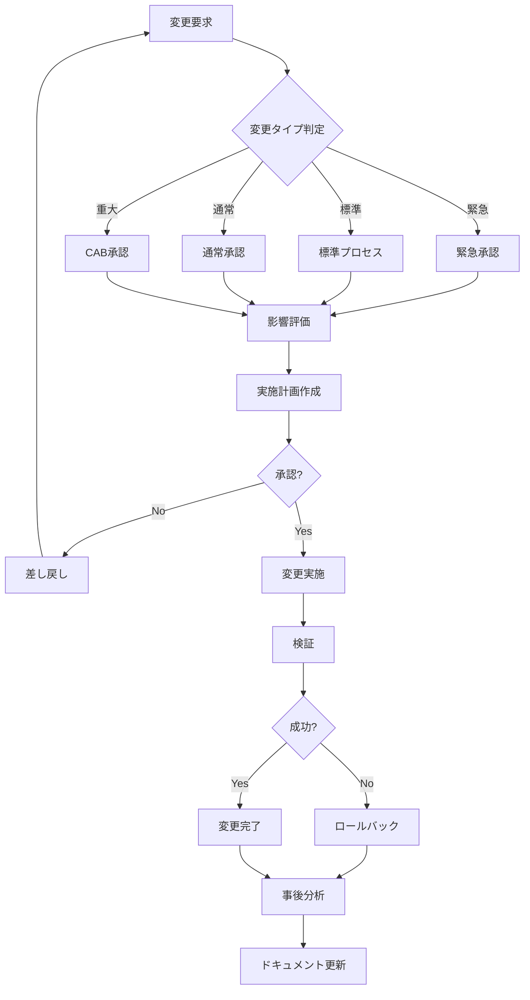
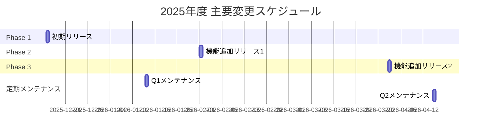
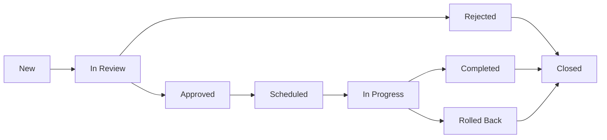
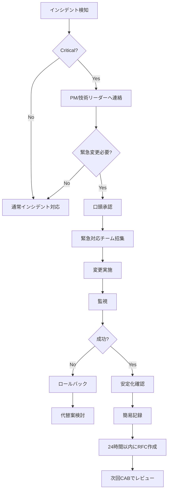

# 変更管理計画書

**ドキュメントバージョン**: 1.0.0  
**作成日**: 2025-10-27  
**最終更新**: 2025-10-27  
**ステータス**: Draft

---

## 📋 概要

本ドキュメントは、SDS2Rosterプロジェクトにおける変更管理の方針、プロセス、承認フローを定義します。

**対象読者**:
- プロジェクトマネージャー
- 開発チーム
- 運用チーム
- ステークホルダー

---

## 🎯 変更管理の目的

### 主要目的
1. **変更の可視化**: すべての変更を記録・追跡
2. **リスクの最小化**: 影響を評価し、適切な承認を得る
3. **品質の維持**: 計画的な変更実施による品質確保
4. **コミュニケーション**: 関係者への適切な情報共有

### 変更管理の原則

```
SDS2Rosterプロジェクトは、以下の原則に基づき変更管理を実施する:

1. すべての変更は文書化する
2. 変更の影響を事前に評価する
3. 適切な承認プロセスを経る
4. 変更実施前にロールバック計画を準備する
5. 変更後にレビューを実施する
```

---

## 🔄 変更の種類

### 変更タイプ定義

| 変更タイプ | 定義 | 例 | リードタイム |
|-----------|------|-----|------------|
| **緊急変更（Emergency）** | システム停止やセキュリティ脆弱性など緊急対応が必要な変更 | P1インシデント対応、Critical脆弱性修正 | 即時～4時間 |
| **標準変更（Standard）** | 事前承認済みで、低リスクな定型的変更 | 定期パッチ適用、設定変更 | 1～3日 |
| **通常変更（Normal）** | 計画的に実施する一般的な変更 | 機能追加、バグ修正 | 5～10日 |
| **重大変更（Major）** | システム全体に影響する大規模変更 | アーキテクチャ変更、大規模リファクタリング | 2～4週間 |

---

## 📊 変更ライフサイクル

### 変更管理プロセス



---

## 🔍 変更要求プロセス

### 1. 変更要求の提出

#### RFC（Request For Change）テンプレート

```markdown
# RFC-XXXX: [変更タイトル]

## 基本情報
- **RFC番号**: RFC-XXXX
- **作成日**: YYYY-MM-DD
- **要求者**: [氏名]
- **変更タイプ**: Emergency / Standard / Normal / Major
- **優先度**: Critical / High / Medium / Low
- **希望実施日**: YYYY-MM-DD

## 変更の概要
[変更内容を簡潔に記述]

## 変更の理由
[なぜこの変更が必要か]

## 影響範囲
### 影響を受けるコンポーネント
- [ ] Conversion Engine
- [ ] API
- [ ] Database
- [ ] Infrastructure
- [ ] その他: _______

### 影響を受けるステークホルダー
- [ ] エンドユーザー
- [ ] 開発チーム
- [ ] 運用チーム
- [ ] その他: _______

## 実施計画
### スケジュール
- 開始予定: YYYY-MM-DD HH:MM
- 完了予定: YYYY-MM-DD HH:MM
- 作業時間: X時間

### 実施手順
1. [手順1]
2. [手順2]
3. [手順3]

### 成功基準
- [ ] [基準1]
- [ ] [基準2]

## リスク評価
| リスク | 影響度 | 発生確率 | 対策 |
|--------|--------|---------|------|
| [リスク1] | High/Medium/Low | High/Medium/Low | [対策] |

## ロールバック計画
### ロールバック手順
1. [手順1]
2. [手順2]

### ロールバック判定基準
- [基準1]
- [基準2]

## テスト計画
- [ ] 単体テスト
- [ ] 統合テスト
- [ ] 本番環境での検証

## 必要なリソース
- 人員: _______
- 予算: _______
- ツール: _______

## 承認
| 役割 | 氏名 | 承認 | 日付 |
|------|------|------|------|
| 要求者 | | | |
| 技術リーダー | | | |
| PM | | | |
| PO | | | |
```

---

## ✅ 承認プロセス

### 承認マトリクス

| 変更タイプ | 承認者 | 承認期限 | ドキュメント |
|-----------|--------|---------|-------------|
| **緊急変更** | PM + 技術リーダー | 1時間以内 | 簡易RFC（事後に正式RFC） |
| **標準変更** | 技術リーダー | 即時（事前承認済み） | 標準変更手順書 |
| **通常変更** | 技術リーダー + PM | 2営業日 | RFC |
| **重大変更** | CAB（Change Advisory Board） | 1週間 | RFC + 詳細設計書 |

### CAB（Change Advisory Board）

**構成メンバー**:
- プロジェクトマネージャー（議長）
- プロダクトオーナー
- 技術リーダー
- QAリーダー
- 運用リーダー

**開催頻度**: 週1回（毎週水曜日14:00-15:00）

**議題**:
1. 新規RFCのレビュー
2. 実施中の変更ステータス確認
3. 完了した変更のレビュー
4. 標準変更プロセスの承認

---

## 🔧 変更タイプ別プロセス

### 緊急変更プロセス


**特記事項**:
- 口頭承認でも実施可能（記録は必須）
- 24時間以内に正式なRFC作成
- 次回CABで事後レビュー実施

### 標準変更プロセス

**事前承認が必要な標準変更**:

| ID | 変更内容 | 承認条件 | 実施手順 |
|----|---------|---------|---------|
| STD-001 | 定期パッチ適用 | セキュリティパッチのみ | [パッチ適用手順書] |
| STD-002 | ログローテーション設定変更 | 90日以内の保持期間変更 | [ログ管理手順書] |
| STD-003 | スケール設定変更 | ±20%以内の変更 | [スケーリング手順書] |
| STD-004 | 監視閾値変更 | 過去のインシデントに基づく調整 | [監視設定手順書] |

**実施方法**:
1. 標準変更チケット作成
2. 手順書にしたがって実施
3. 完了報告

### 通常変更プロセス

**ステップ**:
1. RFC作成・提出
2. 技術リーダーによる技術レビュー
3. PMによる計画レビュー
4. 承認
5. 実施
6. 検証
7. 完了報告

**所要期間**: 5～10日

### 重大変更プロセス

**ステップ**:
1. RFC + 詳細設計書作成
2. CABへの事前説明
3. ステークホルダーへの通知
4. CAB承認
5. テスト環境での検証
6. ステージング環境での検証
7. 本番環境での実施
8. 事後レビュー

**所要期間**: 2～4週間

---

## 📊 影響評価

### 影響度評価基準

| 評価項目 | Critical | High | Medium | Low |
|---------|---------|------|--------|-----|
| **ユーザー影響** | 全ユーザー影響 | 多数のユーザー影響 | 一部ユーザー影響 | ほぼ影響なし |
| **ダウンタイム** | 1時間以上 | 30分～1時間 | 5分～30分 | 5分未満 |
| **データ影響** | データ損失リスク | データ不整合リスク | 一時的な影響 | 影響なし |
| **ビジネス影響** | 業務停止 | 業務遅延 | 軽微な影響 | 影響なし |
| **ロールバック難易度** | 困難 | やや困難 | 容易 | 非常に容易 |

### 総合影響度の決定

```
総合影響度 = max(各評価項目の影響度)
```

**例**:
- ユーザー影響: High
- ダウンタイム: Medium
- データ影響: Low
- ビジネス影響: Medium
- ロールバック難易度: High

→ **総合影響度: High**

---

## 📅 変更カレンダー

### 変更ウィンドウ

| 環境 | 変更可能時間 | 変更禁止期間 |
|------|------------|-------------|
| **開発環境** | 随時 | なし |
| **ステージング環境** | 随時 | なし |
| **本番環境** | 平日 21:00-23:00<br>土曜 15:00-18:00 | 月末最終営業日<br>学期開始前後1週間 |

### 年間変更計画



---

## 🎯 変更実施

### 変更実施チェックリスト

```markdown
# 変更実施チェックリスト

## 実施前
- [ ] RFC承認済み
- [ ] 影響評価完了
- [ ] ロールバック計画確認
- [ ] 関係者への通知完了
- [ ] バックアップ取得完了
- [ ] テスト環境で検証済み
- [ ] 実施手順書準備完了

## 実施中
- [ ] 実施開始を関係者に通知
- [ ] 手順書に従って実施
- [ ] 各ステップの結果を記録
- [ ] 異常発生時は即座に報告

## 実施後
- [ ] 成功基準の確認
- [ ] 動作確認（スモークテスト）
- [ ] ログ確認
- [ ] 監視ダッシュボード確認
- [ ] 完了を関係者に通知
- [ ] ドキュメント更新
```

### ロールバック判定基準

以下のいずれかに該当する場合、即座にロールバックを実施:

1. **機能停止**: 主要機能が動作しない
2. **データ不整合**: データの整合性が失われた
3. **パフォーマンス劣化**: 応答時間が目標の2倍以上
4. **エラー率上昇**: エラー率が通常の3倍以上
5. **計画超過**: 実施時間が計画の1.5倍を超過

---

## 📝 変更記録

### 変更ログテンプレート

```markdown
# 変更ログ: RFC-XXXX

## 基本情報
- **RFC番号**: RFC-XXXX
- **変更タイトル**: [タイトル]
- **実施日時**: YYYY-MM-DD HH:MM
- **実施者**: [氏名]
- **変更タイプ**: Emergency / Standard / Normal / Major

## 実施内容
[実施した内容を記録]

## 結果
- **ステータス**: 成功 / 失敗 / ロールバック
- **開始時刻**: HH:MM
- **終了時刻**: HH:MM
- **ダウンタイム**: X分

## 問題・課題
[発生した問題があれば記録]

## 教訓
[今後に活かすべき教訓]

## 添付資料
- [実施時のスクリーンショット]
- [ログファイル]
```

---

## 📈 変更管理メトリクス

### 追跡メトリクス

| メトリクス | 定義 | 目標値 | 測定頻度 |
|----------|------|--------|---------|
| **変更成功率** | 成功変更数 / 総変更数 × 100 | 95%以上 | 月次 |
| **緊急変更率** | 緊急変更数 / 総変更数 × 100 | 10%以下 | 月次 |
| **ロールバック率** | ロールバック数 / 総変更数 × 100 | 5%以下 | 月次 |
| **変更起因インシデント率** | 変更起因インシデント数 / 総変更数 × 100 | 3%以下 | 月次 |
| **RFC承認期間** | 承認日 - 提出日 | タイプ別目標値以内 | 変更毎 |
| **変更実施時間** | 実施完了時刻 - 開始時刻 | 計画時間±20% | 変更毎 |

### 月次レポート

```markdown
# 変更管理月次レポート: YYYY年MM月

## サマリー
- **総変更数**: XX件
- **変更成功率**: XX%
- **緊急変更率**: XX%
- **ロールバック数**: X件

## 変更タイプ別内訳
| タイプ | 件数 | 成功 | 失敗 | ロールバック |
|--------|------|------|------|-------------|
| 緊急 | X | X | X | X |
| 標準 | X | X | X | X |
| 通常 | X | X | X | X |
| 重大 | X | X | X | X |

## 主要な変更
1. RFC-XXX: [概要]
2. RFC-XXX: [概要]

## 課題と改善アクション
1. [課題] → [アクション]
2. [課題] → [アクション]

## 次月の予定
- [予定1]
- [予定2]
```

---

## 🔐 変更管理ツール

### 使用ツール

| ツール | 用途 |
|--------|------|
| **Azure DevOps** | RFC管理、変更チケット |
| **GitHub** | コード変更管理、Pull Request |
| **Slack** | 変更通知、コミュニケーション |
| **Confluence** | 変更ドキュメント、手順書 |
| **Azure Monitor** | 変更後の監視 |

### RFC管理ワークフロー（Azure DevOps）



---

## 🎓 変更管理のベストプラクティス

### 推奨事項

1. **小さく頻繁に変更する**
   - 大きな変更は小さく分割
   - リスクとロールバックの容易性向上

2. **テストを徹底する**
   - 開発環境 → ステージング → 本番の順に実施
   - 各環境で十分な検証

3. **ロールバック計画を必ず準備**
   - すべての変更にロールバック手順を用意
   - 定期的にロールバック訓練を実施

4. **変更を可視化する**
   - 変更カレンダーで予定を共有
   - 変更状況をダッシュボードで可視化

5. **フィードバックループを回す**
   - 変更後レビューを実施
   - 教訓を次の変更に活かす

---

## 📚 関連ドキュメント

### プロジェクト管理ドキュメント
- [01_project_management_plan.md](./01_project_management_plan.md) - プロジェクト管理計画書
- [02_risk_management_plan.md](./02_risk_management_plan.md) - リスク管理計画書
- [04_operations_plan.md](./04_operations_plan.md) - 運用・保守計画書
- [05_quality_assurance_plan.md](./05_quality_assurance_plan.md) - 品質保証計画書

### アーキテクチャドキュメント
- [07_deployment_architecture.md](../architecture/07_deployment_architecture.md) - デプロイメントアーキテクチャ

---

## 🔍 承認

| 役割 | 氏名 | 署名 | 日付 |
|------|------|------|------|
| プロジェクトマネージャー | 未定 | - | - |
| 技術リーダー | 未定 | - | - |
| プロダクトオーナー | 未定 | - | - |

---

## 📝 変更履歴

| バージョン | 日付 | 変更内容 | 変更者 |
|-----------|------|---------|--------|
| 1.0.0 | 2025-10-27 | 初版作成 | PM |

---

## 付録A: RFC番号体系

### RFC番号ルール

```
RFC-YYYY-XXXX

YYYY: 年（西暦4桁）
XXXX: 連番（4桁、ゼロパディング）

例: RFC-2025-0001
```

---

## 付録B: 標準変更手順書テンプレート

```markdown
# 標準変更手順書: STD-XXX

## 変更内容
[標準変更の内容]

## 事前承認条件
[この手順書が適用できる条件]

## 実施手順
1. [手順1]
   - コマンド: `xxxxx`
   - 期待結果: xxxxx

2. [手順2]
   - コマンド: `xxxxx`
   - 期待結果: xxxxx

## 検証手順
1. [検証1]
2. [検証2]

## ロールバック手順
1. [ロールバック1]
2. [ロールバック2]

## 注意事項
- [注意事項1]
- [注意事項2]
```

---

## 付録C: 緊急変更対応フロー

### 緊急変更実施フローチャート



### 緊急連絡先

| 役割 | 担当者 | 電話番号 | Email |
|------|--------|---------|-------|
| プロジェクトマネージャー | 未定 | XXX-XXXX-XXXX | pm@example.com |
| 技術リーダー | 未定 | XXX-XXXX-XXXX | tech-lead@example.com |
| 運用リーダー | 未定 | XXX-XXXX-XXXX | ops-lead@example.com |

---

## 付録D: 変更リスク評価マトリクス

### リスクマトリクス

| 発生確率 ＼ 影響度 | Low | Medium | High | Critical |
|-------------------|-----|--------|------|----------|
| **高（70%+）** | 🟡 Medium | 🟠 High | 🔴 Critical | 🔴 Critical |
| **中（30-70%）** | 🟢 Low | 🟡 Medium | 🟠 High | 🔴 Critical |
| **低（-30%）** | 🟢 Low | 🟢 Low | 🟡 Medium | 🟠 High |

### リスク別対応方針

- **🔴 Critical**: CAB承認必須、詳細な準備、リハーサル実施
- **🟠 High**: PM承認必須、十分な準備、ロールバック訓練
- **🟡 Medium**: 技術リーダー承認、標準的な準備
- **🟢 Low**: 標準変更プロセス適用可能
