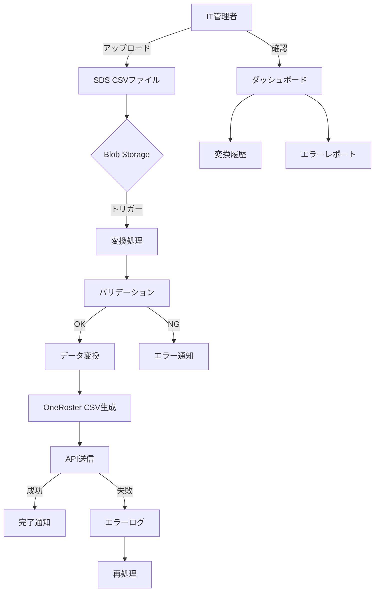

# SDS to OneRoster 変換ツール - 機能要件定義

**文書バージョン**: 1.0.0  
**作成日**: 2025-10-27  
**最終更新**: 2025-10-27  
**ステータス**: Draft

---

## 1. 機能要件概要

本文書では、SDS2Rosterシステムの機能要件を定義する。

### 1.1 機能分類

| ID | 機能カテゴリ | 優先度 | 概要 |
|----|------------|--------|------|
| F1 | ファイルアップロード検知 | Must | Blob Storageへのファイルアップロードを検知 |
| F2 | データ変換 | Must | SDS形式からOneRoster形式への変換 |
| F3 | データバリデーション | Must | 変換前後のデータ検証 |
| F4 | ファイル送信 | Must | CSVアップロードAPI経由でのファイル送信 |
| F5 | ログ・履歴管理 | Must | 変換履歴とログの記録 |
| F6 | エラーハンドリング | Must | エラー検知と通知 |
| F7 | 監視・レポート | Should | 変換ステータスの可視化 |
| F8 | 再処理機能 | Should | 失敗したジョブの再実行 |

---

## 2. 詳細機能要件

### F1: ファイルアップロード検知機能

#### F1-1: Blob Storage監視

**要件ID**: FR-F1-001  
**優先度**: Must  
**説明**: Azure Blob StorageにSDS CSVファイルがアップロードされたことを自動的に検知する。

**受け入れ基準**:
- ファイルアップロード後、10秒以内に検知される
- 対象ファイル形式: `.csv`
- **対象ファイル名パターン（SDS V1形式）**:
  - **必須ファイル**: `school.csv`, `student.csv`, `teacher.csv`
  - **クラス管理ファイル**: `section.csv`, `studentenrollment.csv`, `teacherroster.csv`
  - 参考: [SDS V1 CSV File Format](https://learn.microsoft.com/schooldatasync/sds-v1-csv-file-format)
- 複数ファイルの同時アップロードに対応
- アップロード検知時にAzure Functionがトリガーされる
- **Event Grid-based Blob Trigger**を使用（低レイテンシ、高スケール対応）
- **Storage Account分離**: Function App用とBlob Storage用で別のStorage Accountを使用してパフォーマンスを最適化

**技術仕様**:
- トリガータイプ: Blob Trigger (Event Grid-based)
  - 利点: ポーリングベースよりも低レイテンシ（即座に検知）
  - 利点: 100,000件以上のBlobや高頻度更新に対応
  - Event Gridサブスクリプション必須
- Storage Account構成:
  - Function App Storage: `sds2rosterfuncsa` (AzureWebJobsStorage用)
  - Data Storage: `sds2rosterdatasa` (CSV入出力用)
  - 参考: [Azure Functions Storage Best Practices](https://learn.microsoft.com/azure/azure-functions/storage-considerations#working-with-blobs)

**入力**:
- Blob Storageコンテナ名: `sds-csv-input`
- ディレクトリ構造: `yyyymmdd/` (例: `20251027/`)
  - `yyyymmdd`: 西暦年月日（8桁）
  - SDSファイルは日付別ディレクトリ配下に配置
  - 例: `sds-csv-input/20251027/school.csv`
- ファイル: SDS CSV形式

**出力**:
- イベントトリガー（Azure Function起動）
- 検知ログ（Timestamp、ファイル名、ファイルサイズ、ディレクトリパス）

---

#### F1-2: ファイルセットの完全性チェック

**要件ID**: FR-F1-002  
**優先度**: Must  
**説明**: SDS CSVの必須ファイルがすべて揃っているかを確認する。

**受け入れ基準**:
- **必須ファイル（ユーザー管理のみの場合）**: `school.csv`, `student.csv`, `teacher.csv`
- **クラス管理ファイル（クラス・登録を管理する場合）**: `section.csv`, `studentenrollment.csv`, `teacherroster.csv`
  - クラス管理を行う場合、必須3ファイル + クラス管理3ファイルの計6ファイルが必要
- **ファイルグループ化**: 同一`yyyymmdd`ディレクトリ内のファイルを1つのセットとして扱う
- すべての必須ファイルが揃うまで変換処理を開始しない
- ファイル待機タイムアウト: 5分（同一ディレクトリ内で最初のファイル検知から）
- 参考: [SDS V1 CSV File Format - Required Files](https://learn.microsoft.com/schooldatasync/sds-v1-csv-file-format)

**入力**:
- アップロードされたCSVファイル一覧（ディレクトリパス含む）
- ディレクトリパス: `sds-csv-input/yyyymmdd/`

**出力**:
- 完全性チェック結果（OK/NG）
- 不足ファイル一覧（NGの場合）
- 処理対象ディレクトリパス

---

### F2: データ変換機能

#### F2-1: SDS CSV読み込み

**要件ID**: FR-F2-001  
**優先度**: Must  
**説明**: SDS形式のCSVファイルを読み込み、内部データ構造に変換する。

**受け入れ基準**:
- UTF-8エンコーディング対応
- BOM付きUTF-8対応
- CSV形式エラーの検出（不正な引用符、列数不一致等）
- 最大ファイルサイズ: 500MB
- 最大レコード数: 100万件

**SDS CSVファイル仕様**:

##### school.csv（学校/組織）
| 列名 | データ型 | 必須 | 説明 |
|------|---------|------|------|
| SIS ID | String | Yes | 学校の一意識別子 |
| Name | String | Yes | 学校名 |
| School Number | String | No | 学校番号 |

##### student.csv（生徒）
| 列名 | データ型 | 必須 | 説明 |
|------|---------|------|------|
| SIS ID | String | Yes | 生徒の一意識別子 |
| School SIS ID | String | Yes | 所属学校のSIS ID |
| Username | String | Yes | ユーザー名 |
| First Name | String | Yes | 名 |
| Last Name | String | Yes | 姓 |
| Middle Name | String | No | ミドルネーム |
| Secondary Email | String | No | セカンダリメールアドレス |
| Student Number | String | No | 生徒番号 |
| Grade | String | No | 学年（例: K, 1-12） |

##### teacher.csv（教員）
| 列名 | データ型 | 必須 | 説明 |
|------|---------|------|------|
| SIS ID | String | Yes | 教員の一意識別子 |
| School SIS ID | String | Yes | 所属学校のSIS ID |
| Username | String | Yes | ユーザー名 |
| First Name | String | Yes | 名 |
| Last Name | String | Yes | 姓 |
| Middle Name | String | No | ミドルネーム |
| Teacher Number | String | No | 教員番号 |
| Secondary Email | String | No | セカンダリメールアドレス |

##### section.csv（クラス/セクション）
| 列名 | データ型 | 必須 | 説明 |
|------|---------|------|------|
| SIS ID | String | Yes | セクションの一意識別子 |
| School SIS ID | String | Yes | 所属学校のSIS ID |
| Section Name | String | Yes | セクション名 |
| Section Number | String | No | セクション番号 |
| Course SIS ID | String | No | コースID |
| Course Name | String | No | コース名 |
| Course Number | String | No | コース番号 |

##### studentenrollment.csv（生徒登録）
| 列名 | データ型 | 必須 | 説明 |
|------|---------|------|------|
| Section SIS ID | String | Yes | セクションID |
| SIS ID | String | Yes | 生徒のSIS ID |

##### teacherroster.csv（教員配置）
| 列名 | データ型 | 必須 | 説明 |
|------|---------|------|------|
| Section SIS ID | String | Yes | セクションID |
| SIS ID | String | Yes | 教員のSIS ID |

**注意**: すべてのファイル名は小文字で、列名は大文字小文字を区別します。  
**参考**: [Microsoft SDS V1 CSV File Format](https://learn.microsoft.com/schooldatasync/sds-v1-csv-file-format)

**入力**:
- SDS CSVファイル（基本3ファイル + クラス管理3ファイル）

**出力**:
- 内部データモデル（Python dict/dataclass）
- パースエラーリスト

---

#### F2-2: データマッピング（SDS → OneRoster）

**要件ID**: FR-F2-002  
**優先度**: Must  
**説明**: SDS CSVフィールドをOneRoster v1.2 CSVフィールドにマッピングする。

**受け入れ基準**:
- OneRoster v1.2仕様に完全準拠
- すべての必須フィールドが適切にマッピングされる
- 参照整合性が保証される（orgSourcedId, userSourcedId等）
- データ型が正しく変換される（String, DateTime, GUID等）

**OneRoster v1.2 CSV出力ファイル（7ファイル）**:
1. manifest.csv（必須：バージョン情報と含まれるファイルリスト）
2. orgs.csv（組織情報）
3. users.csv（ユーザー情報）
4. courses.csv（コース情報）
5. classes.csv（クラス情報）
6. enrollments.csv（登録情報）
7. academicSessions.csv（学期情報）

**注意**: OneRoster CSVではmanifest.csvが必須です。このファイルにはOneRosterバージョン（1.2）と含まれるすべてのCSVファイルのリストを記述します。

**マッピング詳細**:

**OneRoster CSVファイル出力仕様**:

##### orgs.csv（組織）
| 列名 | データ型 | 必須 | マッピング元（SDS） |
|------|---------|------|---------------------|
| sourcedId | GUID | Yes | 新規生成（School.SIS IDベース） |
| status | Enum | Yes | 固定値: "active" |
| dateLastModified | DateTime | Yes | 変換実行日時 |
| name | String | Yes | School.Name |
| type | Enum | Yes | 固定値: "school" |
| identifier | String | No | School.School Number |
| metadata | JSON | No | 空 |

##### users.csv（ユーザー）
| 列名 | データ型 | 必須 | マッピング元（SDS） |
|------|---------|------|---------------------|
| sourcedId | GUID | Yes | 新規生成（Student/Teacher.SIS IDベース） |
| status | Enum | Yes | 固定値: "active" |
| dateLastModified | DateTime | Yes | 変換実行日時 |
| enabledUser | Boolean | Yes | 固定値: true |
| orgSourcedIds | Array | Yes | orgs.sourcedId |
| role | Enum | Yes | "student" or "teacher" |
| username | String | Yes | Student/Teacher.Username |
| userIds | JSON | No | SIS ID格納 |
| givenName | String | Yes | Student/Teacher.First Name |
| familyName | String | Yes | Student/Teacher.Last Name |
| middleName | String | No | 空 |
| email | String | No | Student/Teacher.Email |
| sms | String | No | 空 |
| phone | String | No | 空 |
| agents | Array | No | 空 |
| grades | Array | No | Student.Grade |
| password | String | No | 空 |

##### courses.csv（コース）
| 列名 | データ型 | 必須 | マッピング元（SDS） |
|------|---------|------|---------------------|
| sourcedId | GUID | Yes | 新規生成（Section.Course SIS IDベース） |
| status | Enum | Yes | 固定値: "active" |
| dateLastModified | DateTime | Yes | 変換実行日時 |
| schoolYearSourcedId | GUID | No | 空（academicSessionsで定義） |
| title | String | Yes | Section.Section Name |
| courseCode | String | No | Section.Course SIS ID |
| grades | Array | No | 空 |
| orgSourcedId | GUID | Yes | orgs.sourcedId |
| subjects | Array | No | 空 |
| subjectCodes | Array | No | 空 |
| metadata | JSON | No | 空 |

##### classes.csv（クラス）
| 列名 | データ型 | 必須 | マッピング元（SDS） |
|------|---------|------|---------------------|
| sourcedId | GUID | Yes | 新規生成（Section.SIS IDベース） |
| status | Enum | Yes | 固定値: "active" |
| dateLastModified | DateTime | Yes | 変換実行日時 |
| title | String | Yes | Section.Section Name |
| grades | Array | No | 空 |
| courseSourcedId | GUID | Yes | courses.sourcedId |
| classCode | String | No | Section.SIS ID |
| classType | Enum | Yes | 固定値: "scheduled" |
| location | String | No | 空 |
| schoolSourcedId | GUID | Yes | orgs.sourcedId |
| termSourcedIds | Array | No | 空 |
| subjects | Array | No | 空 |
| subjectCodes | Array | No | 空 |
| periods | Array | No | 空 |
| metadata | JSON | No | 空 |

##### enrollments.csv（登録）
| 列名 | データ型 | 必須 | マッピング元（SDS） |
|------|---------|------|---------------------|
| sourcedId | GUID | Yes | 新規生成 |
| status | Enum | Yes | 固定値: "active" |
| dateLastModified | DateTime | Yes | 変換実行日時 |
| classSourcedId | GUID | Yes | classes.sourcedId |
| schoolSourcedId | GUID | Yes | orgs.sourcedId |
| userSourcedId | GUID | Yes | users.sourcedId |
| role | Enum | Yes | "student" or "teacher" |
| primary | Boolean | No | 固定値: true |
| beginDate | Date | No | 空 |
| endDate | Date | No | 空 |
| metadata | JSON | No | 空 |

##### academicSessions.csv（学期）
| 列名 | データ型 | 必須 | マッピング元（SDS） |
|------|---------|------|---------------------|
| sourcedId | GUID | Yes | 新規生成 |
| status | Enum | Yes | 固定値: "active" |
| dateLastModified | DateTime | Yes | 変換実行日時 |
| title | String | Yes | 固定値: "2025 Academic Year" |
| type | Enum | Yes | 固定値: "schoolYear" |
| startDate | Date | Yes | 固定値: 2025-04-01 |
| endDate | Date | Yes | 固定値: 2026-03-31 |
| parentSourcedId | GUID | No | 空 |
| schoolYear | String | Yes | 固定値: "2025" |
| metadata | JSON | No | 空 |

**入力**:
- 内部データモデル（SDS形式）

**出力**:
- OneRoster CSV ファイル（6種類）
- データマッピングログ
- 変換警告リスト（データ欠損等）

---

#### F2-3: GUID生成

**要件ID**: FR-F2-003  
**優先度**: Must  
**説明**: OneRosterで必須のsourcedId（GUID）を一意に生成する。

**受け入れ基準**:
- SDS SIS IDを元に決定論的にGUIDを生成（同じSIS IDから常に同じGUIDが生成される）
- UUID v5（名前ベース）を使用
- 名前空間: カスタム名前空間UUID（組織固有）
- 重複チェック（同一変換ジョブ内で重複しない）

**アルゴリズム**:
```python
import uuid

NAMESPACE_SDS = uuid.UUID('12345678-1234-5678-1234-567812345678')  # 組織固有

def generate_sourced_id(entity_type: str, sis_id: str) -> str:
    name = f"{entity_type}:{sis_id}"
    return str(uuid.uuid5(NAMESPACE_SDS, name))
```

**入力**:
- エンティティタイプ（org, user, class等）
- SDS SIS ID

**出力**:
- GUID（UUID v5形式）

---

#### F2-4: OneRoster CSV出力

**要件ID**: FR-F2-004  
**優先度**: Must  
**説明**: 変換されたデータをOneRoster v1.2 CSV形式で出力する。

**受け入れ基準**:
- OneRoster v1.2 CSV仕様に完全準拠
- UTF-8エンコーディング（BOMなし）
- RFC 4180準拠のCSVフォーマット
- ヘッダー行を含む
- 出力先: Azure Blob Storage（別コンテナ）
- 出力ディレクトリ構造: `oneroster-output/yyyymmdd/` (入力と同じ日付)
  - 例: 入力が`sds-csv-input/20251027/`の場合、出力は`oneroster-output/20251027/`

**出力ファイル**:
1. `manifest.csv`（必須：バージョン"1.2"とファイルリスト）
2. `orgs.csv`
3. `users.csv`
4. `courses.csv`
5. `classes.csv`
6. `enrollments.csv`
7. `academicSessions.csv`

**manifest.csv構造**:
```csv
propertyName,value
manifest.version,1.0
oneroster.version,1.2
file.orgs,bulk
file.users,bulk
file.courses,bulk
file.classes,bulk
file.enrollments,bulk
file.academicSessions,bulk
source.systemName,SDS
source.systemCode,SDS
```

**入力**:
- OneRoster内部データモデル

**出力**:
- OneRoster CSVファイル一式
- Blob Storage書き込みログ

---

### F3: データバリデーション機能

#### F3-1: 入力データバリデーション（SDS）

**要件ID**: FR-F3-001  
**優先度**: Must  
**説明**: SDS CSVファイルの妥当性を検証する。

**検証項目**:
1. **形式チェック**
   - CSV構文エラー（不正な引用符、列数不一致）
   - 文字エンコーディング（UTF-8）
   - ヘッダー行の存在と正確性

2. **必須フィールドチェック**
   - すべての必須列が存在するか
   - 必須フィールドに空値がないか

3. **データ型チェック**
   - SIS IDの形式（英数字、長さ制限）
   - メールアドレスの形式

4. **整合性チェック**
   - 外部キー参照の整合性（例: Student.School SIS IDがSchool.csvに存在）
   - 重複SIS IDチェック

5. **ビジネスルールチェック**
   - 学年の妥当性（K, 1-12）
   - 名前フィールドの長さ制限

**受け入れ基準**:
- エラー検出率: 100%（既知の不正データパターン）
- バリデーション処理時間: データ量の1%以内
- エラーレポートにエラー箇所（ファイル名、行番号、列名）を含む

**入力**:
- SDS CSV ファイル

**出力**:
- バリデーション結果（OK/NG）
- エラーレポート（JSON形式）

---

#### F3-2: 出力データバリデーション（OneRoster）

**要件ID**: FR-F3-002  
**優先度**: Must  
**説明**: 生成されたOneRoster CSVファイルの妥当性を検証する。

**検証項目**:
1. **OneRoster仕様準拠チェック**
   - 必須フィールドの存在
   - データ型の正確性（Enum値、日付形式等）
   - GUID形式の正確性

2. **整合性チェック**
   - enrollments.classSourcedIdがclasses.csvに存在
   - users.orgSourcedIdsがorgs.csvに存在
   - 循環参照がないこと

3. **統計チェック**
   - 変換前後のレコード数が一致
   - 欠損データの割合が閾値以下（5%）

**受け入れ基準**:
- OneRoster公式バリデーターとの整合性
- 全エンティティの整合性確認
- バリデーション結果をログに記録

**入力**:
- OneRoster CSV ファイル

**出力**:
- バリデーション結果（OK/NG）
- 警告リスト
- 統計レポート

---

### F4: ファイル送信機能

#### F4-1: CSVアップロードAPI接続

**要件ID**: FR-F4-001  
**優先度**: Must  
**説明**: CSVアップロードAPIに接続し、変換したCSVファイルを送信する。

**受け入れ基準**:
- Azure AD OAuth 2.0認証（Client Credentials Flow）
- API Key認証（X-API-Key ヘッダー）
- HTTPS通信（TLS 1.2以上）
- 接続タイムアウト: 60秒
- リトライ機能（指数バックオフ、最大3回）
- レート制限への対応（429 Too Many Requests）

**APIエンドポイント**:
- ベースURL: 設定ファイルから取得
  - 開発: `https://api-dev.oneroster-hub.example.com`
  - 本番: `https://api-py.oneroster-hub.example.com` または `https://api-js.oneroster-hub.example.com`
- CSVアップロードエンドポイント: `POST /api/v1/upload`
- ステータス確認エンドポイント: `GET /api/v1/upload/{uploadId}`

**認証フロー**:
```
1. Azure ADトークン取得
   POST https://login.microsoftonline.com/{tenant_id}/oauth2/v2.0/token
   Body: client_id, client_secret, grant_type=client_credentials
   Response: access_token, expires_in

2. CSVファイルアップロード
   POST /api/v1/upload
   Headers: 
     - Authorization: Bearer {access_token}
     - X-API-Key: {api_key}
     - Content-Type: multipart/form-data
   Body: metadata.json + CSV files
   Response: 202 Accepted, uploadId
```

**入力**:
- OneRoster CSVファイル一式（7ファイル）
- metadata.json（メタデータ情報）
- API認証情報（Key Vault取得）

**出力**:
- アップロード結果（成功/失敗）
- アップロードID
- レスポンスログ

---

#### F4-2: バッチCSVファイルアップロード

**要件ID**: FR-F4-002  
**優先度**: Must  
**説明**: 複数のOneRoster CSVファイルを一括でAPIに送信する。

**受け入れ基準**:
- multipart/form-dataで複数ファイル送信
- ファイルサイズ制限: 1ファイル最大50MB、合計最大100MB
- メタデータJSON付与（ソース、バージョン、レコード数、チェックサム）
- 送信ファイルリスト:
  - 必須: orgs.csv, users.csv
  - オプション: courses.csv, classes.csv, enrollments.csv, academicSessions.csv, demographics.csv
- 非同期処理（202 Acceptedレスポンス）

**メタデータJSON形式**:
```json
{
  "source": "sds2roster",
  "version": "python|javascript",
  "sourceDirectory": "20251027",
  "processingDate": "2025-10-27T10:30:00Z",
  "recordCounts": {
    "orgs": 150,
    "users": 2500,
    "courses": 80,
    "classes": 120,
    "enrollments": 3000
  },
  "checksum": {
    "orgs": "sha256:abc123...",
    "users": "sha256:def456..."
  }
}
```

**入力**:
- OneRoster CSV ファイル一式（2-7ファイル）
- メタデータJSON

**出力**:
- アップロード結果（202 Accepted）
- uploadId
- 受信ファイル一覧

---

#### F4-3: 送信ステータス確認

**要件ID**: FR-F4-003  
**優先度**: Should  
**説明**: API側でのファイル処理ステータスを確認する。

**受け入れ基準**:
- uploadIdを使用してステータスポーリング
- ポーリング間隔: 10秒
- 最大ポーリング時間: 30分
- ステータス: accepted, processing, completed, failed, partial_success

**APIエンドポイント**:
- GET `/api/v1/upload/{uploadId}`

**入力**:
- uploadId

**出力**:
- アップロードステータス
- 処理済みファイル数
- 各ファイルの処理状況（レコード数、エラー数）
- エラー詳細（失敗時）

---

### F5: ログ・履歴管理機能

#### F5-1: 変換履歴記録

**要件ID**: FR-F5-001  
**優先度**: Must  
**説明**: すべての変換ジョブの履歴を記録する。

**記録項目**:
- ジョブID（GUID）
- 開始日時、終了日時
- ステータス（success, failed, partial）
- 入力ファイル一覧（ファイル名、サイズ、ハッシュ値）
- 出力ファイル一覧
- 変換レコード数（エンティティ別）
- エラー数、警告数
- 実行ユーザー（アップロードユーザー）

**保存先**:
- Azure Table Storage
- 保存期間: 1年間

**Table Storage設計**:
- **テーブル名**: JobHistory
- **Partition Key**: YYYY-MM（年月）
- **Row Key**: jobId（タイムスタンプ逆順）
- **プロパティ**: 
  - jobId: ジョブID
  - status: ステータス（Processing, Completed, Failed）
  - startTime: 開始時刻
  - endTime: 終了時刻
  - inputDirectory: 入力ディレクトリパス（例: `sds-csv-input/20251027/`）
  - outputDirectory: 出力ディレクトリパス（例: `oneroster-output/20251027/`）
  - inputFiles: 入力ファイルリスト（JSON配列）
  - outputFiles: 出力ファイルリスト（JSON配列）
  - recordCounts: レコード数（JSON: `{orgs: 10, users: 150, ...}`）
  - errors: エラー数
  - warnings: 警告数
  - userId: 実行ユーザーID

**受け入れ基準**:
- すべてのジョブが記録される
- 履歴データの検索・フィルタリングが可能（月単位での高速クエリ）
- 監査ログとして使用可能

---

#### F5-2: 詳細ログ出力

**要件ID**: FR-F5-002  
**優先度**: Must  
**説明**: 変換処理の詳細ログを出力する。

**ログレベル**:
- ERROR: 処理失敗、重大なエラー
- WARNING: データ欠損、非推奨フィールド使用
- INFO: 処理開始/終了、ファイル読み込み完了
- DEBUG: 詳細な処理内容（開発時のみ）

**ログフォーマット**:
- 構造化ログ（JSON形式）
- タイムスタンプ（UTC、ISO 8601）
- ジョブID、ファイル名、行番号等のコンテキスト情報

**保存先**:
- Azure Application Insights
- 保存期間: 90日間

**受け入れ基準**:
- すべてのエラーがログに記録される
- Application Insightsでクエリ可能
- 警告・エラー発生時にアラート通知

---

#### F5-3: 変換レポート生成

**要件ID**: FR-F5-003  
**優先度**: Should  
**説明**: 変換結果のサマリーレポートを生成する。

**レポート内容**:
- 変換ジョブ概要（ジョブID、日時、ステータス）
- 入力データ統計（ファイル数、レコード数）
- 出力データ統計（エンティティ別レコード数）
- エラー・警告サマリー
- 処理時間
- データ品質スコア

**フォーマット**:
- JSON（プログラム処理用）
- Markdown（人間可読）

**保存先**:
- Blob Storage（レポート専用コンテナ）

**受け入れ基準**:
- 各変換ジョブごとにレポート生成
- レポートダウンロード可能
- レポートからエラー詳細へリンク

---

### F6: エラーハンドリング機能

#### F6-1: エラー検出・分類

**要件ID**: FR-F6-001  
**優先度**: Must  
**説明**: 発生したエラーを検出し、適切に分類する。

**エラー分類**:
1. **Fatal Error（致命的エラー）**: 処理を中断
   - ファイル読み込みエラー
   - 認証失敗
   - API接続不可
   - データベース接続エラー

2. **Validation Error（検証エラー）**: データ品質問題
   - 必須フィールド欠損
   - データ型不一致
   - 整合性エラー

3. **Transformation Error（変換エラー）**: マッピング失敗
   - マッピング定義エラー
   - GUID生成失敗

4. **API Error（API送信エラー）**:
   - タイムアウト
   - レート制限
   - サーバーエラー（5xx）

**受け入れ基準**:
- すべてのエラーが適切に分類される
- エラーコードとエラーメッセージが標準化されている
- エラー発生箇所（ファイル名、行番号）が特定可能

---

#### F6-2: エラー通知

**要件ID**: FR-F6-002  
**優先度**: Must  
**説明**: エラー発生時に関係者に通知する。

**通知方法**:
- メール通知（Azure Logic Apps）
- Teams通知（Webhook）
- Application Insightsアラート

**通知対象エラー**:
- Fatal Error: 即座に通知
- Validation Error（10件以上）: ジョブ完了時に通知
- API Error: 3回リトライ失敗後に通知

**通知内容**:
- エラー種別
- ジョブID
- エラー発生日時
- エラーメッセージ
- エラーファイル・行番号
- 推奨対応アクション

**受け入れ基準**:
- エラー発生から5分以内に通知
- 通知メールにエラー詳細とログへのリンクを含む
- 重複通知を防ぐ（同一エラーは1回のみ）

---

#### F6-3: エラーリカバリー

**要件ID**: FR-F6-003  
**優先度**: Should  
**説明**: エラー発生後の復旧処理を実行する。

**リカバリー戦略**:
1. **自動リトライ**:
   - 一時的エラー（ネットワーク、タイムアウト）
   - 指数バックオフ（1秒、2秒、4秒）
   - 最大3回

2. **部分成功処理**:
   - 一部のファイルのみ変換成功時、成功分のみAPI送信
   - 失敗ファイルをエラーキューに格納

3. **手動再処理**:
   - 管理者による失敗ジョブの再実行
   - エラー修正後の再アップロード

**受け入れ基準**:
- 一時的エラーの90%が自動リトライで成功
- 部分成功時にロールバックせず、成功分を有効化
- 再処理機能により手動復旧可能

---

### F7: 監視・レポート機能

#### F7-1: リアルタイム監視ダッシュボード

**要件ID**: FR-F7-001  
**優先度**: Should  
**説明**: 変換処理の状況をリアルタイムで可視化する。

**表示項目**:
- 現在実行中のジョブ数
- ジョブステータス（pending, processing, completed, failed）
- 処理進捗率
- エラー・警告件数
- 平均処理時間
- API送信ステータス

**技術スタック**:
- Azure Application Insights
- Power BI または Grafana

**受け入れ基準**:
- ダッシュボードが5秒ごとに更新される
- 過去24時間の履歴が表示される
- エラー発生時に赤色で強調表示

---

#### F7-2: 定期レポート

**要件ID**: FR-F7-002  
**優先度**: Should  
**説明**: 定期的な運用レポートを生成する。

**レポート種類**:
1. **日次レポート**:
   - 当日の変換ジョブ数
   - 成功率
   - エラーサマリー

2. **週次レポート**:
   - 週間統計
   - データ品質トレンド
   - システムパフォーマンス

3. **月次レポート**:
   - 月間統計
   - コスト分析
   - SLA達成状況

**配信方法**:
- メール自動配信
- Blob Storageに保存

**受け入れ基準**:
- 定時配信（日次: 8:00、週次: 月曜8:00、月次: 1日8:00）
- PDF/HTML形式
- グラフ・チャートを含む視覚的なレポート

---

### F8: 再処理機能

#### F8-1: 失敗ジョブ再実行

**要件ID**: FR-F8-001  
**優先度**: Should  
**説明**: 失敗したジョブを再実行する機能を提供する。

**再実行トリガー**:
1. 管理画面からの手動実行
2. REST API経由での実行
3. スケジュール再実行（夜間バッチ）

**再実行モード**:
- **完全再実行**: 最初から全ファイルを再処理
- **差分再実行**: 失敗した部分のみ再処理
- **強制再実行**: バリデーションエラーを無視して実行（管理者のみ）

**受け入れ基準**:
- 再実行時に元のジョブIDを参照
- 再実行履歴を記録
- 再実行回数制限（最大5回）

---

#### F8-2: データ修正機能

**要件ID**: FR-F8-002  
**優先度**: Could  
**説明**: エラーの原因となったデータを修正する機能を提供する。

**修正方法**:
1. **手動修正**:
   - 管理画面でCSVエラー箇所を表示
   - ユーザーがCSVファイルを修正して再アップロード

2. **自動修正（簡易）**:
   - よくあるエラーパターンを自動修正（例: 全角数字→半角数字）
   - トリミング（前後の空白削除）

**受け入れ基準**:
- エラー箇所をハイライト表示
- 修正提案を表示（自動修正可能な場合）
- 修正履歴を記録

---

## 3. 機能優先順位マトリクス

| 機能ID | 機能名 | ビジネス価値 | 技術的複雑度 | 優先度 | スプリント |
|--------|--------|------------|-------------|--------|-----------|
| F1 | ファイルアップロード検知 | High | Low | Must | Sprint 1 |
| F2 | データ変換 | High | High | Must | Sprint 2-3 |
| F3 | データバリデーション | High | Medium | Must | Sprint 2 |
| F4 | API送信 | High | Medium | Must | Sprint 3 |
| F5 | ログ・履歴管理 | Medium | Low | Must | Sprint 4 |
| F6 | エラーハンドリング | High | Medium | Must | Sprint 4 |
| F7 | 監視・レポート | Medium | Medium | Should | Sprint 5 |
| F8 | 再処理機能 | Medium | Low | Should | Sprint 6 |

---

## 4. ユースケース図



---

## 5. 関連ドキュメント

- [プロジェクト概要](./01_project_overview.md)
- [非機能要件定義](./03_non_functional_requirements.md)
- [ユーザーストーリー](./04_user_stories.md)
- [データマッピング仕様](./05_data_mapping.md)

---

## 6. 承認履歴

| 日付 | 承認者 | 役割 | ステータス |
|------|--------|------|-----------|
| 2025-10-27 | - | Requirements Analyst | Draft |
| - | - | Product Owner | Pending |
| - | - | Technical Lead | Pending |

---

## 7. 変更履歴

| バージョン | 日付 | 変更内容 | 変更者 |
|-----------|------|---------|--------|
| 1.0.0 | 2025-10-27 | 初版作成 | Requirements Analyst |
