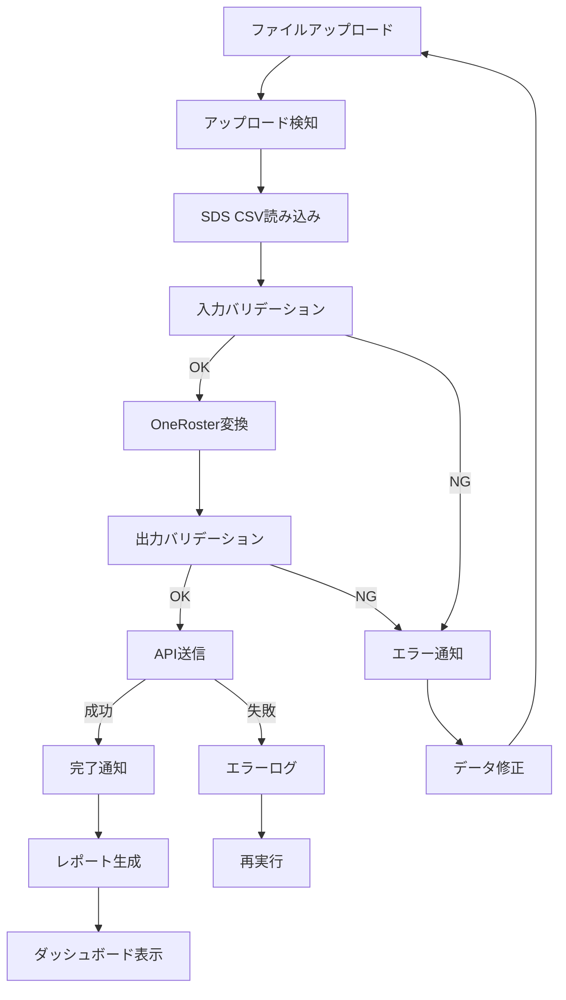

# SDS to OneRoster 変換ツール - ユーザーストーリー

**文書バージョン**: 1.0.0  
**作成日**: 2025-10-27  
**最終更新**: 2025-10-27  
**ステータス**: Draft

---

## 1. ユーザーストーリー概要

本文書では、SDS2Rosterシステムのユーザーストーリーを記載する。各ストーリーは以下の形式で記述される：

**フォーマット**:
```
As a [ユーザーロール]
I want to [やりたいこと]
So that [得られる価値]
```

---

## 2. ペルソナ定義

### ペルソナ1: IT管理者（田中太郎）
- **役割**: 学校のITシステム管理者
- **経験**: IT管理5年、教育システム2年
- **技術レベル**: 中級（CSVファイル操作、基本的なクラウド知識）
- **目標**: データ連携作業の自動化、作業時間削減
- **課題**: 手動変換に時間がかかる、ミスが発生する

### ペルソナ2: システム管理者（佐藤花子）
- **役割**: 教育委員会のシステム管理者
- **経験**: システム管理10年、複数校の統括管理
- **技術レベル**: 上級（Azure管理、スクリプト作成可能）
- **目標**: 複数校のデータを効率的に管理、運用負荷削減
- **課題**: 複数校の処理に時間がかかる、エラー対応が大変

### ペルソナ3: 開発者（鈴木次郎）
- **役割**: 教育アプリケーションの開発者
- **経験**: Web開発5年、OneRoster API連携経験あり
- **技術レベル**: 上級（Python、REST API、Azure）
- **目標**: OneRosterデータの安定供給、API統合の簡易化
- **課題**: データ品質が不安定、エラー時の調査が困難

---

## 3. エピック一覧

| Epic ID | エピック名 | 説明 | 優先度 |
|---------|----------|------|--------|
| E1 | ファイルアップロードと検知 | SDS CSVファイルをアップロードし、処理を開始 | Must |
| E2 | データ変換 | SDS形式からOneRoster形式への変換 | Must |
| E3 | データ品質保証 | バリデーションとエラーハンドリング | Must |
| E4 | ファイルアップロード連携 | CSVファイルのアップロードとステータス確認 | Must |
| E5 | 監視と運用 | システム監視、ログ確認、レポート | Should |
| E6 | エラー復旧 | エラー発生時の再処理と修正 | Should |

---

## 4. ユーザーストーリー詳細

## Epic E1: ファイルアップロードと検知

### US-E1-01: CSVファイルのアップロード

**ストーリーID**: US-E1-01  
**優先度**: Must  
**ポイント**: 3  
**ペルソナ**: IT管理者

**ストーリー**:
```
As an IT管理者
I want to SDS CSVファイルをAzure Blob Storageにアップロードする
So that 自動的に変換処理が開始される
```

**受け入れ基準**:
- [ ] Azureポータルまたは管理画面からCSVファイルをアップロードできる
- [ ] ファイルは`sds-csv-input/yyyymmdd/`ディレクトリ配下にアップロードされる（例: `sds-csv-input/20251027/`）
- [ ] 複数ファイル（最大6ファイル）を同時にアップロードできる
- [ ] ドラッグ&ドロップでアップロードできる
- [ ] アップロード進捗が表示される
- [ ] アップロード完了後、確認メッセージが表示される
- [ ] 最大ファイルサイズ500MBまで対応

**備考**:
- 対象ファイル: `School.csv`, `Student.csv`, `Teacher.csv`, `Section.csv`, `StudentEnrollment.csv`, `TeacherRoster.csv`
- ディレクトリ命名規則: `yyyymmdd`形式（8桁の西暦年月日）

---

### US-E1-02: ファイルアップロード検知

**ストーリーID**: US-E1-02  
**優先度**: Must  
**ポイント**: 5  
**ペルソナ**: システム管理者

**ストーリー**:
```
As a システム管理者
I want to ファイルアップロード後、自動的に変換処理が開始される
So that 手動で処理を起動する必要がない
```

**受け入れ基準**:
- [ ] ファイルアップロード後10秒以内に検知される
- [ ] 同一`yyyymmdd`ディレクトリ内のファイルを1つのセットとして処理する
- [ ] Azure Functionが自動的にトリガーされる
- [ ] 検知ログがApplication Insightsに記録される
- [ ] 必須ファイルが揃うまで待機する（タイムアウト5分）
- [ ] ファイルセットが完全な場合のみ変換処理を開始

**技術的詳細**:
- Blob Storage Event Grid Trigger使用
- ファイルセット完全性チェック実装

---

### US-E1-03: アップロード履歴の確認

**ストーリーID**: US-E1-03  
**優先度**: Should  
**ポイント**: 3  
**ペルソナ**: IT管理者

**ストーリー**:
```
As an IT管理者
I want to 過去にアップロードしたファイルの履歴を確認する
So that いつ、どのファイルをアップロードしたか把握できる
```

**受け入れ基準**:
- [ ] アップロード履歴がリスト表示される
- [ ] アップロード日時、ファイル名、サイズが表示される
- [ ] 処理ステータス（pending, processing, completed, failed）が表示される
- [ ] 日付範囲でフィルタリングできる
- [ ] 履歴は最大1年間保存される

---

## Epic E2: データ変換

### US-E2-01: SDS CSV読み込み

**ストーリーID**: US-E2-01  
**優先度**: Must  
**ポイント**: 5  
**ペルソナ**: 開発者

**ストーリー**:
```
As a 開発者
I want to SDS CSV形式のファイルを正確に読み込む
So that 変換処理の基盤となるデータを取得できる
```

**受け入れ基準**:
- [ ] UTF-8エンコーディング（BOM付き含む）に対応
- [ ] CSV形式エラー（不正な引用符、列数不一致）を検出
- [ ] 最大100万レコードを処理できる
- [ ] パースエラー時に詳細なエラーメッセージを出力
- [ ] 処理進捗がログに記録される

---

### US-E2-02: OneRoster形式への変換

**ストーリーID**: US-E2-02  
**優先度**: Must  
**ポイント**: 13  
**ペルソナ**: 開発者

**ストーリー**:
```
As a 開発者
I want to SDSデータをOneRoster v1.2形式に正確に変換する
So that OneRoster APIで利用可能なデータが得られる
```

**受け入れ基準**:
- [ ] すべてのSDS必須フィールドがOneRosterフィールドにマッピングされる
- [ ] OneRoster必須フィールドがすべて生成される
- [ ] sourcedId（GUID）が一意に生成される
- [ ] データ型変換が正しく行われる（日付、Boolean等）
- [ ] 外部キー参照が整合性を保つ
- [ ] manifest.csvが生成される
- [ ] 変換ログが詳細に記録される

**技術的詳細**:
- UUID v5使用（決定論的GUID生成）
- データマッピング定義に基づく変換

---

### US-E2-03: 変換結果の確認

**ストーリーID**: US-E2-03  
**優先度**: Should  
**ポイント**: 3  
**ペルソナ**: IT管理者

**ストーリー**:
```
As an IT管理者
I want to 変換結果を管理画面で確認する
So that 正しく変換されたか確認できる
```

**受け入れ基準**:
- [ ] 変換前後のレコード数が表示される（エンティティ別）
- [ ] 変換成功率が表示される
- [ ] 警告・エラーの件数が表示される
- [ ] サンプルデータ（最初の5件）をプレビューできる
- [ ] 変換されたCSVファイルをダウンロードできる

---

### US-E2-04: 大量データの高速変換

**ストーリーID**: US-E2-04  
**優先度**: Must  
**ポイント**: 8  
**ペルソナ**: システム管理者

**ストーリー**:
```
As a システム管理者
I want to 10万件以上のデータを10分以内に変換する
So that 大規模校でも実用的に使用できる
```

**受け入れ基準**:
- [ ] 10万レコードを10分以内に変換
- [ ] バッチ処理により効率的に変換
- [ ] メモリ使用量が制限内（2GB以下）
- [ ] 処理中でも他のジョブを受け付ける
- [ ] 進捗状況がリアルタイムで確認できる

**技術的詳細**:
- ストリーミング処理
- 並列処理（マルチスレッド）

---

## Epic E3: データ品質保証

### US-E3-01: 入力データのバリデーション

**ストーリーID**: US-E3-01  
**優先度**: Must  
**ポイント**: 8  
**ペルソナ**: IT管理者

**ストーリー**:
```
As an IT管理者
I want to アップロードしたSDS CSVファイルのエラーを検出する
So that 不正なデータで処理が失敗するのを防ぐ
```

**受け入れ基準**:
- [ ] 必須フィールドの欠損を検出
- [ ] データ型エラーを検出（数値に文字列等）
- [ ] 外部キー参照の整合性を検証
- [ ] 重複SIS IDを検出
- [ ] メールアドレス形式を検証
- [ ] バリデーション結果レポートを生成
- [ ] エラー箇所（ファイル名、行番号、列名）を明示

---

### US-E3-02: 出力データのバリデーション

**ストーリーID**: US-E3-02  
**優先度**: Must  
**ポイント**: 5  
**ペルソナ**: 開発者

**ストーリー**:
```
As a 開発者
I want to 生成されたOneRoster CSVの妥当性を検証する
So that API送信前にデータ品質を保証できる
```

**受け入れ基準**:
- [ ] OneRoster v1.2仕様準拠を検証
- [ ] 必須フィールドの存在を確認
- [ ] GUID形式の正確性を検証
- [ ] Enum値の妥当性を確認
- [ ] 整合性チェック（外部キー参照）
- [ ] 変換前後のレコード数を比較
- [ ] 検証結果をログに記録

---

### US-E3-03: データ品質レポート

**ストーリーID**: US-E3-03  
**優先度**: Should  
**ポイント**: 5  
**ペルソナ**: システム管理者

**ストーリー**:
```
As a システム管理者
I want to データ品質のレポートを確認する
So that データの問題を早期に発見し対応できる
```

**受け入れ基準**:
- [ ] 変換成功率が表示される
- [ ] エラー・警告の統計が表示される
- [ ] データ欠損率が表示される
- [ ] エンティティ別の品質スコアが表示される
- [ ] トレンドグラフで品質推移を確認できる
- [ ] レポートをPDF/CSVでダウンロードできる

---

## Epic E4: ファイルアップロード連携

### US-E4-01: CSVファイルのアップロード

**ストーリーID**: US-E4-01  
**優先度**: Must  
**ポイント**: 8  
**ペルソナ**: 開発者

**ストーリー**:
```
As a 開発者
I want to 変換したCSVファイルをCSV Upload APIにアップロードする
So that 手動でファイル転送する必要がない
```

**受け入れ基準**:
- [ ] Azure AD + API Keyで認証される
- [ ] 複数のCSVファイルとmetadata.jsonを一括送信(multipart/form-data)
- [ ] SHA-256チェックサムで整合性検証
- [ ] ファイルサイズ制限(50MB/ファイル、100MB/リクエスト)を遵守
- [ ] タイムアウト時に自動リトライ(最大3回)
- [ ] レート制限(429 Too Many Requests)に対応
- [ ] アップロード結果がログに記録される

**技術的詳細**:
- 指数バックオフによるリトライ
- Azure AD Bearer Token + X-API-Key ヘッダー

---

### US-E4-02: アップロードステータス確認

**ストーリーID**: US-E4-02  
**優先度**: Should  
**ポイント**: 5  
**ペルソナ**: IT管理者

**ストーリー**:
```
As an IT管理者
I want to ファイルアップロード後の処理ステータスを確認する
So that CSV Upload API側での処理完了を把握できる
```

**受け入れ基準**:
- [ ] uploadIdを使用してステータスをポーリング
- [ ] ステータス(accepted, processing, completed, failed, partial_success)が表示される
- [ ] 処理済みレコード数が表示される
- [ ] エラー詳細が表示される(失敗時)
- [ ] ポーリングは最大30分間継続
- [ ] 完了時に通知が送信される

---

### US-E4-03: アップロードAPI認証情報の管理

**ストーリーID**: US-E4-03  
**優先度**: Must  
**ポイント**: 3  
**ペルソナ**: システム管理者

**ストーリー**:
```
As a システム管理者
I want to CSV Upload APIの認証情報を安全に管理する
So that 認証情報の漏洩を防ぐ
```

**受け入れ基準**:
- [ ] API Keyと認証情報はAzure Key Vaultに保存される
- [ ] 管理画面から認証情報を設定できる
- [ ] 認証情報は暗号化して保存される
- [ ] アクセスログが記録される
- [ ] 認証情報の有効期限を管理できる
- [ ] 期限切れ時にアラートが送信される

---

## Epic E5: 監視と運用

### US-E5-01: リアルタイム監視ダッシュボード

**ストーリーID**: US-E5-01  
**優先度**: Should  
**ポイント**: 8  
**ペルソナ**: システム管理者

**ストーリー**:
```
As a システム管理者
I want to 変換処理の状況をリアルタイムで監視する
So that 問題発生時に迅速に対応できる
```

**受け入れ基準**:
- [ ] 現在実行中のジョブ数が表示される
- [ ] ジョブステータス（pending, processing, completed, failed）が表示される
- [ ] 処理進捗率が表示される
- [ ] エラー・警告件数が表示される
- [ ] 平均処理時間が表示される
- [ ] ダッシュボードが5秒ごとに自動更新される
- [ ] 過去24時間の履歴が確認できる

---

### US-E5-02: 変換ログの確認

**ストーリーID**: US-E5-02  
**優先度**: Must  
**ポイント**: 5  
**ペルソナ**: IT管理者

**ストーリー**:
```
As an IT管理者
I want to 変換処理の詳細ログを確認する
So that エラー発生時の原因を調査できる
```

**受け入れ基準**:
- [ ] ジョブIDでログを検索できる
- [ ] ログレベル（ERROR, WARNING, INFO）でフィルタリングできる
- [ ] 日時範囲でフィルタリングできる
- [ ] ログにコンテキスト情報（ファイル名、行番号）が含まれる
- [ ] エラーログにスタックトレースが含まれる
- [ ] ログをCSV/JSONでエクスポートできる

---

### US-E5-03: 定期レポートの受信

**ストーリーID**: US-E5-03  
**優先度**: Should  
**ポイント**: 5  
**ペルソナ**: システム管理者

**ストーリー**:
```
As a システム管理者
I want to 日次・週次・月次の運用レポートを自動受信する
So that システムの健全性を定期的に確認できる
```

**受け入れ基準**:
- [ ] 日次レポートが毎日8:00に配信される
- [ ] 週次レポートが毎週月曜8:00に配信される
- [ ] 月次レポートが毎月1日8:00に配信される
- [ ] レポートにジョブ数、成功率、エラーサマリーが含まれる
- [ ] レポートにグラフ・チャートが含まれる
- [ ] レポートはメールとBlob Storageに保存される

---

### US-E5-04: アラート通知

**ストーリーID**: US-E5-04  
**優先度**: Must  
**ポイント**: 5  
**ペルソナ**: システム管理者

**ストーリー**:
```
As a システム管理者
I want to エラー発生時に即座に通知を受ける
So that 迅速に対応できる
```

**受け入れ基準**:
- [ ] Fatal Errorは即座に通知される
- [ ] Validation Error（10件以上）はジョブ完了時に通知される
- [ ] API Error（3回リトライ失敗後）に通知される
- [ ] 通知方法: メール、Teams Webhook
- [ ] 通知内容: エラー種別、ジョブID、エラーメッセージ、推奨対応
- [ ] 重複通知を防ぐ（同一エラーは1回のみ）

---

## Epic E6: エラー復旧

### US-E6-01: 失敗ジョブの再実行

**ストーリーID**: US-E6-01  
**優先度**: Should  
**ポイント**: 5  
**ペルソナ**: IT管理者

**ストーリー**:
```
As an IT管理者
I want to 失敗したジョブを再実行する
So that エラー修正後にデータを再処理できる
```

**受け入れ基準**:
- [ ] 管理画面から失敗ジョブを選択して再実行できる
- [ ] 再実行時に元のジョブIDが参照される
- [ ] 再実行モード（完全再実行、差分再実行）を選択できる
- [ ] 再実行履歴が記録される
- [ ] 再実行回数に制限がある（最大5回）
- [ ] 再実行成功時に通知が送信される

---

### US-E6-02: エラーデータの修正

**ストーリーID**: US-E6-02  
**優先度**: Could  
**ポイント**: 8  
**ペルソナ**: IT管理者

**ストーリー**:
```
As an IT管理者
I want to エラーの原因となったデータを修正する
So that 修正後に再処理できる
```

**受け入れ基準**:
- [ ] エラー箇所が管理画面にハイライト表示される
- [ ] エラーメッセージと推奨修正方法が表示される
- [ ] 修正したCSVファイルを再アップロードできる
- [ ] 自動修正機能（全角→半角、トリミング）が利用できる
- [ ] 修正履歴が記録される

---

### US-E6-03: ロールバック

**ストーリーID**: US-E6-03  
**優先度**: Could  
**ポイント**: 5  
**ペルソナ**: システム管理者

**ストーリー**:
```
As a システム管理者
I want to 誤って送信したデータをロールバックする
So that 誤ったデータがシステムに残らないようにする
```

**受け入れ基準**:
- [ ] 管理画面から過去のジョブを選択してロールバックできる
- [ ] ロールバック時にAPI経由でデータ削除リクエストが送信される
- [ ] ロールバック確認ダイアログが表示される
- [ ] ロールバック履歴が記録される
- [ ] ロールバック完了時に通知が送信される

---

## 5. ユーザーストーリーマッピング



---

## 6. スプリント計画

### Sprint 1（Week 1-2）: 基盤構築
- US-E1-01: CSVファイルのアップロード
- US-E1-02: ファイルアップロード検知
- US-E2-01: SDS CSV読み込み

**合計ポイント**: 13

---

### Sprint 2（Week 3-4）: コア変換機能
- US-E2-02: OneRoster形式への変換
- US-E3-01: 入力データのバリデーション
- US-E3-02: 出力データのバリデーション

**合計ポイント**: 26

---

### Sprint 3（Week 5-6）: ファイルアップロード連携
- US-E4-01: CSVファイルのアップロード
- US-E4-03: アップロードAPI認証情報の管理
- US-E2-04: 大量データの高速変換

**合計ポイント**: 19

---

### Sprint 4（Week 7-8）: 監視と運用
- US-E5-02: 変換ログの確認
- US-E5-04: アラート通知
- US-E1-03: アップロード履歴の確認
- US-E2-03: 変換結果の確認

**合計ポイント**: 16

---

### Sprint 5（Week 9-10）: 高度な監視
- US-E5-01: リアルタイム監視ダッシュボード
- US-E5-03: 定期レポートの受信
- US-E3-03: データ品質レポート
- US-E4-02: アップロードステータス確認

**合計ポイント**: 23

---

### Sprint 6（Week 11-12）: エラー復旧とポリッシュ
- US-E6-01: 失敗ジョブの再実行
- US-E6-02: エラーデータの修正
- US-E6-03: ロールバック
- バグ修正とパフォーマンスチューニング

**合計ポイント**: 18

---

**総ポイント**: 115ポイント  
**平均ベロシティ**: 19ポイント/スプリント

---

## 7. ストーリー優先順位

### 最優先（MVP必須）
- US-E1-01, US-E1-02: ファイルアップロードと検知
- US-E2-01, US-E2-02: データ変換
- US-E3-01, US-E3-02: バリデーション
- US-E4-01, US-E4-03: API送信
- US-E5-02, US-E5-04: ログとアラート

### 高優先（β版で必要）
- US-E2-04: 大量データ処理
- US-E1-03, US-E2-03: 履歴と結果確認
- US-E5-01, US-E5-03: ダッシュボードとレポート
- US-E6-01: 再実行機能

### 中優先（本番リリース後）
- US-E3-03: 品質レポート
- US-E4-02: APIステータス確認
- US-E6-02: エラーデータ修正

### 低優先（将来機能）
- US-E6-03: ロールバック

---

## 8. 関連ドキュメント

- [プロジェクト概要](./01_project_overview.md)
- [機能要件定義](./02_functional_requirements.md)
- [非機能要件定義](./03_non_functional_requirements.md)
- [データマッピング仕様](./05_data_mapping.md)

---

## 9. 承認履歴

| 日付 | 承認者 | 役割 | ステータス |
|------|--------|------|-----------|
| 2025-10-27 | - | Requirements Analyst | Draft |
| - | - | Product Owner | Pending |
| - | - | Agile Coach | Pending |

---

## 10. 変更履歴

| バージョン | 日付 | 変更内容 | 変更者 |
|-----------|------|---------|--------|
| 1.0.0 | 2025-10-27 | 初版作成 | Requirements Analyst |
