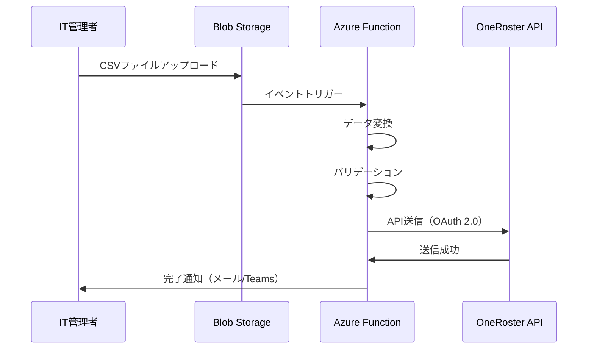
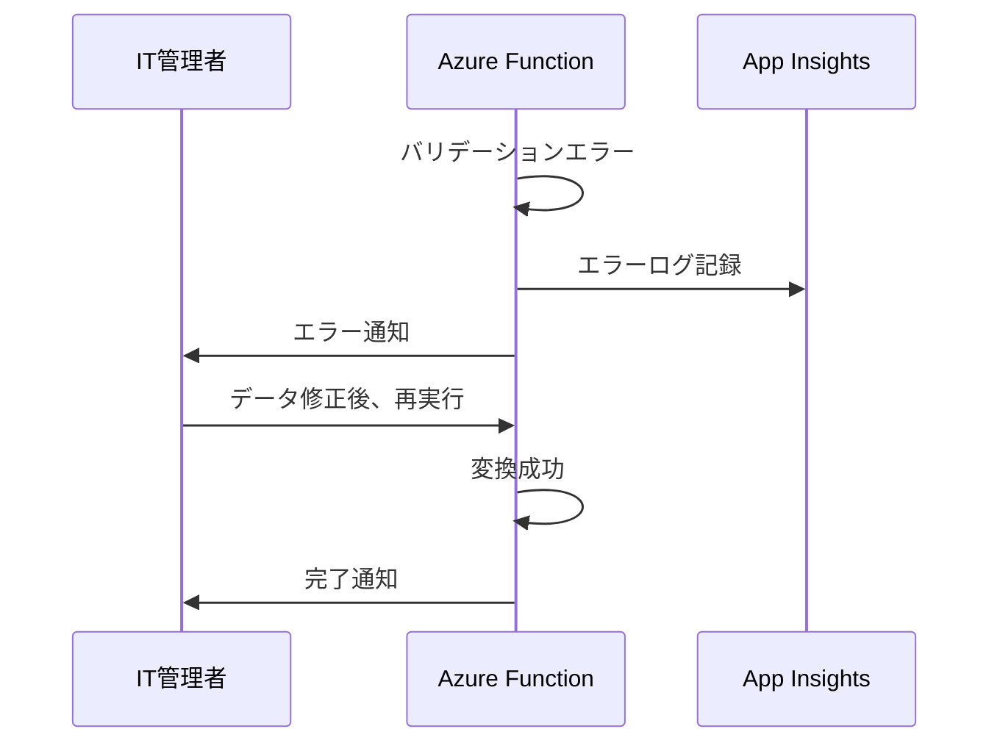
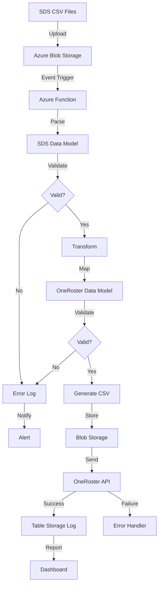

# SDS to OneRoster 変換ツール - 要件定義書

**プロジェクト名**: SDS2Roster  
**バージョン**: 1.0.0  
**作成日**: 2025-10-27  
**最終更新**: 2025-10-27  
**ステータス**: Draft

---

## 📋 ドキュメント概要

本要件定義書は、Microsoft School Data Sync (SDS) CSV形式をOneRoster v1.2 CSV形式に自動変換し、CSV Upload API経由でファイルをアップロードするクラウドベースシステム「SDS2Roster」の要件を定義するものです。

**注意**: OneRoster v1.2が現在の最新仕様です（2022年9月リリース）。

---

## 📚 ドキュメント構成

### 1. [プロジェクト概要](./01_project_overview.md)
- プロジェクトの目的と背景
- ステークホルダー
- 成功基準
- 制約条件と前提条件
- ビジネス価値とROI

**主要内容**:
- プロジェクト名: SDS2Roster
- 開発期間: 12週間
- 予算: 開発費500万円、月額運用費10万円
- 期待効果: 年間480万円のコスト削減

---

### 2. [機能要件定義](./02_functional_requirements.md)
- 機能要件の詳細仕様
- 8つの主要機能カテゴリ
- 受け入れ基準
- ユースケース図

**主要機能**:
- F1: ファイルアップロード検知
- F2: データ変換(SDS → OneRoster)
- F3: データバリデーション
- F4: ファイルアップロード(CSV Upload API連携)
- F5: ログ・履歴管理
- F6: エラーハンドリング
- F7: 監視・レポート
- F8: 再処理機能

---

### 3. [非機能要件定義](./03_non_functional_requirements.md)
- パフォーマンス、可用性、セキュリティ等の非機能要件
- 13の非機能要件カテゴリ
- 具体的な目標値と測定方法

**主要要件**:
- パフォーマンス: 10万レコード/10分以内
- 可用性: 99.9%(月間ダウンタイム43分以内)
- セキュリティ: Entra ID + API Key、データ暗号化(AES-256)
- スケーラビリティ: 最大100万ユーザー対応
- コスト: 月額10万円以内

---

### 4. [ユーザーストーリー](./04_user_stories.md)
- ペルソナ定義
- 6つのエピック、25個のユーザーストーリー
- 受け入れ基準
- スプリント計画（6スプリント）

**主要エピック**:
- E1: ファイルアップロードと検知
- E2: データ変換
- E3: データ品質保証
- E4: ファイルアップロード連携
- E5: 監視と運用
- E6: エラー復旧

**総ストーリーポイント**: 115ポイント  
**平均ベロシティ**: 19ポイント/スプリント

---

### 5. [データマッピング仕様](./05_data_mapping.md)
- SDS CSV → OneRoster CSV の詳細マッピング
- 9つのエンティティマッピング
- GUID生成アルゴリズム
- データ型変換ルール
- 整合性チェック仕様

**主要マッピング**:
- school.csv → orgs.csv
- student.csv / teacher.csv → users.csv
- section.csv → courses.csv + classes.csv
- studentenrollment.csv / teacherroster.csv → enrollments.csv
- （自動生成） → academicSessions.csv

**注意**: SDS V1形式のファイル名はすべて小文字です。

---

## 🎯 プロジェクト概要サマリー

### プロジェクト目的
Azure Blob StorageにアップロードされたSDS CSVファイルを自動的にOneRoster v1.2形式に変換し、CSV Upload API経由でアップロードする自動化システムを構築する。

### 主要機能
1. **自動変換**: Blob Storageへのアップロードをトリガーに自動変換
2. **データ品質保証**: 入力・出力データのバリデーション
3. **ファイルアップロード**: Entra ID + API Key認証によるCSV Upload APIへのアップロード
4. **監視・運用**: リアルタイムダッシュボード、定期レポート
5. **エラー復旧**: 失敗ジョブの再実行、エラーデータ修正

### 技術スタック
- **クラウド**: Azure(Functions, Blob Storage, Table Storage, Key Vault)
- **言語**: Python 3.11
- **認証**: Entra ID + API Key、Azure Managed Identity
- **監視**: Application Insights、Azure Monitor
- **CI/CD**: GitHub Actions
- **IaC**: Terraform

### Azureアーキテクチャのベストプラクティス適用

本プロジェクトは、Microsoft Learnの推奨事項に基づいたAzureベストプラクティスを採用しています：

**1. イベント駆動アーキテクチャ**
- **Event Grid-based Blob Trigger**: 従来のポーリングベースではなく、Event Gridを使用した低レイテンシ・高スケーラブルなBlob監視
- 参考: [Azure Functions Storage Considerations](https://learn.microsoft.com/azure/azure-functions/storage-considerations)

**2. Storage Account分離**
- **Function App専用Storage**: AzureWebJobsStorage用の独立したStorage Account
- **データ専用Storage**: CSV入出力用の独立したStorage Account
- 利点: パフォーマンス向上、イベント処理の競合回避

**3. セキュリティ強化**
- **Managed Identity優先**: Key Vault、Table Storage、Storage Accountへのアクセスに認証情報不要
- **Key Vault分離**: 環境ごと（開発、本番）に独立したKey Vault
- **RBAC over Access Policies**: Key VaultはAzure RBACモデルを使用（レガシーアクセスポリシーは非推奨）
- 参考: [Azure Key Vault Best Practices](https://learn.microsoft.com/azure/key-vault/general/best-practices)

**4. Azure Table Storage最適化**
- **Partition Key設計**: 変換ジョブIDベースで書き込み・読み取りを均等分散
- **RowKey設計**: タイムスタンプベースで時系列クエリを最適化
- **バッチ操作**: 複数エンティティの一括書き込みで効率向上
- **低コスト**: Cosmos DBと比較して約90%のコスト削減
- 参考: [Table Storage Design Guide](https://learn.microsoft.com/azure/storage/tables/table-storage-design)

**5. Application Insights統合**
- **環境ごとのリソース分離**: 開発、ステージング、本番で独立したApp Insights
- **アダプティブサンプリング**: 高トラフィック時のコスト最適化
- **可用性テスト**: 主要エンドポイントの5分ごとの監視
- **構造化ログ**: JSON形式、相関IDによる分散トレース
- 参考: [Application Insights Best Practices](https://learn.microsoft.com/azure/well-architected/service-guides/application-insights)

### 開発スケジュール

| フェーズ | 期間 | 主要成果物 |
|---------|------|----------|
| Sprint 1-2 | Week 1-4 | 基盤構築、コア変換機能 |
| Sprint 3 | Week 5-6 | API連携 |
| Sprint 4 | Week 7-8 | 監視と運用（β版リリース） |
| Sprint 5 | Week 9-10 | 高度な監視機能 |
| Sprint 6 | Week 11-12 | エラー復旧、本番リリース |

**総開発期間**: 12週間（3か月）

---

## 📊 主要メトリクス

### ビジネスメトリクス
| 指標 | 目標値 |
|------|--------|
| 時間削減 | 40時間/月 → 0時間/月 |
| コスト削減 | 年間480万円 |
| 処理速度向上 | 1日 → 10分（10万レコード） |
| ROI回収期間 | 約11か月 |

### 技術メトリクス
| 指標 | 目標値 |
|------|--------|
| 変換精度 | 99.9%以上 |
| 変換速度 | 10万レコード/10分以内 |
| システム可用性 | 99.9%以上 |
| エラー率 | 0.1%未満 |
| API送信成功率 | 99%以上 |

---

## 🔍 主要ユースケース

### ユースケース1: 通常の変換フロー

### ユースケース2: エラー発生時のフロー

---

## 📁 データフロー

---

## 🔐 セキュリティ設計

### 認証・認可
- **Entra ID**: 管理画面アクセス
- **Managed Identity**: Azureサービス間通信
- **OAuth 2.0**: OneRoster API認証
- **RBAC**: ロールベースアクセス制御（Admin, Operator, Viewer）

### データ保護
- **転送中**: TLS 1.2以上（HTTPS）
- **保存時**: AES-256暗号化
- **機密情報**: Azure Key Vault保管
- **個人情報**: 個人情報保護法、GDPR、FERPA準拠

### 監査
- すべてのアクセスを記録
- ログ保存期間: 1年間
- 改ざん防止（Immutable Storage）

---

## 📈 スケーラビリティ

### 垂直スケーリング
- Azure Functions: Premium Planでメモリ・CPU増強
- Table Storage: パーティション単位でスループット向上

### 水平スケーリング
- Azure Functions: 最大200インスタンス自動スケール
- 負荷に応じた自動スケールアウト（1分以内）

### 容量計画
| 年度 | 予想レコード数/日 | 必要リソース | 月額コスト |
|------|-----------------|------------|----------|
| Year 1 | 100万 | 現行構成 | 10万円 |
| Year 2 | 200万 | 1.5倍 | 15万円 |
| Year 3 | 500万 | 3倍 | 30万円 |

---

## 🛠️ 開発・運用体制

### 開発チーム
- **バックエンド**: 2名（Python、Azure Functions）
- **フロントエンド**: 1名（React、管理画面）
- **QA**: 1名（テスト設計、自動化）
- **DevOps**: 1名（インフラ、CI/CD）

### 運用体制
- **レベル1（緊急）**: 24時間365日対応
- **レベル2（通常）**: 平日9:00-18:00（JST）
- **計画メンテナンス**: 月1回、日曜日2:00-2:30（JST）

---

## 📝 承認プロセス

### 承認ステップ
1. **要件定義承認**: Product Owner、Project Sponsor
2. **設計承認**: Technical Lead、System Architect
3. **セキュリティ承認**: Security Officer
4. **最終承認**: Project Sponsor

### 承認状況
| ドキュメント | 作成者 | 承認者 | ステータス | 日付 |
|------------|--------|--------|-----------|------|
| プロジェクト概要 | Requirements Analyst | Product Owner | Pending | - |
| 機能要件定義 | Requirements Analyst | Product Owner | Pending | - |
| 非機能要件定義 | Requirements Analyst | System Architect | Pending | - |
| ユーザーストーリー | Requirements Analyst | Product Owner | Pending | - |
| データマッピング仕様 | Requirements Analyst | Data Architect | Pending | - |

---

## 📖 関連ドキュメント

### 外部仕様書
- [IMS OneRoster v1.2仕様](https://www.imsglobal.org/spec/oneroster/v1p2)
- [Microsoft SDS CSV Format v2.1](https://learn.microsoft.com/en-us/schooldatasync/csv-files)
- [Azure Functions ドキュメント](https://learn.microsoft.com/azure/azure-functions/)

### プロジェクト内ドキュメント
- システムアーキテクチャ設計書（作成予定）
- データベーススキーマ設計書（作成予定）
- API仕様書（OpenAPI 3.0）（作成予定）
- テスト計画書（作成予定）
- 運用手順書（作成予定）

---

## 🔄 変更管理

### 変更要求プロセス
1. 変更要求書の提出
2. 影響分析（スコープ、コスト、スケジュール）
3. 変更管理委員会での審議
4. 承認・却下の決定
5. 要件定義書の更新

### 変更履歴
| バージョン | 日付 | 変更内容 | 変更者 | 承認者 |
|-----------|------|---------|--------|--------|
| 1.0.0 | 2025-10-27 | 初版作成 | Requirements Analyst | - |

---

## 📧 問い合わせ先

### プロジェクトチーム
- **Product Owner**: [氏名] - [メールアドレス]
- **Project Manager**: [氏名] - [メールアドレス]
- **Technical Lead**: [氏名] - [メールアドレス]
- **Requirements Analyst**: [氏名] - [メールアドレス]

### サポート
- **技術サポート**: support@example.com
- **ビジネス問い合わせ**: business@example.com

---

## 📅 次のステップ

### 承認待ち
- [ ] 全ステークホルダーによる要件定義書のレビュー
- [ ] Product Ownerによる承認
- [ ] Project Sponsorによる最終承認

### 次フェーズ（設計）
- [ ] システムアーキテクチャ設計
- [ ] データベーススキーマ設計
- [ ] API設計（OpenAPI 3.0）
- [ ] UI/UX設計
- [ ] インフラ設計（Terraform）

### 開発開始予定
- **キックオフミーティング**: 2025-11-04（月）
- **Sprint 1開始**: 2025-11-04（月）
- **β版リリース**: 2025-12-23（月）Week 8
- **本番リリース**: 2026-01-20（月）Week 12

---

**文書管理責任者**: Requirements Analyst  
**最終更新日**: 2025-10-27  
**文書バージョン**: 1.0.0  
**文書ステータス**: Draft
